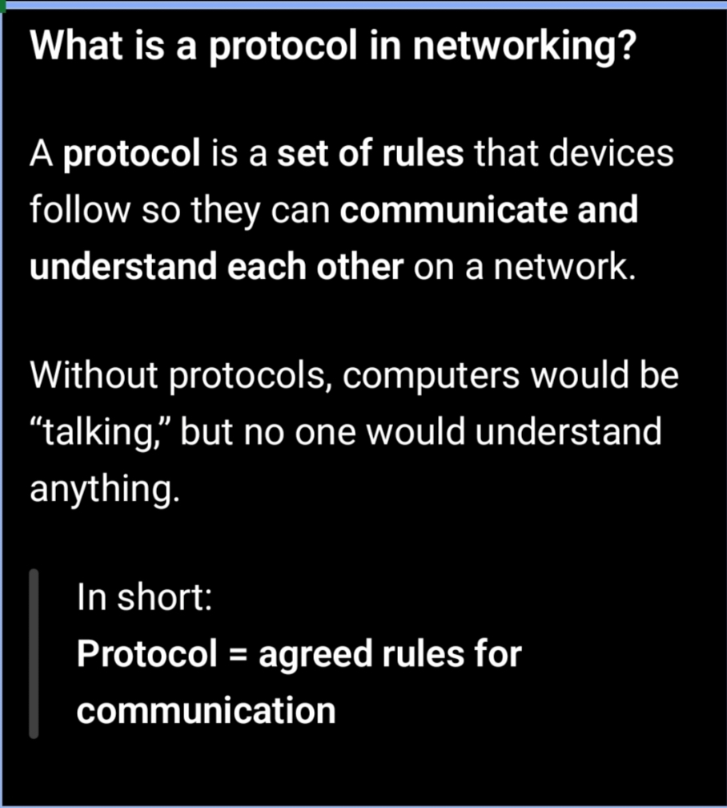
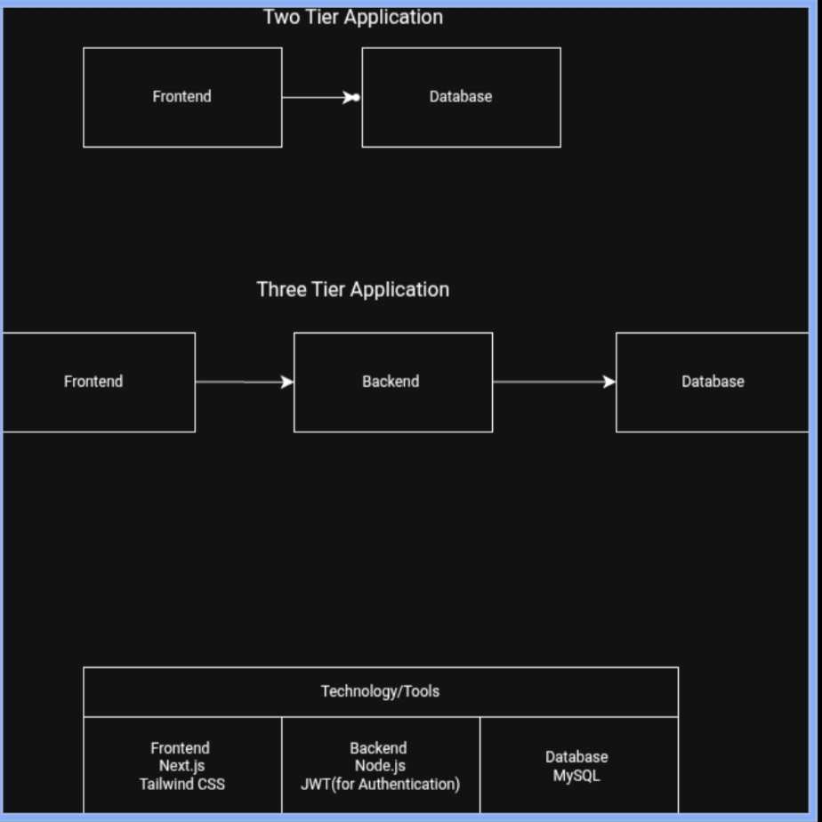
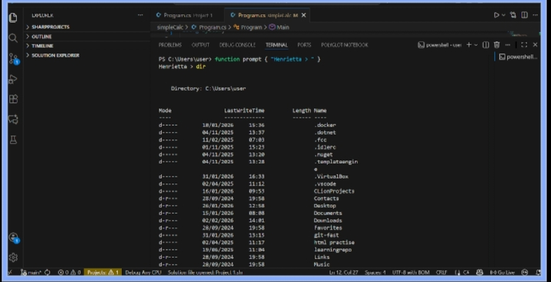

# Week 00 - Internet and Networking

Part of the DevOps Micro Internship (DMI) Cohort 3 with Agentic AI

---

# 🧑‍💻 Task 1: Using ChatGPT as Your Learning Assistant

## Scenario

You're new to DevOps and will frequently encounter technical questions. ChatGPT can be your learning companion.

## Your Task

Write a clear ChatGPT prompt to help you understand:

> "What is a protocol in networking? Explain with a simple real-life example."

Take a screenshot of your interaction showing:

* Your detailed prompt (with clear expectations)
* ChatGPT's simplified response with an example

## Screenshot

Save your screenshot in the `screenshots` folder and update the file name below.




Replace `task-1-chatgpt.png` with your actual screenshot file name.

---

## What I Learned (2–3 lines)

I learned that protocols is a set of rules that devices follow to communicate with each other.

---

# 🌐 Task 2: Internet and Networking

## Scenario

Your friend is launching an online bookstore named **EpicReads**.

He asked you to explain how users globally can access his website hosted in Finland.

## Your Task

Write a short explanation (**100–150 words**) that includes:

* Packet Switching
* IP Address
* TCP/IP
* HTTP/HTTPS

💡 **Tip:** You may use ChatGPT (as demonstrated in Task 1) to refine your explanation.

## 

When a user anywhere in the world visits EpicReads, their device sends a request over the internet using packet switching i.e. data splitting and reassembling. This means the request/data is broken into small packets, each of which may take different routes across the network to reach the server in Finland.

Every device involved has an IP address (unique address), which works like a digital home address, ensuring packets know where to go and where to return. 

Communication follows the TCP/IP model: IP handles addressing and routing, while TCP ensures packets arrive correctly, in order, and without loss.

When users type EpicReads’ web address, their browser uses HTTP or HTTPS to request the website content. HTTPS adds encryption, keeping user data secure. Once all packets arrive, the browser reassembles them and displays the bookstore seamlessly.


---

# 🏗️ Task 3: Application Architecture & Stack

## Scenario

EpicReads bookstore has two application versions:

### Two-Tier Application

* Frontend
* Database

### Three-Tier Application

* Frontend
* Backend
* Database

## Your Task

* Draw simple diagrams (hand-drawn or tool-based such as draw.io)
* Label each layer clearly
* List at least two common technologies or tools used for each layer
* Submit a screenshot or photo clearly showing your own drawing

## Diagram Screenshot / Photo

Save your diagram image in the `screenshots` folder and update the file name below.



Replace `task-3-diagram.png` with your actual diagram file name.

---

## Technologies Used

### Frontend

* Next.js
* Tailwind CSS

### Backend

* Node.js
* JWT (for Authentication)

### Database

* Mysql


---

# 🌍 Task 4: Domain Name & DNS (Basic Concepts)

## Scenario

Your friend's bookstore **EpicReads** is currently accessible through:

```text
52.172.142.222:3000
```

He purchased the domain:

```text
epicreads.com
```

## Your Task

In **50–100 words**, explain in your own words:

1. What is DNS (Domain Name System)?
2. Which DNS record type should be used to connect the domain to the given IP, and why?

## Answer

1. DNS (Domain Name System) is like the internet’s phonebook where domain names are stored. It translates human-friendly domain names such as epicreads.com into numerical IP addresses that computers use to locate servers.

2. To connect epicreads.com to the IP 52.172.142.222, record should be used. A record maps a domain name directly to an IPv4 address, allowing users to access the bookstore using the domain instead of the numeric IP.


---

# 💻 Task 5: Visual Studio Code Setup (Hands-on)

## Your Task

Install Visual Studio Code (if not already installed).

Take a screenshot of your VS Code environment showing:

* Terminal open inside VS Code
* Running a basic command:

### Windows

```powershell
dir
```

### Linux / macOS

```bash
pwd
ls
```

* Your selected VS Code theme clearly visible

⚠️ **Important:** The screenshot must show your username or another identifiable detail to confirm it is your environment.

## Screenshot

Save your screenshot in the `screenshots` folder and update the file name below.




Replace `task-5-vscode.png` with your actual screenshot file name.

---

# 🔗 Task 6: Publish Your Assignment as a LinkedIn Post

## Objective

Publishing on LinkedIn helps you:

* Build your professional online presence
* Reinforce your learning
* Document your DevOps journey publicly

## Your Task

Summarize your answers from Tasks 1–5 into a LinkedIn post.

Clearly structure your post into the following sections:

* ChatGPT
* Internet & Networking
* App Architecture
* DNS
* VS Code Setup

Add the following credit note at the end of your post:

> **P.S. This post is part of the DevOps Micro Internship (DMI) with Agentic AI — Cohort 3 — by Pravin Mishra. My graded progress is public: https://dmi.pravinmishra.com/s/YOUR-GITHUB-USERNAME.html · Start your DevOps journey: https://dmi.pravinmishra.com/?utm_source=student&utm_medium=ps-linkedin&utm_campaign=cohort3**

---

## LinkedIn Post URL

 https://www.linkedin.com/posts/henrietta-ogochukwu-onyeabor_devops-dmi-devops-activity-7424700877732732928-FK2D? 

```text
 https://www.linkedin.com/posts/henrietta-ogochukwu-onyeabor_devops-dmi-devops-activity-7424700877732732928-FK2D? 

```

---

## LinkedIn Post Backup Copy

Paste the full text of your LinkedIn post here:

I took another bold step 🤸💪


hashtag#DevOps wasn't another tech buzzword.
It’s the reason most apps don’t fall apart.

A few weeks ago, I wasn’t planning to start a DevOps journey at all.

Then I kept hearing Oladayo Aremu talk about it.

Listening to him made one thing obvious:
DevOps isn’t just about tools.
It’s also about how software survives in the real world.

So when Cohort 3 hashtag#DMI (DevOps Micro Internship) began orientation, I jumped in.

This isn’t the usual “watch videos and move on” experience.
It’s practical. It’s demanding. 
And it requires you to intentionally dedicate hours every week and actually think.

My first lesson...
The internet is not magic.

When you visit a website, your request doesn’t magically appear on a server.
It’s broken into small pieces called packets, guided by IP addresses, and controlled by strict rules called protocols.

Think of it like traffic on a busy road.
Without rules, nothing moves.

That’s where things like HTTP, HTTPS, TCP/IP, DNS come in. They’re the traffic rules of the internet.

We type names like #LinkedIn.com because as humans we understand it better, machines understand numbers.

DNS acts like the internet’s phonebook, translating those names into numbers machines can understand.

Then came environment setup, terminals, and understanding how apps are structured:

How frontend, backend, and database talk to each other.

DevOps is teaching me this: 
👉 Software is not just built it’s maintained 
👉 Reliability matters as much as features 
👉 Good systems reduce chaos, not people

Sometimes growth doesn’t come from a grand plan.
I’m glad I said yes when this opportunity came.

This is just the beginning of hashtag#Devops Journey for me.
Stick around, let’s walk this path together.

P.S. This post is part of the FREE DevOps Micro Internship Cohort run by Pravin Mishra .
You can start your DevOps journey for free from his YouTube playlist.

🖼️ https://lnkd.in/dAH7V9JZ

hashtag#DevOpsJourney hashtag#ProductManagement hashtag#SoftwareEngineering hashtag#TechGrowth
hashtag#CloudComputing hashtag#VSCode hashtag#Projectmanagement

---

# Reflection – Week 0

### What did you find easy?

I found the topic easy protocol in networking easy using real life examples.

---

### What was difficult?

Drawing the diagram on draw.io but i later used an alternative.

---

### What will you improve next week?

Getting more familiar with all the concepts on week 00 Assignment.

---

## 📌 About DMI & CloudAdvisory

DevOps Micro Internship (DMI) is a project-based DevOps program run by Pravin Mishra (The CloudAdvisory) focused on real-world execution, systems thinking, and career readiness.

It helps learners build strong DevOps foundations with hands-on experience.


## 📌 Resources

- 🌐 **DMI Official Website:** https://pravinmishra.com/dmi  
- 🎓 **DevOps for Beginners (Udemy):** https://www.udemy.com/course/devops-for-beginners-docker-k8s-cloud-cicd-4-projects/  
- 🎓 **Ultimate Agentic AI DevOps with Clude Code** https://www.udemy.com/course/ultimate-agentic-ai-devops-with-claude-code/?referralCode=448389767BC96284087B
- 🎓 **DevOps with Claude Code: Terraform, EKS, ArgoCD & Helm** https://www.udemy.com/course/devops-with-claude-code-terraform-eks-argocd-helm/?referralCode=1C5B734505D65A010FA3
- ▶️ **YouTube Playlist (DMI Cohort 3):** https://www.youtube.com/playlist?list=PLFeSNDtI4Cho  
- 🔗 **Pravin Mishra (LinkedIn):** https://www.linkedin.com/in/pravin-mishra-aws-trainer/  
- 🏢 **CloudAdvisory (LinkedIn):** https://www.linkedin.com/company/thecloudadvisory/

---

*This submission is part of DevOps Micro Internship (DMI) Cohort 3 — Agentic AI Track*