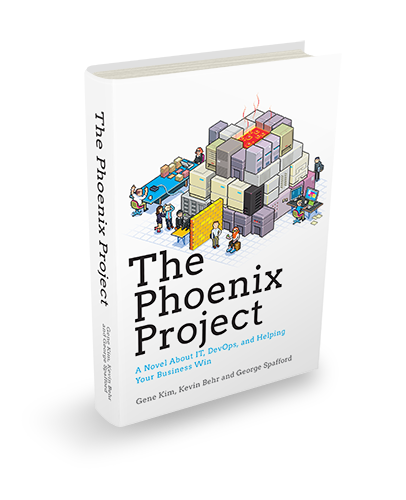
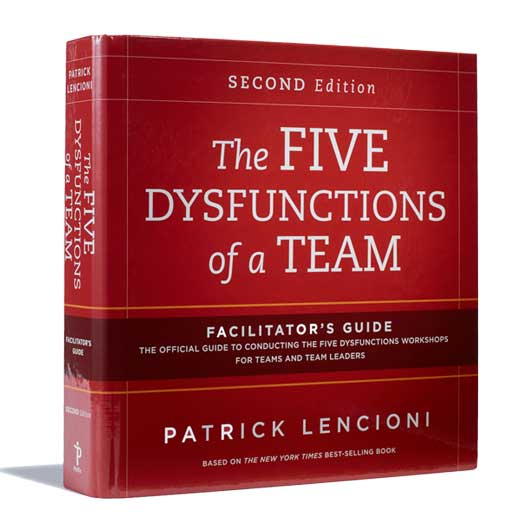
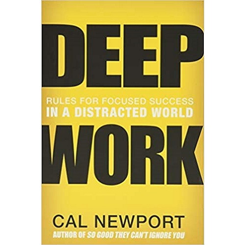
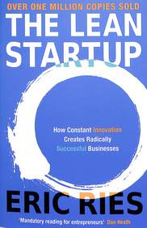
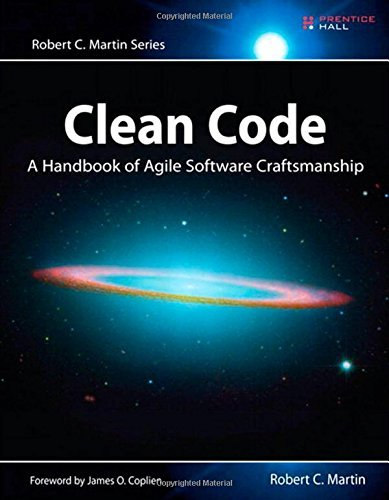
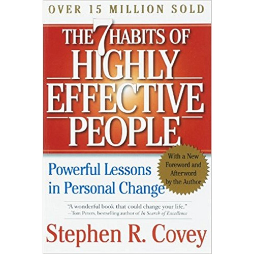

# Week 01 — Success Mindset (Mindset OS)

Part of the DevOps Micro Internship (DMI) Cohort 3 with Agentic AI

---

## Purpose (Read This First)

This week is not motivation homework.

This is you building your **Mindset OS** — the system you will use for the next 5 months (and honestly, for years).

### Expectations

* Be honest.
* Be specific.
* Be practical.
* Write like an adult professional: clear sentences, no one-liners.

You will reuse this in later weeks. So do it properly once.

---

# Assignment 1. What is something you believe to be true that most people around you would disagree with?

### Rules

* No "safe" answers.
* Must be your real belief (not copied from internet).
* Minimum 50 words.

**Hint:** What do you believe about career, money, learning, discipline, relationships, health, success, life, tech industry, etc. that most people don't agree with?

## Answer

I believe that success is not determined only by talent or hard work, but by character, consistency, and how people treat others. 
Many people focus on getting results at all costs, but I have come to believe that communication, empathy, and integrity are what sustain long term success.

I also believe that setbacks are not always signs that you are on the wrong path. Sometimes they become the very experiences that shape your character, deepen your faith, and prepare you for greater responsibilities. That is why I choose to keep learning, improving, and treating people with respect, even when life does not go the way I expected.

---

# Assignment 2. What are the top 3 objective truths you discovered through experimentation and results?

### Definition

Objective truths do not depend on opinions. They hold true regardless of how people feel.

Write each truth in this format:

**Truth:** (1 sentence)

**Evidence from my life:** (2–4 lines: what you tried + what happened)

---

## Truth #1

### Truth

Clear communication prevents more problems than assumptions ever solve.

### Evidence from my life

Throughout my experience as a Project Coordinator and Executive Virtual Assistant, I learned that proactively communicating with clients, team members, and stakeholders kept projects moving smoothly and reduced misunderstandings. I also experienced firsthand how the absence of communication in a previous role led to an unexpected termination without prior discussion. That experience reinforced the importance of honest, timely communication in both leadership and teamwork.

---

## Truth #2

### Truth

Consistency produces better long term results than occasional bursts of motivation.

### Evidence from my life

While balancing software engineering studies, project management work, and continuous learning, I realized that making steady daily progress was more effective than waiting to feel motivated. Each time I remained consistent with my coursework, portfolio development, or certifications, I gained measurable progress and confidence, even during difficult seasons.

---

## Truth #3

### Truth

Every challenging experience teaches a lesson that improves future decisions if I choose to reflect instead of react.

### Evidence from my life

After losing a job that meant a lot to me, I spent time reflecting instead of becoming bitter. That experience changed how I view leadership, feedback, and team management. It also strengthened my commitment to communicate openly, document expectations clearly, and lead with empathy in my own professional career.

---

# Assignment 3. What does your 2.0 version look like?

### Instructions

Write as if a journalist is writing about you **3 to 7 years from now** (not 20 years).

**Minimum 300 words.**

### Rules

* Write in past tense, like it already happened.
* Don't use "likes to / wants to / hopes to."
* Use specifics:

  * built
  * shipped
  * led
  * published
  * earned
  * relocated
  * contributed
* Include skills proof:

  * projects
  * portfolios
  * GitHub
  * blogs
  * certifications
  * job role
  * leadership
  * community contribution
* Add 1–3 images if you can (optional but powerful).

### Publish It Publicly On Any ONE

* LinkedIn
* Medium
* WordPress
* Blogspot
* Personal blog
* Portfolio page

Include this line:

> **P.S. This post is a part of DevOps Micro Internship with Agentic AI Cohort-3 by [Pravin Mishra](https://www.linkedin.com/in/pravin-mishra-aws-trainer/). You can start your DevOps journey by joining this [Discord community](https://discord.pravinmishra.com/) ( https://discord.pravinmishra.com/ ).**

## Your Article

Four years ago, Henrietta made a decision that quietly transformed the direction of her life. Instead of allowing setbacks and disappointments to define her career, she committed herself to continuous learning, discipline, and consistent execution.

Today, she is recognized as a Software Engineer, DevOps Professional, Project/Product Manager, and Operations Specialist who sets the pace for technlogies and businesses. Her unique combination of technical knowledge, project leadership, and process improvement has enabled her to contribute to products that serve thousands of users across different industries.

Her journey was not built on shortcuts. While completing her Software Engineering degree and participating in professional programs such as the DevOps Micro Internship, she consistently developed practical skills through hands-on projects. Her GitHub portfolio evolved from small learning exercises into production-ready applications, infrastructure projects, automation scripts, and documented DevOps workflows. Alongside her technical portfolio, she continued publishing articles and documenting lessons learned from real-world project experiences.

Professionally, Henrietta led cross-functional teams, coordinated software development projects, and implemented Agile practices that improved collaboration, delivery speed, and operational efficiency. Her ability to combine technical understanding with strong communication made her a trusted partner to developers, designers, stakeholders, and clients.

Beyond her professional work, she became known for mentoring aspiring professionals entering project/product management and technology. Through LinkedIn, community events, and online learning platforms, she openly shared her experiences, encouraging others to embrace lifelong learning, resilience, and ethical leadership. Her willingness to discuss both successes and failures made her contributions authentic and relatable.

Her certifications in project management, product management, cloud technologies, DevOps, and software engineering complemented years of practical experience. More importantly, her reputation was built on reliability, professionalism, integrity, and empathy. Qualities that clients and colleagues consistently recognized.

Financially, she achieved greater stability by building multiple streams of professional income through full-time opportunities, consulting engagements, and freelance projects. This stability allowed her to continue investing in education, support meaningful causes, and create opportunities for others.

Looking back, the career setback that once seemed devastating became one of the defining moments of her growth. It strengthened her resilience, deepened her faith, and shaped the kind of leader she chose to become. Rather than allowing disappointment to define her future, she used it as fuel to build a career grounded in excellence, continuous improvement, and service to others.

Today, Henrietta's story is a reminder that success is rarely the result of one opportunity. It is built through consistent learning, disciplined execution, resilience during difficult seasons, and the courage to keep moving forward when the path is uncertain.

**P.S. This post is a part of DevOps Micro Internship with Agentic AI Cohort-3 by [Pravin Mishra](https://www.linkedin.com/in/pravin-mishra-aws-trainer/). You can start your DevOps journey by joining this [Discord community](https://discord.pravinmishra.com/) ( https://discord.pravinmishra.com/ ).**

### Public Link

<<<<<<< HEAD
https://medium.com/@harietogochukwu/my-2-0-version-5ec4b78c1060
=======
Paste your link here:

`Add your URL here`
>>>>>>> upstream/main

---

# Assignment 4. Have you ever cut corners (unethical / dishonest / shortcut behavior — not necessarily illegal)? If yes, how did it make you feel?

### Important

You don't need to write the full story.

Focus on the feeling:

* guilt
* fear
* shame
* stress
* regret
* numbness
* etc.

This is about self-awareness, not judgment.

### Answer Format

**Yes / No**

If Yes:

**What emotion did you feel?** (minimum 50–100 words)

## Answer

I have had moments where I questioned my own decisions after the outcome was not what I expected. Those experiences made me reflect deeply on whether I could have communicated better, sought clarification earlier, or approached situations differently.

---

# Assignment 5. What are 10 non-fiction books you plan to read in the next 1 year?

### Rules

* Mention **Title + Author**
* Any language allowed
* No fiction novels

### Tip

Choose books that improve:

* mindset
* communication
* productivity
* health
* money
* career
* leadership

## Book List

1. The Power of Focus for Women - Fran Hewitt & Les Hewitt

2. The Phoenix Project — Gene Kim, Kevin Behr & George Spafford

3. The Five Dysfunctions of a Team — Patrick Lencioni

4. Deep Work — Cal Newport

5. The Lean Startup — Eric Ries

6. Clean Code — Robert C. Martin

7. The Psychology of Money — Morgan Housel

8. Crucial Conversations — Kerry Patterson, Joseph Grenny, Ron McMillan & Al Switzler

9. The 7 Habits of Highly Effective People — Stephen R. Covey

10. Secret the Power - Rhonda Byrne

---

# Assignment 6. What are the things you will measure regularly in your life and career?

### Rules

List topics only. No need to share numbers.

### Must Include

* Learning / skill
* Output / proof
* Health / energy
* Time / focus
* Money / finance (personal or business)

### Example

* Learning hours per week
* Deep work sessions per week
* Projects shipped / documented
* Steps / workouts
* Sleep hours
* Spending tracker

## My Metrics

* Learning hours per week (Software Engineering, DevOps, and continuous learning)
* Projects completed and documented
* Coursework progress and assignment completion
* Deep work and focused study sessions
* Sleep quality and hours of rest
* Networking and professional outreach
* Personal finances (income, savings, and monthly expenses)
* Physical and emotional well-being (exercise, prayer, reflection, and stress management)
* Professional certifications and new skills acquired
* Weekly reflection and goal review

---

# Assignment 7. Brain Dump + 5-Month System Plan

## Step 1: Brain Dump (Private)

Do a brain dump of everything in your mind into a notebook.

Examples:

* Bills
* Tasks
* Worries
* Goals
* Pending messages
* Ideas
* Responsibilities

### Did You Do It?

**Yes / No**

Answer: Yes

I emptied everything that was occupying my mind, including my coursework, DevOps internship tasks, job search, portfolio improvements, GitHub projects, certifications, finances, family responsibilities, prayer intentions, pending messages, ideas for content creation, career goals, and personal development plans. Writing everything down helped me reduce mental clutter, organize my priorities, and focus on what truly deserves my attention instead of trying to remember everything.

---

## Step 2: Your 5-Month Routine + Focus Blocks

Create a simple plan you can realistically follow for the next 5 months.

### Weekly Routine

Example:

* Mon–Thu: 60 min deep work
* Sat: DMI session
* Sun: Weekly review

#### My Weekly Routine

Monday – Friday 

Attend classes and stay up to date with my Software Engineering coursework.
Complete one focused DevOps learning session.
Spend time improving my portfolio or GitHub projects.
End each day with a short review and plan for the next day.

Saturday

Attend the DevOps Micro Internship session.
Review notes and complete any pending internship tasks.
Update documentation and reflect on lessons learned.

Sunday

Weekly planning and review.
Organize my study schedule for the coming week.
Prayer, rest, and personal reflection.
Spend quality time with family and recharge for the new week.

---

### Focus Blocks

#### When Will You Do DMI Work? (Days + Time)

Tuesday, Thursday, Saturday, and Sunday evenings (6:00 PM – 8:00 PM)

#### How Many Sessions Per Week?

4 focused sessions per week

---

### Distraction Rules

Examples:

* Phone rules
* Social media rules
* Environment setup

#### My Distraction Rules

* Keep my phone on Do Not Disturb during deep work sessions.
* Check WhatsApp and social media only during scheduled breaks.
* Avoid comparing my career journey with other people's progress.
* Work from a clean and organized study environment.
* Focus on completing one task before starting another.
* Review my priorities every morning instead of reacting to distractions.
* Protect my peace by limiting activities that trigger unnecessary self-doubt.

---

# Reflection – Week 1

### Biggest insight I got about myself this week

I realized that my biggest obstacle is not a lack of ability but allowing disappointment and uncertainty to consume my focus. I have grown through difficult experiences, and I am learning that consistency, faith, and daily action are far more powerful than waiting for perfect circumstances. My future will be shaped more by the systems I build than by the setbacks I have experienced.

### My biggest weakness/loop I noticed

I tend to overthink situations that I cannot control, especially career and health setbacks. I replay past events in my mind, searching for explanations that may never come. This sometimes affects my focus, confidence, and emotional well-being. Going forward, I want to redirect that energy toward learning, building projects, and taking actions that move my career forward.

### One system I will implement from this week (exact habit + time)

Every evening between 7:00 - 10:00 PM, I will spend 15-30 minutes reviewing my day, writing down tomorrow's top three priorities, and expressing gratitude for one thing that went well. This habit will help me stay organized, reduce anxiety, and begin each new day with clarity and purpose.

### LinkedIn Post

Paste your LinkedIn post link here:
<<<<<<< HEAD
https://www.linkedin.com/posts/henrietta-ogochukwu-onyeabor_today-i-challenged-myself-to-write-about-share-7477873623282835456-DLMw/
=======

`Add your URL here`
>>>>>>> upstream/main

---

## 10. Proof of Work

- LinkedIn Post URL: **https://www.linkedin.com/posts/henrietta-ogochukwu-onyeabor_today-i-challenged-myself-to-write-about-share-7477873623282835456-DLMw/**  
- Blog / Medium : **https://medium.com/@harietogochukwu/my-2-0-version-5ec4b78c1060?sharedUserId=harietogochukwu**  

---

## 📌 About DMI & CloudAdvisory

DevOps Micro Internship (DMI) is a project-based DevOps program run by Pravin Mishra (The CloudAdvisory) focused on real-world execution, systems thinking, and career readiness.

It helps learners build strong DevOps foundations with hands-on experience.

## 📌 Resources

- 🌐 **DMI Official Website:** https://pravinmishra.com/dmi  
- 🎓 **DevOps for Beginners (Udemy):** https://www.udemy.com/course/devops-for-beginners-docker-k8s-cloud-cicd-4-projects/  
- 🎓 **Ultimate Agentic AI DevOps with Clude Code** https://www.udemy.com/course/ultimate-agentic-ai-devops-with-claude-code/?referralCode=448389767BC96284087B
- 🎓 **DevOps with Claude Code: Terraform, EKS, ArgoCD & Helm** https://www.udemy.com/course/devops-with-claude-code-terraform-eks-argocd-helm/?referralCode=1C5B734505D65A010FA3
- ▶️ **YouTube Playlist (DMI Cohort 3):** https://www.youtube.com/playlist?list=PLFeSNDtI4Cho  
- 🔗 **Pravin Mishra (LinkedIn):** https://www.linkedin.com/in/pravin-mishra-aws-trainer/  
- 🏢 **CloudAdvisory (LinkedIn):** https://www.linkedin.com/company/thecloudadvisory/

---

*This submission is part of DevOps Micro Internship (DMI) Cohort 3 — Agentic AI Track*