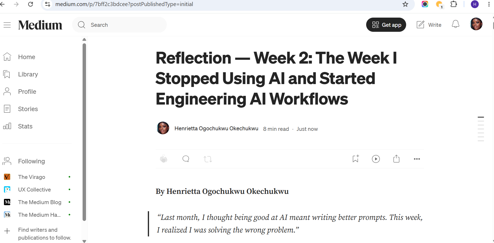
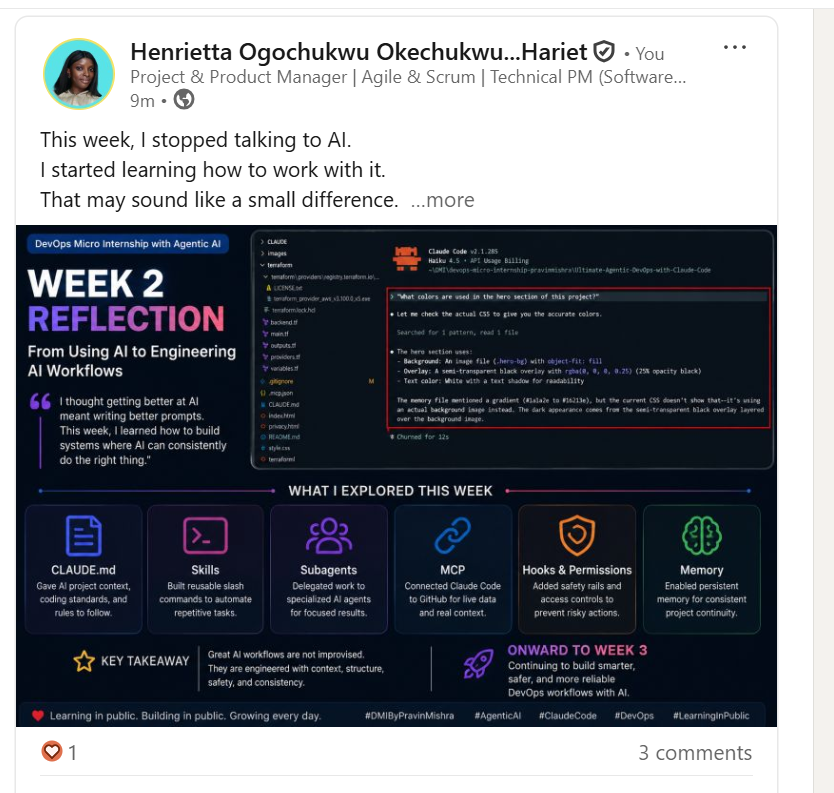

# Assignment 8 — Week 2 Reflection Blog

Part of the DevOps Micro Internship (DMI) Cohort 3 with Agentic AI

---

# Purpose

In this assignment, you will reflect on your Week 2 learning journey and write a short blog capturing your experience working with Agentic AI tools such as Claude Code, Skills, Subagents, MCP, Hooks, Permissions, and Memory.

You will also publish a LinkedIn post summarizing your learning and share both links for evaluation.

---

# Task 1 — Write Your Reflection Blog

## Goal

Write a reflection blog covering your Week 2 learning experience.

### Blog Requirements

Your blog must include:

* Title: **Reflection – Week 2**
* Minimum 300 words
* At least 2–3 topics from Week 2 (Claude Code, Skills, Subagents, MCP, Hooks, Permissions, Memory)
* Honest personal reflection (learning, challenges, mindset)
* One habit/system you plan to implement
* Your full name clearly visible

### Allowed Platforms

You can publish your blog on:

* Hashnode
* Medium
* Dev.to
* LinkedIn Article
* GitHub Markdown file
* Substack

---

### Evidence

#### Screenshot 1 — Blog published and visible



---

### Submission Field

Blog Link:

`https://medium.com/@harietogochukwu/reflection-week-2-the-week-i-stopped-using-ai-and-started-engineering-ai-workflows-7bff2c3bdcee?sharedUserId=harietogochukwu`

---

# Task 2 — Create LinkedIn Post

## Goal

Share your Week 2 learning publicly on LinkedIn.

---

### LinkedIn Post Requirements

Your post must include:

* One screenshot from any Week 2 assignment
* Short reflection (what you learned or built)
* Required P.S. line exactly as given below

---

### Required P.S. Line (Must Include Exactly)

> **P.S. This post is a part of DevOps Micro Internship with Agentic AI Cohort-3 by [Pravin Mishra](https://www.linkedin.com/in/pravin-mishra-aws-trainer/). You can start your DevOps journey by joining [DMI waiting list](https://forms.gle/3hvrWJBDzsDeJoPs6) (https://forms.gle/3hvrWJBDzsDeJoPs6).**

---

### Suggested Hashtags

#DMIByPravinMishra #AgenticAI #ClaudeCode #DevOps #LearningInPublic

---

### Evidence

#### Screenshot 2 — LinkedIn post published



---

### Submission Field

LinkedIn Post Content (copy-paste here):

```
This week, I stopped talking to AI.

I started learning how to work with it.

That may sound like a small difference.

It wasn't.


When Week 2 of the DevOps Micro Internship began, I expected to learn a few new Claude Code features.

Maybe some shortcuts.

Maybe better prompts.

Instead, every assignment quietly challenged the way I thought software was built.


The first surprise came when I created a CLAUDE.md file.

I thought,

"Why am I writing documentation for AI?"

Then it clicked.

We write documentation so new teammates understand a project.

Why should AI be any different?


Then came Skills.

Instead of repeating the same Terraform prompt over and over, I packaged it into something reusable.

One command.

An entire infrastructure scaffold.

That wasn't just automation.

It was consistency.


By the time I reached MCP, Hooks, Permissions, and Memory, I realized none of these assignments were actually about learning Claude Code.

They were teaching something much bigger.

They were teaching me how engineers think.


Engineers don't rely on memory.

They create systems.

Systems that document.

Systems that automate.

Systems that protect.

Systems that remember.


One moment stayed with me more than any other.

I closed Claude.

Started a completely fresh session.

Asked a question about my project...

And it remembered.

Not because I reminded it.

Because we'd designed the workflow that way.


I actually smiled.

Because I suddenly understood where AI is heading.

The future isn't AI replacing engineers.

It's engineers building AI systems that become reliable teammates.


That realization also forced me to reflect on myself.

I've discovered that I don't learn only by watching tutorials.

I learn by trying.

By making mistakes.

By wondering why something didn't work.

By reading documentation after I've already broken something.


Every assignment this week reminded me that frustration isn't the opposite of learning.

Sometimes...

it's the evidence that learning is happening.


Then i reflected on week 2 again....

If someone asked me what I learned in Week 2, I could list six different technologies.

But honestly...

that wouldn't be my answer.


My answer would be this:

I stopped thinking AI was another tool.

I started thinking about how to engineer systems where humans and AI can work together.

And I think that perspective will stay with me far longer than any command I learned this week.


Has there ever been a technology that completely changed the way you think about engineering? I'd love to hear your story.


P.S. This post is a part of DevOps Micro Internship with Agentic AI Cohort-3 by Pravin Mishra. You can start your DevOps journey by joining this Discord community ( https://lnkd.in/eXXCh4J8 ).


#softwareengineering #devops # #DMIByPravinMishra #AgenticAI
```

---

### LinkedIn Post Link:

[https://www.linkedin.com/posts/henrietta-ogochukwu-onyeabor_softwareengineering-devops-dmibypravinmishra-share-7481401004077432833-aCbq/?]

---

# Submission Instructions

* Blog must be publicly accessible
* LinkedIn post must be visible (public or unlisted where applicable)
* All required fields must be filled
* Screenshot proofs must be added to GitHub repository
* Do not include sensitive information in blog or post

---

# Completion Checklist

* [✅] Blog written with required structure
* [✅] Blog includes at least 2–3 Week 2 topics
* [✅] Blog is publicly accessible
* [✅] LinkedIn post created
* [✅] Required P.S. line included
* [✅] LinkedIn post content copied in submission field
* [✅] Blog link added
* [✅] LinkedIn post link added
* [✅] Screenshots added to GitHub repo

---

# About DMI & CloudAdvisory

DevOps Micro Internship (DMI) is a project-based DevOps program run by Pravin Mishra (The CloudAdvisory), focused on real-world execution, systems thinking, and agentic AI workflows.

It helps learners build strong DevOps foundations through hands-on experience.

---

# Resources

* 🌐 DMI Official Website: [https://pravinmishra.com/dmi](https://pravinmishra.com/dmi)
* 🎓 DevOps for Beginners (Udemy): [https://www.udemy.com/course/devops-for-beginners-docker-k8s-cloud-cicd-4-projects/](https://www.udemy.com/course/devops-for-beginners-docker-k8s-cloud-cicd-4-projects/)
* 🎓 Agentic AI DevOps with Claude Code: [https://www.udemy.com/course/ultimate-agentic-ai-devops-with-claude-code/](https://www.udemy.com/course/ultimate-agentic-ai-devops-with-claude-code/)
* 🎓 DevOps with Claude Code: Terraform, EKS, ArgoCD & Helm: [https://www.udemy.com/course/devops-with-claude-code-terraform-eks-argocd-helm/](https://www.udemy.com/course/devops-with-claude-code-terraform-eks-argocd-helm/)
* ▶️ YouTube Playlist: [https://www.youtube.com/playlist?list=PLFeSNDtI4Cho](https://www.youtube.com/playlist?list=PLFeSNDtI4Cho)
* 🔗 Pravin Mishra (LinkedIn): [https://www.linkedin.com/in/pravin-mishra-aws-trainer/](https://www.linkedin.com/in/pravin-mishra-aws-trainer/)
* 🏢 CloudAdvisory (LinkedIn): [https://www.linkedin.com/company/thecloudadvisory/](https://www.linkedin.com/company/thecloudadvisory/)
