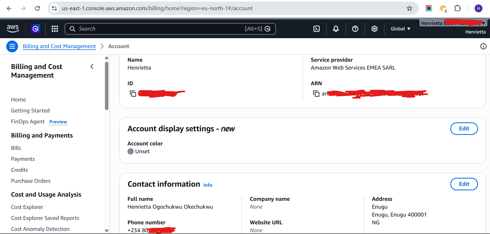
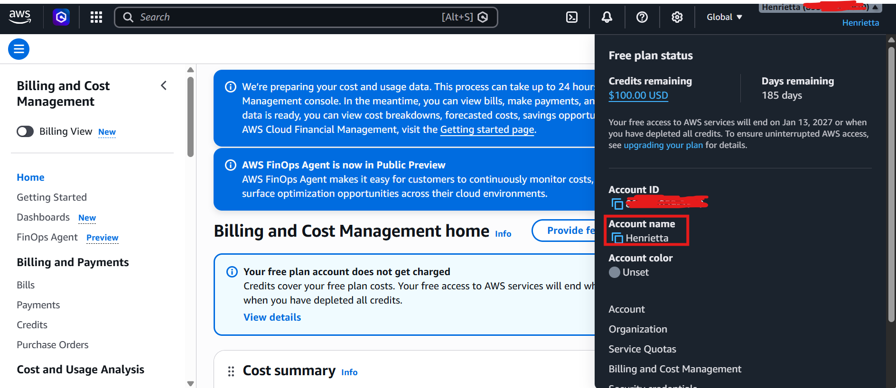

# Assignment 1 — AWS Free Tier Account Setup (EpicReads Cloud Onboarding)

Part of the DevOps Micro Internship (DMI) Cohort 3 with Agentic AI

---

## Purpose

In this assignment, you will create and verify an AWS Free Tier account as part of onboarding EpicReads — an online bookstore moving to the cloud. You will demonstrate an understanding of AWS fundamentals, Free Tier services, and account setup by answering conceptual questions and capturing proof of a working AWS Console login.

---

# Task 1 — Understanding AWS & Free Tier

## Goal

Demonstrate understanding of AWS basics and Free Tier usage by answering the following questions in your own words (3–4 lines each).

### Answers

#### Question 1 — What is an AWS account, and why do you need it at this stage?

An AWS account is a secure container for creating and managing cloud resources. Individuals or organizations use it to access AWS cloud services for deploying applications, such as EC2 instances, S3 storage buckets, and ECR repositories. 

I need it at this stage to gain hands-on cloud experience and deploy my Week 3 project along with future projects.

---

#### Question 2 — What is AWS Free Tier, and how long does it last?

AWS Free Tier allows new users to explore and test AWS services at no cost within specific usage limits.

Under the updated policy (post-July 15, 2025), new users get a 6-month Free Plan with up to $200 in promotional credits ($100 at sign-up + $100 earned through onboarding tasks). 
Accounts created before July 15, 2025 fall under the Legacy Free Tier, which lasts 12 months.

---

#### Question 3 — Name three AWS Free Tier services and their free usage limits.

1. Amazon EC2 (Virtual Servers)
* It has free usage limit of 750 hours per month of t2.micro or t3.micro Linux/Windows instances.
* Duration is 12 Months for Legacy accounts, it covers promotional $200 credits on new 6-month Free Plans.

2. Amazon S3 - Cloud Storage
This offers free usage limit of 5 GB of standard storage +20,000 GET requests, +2000 PUT requests per months.
The duration is 12 Months for Legacy accounts, Always free tier also exists with lower limits.
3. AWS Lambda (Serverless Compute):
It has usage limit of 1 Million  requests per month + 400,000 GB-seconds of compute time per month.
The duration of Always Free does not expire as long as you stay within limits.

---

# Task 2 — Create AWS Free Tier Account

## Goal

Create a valid AWS Free Tier account and sign in to the AWS Management Console.

> No screenshots required for this task. Completion is verified through Task 3.

---

# Task 3 — Verify AWS Account

## Goal

Confirm that your AWS account setup is complete by navigating to the Account section and capturing proof.

### Evidence

#### Screenshot 1 — AWS Account page showing account name (email may be blurred)

---

# Submission Instructions

- Add all required screenshots in your GitHub repository submission
- Full name must be visible in required screenshots
- Do not expose sensitive information (keys, passwords, account IDs)

---

# Completion Checklist

- [✅] Task 1 answers written in own words
- [✅] AWS Free Tier account created successfully
- [✅] Signed in to AWS Management Console
- [✅] Screenshot of AWS Account page captured (full name visible, no sensitive data)
- [✅] All required screenshots added to repository

---

## 📌 About DMI & CloudAdvisory

DevOps Micro Internship (DMI) is a project-based DevOps program run by Pravin Mishra (The CloudAdvisory) focused on real-world execution, systems thinking, and career readiness.

It helps learners build strong DevOps foundations with hands-on experience.

---

## 📌 Resources

- 🌐 DMI Official Website: https://pravinmishra.com/dmi  
- 🎓 DevOps for Beginners (Udemy): https://www.udemy.com/course/devops-for-beginners-docker-k8s-cloud-cicd-4-projects/  
- 🎓 Agentic AI DevOps with Claude Code: https://www.udemy.com/course/ultimate-agentic-ai-devops-with-claude-code/  
- 🎓 DevOps with Claude Code: Terraform, EKS, ArgoCD & Helm: https://www.udemy.com/course/devops-with-claude-code-terraform-eks-argocd-helm/  
- ▶️ YouTube Playlist: https://www.youtube.com/playlist?list=PLFeSNDtI4Cho  
- 🔗 Pravin Mishra (LinkedIn): https://www.linkedin.com/in/pravin-mishra-aws-trainer/  
- 🏢 CloudAdvisory (LinkedIn): https://www.linkedin.com/company/thecloudadvisory/

---

*This submission is part of DevOps Micro Internship (DMI) Cohort 3 — Agentic AI Track.*