# Assignment 3 — Production Maintenance Drill (OPS Checklist)

Part of the DevOps Micro Internship (DMI) Cohort 3 with Agentic AI

---

## Purpose

In this assignment, you will treat your already deployed React application (on Ubuntu VM with Nginx) as a live production system. You will perform structured operational checks covering network validation, service health, log analysis, resource monitoring, configuration verification, and incident simulation with recovery — mirroring real on-call DevOps responsibilities.

---

# Task 1 — Server Access & Networking Validation

## Goal

Verify that the deployed React application is reachable from the browser and confirm basic network connectivity of the Ubuntu VM.

### Evidence

#### Screenshot 1 — Browser showing the React app with your Full Name visible on the UI

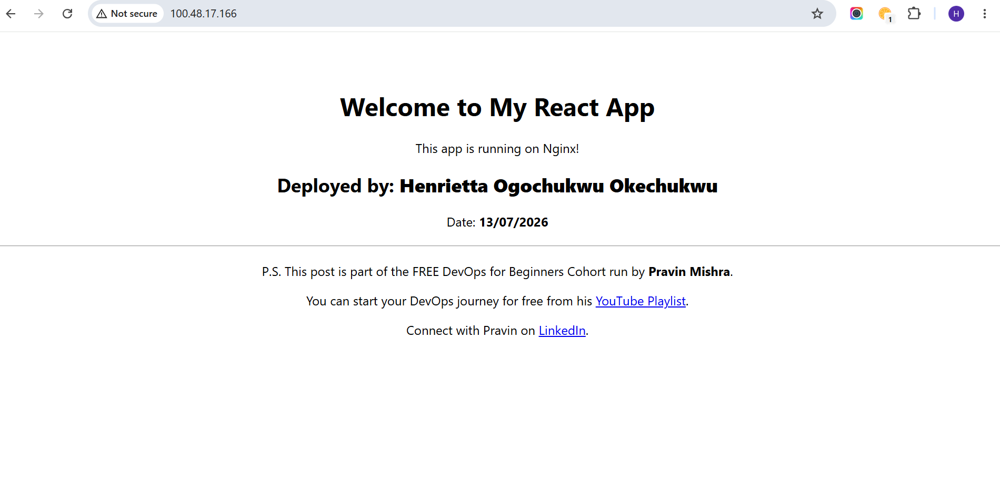

---

#### Screenshot 2 — Output of `ip a`

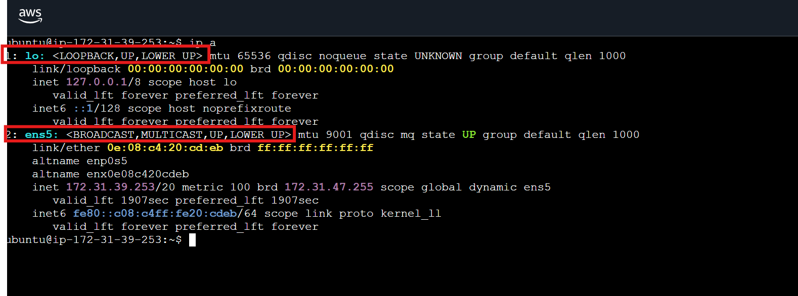

---

#### Screenshot 3 — Output of `sudo ss -tulpen`

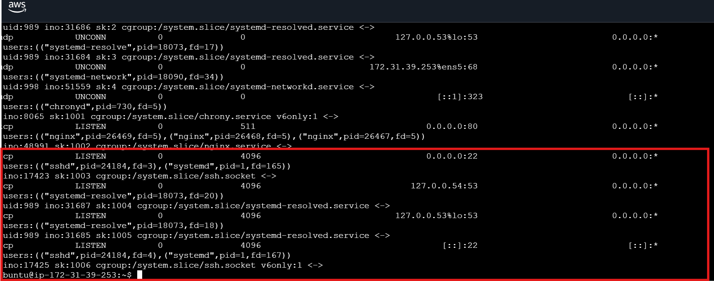

---

#### Screenshot 4 — Output of `sudo ufw status`

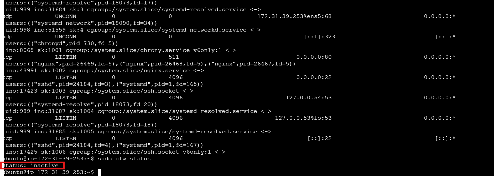

---

### Notes

Answer the following in your own words:

**1. What proves Nginx is listening on 0.0.0.0:80?**

From the Output using after running sudo ss -tulpen, there is an entry 0.0.0.0:80, this proves Nginx is actively listening for incoming TCP traffic on IPv4 Port 80 across all network interfaces.

---

**2. What proves SSH is active on port 22?**

The ss -tulpen output lists 0.0.0.0:22 bound to sshd. Additionally, our ability to connect to and run commands on the EC2 instance remotely confirms SSH daemon activity on Port 22

---

**3. Did you find any unexpected open ports? Explain briefly.**

No unexpected ports were open. The open listening ports were limited to Port 22 (SSH for remote access) and Port 80 (HTTP for Nginx web serving).

---

# Task 2 — Service Health & Systemd Validation (Nginx)

## Goal

Verify that Nginx is properly installed, running, enabled at boot, and safely configured.

### Evidence

#### Screenshot 1 — Output of `systemctl status nginx --no-pager`

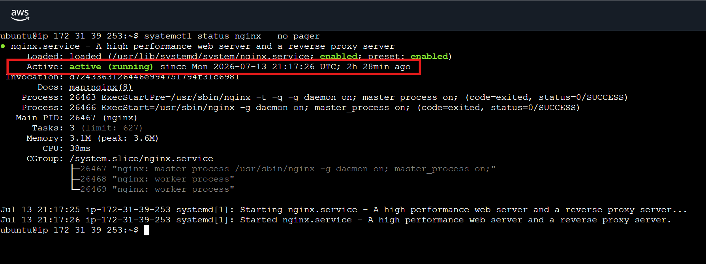

---

#### Screenshot 2 — Output of `sudo nginx -t`

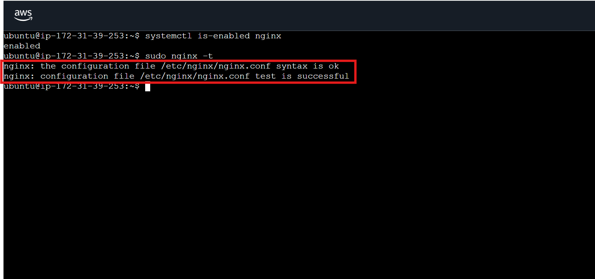

---

#### Screenshot 3 — Output of `sudo ss -lptn '( sport = :80 )'`

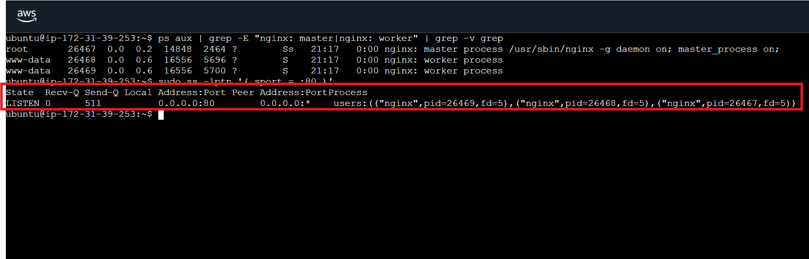

---

### Notes

Answer the following in your own words:

**1. What happens if Nginx fails to restart in production?**

If Nginx fails to restart, web requests targeting Port 80 will drop, leading to connection timeouts (ERR_CONNECTION_REFUSED or 502/504 errors for clients). Incoming web traffic will fail completely, causing service downtime until resolved.

---

**2. What's your basic rollback plan?**

Before making any configuration change, always run sudo nginx -t first to validate the config syntax — this catches most errors before they ever reach a restart. If a restart is attempted and fails, the first step is to check systemctl status nginx --no-pager and sudo journalctl -u nginx --no-pager -n 50 to see the exact error.

 If the failure is due to a bad configuration change, the fix is to revert the config file back to its last known-good version (ideally from a backup or version control) and re-run sudo nginx -t followed by sudo systemctl restart nginx again. Keeping a backup copy of the working config before making changes is the simplest safeguard, since it allows an immediate rollback without needing to debug under pressure.

---

# Task 3 — Logs & Request Trace

## Goal

Verify real traffic flow and analyze logs to understand system behavior and errors.

### Evidence

#### Screenshot 1 — Output of `sudo tail -n 30 /var/log/nginx/access.log`

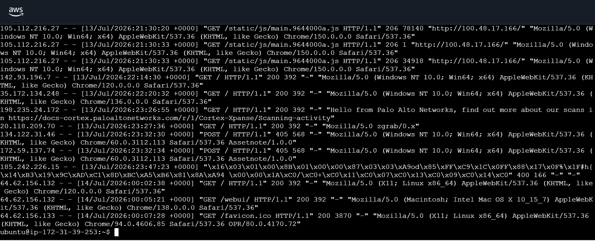

---

#### Screenshot 2 — Output of `sudo tail -n 30 /var/log/nginx/error.log`

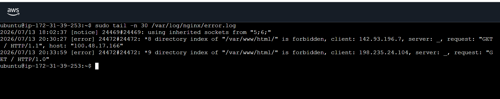

---

#### Screenshot 3 — Output of `sudo journalctl -u nginx --no-pager -n 50`

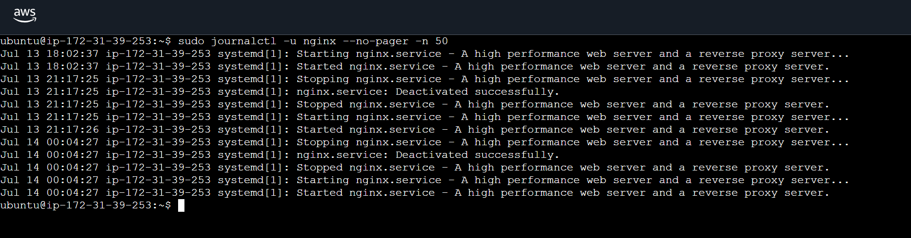

---

### Notes

Answer the following in your own words:

**1. Were there any errors in the logs?**

- If yes, mention 1–2 example error lines from the logs and explain what each one means in simple terms.
- If no, explain what it means if the error log is empty or shows no recent errors during your check.

Yes. The error.log catches actual operational glitches. For example:

[error] ... directory index of "/var/www/html/" is forbidden

In simple terms: This means an external client tried to access the root directory URL (/), but Nginx could not find an entry file (like index.html) at that exact moment or directory listing was disabled by security rules, causing it to block access with a 403 Forbidden error status.

---

**2. If there were no errors, what does that indicate about the system?**

(Since you do have errors, we adapt this to explain what the combination means):
The presence of occasional 403 Forbidden directory index errors alongside highly successful asset delivery lines shows that while the web server daemon itself is stable and running, external clients or bots sometimes hit invalid paths or request access during moments when deployment contents are temporarily shuffled or missing.

---

**3. Based on the access logs, were your curl requests visible in the log entries? What does that prove about traffic flow?**

Yes. The access.log captures incoming traffic explicitly, showing lines delivering static media files like /static/js/main.9644000a.js with 206 and 200 OK status codes to browser clients (Chrome/150.0.0.0).

Interestingly, the logs also show automated network scanning bots (like Palo Alto Networks and zgrab) crawling your public IP! This absolutely proves that your network traffic pipeline is fully open and reachable from the public internet.

---

# Task 4 — System Resource Health Check (Capacity Red Flags)

## Goal

Assess server capacity and detect potential performance or failure risks.

### Evidence

#### Screenshot 1 — Output of `uptime`

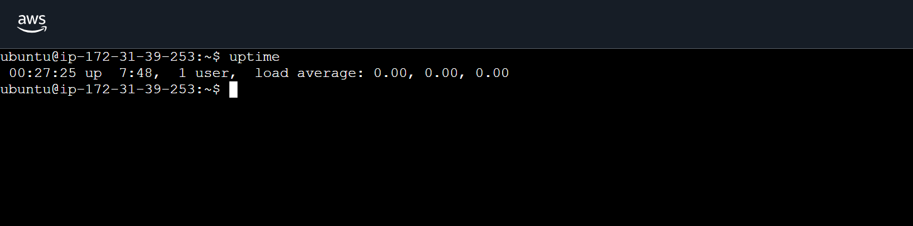

---

#### Screenshot 2 — Output of `free -h`

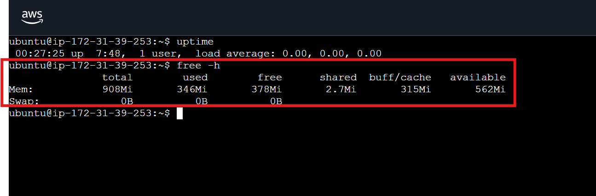

---

#### Screenshot 3 — Output of `df -h`

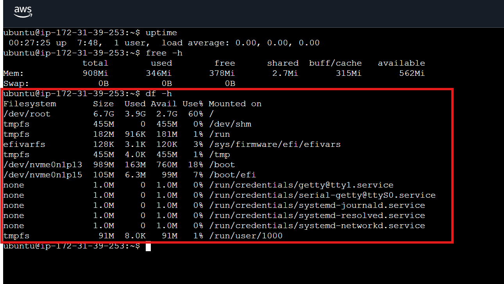

---

#### Screenshot 4 — Output of `sudo du -sh /var/* | sort -h`

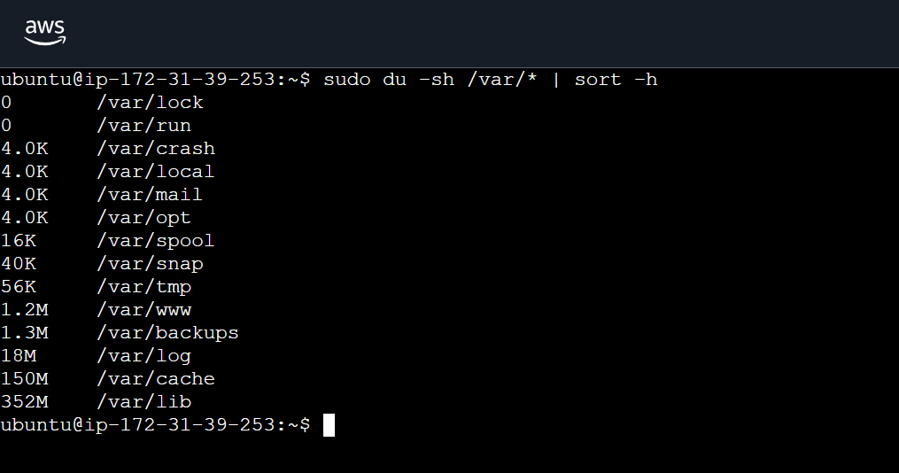

---

### Notes

Answer the following in your own words:

**1. Which resource looks most critical right now? (CPU/load, memory, or disk) Explain why.**

On a small cloud instance (e.g., t2.micro / t3.micro), RAM/Memory is typically the most critical resource because running background processes alongside system daemons leaves minimal headroom. Low free memory can trigger swap usage or cause the Linux Out-Of-Memory (OOM) killer to terminate active processes.

---

**2. What happens if disk becomes 100% full in a production server?**

A completely full disk prevents processes from writing log files, temporary application states, or database transactions. Services like Nginx or MySQL crash or fail to execute basic write operations, leading to cascading system failure.

---

# Task 5 — Configuration & Deployment Verification

## Goal

Ensure the correct React build is deployed and Nginx is serving it properly.

### Evidence

#### Screenshot 1 — Output of `ls -lah /var/www/html | head -n 20`

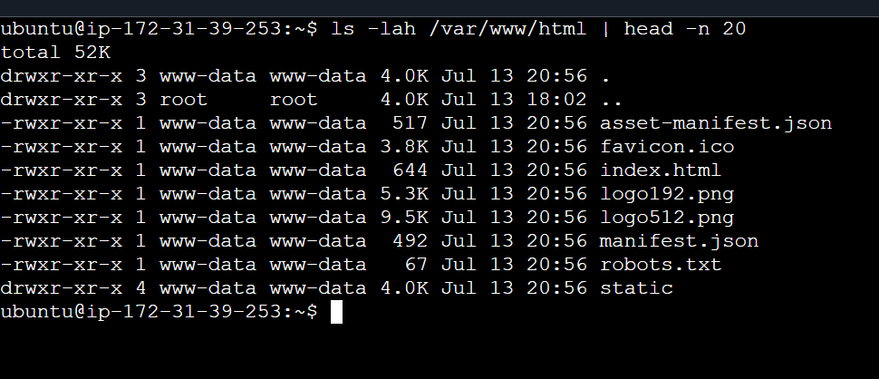

---

#### Screenshot 2 — Output of `grep -R "Deployed by" -n /var/www/html 2>/dev/null | head`

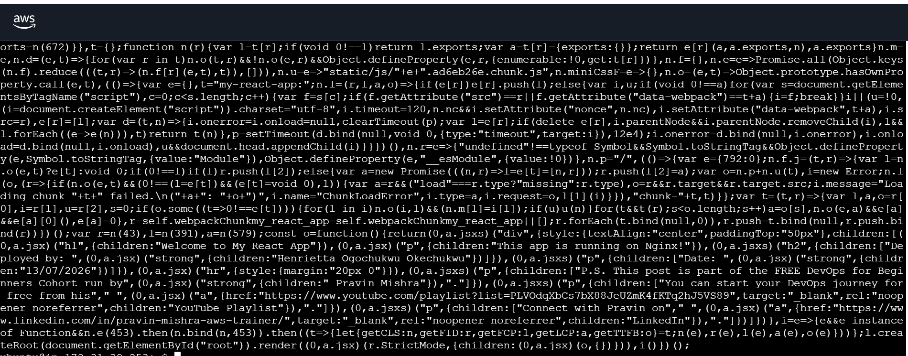

---

#### Screenshot 3 — Output of `grep -n "try_files" /etc/nginx/sites-available/default`

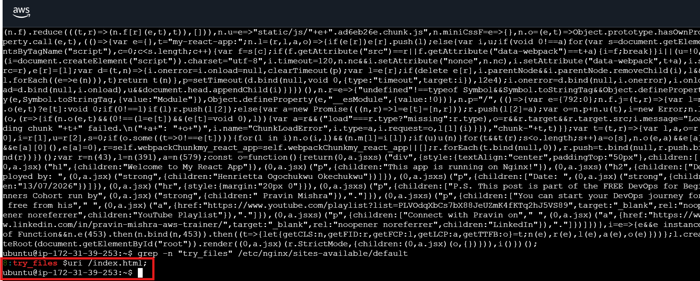

---

### Notes

Answer the following in your own words:

**1. How do you confirm that the correct version of the application is deployed?**

By inspecting build artifacts inside /var/www/html for unique commit hashes or custom text strings (e.g., matching "Deployed by: Henrietta Ogochukwu Okechukwu") using commands like grep, alongside checking deployment timestamps and client-side HTTP response codes.

---

# Task 6 — Nginx Configuration Failure Simulation

## Goal

Simulate a real-world Nginx misconfiguration and recover the service safely.

### Evidence

#### Screenshot 1 — Output of `sudo nginx -t` showing the syntax error (broken config)

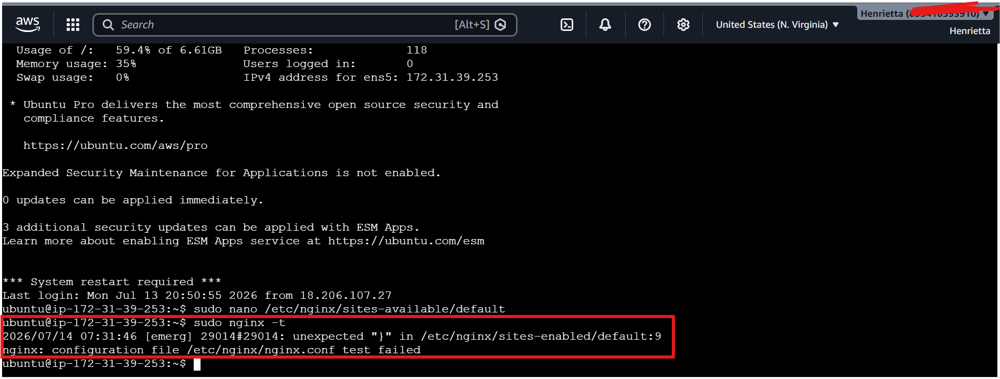

---

#### Screenshot 2 — Output of `sudo nginx -t` showing syntax ok (fixed config)

---

#### Screenshot 3 — Output of `curl -I http://<public-ip>` confirming recovery (200 OK)

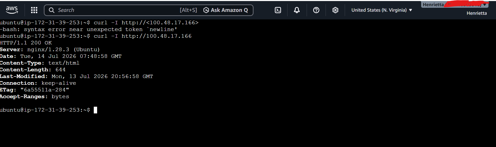

---

### Notes

Answer the following in your own words:

**1. What caused the configuration failure?**

A syntax error in /etc/nginx/sites-available/default (such as a missing semicolon and invalid directive), breaking Nginx's parser.
---

**2. How did you fix the issue?**

 Reopened the config file and restored both missing semicolons, then re-ran sudo nginx -t to confirm the syntax was valid before restarting the service. Only after seeing syntax is ok / test is successful was systemctl restart nginx run, followed by an external curl -I check to confirm the live application was serving correctly again.

---

**3. How can you avoid this kind of issue in real production systems?**

Always run nginx -t after any config edit, without exception, before restarting or reloading.
Keep Nginx config files in version control (git), so a bad change can be instantly reverted to a known-good state instead of manually retyped from memory.

By using a staging environment to test config changes before they ever touch production.
Where possible, automate config validation as part of a deployment pipeline, so a broken config is caught in CI and never reaches the live server at all.

---

# Task 7 — Web Application Failure Simulation

## Goal

Simulate missing deployment content and recover the application safely.

### Evidence

#### Screenshot 1 — Output of `curl -I http://<public-ip>` showing failure (non-200 response)

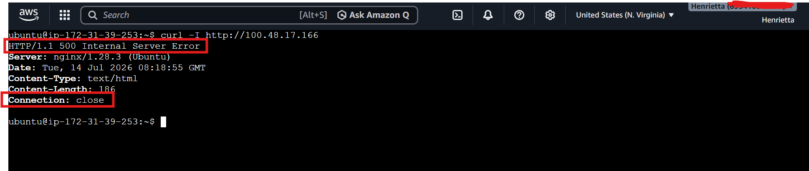

---

#### Screenshot 2 — Output of `curl -I http://<public-ip>` confirming recovery (200 OK)

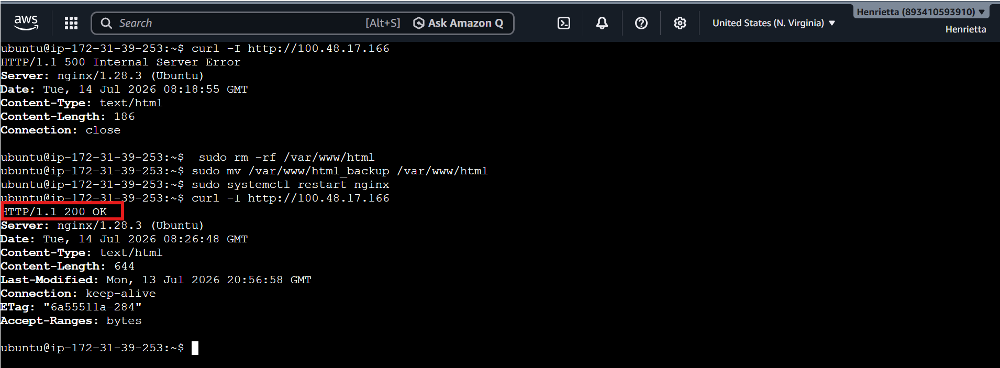

---

### Notes

Answer the following in your own words:

**1. What caused the application to break in this scenario?**

 The web root directory (/var/www/html) — the exact path Nginx serves content from — was emptied of all deployment files. Nginx itself remained running and correctly configured, but with no content present and no fallback file available either, it returned a 500 Internal Server Error instead of serving the React application.

---

**2. How did you fix the issue and restore the application?**

 The original deployment had been safely backed up beforehand (moved to html_backup rather than deleted), so recovery involved removing the empty broken directory and moving the backup back into place at the correct path. Nginx was restarted to ensure it was serving cleanly from the restored files, and recovery was confirmed externally via curl -I, which returned 200 OK with identical content metadata (Content-Length, Last-Modified, ETag) to the pre-incident state — proving the exact same build was successfully restored.

---

**3. What steps would you take to prevent this kind of issue in real production systems?**

Automated pre-deployment backups, so every release can be instantly rolled back without manual intervention.
Deploying to a versioned, separate directory and atomically switching a symlink (e.g., /var/www/current) to point to it, rather than overwriting the live directory in place — this way a failed deploy never leaves the live path empty or half-written.

CI/CD pipeline checks that verify a deployment actually succeeded (e.g., confirming index.html exists and is non-empty) before marking the release complete.

Post-deployment health checks/monitoring that automatically verify the live site returns a healthy 200 response immediately after every deploy, catching this kind of failure within seconds rather than relying on someone noticing manually.

---

# Task 8 — Security & Reliability Review

## Goal

Review and reflect on the security and reliability practices applied during this assignment.

### Security & Reliability Notes

Answer the following in your own words:

**1. Why is SSH key-based authentication more secure than sharing passwords?**

SSH key authentication is more secure because private keys are much harder to guess or brute-force than passwords, reducing the risk of unauthorized access.

---

**2. Why should only required ports be open on a production server?**

Only required ports should remain open to reduce the server's attack surface and minimize security risks

Opening unnecessary ports expands the system's attack surface, exposing services to port scanners, unauthorized access attempts, and potential zero-day vulnerabilities.

---

**3. Why is it important for Nginx to be enabled on boot?**

Enabling Nginx at boot ensures the web application starts automatically after a reboot, reducing downtime.

systemctl enable nginx ensures that Nginx automatically starts up whenever the server reboots or recovers from a hardware fault, minimizing unscheduled downtime without manual human intervention.

---

**4. What are the risks of sharing secrets, keys, or credentials publicly?**

Exposed credentials allow unauthorized actors to hijack cloud resources, steal sensitive data, alter production code, or generate massive unauthorized infrastructure costs

---

**5. Why should cloud resources be stopped or terminated when they are no longer needed?**

Terminating unused instances prevents unnecessary billing charges, conserves cloud resources, and eliminates unmonitored security targets.

---

# LinkedIn Post (Required)

## Evidence

#### LinkedIn Post URL

Paste your LinkedIn post URL here:

`
https://www.linkedin.com/posts/henrietta-ogochukwu-onyeabor_dmibypravinmishra-devops-aws-activity-7483049531161448448__________________________`

---

#### Screenshot — Published LinkedIn post

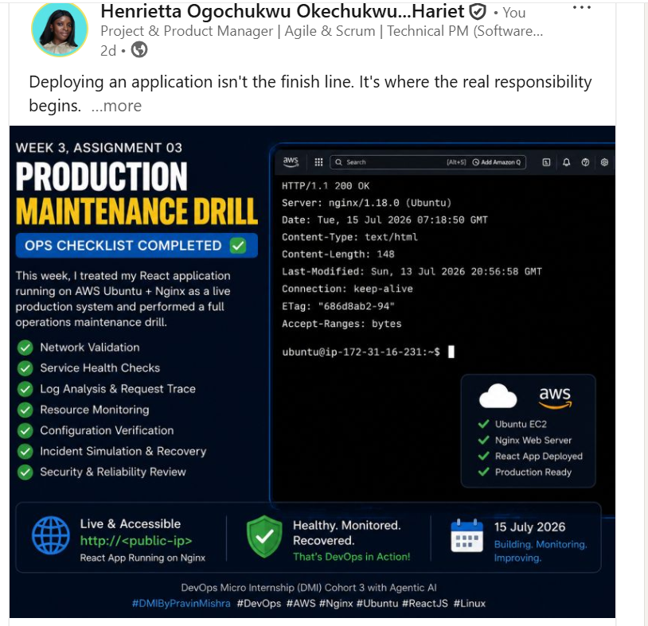

---

# Submission Instructions

- Add all required screenshots in your submission
- Full name must be visible in required screenshots
- Do not expose sensitive information (keys, passwords, account IDs)

---

# Completion Checklist

- [✅] Task 1: Screenshots (browser, ip a, ss -tulpen, ufw status) + Notes answered
- [✅] Task 2: Screenshots (nginx status, nginx -t, ss port 80) + Notes answered
- [✅] Task 3: Screenshots (access log, error log, journalctl) + Notes answered
- [✅] Task 4: Screenshots (uptime, free -h, df -h, du -sh) + Notes answered
- [✅] Task 5: Screenshots (ls html, grep deployed by, grep try_files) + Notes answered
- [✅] Task 6: Screenshots (nginx -t fail, nginx -t pass, curl recovery) + Notes answered
- [✅] Task 7: Screenshots (curl failure, curl recovery) + Notes answered
- [✅] Task 8: Security & Reliability Notes answered
- [✅] LinkedIn post published and URL submitted
- [✅] Full Name visible in all required screenshots
- [✅] No sensitive data exposed

---

## 📌 About DMI & CloudAdvisory

DevOps Micro Internship (DMI) is a project-based DevOps program run by Pravin Mishra (The CloudAdvisory) focused on real-world execution, systems thinking, and career readiness.

It helps learners build strong DevOps foundations with hands-on experience.

---

## 📌 Resources

- 🌐 DMI Official Website: https://pravinmishra.com/dmi  
- 🎓 DevOps for Beginners (Udemy): https://www.udemy.com/course/devops-for-beginners-docker-k8s-cloud-cicd-4-projects/  
- 🎓 Agentic AI DevOps with Claude Code: https://www.udemy.com/course/ultimate-agentic-ai-devops-with-claude-code/  
- 🎓 DevOps with Claude Code: Terraform, EKS, ArgoCD & Helm: https://www.udemy.com/course/devops-with-claude-code-terraform-eks-argocd-helm/  
- ▶️ YouTube Playlist: https://www.youtube.com/playlist?list=PLFeSNDtI4Cho  
- 🔗 Pravin Mishra (LinkedIn): https://www.linkedin.com/in/pravin-mishra-aws-trainer/  
- 🏢 CloudAdvisory (LinkedIn): https://www.linkedin.com/company/thecloudadvisory/

---

*This submission is part of DevOps Micro Internship (DMI) Cohort 3 — Agentic AI Track.*