# Assignment 5 — Bash Script Automation Drill (OPS Checklist)

Part of the DevOps Micro Internship (DMI) Cohort 3 with Agentic AI

---

## Purpose

In this assignment, you will practice Bash scripting by building a series of small automation scripts covering environment setup, variables, arrays, loops, file conditionals, if-else logic, and functions. These scripts form the foundation of real-world Linux automation used in DevOps, cloud, and production support environments.

---

# Task 1 — Bash Environment & Workspace Setup

## Goal

Verify that Bash is available on your system and create a clean workspace for this assignment.

### Evidence

#### Screenshot 1 — Output of `echo $SHELL` and `bash --version`

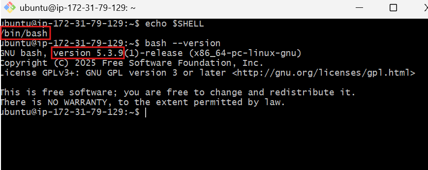

---

#### Screenshot 2 — Output of `pwd` and `ls -lah` showing the scripts directory

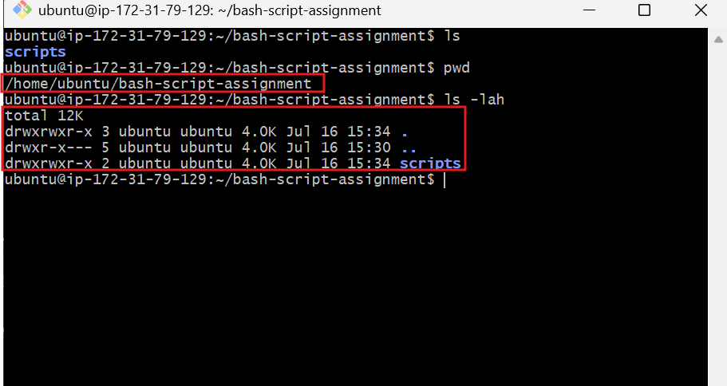

---

### Notes

Answer the following in your own words:

**1. What is Bash?**

Bash (Bourne Again Shell) is a command-line interpreter that allows users to communicate with the Linux operating system. It executes commands entered by the user and can also run scripts to automate repetitive tasks.

Bash stands for Bourne Again SHell. It is a command language interpreter and scripting shell for Unix-like operating systems that executes commands typed directly into a terminal or read from a script file.

---

**2. What is the difference between shell and Bash?**

A shell is any command-line program that allows users to interact with an operating system. Bash is one specific type of shell and is one of the most widely used shells in Linux.

A shell is an abstract macro-interface specification or any program that accepts system commands (like sh, zsh, csh). Bash is a specific, modern, and widely adopted implementation of a shell that adds advanced programming constructs like arrays, history, and arithmetic processing.

---

**3. Why is it important to confirm the Bash version before writing scripts?**

Confirming the Bash version ensures that the features and syntax used in a script are supported by the installed version, helping to prevent compatibility issues and unexpected errors.

---

# Task 2 — Your First Bash Script

## Goal

Create your first Bash script, make it executable, and run it from the terminal.

### Evidence

#### Screenshot 1 — Content of `first-script.sh`

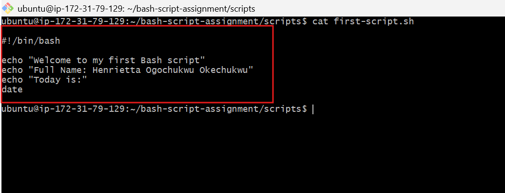

---

#### Screenshot 2 — Output of `./first-script.sh`

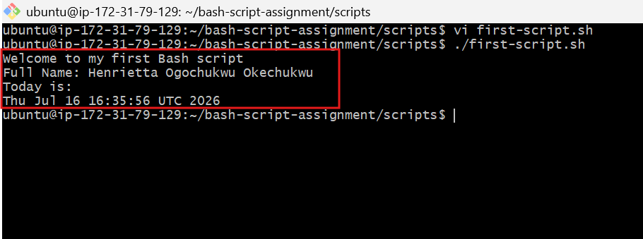

---

#### Screenshot 3 — Output of `ls -l first-script.sh` showing executable permission

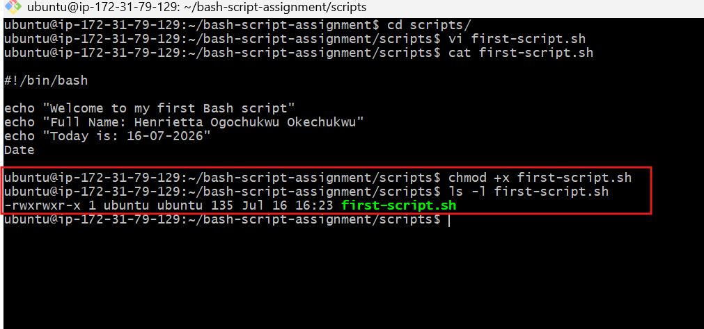

---

### Notes

Answer the following in your own words:

**1. What is the purpose of `#!/bin/bash`?**

#!/bin/bash is called the shebang. It tells the operating system to execute the script using the Bash interpreter, ensuring the commands are processed correctly.

---

**2. Why do we use `chmod +x` before running a script?**

We use chmod +x to give a script execute permission. Without this permission, Linux treats the file as an ordinary text file and prevents it from being run directly.

---

**3. What is the difference between running a script using `./script.sh` and `bash script.sh`?**

When we run: ./script.sh the system runs the file directly. Therefore, the script must have execute permission, and the shebang line determines which interpreter should run it. 

When we run: bash script.sh we are directly asking Bash to read and run the script. The script does not need execute permission for this method, and Bash is used even if the script has a different shebang. 

Using ./script.sh runs the file as an isolated program directly using the executable bit and the internal Shebang file path. Running bash script.sh directly invokes the local bash interpreter binary manually and passes the text file into it as an argument, ignoring whether the executable bit is flipped.

---

# Task 3 — Variables: User Information Script

## Goal

Use variables to store and display user-related information.

### Evidence

#### Screenshot 1 — Content of `user-info.sh`

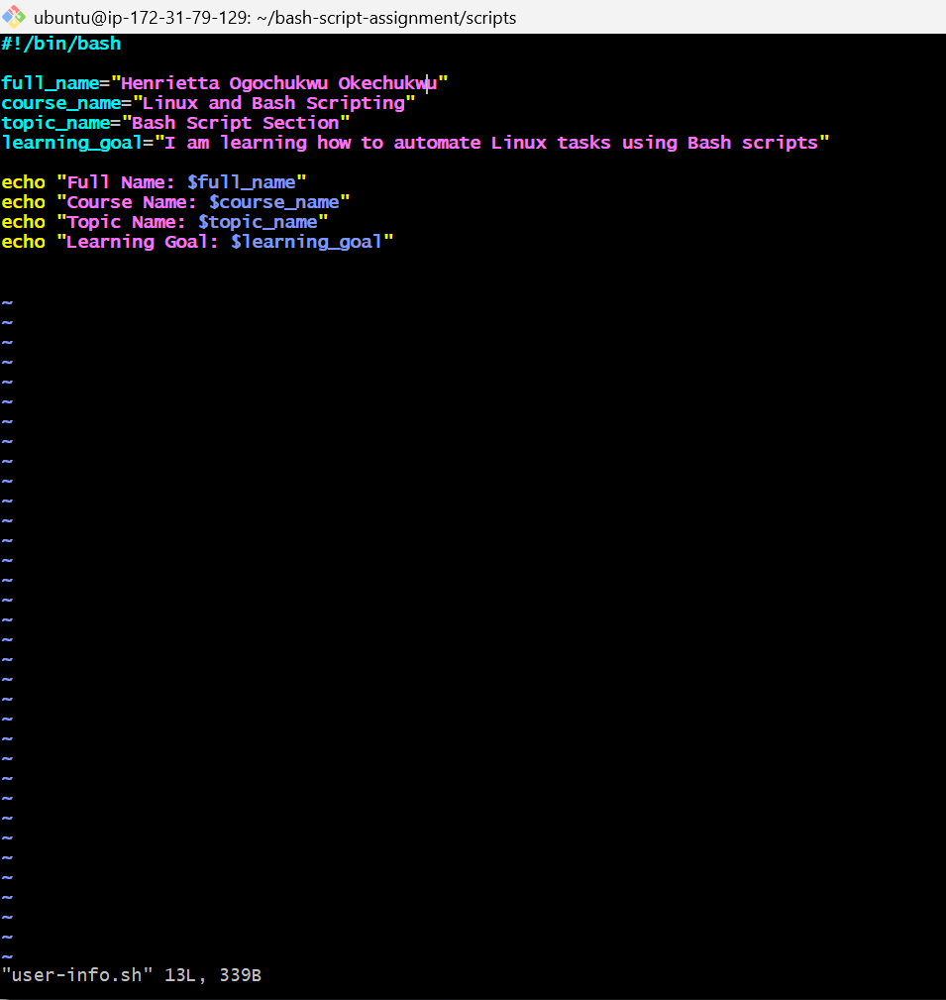

---

#### Screenshot 2 — Output of `./user-info.sh`

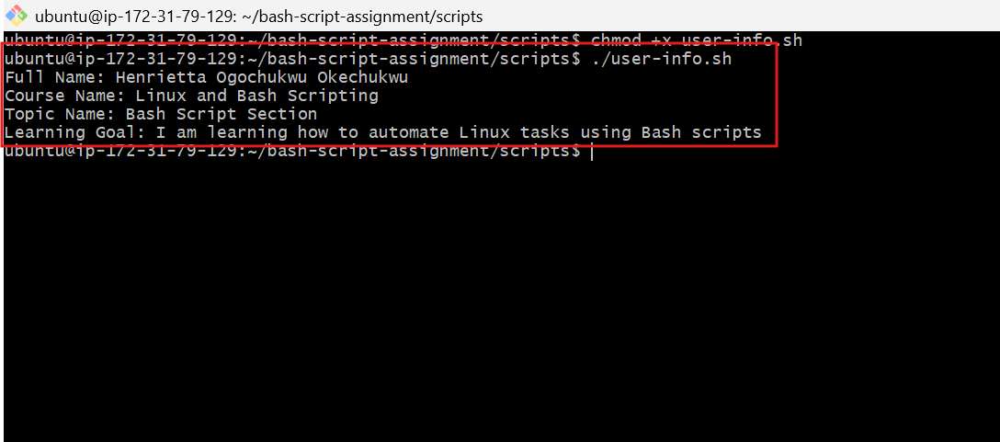

---

### Notes

Answer the following in your own words:

**1. What is a variable in Bash?**

A variable is a named storage location used to hold data such as text, numbers, or file paths. It allows the same value to be reused throughout a script without typing it repeatedly.

---

**2. Why should we avoid spaces around the `=` sign when creating variables?**

Bash treats spaces as separators between commands and arguments. Adding spaces around the equals sign causes Bash to interpret the variable name as a command, resulting in an error.

---

**3. How do you access the value stored inside a Bash variable?**

Prefix the variable name with a dollar sign ($). For example, if the variable is name, its value is accessed using $name.

---

# Task 4 — Arrays & Loops: Tools Checklist Script

## Goal

Use arrays and loops to print a checklist of tools used in Bash scripting.

### Evidence

#### Screenshot 1 — Content of `tools-checklist.sh`

---

#### Screenshot 2 — Output of `./tools-checklist.sh`

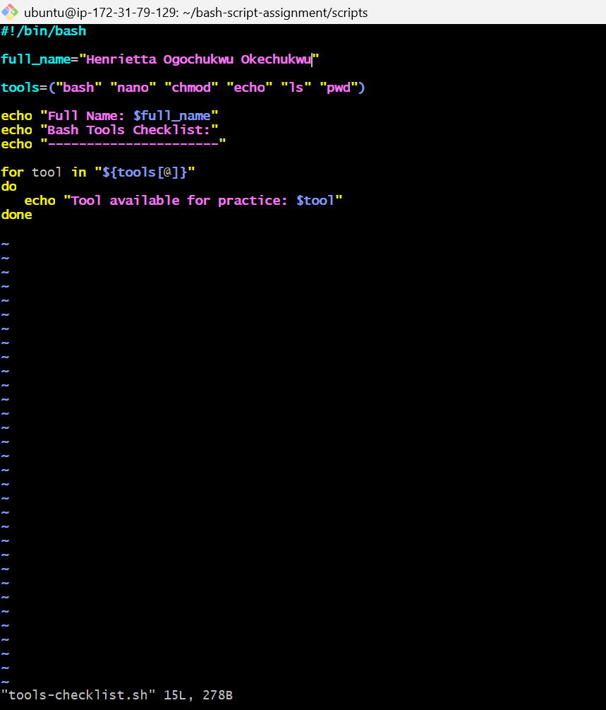

---

### Notes

Answer the following in your own words:

**1. What is an array in Bash?**

An array is a variable that stores multiple values under a single name. Each value can be accessed individually or processed together.

---

**2. Why are arrays useful in scripts?**

Arrays make scripts more organized by allowing related data to be stored in one place. They are especially useful when processing lists of files, servers, users, or tools.

---

**3. What does `"${tools[@]}"` mean?**

Add your answer here.

---

**4. What is the purpose of the `for` loop in this script?**

"${tools[@]}" represents all the elements stored in the tools array. It allows the script to process each item one by one, especially inside loops.

---

# Task 5 — Loops: Number Counter Script

## Goal

Use loops to repeat a task multiple times.

### Evidence

#### Screenshot 1 — Content of `counter.sh`

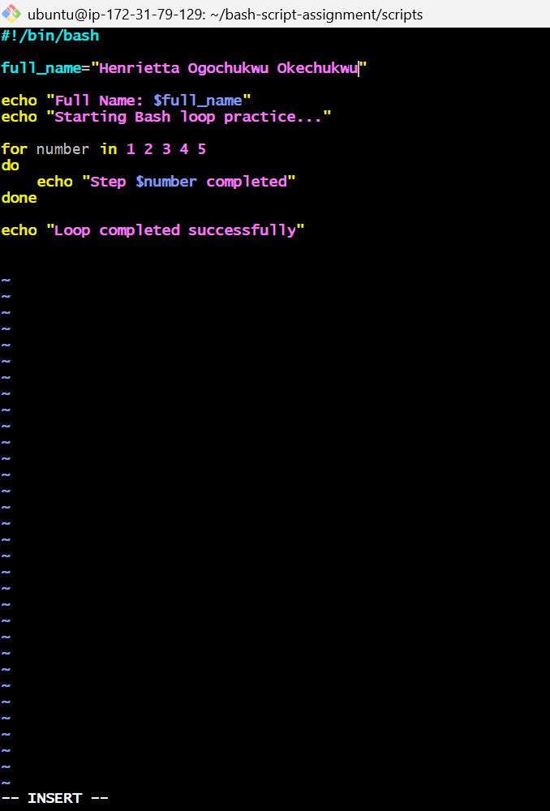

---

#### Screenshot 2 — Output of `./counter.sh`

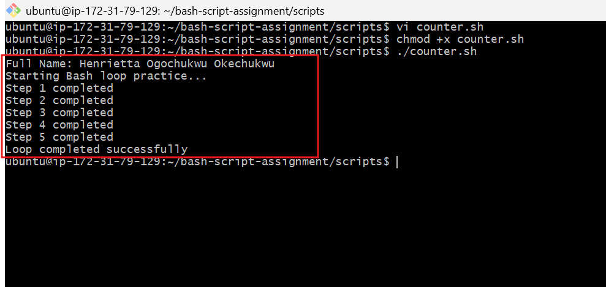

---

### Notes

Answer the following in your own words:

**1. What is a loop?**

A loop is a control structure that repeats a set of instructions until a condition is met.

---

**2. Why do we use loops in Bash scripting?**

o eliminate human repetition by automating identical tasks continuously—like parsing multiple files, tailing logs, processing retries, or auditing clusters of infrastructure.

Loops reduce repetitive code and automate repeated tasks, making scripts shorter, faster, and easier to maintain.

---

**3. How many times did the loop run in your script?**

The loop ran exactly 5 iterations, stepping incrementally from index 1 through 5

The loop ran 5 times, once for each number from 1 to 5.

---

**4. What would you change if you wanted the loop to run 10 times?**

I would change the range sequence bracket input from {1..5} directly to {1..10}.

---

# Task 6 — Files & Conditionals: File Validation Script

## Goal

Use file checks and conditionals to verify whether files and directories exist.

### Evidence

#### Screenshot 1 — Output of `ls -lah ../test-folder`

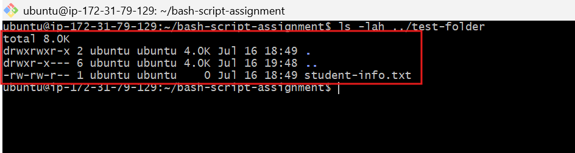

---

#### Screenshot 2 — Content of `file-check.sh`

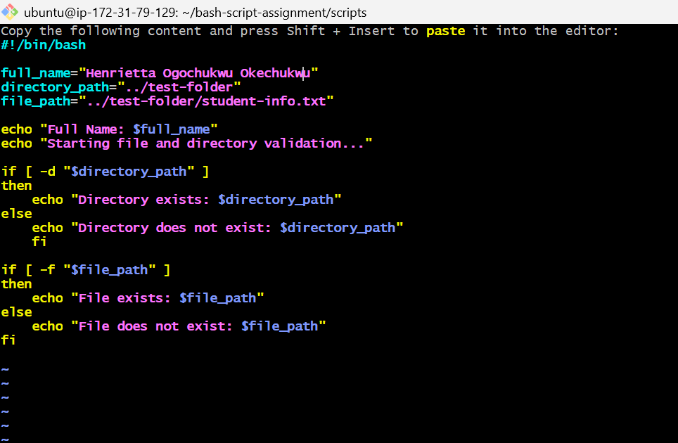

---

#### Screenshot 3 — Output of `./file-check.sh`

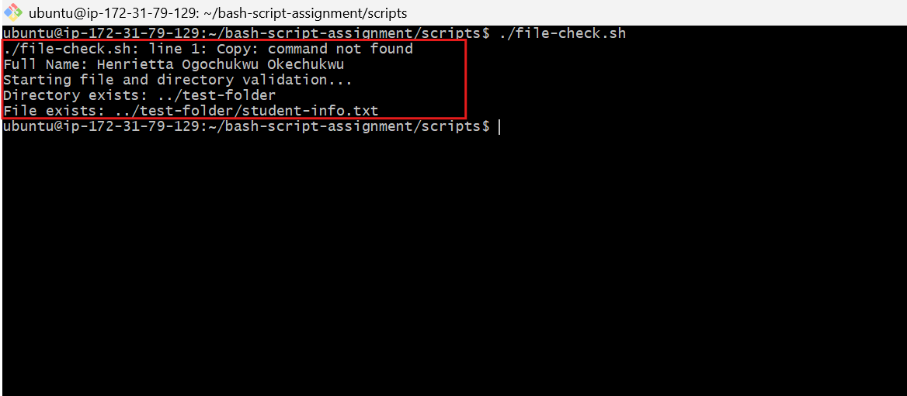

---

### Notes

Answer the following in your own words:

**1. What does `-d` check in Bash?**

-d checks whether the specified path exists and is a directory.

---

**2. What does `-f` check in Bash?**

-f checks whether the specified path exists and is a regular file.

---

**3. Why should file and directory paths be stored in variables?**

Storing file and directory paths in variables makes scripts easier to maintain. If a path changes, it only needs to be updated once instead of in multiple places.

---

**4. What happens if the file does not exist?**

The condition evaluates to false, so the else block runs and displays a message indicating that the file does not exist

---

# Task 7 — Conditionals: Pass or Retry Script

## Goal

Use if-else conditionals to make decisions based on a variable value.

### Evidence

#### Screenshot 1 — Content of `score-check.sh` with `score=85`

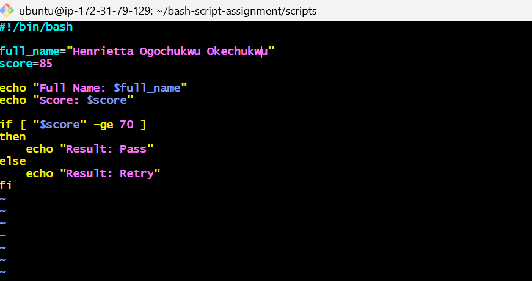

---

#### Screenshot 2 — Output showing `Result: Pass`

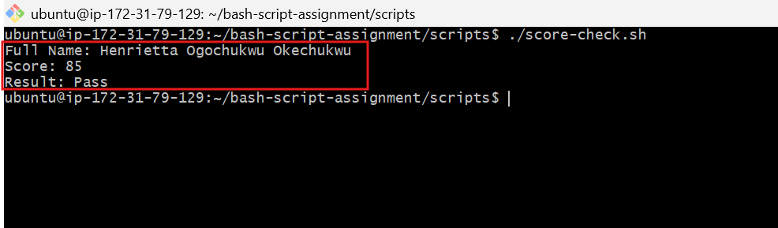

---

#### Screenshot 3 — Content of `score-check.sh` with `score=55`

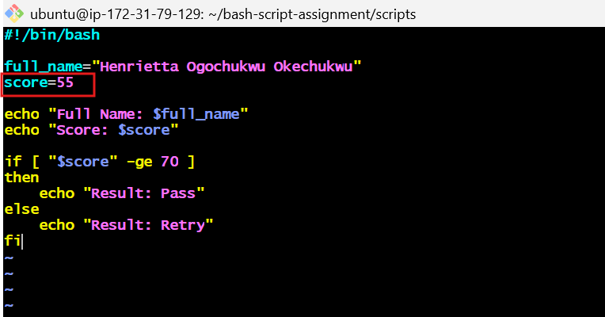

---

#### Screenshot 4 — Output showing `Result: Retry`

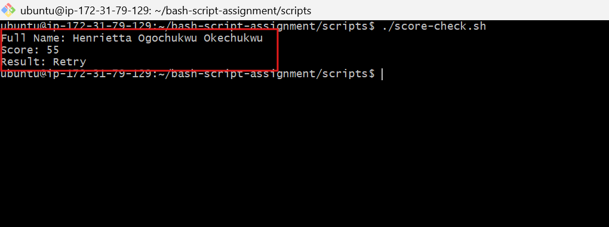

---

### Notes

Answer the following in your own words:

**1. What is the purpose of if-else in Bash?**

The if-else statement allows a Bash script to make decisions. It executes one block of code when a condition is true and another block when the condition is false.

---

**2. What does `-ge` mean?**

-ge means greater than or equal to. It compares two numeric values and returns true if the first value is greater than or equal to the second.

---

**3. Why should conditions be tested with different values?**

Testing different values helps confirm that both the true (if) and false (else) branches work correctly, making the script more reliable.

---

**4. How can conditionals help in automation scripts?**

Conditionals allow automation scripts to respond to different situations, such as checking whether a service is running, verifying a file exists, or stopping a deployment when an error occurs.

---

# Task 8 — Functions: Final Bash Automation Script

## Goal

Create a final Bash script using functions to organize reusable code.

### Evidence

#### Screenshot 1 — Content of `final-automation.sh`

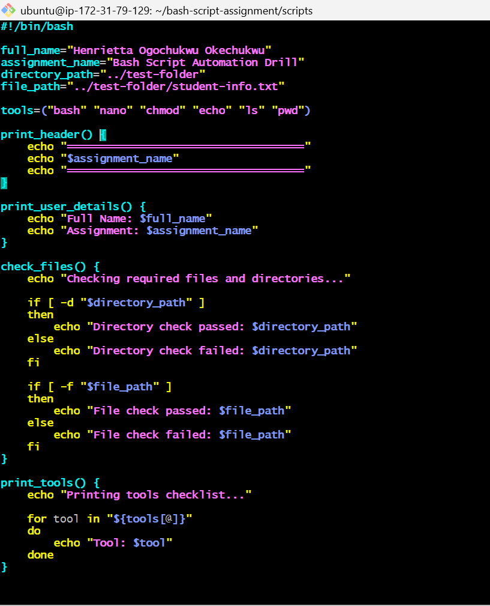

---

#### Screenshot 2 — Output of `./final-automation.sh`

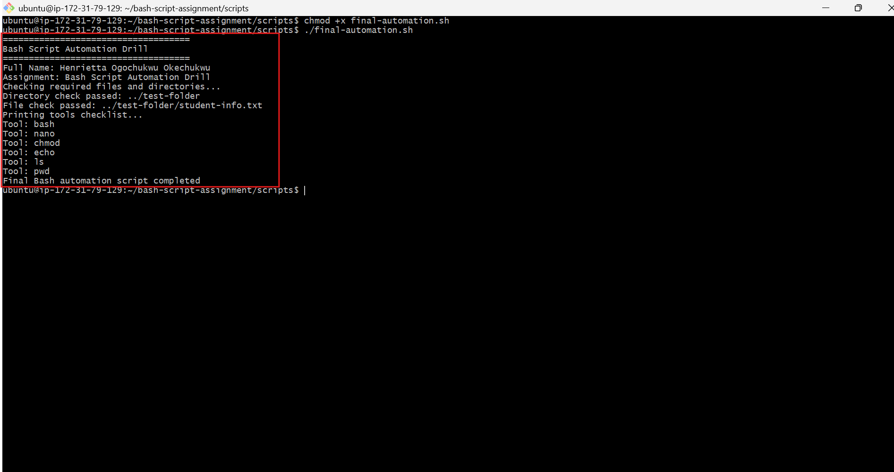

---

#### Screenshot 3 — Output of `ls -lah` showing all created scripts

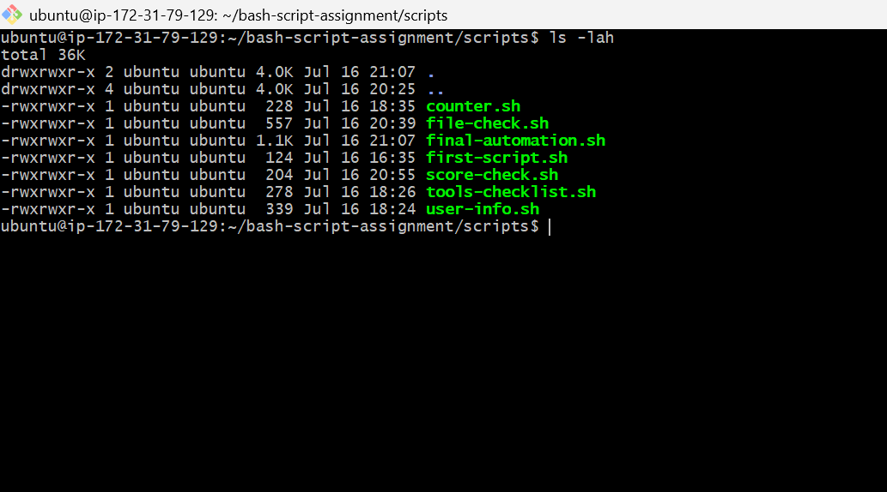

---

### Notes

Answer the following in your own words:

**1. What is a function in Bash?**

A function is a named block of reusable code that performs a specific task. It can be called whenever needed, helping to avoid repeating the same comma

---

**2. Why are functions useful in scripts?**

Functions make scripts more organized, reusable, and easier to maintain. If a task needs to change, it only needs to be updated in one place instead of multiple locations.

---

**3. Which functions did you create in this script?**

I created three functions: show_user() to display user information, show_tools() to list DevOps tools using a loop, and check_score() to evaluate a score using an if-else condition.

---

**4. How does this final script combine variables, arrays, loops, conditionals, files, and functions?**

The final script combines variables to store user information, an array to store DevOps tools, a loop to display each tool, conditionals to determine the training result, and functions to organize reusable code into separate logical sections.

---

# LinkedIn Post (Required)

## Evidence

#### LinkedIn Post URL

Paste your LinkedIn post URL here:

`__________________________`

---

#### Screenshot — Published LinkedIn post

Add your screenshot here.

---

# Submission Instructions

- Add all required screenshots in your submission
- Full name must be visible in required screenshots
- All script files must be created and run successfully
- Required notes must be answered clearly for every task
- Do not expose sensitive information (keys, passwords, credentials)

---

# Completion Checklist

- [ ] Task 1: Environment setup verified, workspace created (Screenshots 1–2, Notes answered)
- [ ] Task 2: First script created, executed, permissions verified (Screenshots 1–3, Notes answered)
- [ ] Task 3: Variables script created and run (Screenshots 1–2, Notes answered)
- [ ] Task 4: Arrays and loops script created and run (Screenshots 1–2, Notes answered)
- [ ] Task 5: Counter loop script created and run (Screenshots 1–2, Notes answered)
- [ ] Task 6: File validation script created and run (Screenshots 1–3, Notes answered)
- [ ] Task 7: Pass/Retry conditional script tested with both values (Screenshots 1–4, Notes answered)
- [ ] Task 8: Final automation script created and run (Screenshots 1–3, Notes answered)
- [ ] All scripts run without errors
- [ ] Full Name visible in all required screenshots
- [ ] LinkedIn post published and URL submitted
- [ ] No sensitive data exposed

---

## 📌 About DMI & CloudAdvisory

DevOps Micro Internship (DMI) is a project-based DevOps program run by Pravin Mishra (The CloudAdvisory) focused on real-world execution, systems thinking, and career readiness.

It helps learners build strong DevOps foundations with hands-on experience.

---

## 📌 Resources

- 🌐 DMI Official Website: https://pravinmishra.com/dmi  
- 🎓 DevOps for Beginners (Udemy): https://www.udemy.com/course/devops-for-beginners-docker-k8s-cloud-cicd-4-projects/  
- 🎓 Agentic AI DevOps with Claude Code: https://www.udemy.com/course/ultimate-agentic-ai-devops-with-claude-code/  
- 🎓 DevOps with Claude Code: Terraform, EKS, ArgoCD & Helm: https://www.udemy.com/course/devops-with-claude-code-terraform-eks-argocd-helm/  
- ▶️ YouTube Playlist: https://www.youtube.com/playlist?list=PLFeSNDtI4Cho  
- 🔗 Pravin Mishra (LinkedIn): https://www.linkedin.com/in/pravin-mishra-aws-trainer/  
- 🏢 CloudAdvisory (LinkedIn): https://www.linkedin.com/company/thecloudadvisory/

---

*This submission is part of DevOps Micro Internship (DMI) Cohort 3 — Agentic AI Track.*