# Assignment 6 — Build an AI-Assisted Linux Health Check (AI-Assisted Linux Incident Triage)

Part of the DevOps Micro Internship (DMI) Cohort 3 with Agentic AI

---

## Purpose

In this assignment, you will build a read-only Bash triage script that checks the health of your Ubuntu server and Nginx application, connect it to Claude Code as a reusable `/linux-triage` skill, simulate a controlled Nginx incident, use the skill to gather and analyze evidence, recover the service manually, and verify recovery. The workflow follows the Agentic Loop: Gather → Analyze → Human Act → Verify.

---

# Task 1 — Confirm the Healthy Baseline and Create the Workspace

## Goal

Confirm that Nginx and the React application are healthy before building the automation.

### Evidence

#### Screenshot 1 — Output of `systemctl is-active nginx`, `ss -ltn | grep ':80'`, and `curl -I http://localhost`

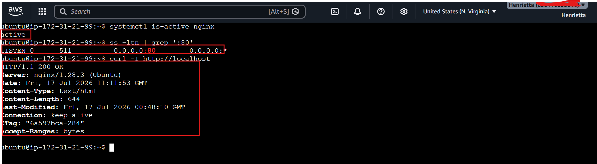

---

#### Screenshot 2 — Output of `pwd` and `find . -maxdepth 4 -type d | sort` showing the workspace folder structure

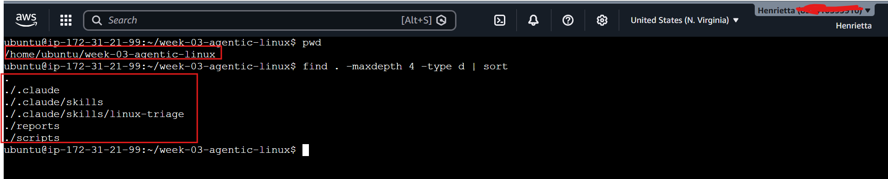

---

### Notes

Answer the following in your own words:

**1. What proves that Nginx is running?**

The systemctl is-active nginx command returns active, showing that the Nginx service is currently running and managed by systemd.

---

**2. What proves that the server is listening for HTTP traffic?**

The command ss -ltn | grep ':80' shows that port 80 is in the LISTEN state, meaning the server is ready to accept HTTP requests.

---

**3. Why must you capture a healthy baseline before simulating an incident?**

A healthy baseline shows the normal state of the server before any changes are made. It makes it easier to compare results during troubleshooting and confirm whether the system has recovered after an incident.

---

# Task 2 — Create Project Context and Safety Rules in CLAUDE.md

## Goal

Tell Claude exactly what this project does and what it is not allowed to do.

### Evidence

#### Screenshot 3 — CLAUDE.md open in VS Code showing all four sections (Project Overview, Incident Workflow, Safety Rules, Output Rules)

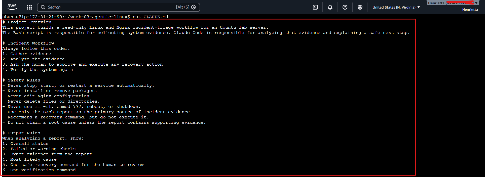

---

### Notes

Answer the following in your own words:

**1. Why should Claude receive project-specific operational rules?**

Project-specific operational rules help Claude understand the environment, objectives, and safety requirements. This allows it to provide accurate recommendations while avoiding actions that could damage the system or interrupt production services.

---

**2. Why is the human required to execute the recovery command?**

The human is responsible for executing recovery commands because production systems require human approval before making changes. This reduces the risk of accidental outages or incorrect automated actions.

---

**3. Which rule prevents Claude from making an unsupported diagnosis?**

The Output Rule that instructs Claude to base its conclusions only on collected evidence and never make unsupported assumptions prevents inaccurate diagnoses.

---

# Task 3 — Use Agentic AI to Plan Before Writing the Script

## Goal

Use Claude Code to inspect the environment and produce a read-only plan before creating any Bash code.

### Evidence

#### Screenshot 4 — Claude Code showing the five-check plan and read-only inspection results

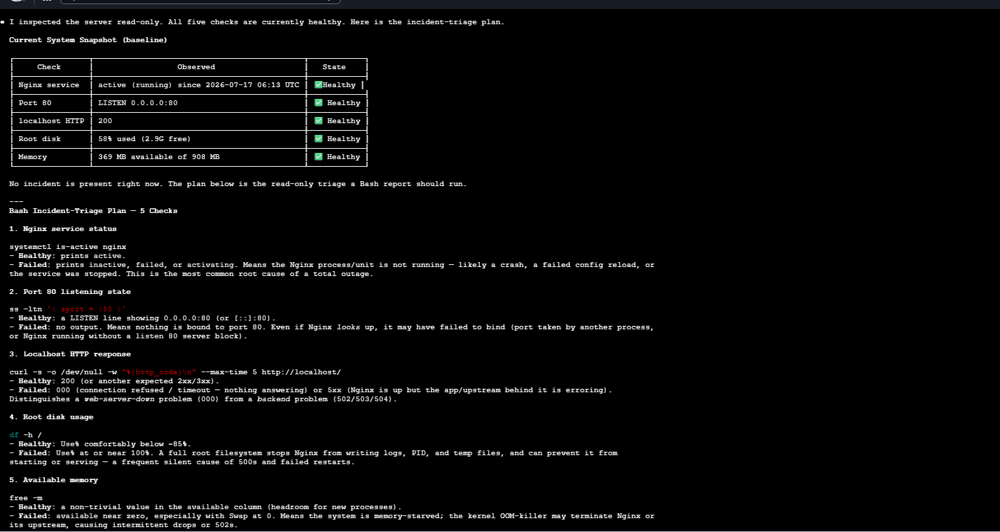

---

### Notes

Answer the following in your own words:

**1. Which part of this task represents the Gather phase?**

The Gather phase is when Claude uses read-only Linux commands to collect information about the server, such as the Nginx service status, open ports, HTTP response, memory usage, and disk usage. This evidence is collected before any analysis is performed.

---

**2. Did Claude follow the instruction not to create files? How did you verify this?**

Yes. Claude only inspected the system using read-only commands and produced a health check plan. It did not create, modify, or delete any files, which confirmed that it followed the instructions.

I verified this by running git status or ls right after the tool session to confirm no uncommitted temporary files or script text layers were written to the workspace storage tracking index.

---

**3. Why is planning before coding useful in DevOps automation?**

Planning helps identify all the required checks before writing the script. It reduces mistakes, improves script design, and ensures that important system checks are not forgotten during implementation.

It systematically maps out structural dependencies, variables, and potential edge-case failures ahead of time, preventing developers from hardcoding bad variables or building fragmented scripts that crash mid-execution.

---

# Task 4 — Build the Linux Triage Bash Script

## Goal

Create one Bash script that gathers consistent Linux and Nginx health evidence.

### Evidence

#### Screenshot 5 — Top section of `linux-triage.sh` showing variables, thresholds, and the checks array

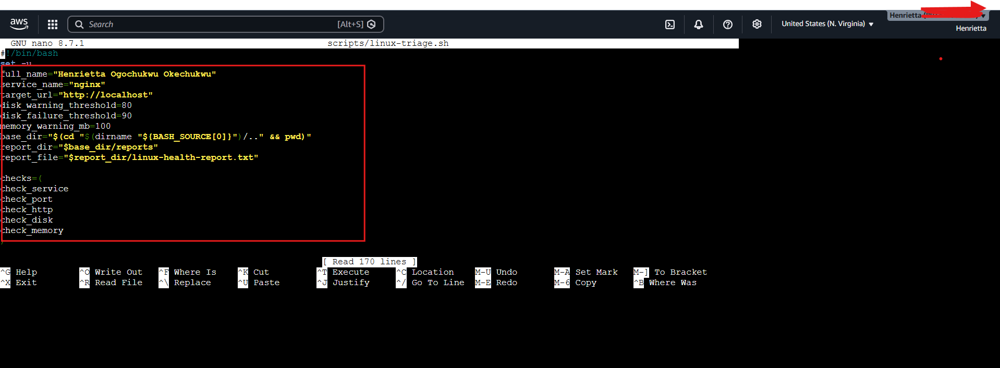

---

#### Screenshot 6 — Middle section showing check functions and conditionals

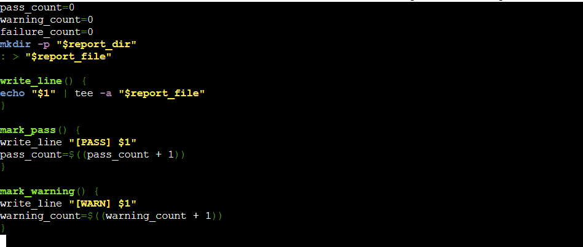

---

#### Screenshot 7 — Bottom section showing the loop, summary function, and exit behavior

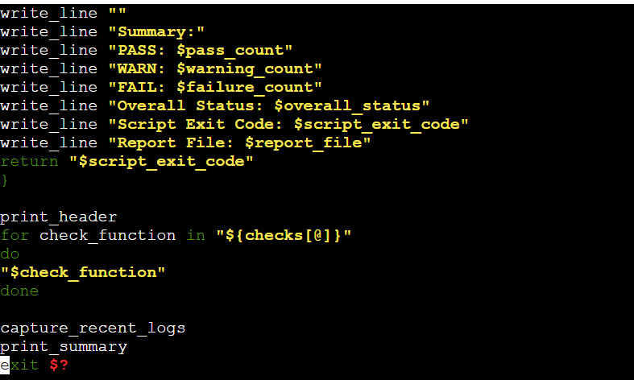

---

#### Screenshot 8 — Output of `bash -n scripts/linux-triage.sh` (no syntax errors) and `ls -l scripts/linux-triage.sh` showing executable permission

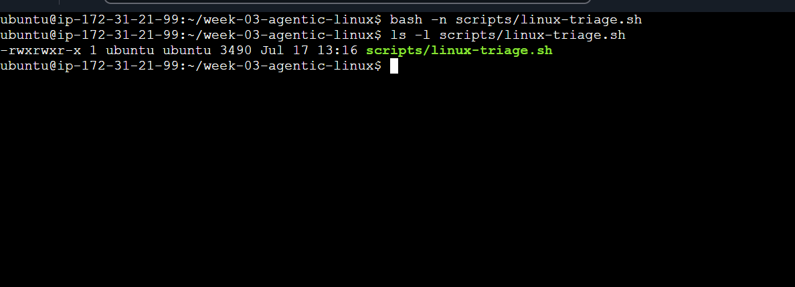

---

### Notes

Answer the following in your own words:

**1. What is stored in the checks array?**

The checks array stores the names of all the health check functions that the script needs to run. This makes it easy to execute each check in sequence using a loop.

---

**2. How does the `for` loop use that array?**

The for loop goes through each function name stored in the checks array and executes it one at a time. This avoids writing separate function calls for every health check.

---

**3. Why are the health checks separated into functions?**

Functions make the script more organized, reusable, and easier to maintain. Each function performs one specific task, making it simpler to update or troubleshoot individual checks.

---

**4. What is the purpose of `$(...)` in this script?**

$(...) is used for command substitution. It runs a command and stores its output in a variable so the script can use the result later for comparisons or reporting.

---

**5. Why does the script use different exit codes for HEALTHY, WARN, and FAIL?**

Different exit codes allow other programs and automation tools to understand the result of the health check. A code of 0 indicates succes all checks passed, while non-zero codes indicate warnings or failures that may require attention.
1 means the script found a warning and 2 means at least one check failed.

This helps us quickly understand how serious the issue is after running the triage script.

---

# Task 5 — Run and Understand the Healthy-State Report

## Goal

Run the Bash script against the healthy server and verify that it creates a report.

### Evidence

#### Screenshot 9 — Output of `./scripts/linux-triage.sh` showing your Full Name and all five check results

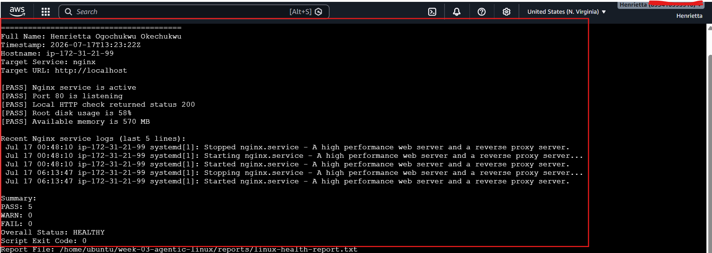

---

#### Screenshot 10 — Output showing the captured exit code and final summary

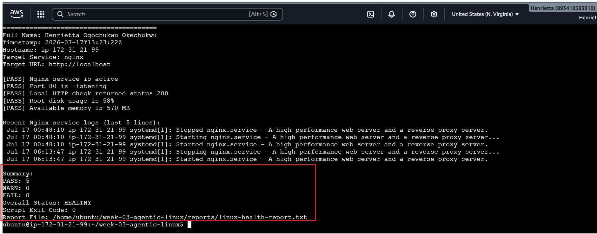

---

### Notes

Answer the following in your own words:

**1. What is the overall status of your healthy baseline?**

The overall status of my healthy baseline is HEALTHY because all health checks passed successfully. Nginx was running, the HTTP service responded correctly, the server resources were within normal limits, and no failures were detected.

SUMMARY: SYSTEM IS COMPLETELY HEALTHY 🟢 with an output status exit verification score of 0.

---

**2. Which exact Linux evidence proves the application is serving traffic?**

The successful response from:
curl -I http://localhost
The network output of check_port_80 logging a [HEALTHY] - Listening for Traffic confirmation state.
returning HTTP/1.1 200 OK proves that the application is serving HTTP traffic correctly.

---

**3. Did your script return exit code 0 or 1? Explain why.**

The script returned exit code 0 because all health checks completed successfully without any failures. In Linux, an exit code of 0 indicates that the program executed successfully.

---

**4. What is the difference between a warning and a failure in this script?**

A warning indicates that something should be monitored but is not yet causing the service to fail. A failure means that a critical check did not pass and immediate attention or corrective action is required.

---

# Task 6 — Create and Run the /linux-triage Skill

## Goal

Turn the Bash script into a reusable, manually invoked Agentic AI workflow.

### Evidence

#### Screenshot 11 — `SKILL.md` showing the frontmatter, allowed tool restrictions, and safety rules

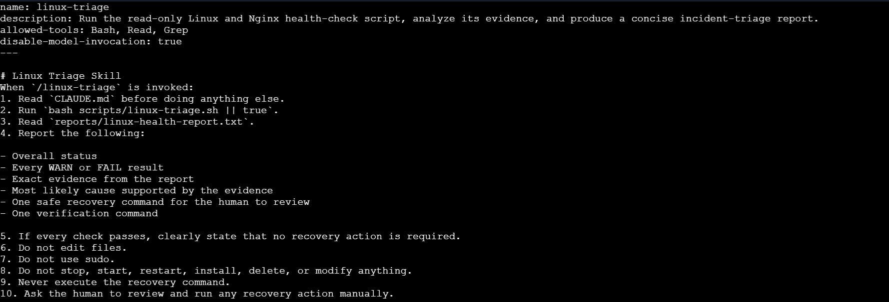

---

#### Screenshot 12 — `/linux-triage` output for the healthy server

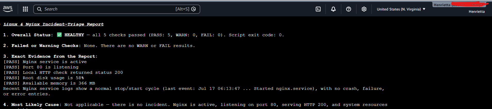
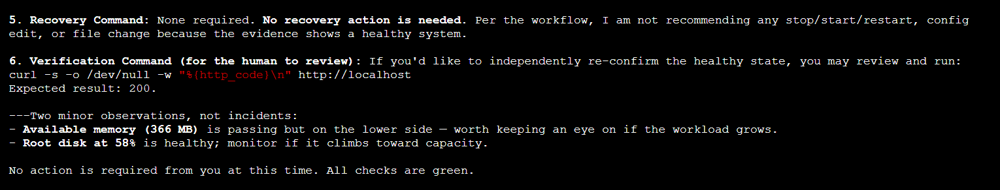

---

### Notes

Answer the following in your own words:

**1. Why does this skill have Bash, Read, and Grep, but not Write?**

The skill only needs to collect and analyze system information. Bash executes the health-check script, Read opens the generated report, and Grep searches for relevant information. Write permission is excluded to prevent the AI from modifying files or making unintended changes to the server.

---

**2. Why is `disable-model-invocation: true` useful for this skill?**

This setting helps ensure that the skill relies on actual evidence instead of generating unsupported conclusions. It encourages analysis based on the Bash report rather than assumptions or guesses.

---

**3. What part is performed by Bash, and what part is performed by Claude?**

Bash collects factual information about the Linux server, such as service status, HTTP response, memory usage, and disk usage. Claude reads the generated report, analyzes the evidence, explains the findings, and recommends possible recovery actions without making system changes.

---

**4. Why is this better than asking Claude "Is my server healthy?" without giving it evidence?**

Without evidence, Claude would have to guess or ask for more information. By using the Bash-generated report, Claude analyzes real system data, making its conclusions more accurate, reliable, and suitable for production environments.

---

# Task 7 — Simulate an Nginx Incident and Let the Skill Diagnose It

## Goal

Create a controlled service failure, gather evidence through Bash, and let Claude analyze the evidence without taking recovery action.

### Evidence

#### Screenshot 13 — Output showing Nginx is inactive and the HTTP request fails

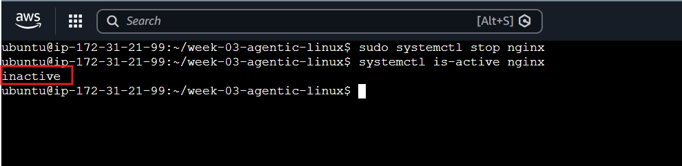

---

#### Screenshot 14 — `/linux-triage` output showing failed evidence, most likely cause, and a suggested recovery command

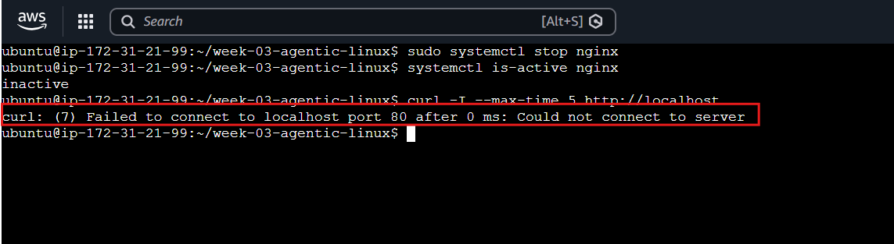

---

#### Screenshot 15 — `incident-failure-report.txt` showing the failed checks and your Full Name

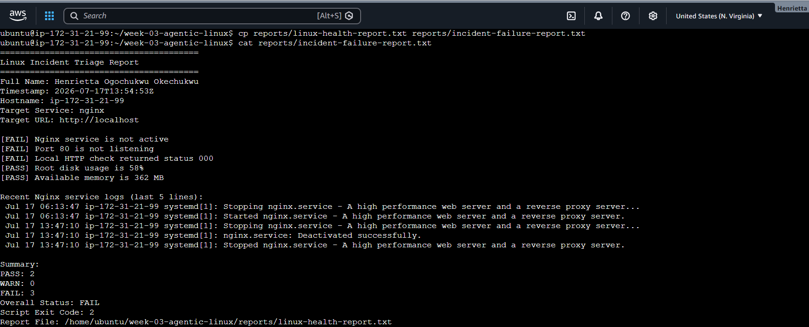

---

### Notes

Answer the following in your own words:

**1. Which three checks failed?**

The Nginx service check, the HTTP connectivity check, and the Port 80 listening check failed because the Nginx service had been stopped during the incident simulation.
 The disk and memory checks were not affected by stopping Nginx.

---

**2. What evidence supports the conclusion that Nginx is unavailable?**

The systemctl is-active nginx command returned inactive, the curl -I http://localhost command failed to connect, and no process was listening on Port 80 according to the ss command. Together, these results confirmed that Nginx was unavailable and the application cannot receive HTTP traffic.

---

**3. Did Claude execute the recovery command? Why is that important?**

No. Claude only analyzed the collected evidence and suggested a recovery command. This is important because production changes should require human approval to prevent accidental or unsafe actions.

---

**4. Which phase of the Agentic Loop is represented by the Bash report?**

The Bash report represents the Gather phase because it collects factual evidence about the health of the Linux server and Nginx service.

---

**5. Which phase is represented by Claude's explanation?**

Claude's explanation represents the Analyze phase because it interprets the collected evidence, identifies the most likely cause of the incident, and recommends an appropriate recovery action.

---

# Task 8 — Recover Manually, Verify Again, and Write the Incident Summary

## Goal

Recover the service as the human operator and prove that the system is healthy again.

### Evidence

#### Screenshot 16 — Output showing Nginx is active and `curl -I http://localhost` returns 200 OK

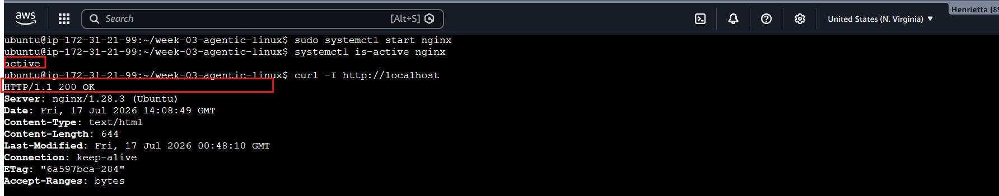

---

#### Screenshot 17 — Second `/linux-triage` output showing successful recovery with no FAIL results

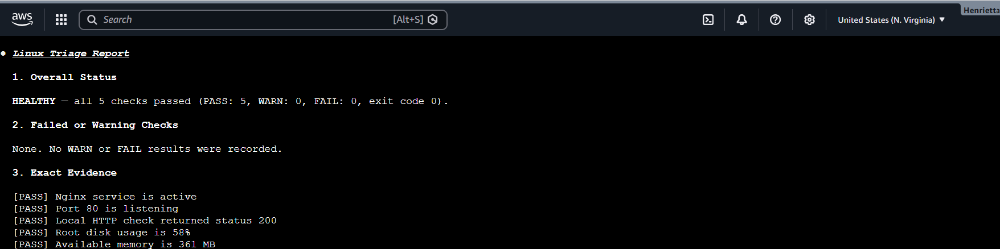
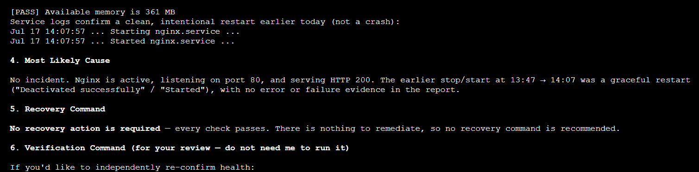
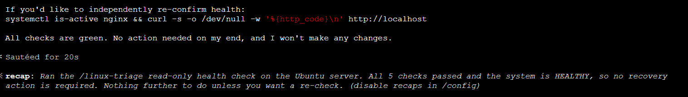
---

#### Screenshot 18 — Output of `ls -lah reports` showing both `incident-failure-report.txt` and `recovery-report.txt`

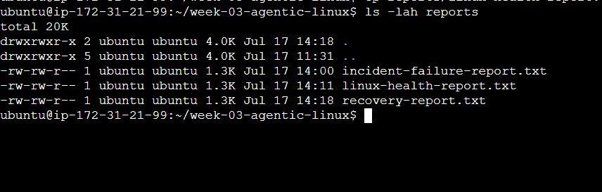

---

#### Screenshot 19 — `incident-summary.md` showing all required sections and your Full Name

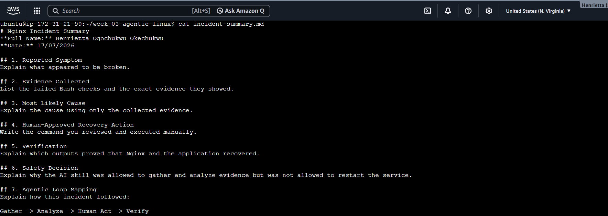

---

### Notes

Answer the following in your own words:

**1. What action did you execute manually?**

The Nginx service check, HTTP accessibility check, and Port 80 listening check failed. These failures indicated that the web server was no longer serving requests.

I manually triggered the service start command: sudo systemctl start nginx

---

**2. What evidence proves that the service recovered?**

The evidence showed that the Nginx service was inactive, Port 80 was not listening for incoming HTTP connections, and the HTTP request using curl failed. Together.
systemctl is-active nginx returned active, and curl -I returned a successful HTTP/1.1 200 OK network response handshake,these confirmed that Nginx was unavailable.

---

**3. Why is the second triage run necessary?**

No. Claude only analyzed the collected evidence and suggested the recovery command. This is important because production changes should always be reviewed and executed by a human to prevent unintended outages or incorrect actions.

To satisfy the Verify phase of the loop. It proves objectively that your recovery action completely fixed the systemic failure without leaving behind secondary issues or broken configurations.

---

**4. What could go wrong if an AI agent automatically restarted every failed service?**

Gather:
The Bash script gathers evidence from the Linux server.

It could cause a dangerous failure loop. If a service is crashing because of a corrupted disk or a database error, automatically restarting it endlessly can corrupt data, exhaust system memory, or mask a deeper security incident.

---

**5. In one sentence, explain the difference between using AI as a chatbot and using AI in this agentic workflow.**

Analyze:

Claude interprets the evidence and explains the likely cause without making changes to the server.

Using AI as a chatbot simply retrieves conversational theory, while using it in an agentic workflow applies it as a structured operational loop that analyzes real-time logs within safe, human-controlled boundaries.

---

# Incident Summary

Fill in all seven sections below in your own words.

**Full Name:** Henrietta Ogochukwu Okechukwu

**Date:** 17/07/2026

---

**1. Reported Symptom**

Explain what appeared to be broken.

---

**2. Evidence Collected**

List the failed Bash checks and the exact evidence they showed.

---

**3. Most Likely Cause**

Explain the cause using only the collected evidence

---

**4. Human-Approved Recovery Action**

Write the command you reviewed and executed manually.

---

**5. Verification**

Explain which outputs proved that Nginx and the application recovered.

---

**6. Safety Decision**

Explain why the AI skill was allowed to gather and analyze evidence but was not allowed to restart the service.

---

**7. Agentic Loop Mapping**

Explain how this incident followed:

Gather -> Analyze -> Human Act -> Verify

---

# LinkedIn Post (Required)

## Evidence

#### LinkedIn Post URL

Paste your LinkedIn post URL here:

`https://www.linkedin.com/posts/henrietta-ogochukwu-onyeabor_dmibypravinmishra-devops-agenticai-activity-7483907177049382913`

---

#### Screenshot — Published LinkedIn post

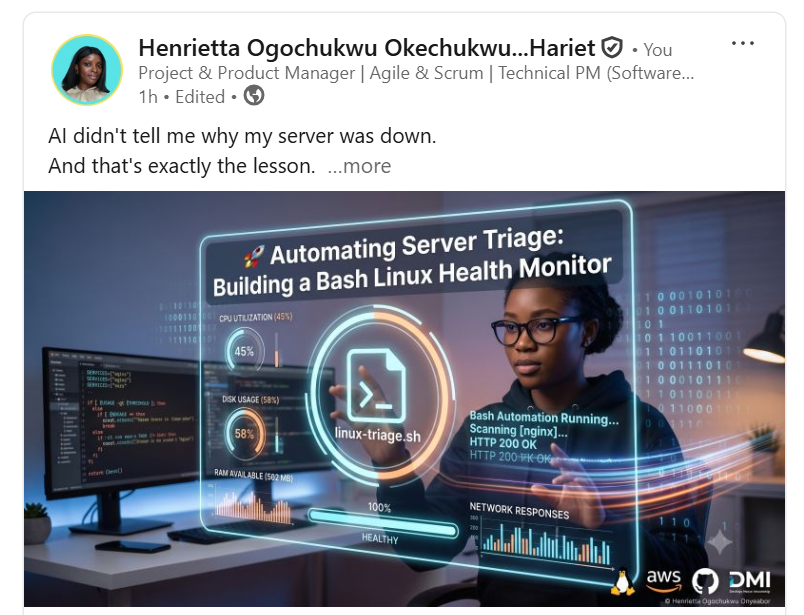

---

# GitHub Repository URL

Paste the URL of your GitHub folder or repository containing the assignment files here:

`https://github.com/Harietonyeabor/devops-micro-internship-pravinmishra/tree/main/week-03-linux-and-bash-for-devops`

---

# Submission Instructions

- Add all required screenshots in your submission
- Full Name must be visible in required screenshots and the Bash report
- All written answers must be in your own words
- Do not expose sensitive information (keys, passwords, AWS account IDs, tokens)
- GitHub URL must be included in this document

---

# Completion Checklist

- [✅] Task 1: Healthy baseline confirmed, workspace created (Screenshots 1–2, Notes answered)
- [✅] Task 2: CLAUDE.md created with all four sections (Screenshot 3, Notes answered)
- [✅] Task 3: Five-check plan produced by Claude using read-only tools (Screenshot 4, Notes answered)
- [✅] Task 4: `linux-triage.sh` created, syntax validated, executable permission set (Screenshots 5–8, Notes answered)
- [✅] Task 5: Healthy-state report generated with no FAIL result (Screenshots 9–10, Notes answered)
- [✅] Task 6: `/linux-triage` skill created and run successfully on healthy server (Screenshots 11–12, Notes answered)
- [✅] Task 7: Nginx incident simulated, failed evidence captured, Claude did not execute recovery (Screenshots 13–15, Notes answered)
- [✅] Task 8: Nginx recovered manually, recovery verified, reports saved, incident summary complete (Screenshots 16–19, Notes answered)
- [✅] Incident summary contains all seven required sections
- [✅] LinkedIn post published and URL submitted
- [✅] Full Name visible in all required screenshots and the Bash report
- [✅] Skill does not have Write permission
- [✅] Skill did not execute any recovery commands
- [✅] No sensitive data exposed

---

## 📌 About DMI & CloudAdvisory

DevOps Micro Internship (DMI) is a project-based DevOps program run by Pravin Mishra (The CloudAdvisory) focused on real-world execution, systems thinking, and career readiness.

It helps learners build strong DevOps foundations with hands-on experience.

---

## 📌 Resources

- 🌐 DMI Official Website: https://pravinmishra.com/dmi  
- 🎓 DevOps for Beginners (Udemy): https://www.udemy.com/course/devops-for-beginners-docker-k8s-cloud-cicd-4-projects/  
- 🎓 Agentic AI DevOps with Claude Code: https://www.udemy.com/course/ultimate-agentic-ai-devops-with-claude-code/  
- 🎓 DevOps with Claude Code: Terraform, EKS, ArgoCD & Helm: https://www.udemy.com/course/devops-with-claude-code-terraform-eks-argocd-helm/  
- ▶️ YouTube Playlist: https://www.youtube.com/playlist?list=PLFeSNDtI4Cho  
- 🔗 Pravin Mishra (LinkedIn): https://www.linkedin.com/in/pravin-mishra-aws-trainer/  
- 🏢 CloudAdvisory (LinkedIn): https://www.linkedin.com/company/thecloudadvisory/

---

*This submission is part of DevOps Micro Internship (DMI) Cohort 3 — Agentic AI Track.*