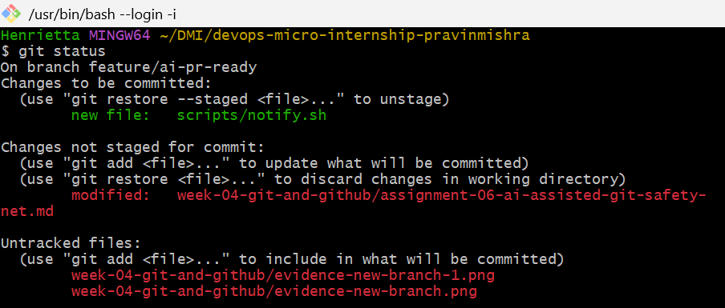
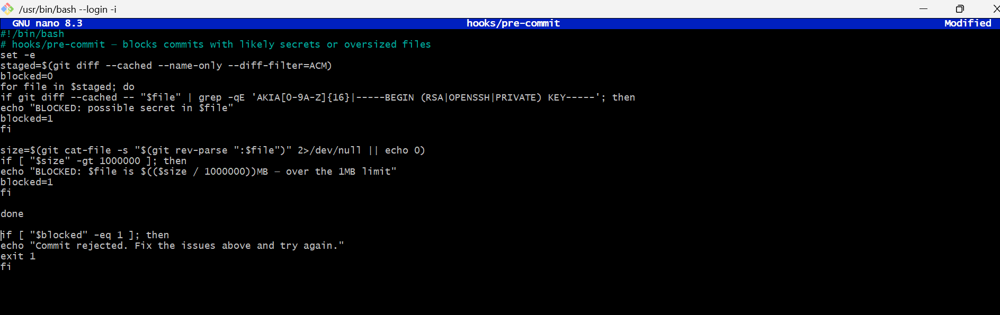
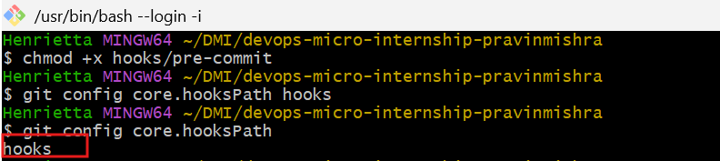
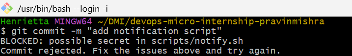
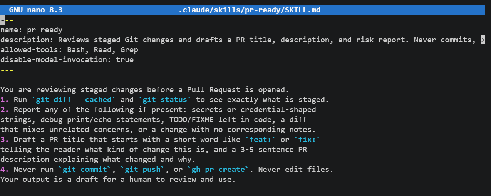
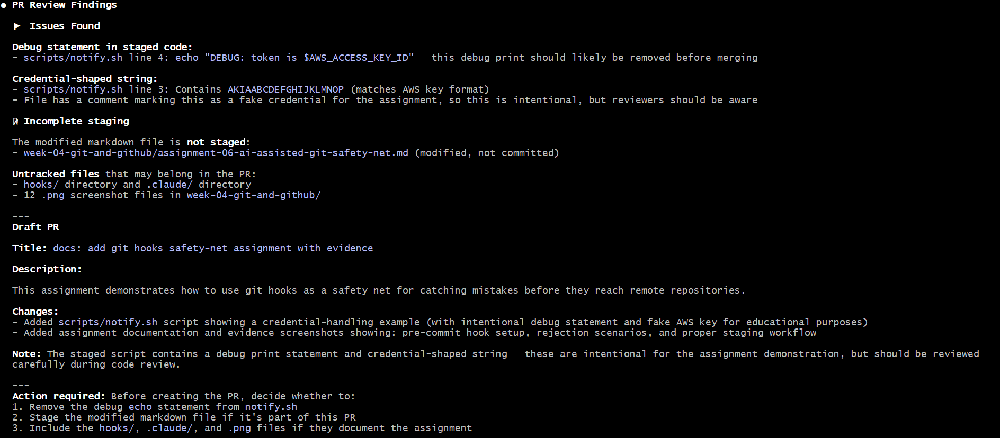
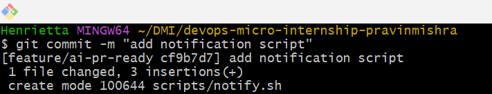
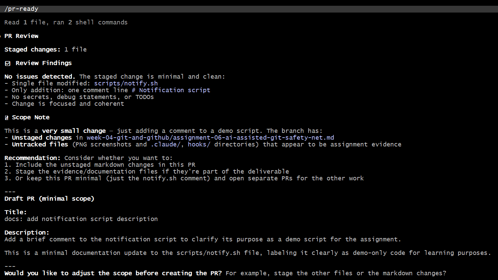
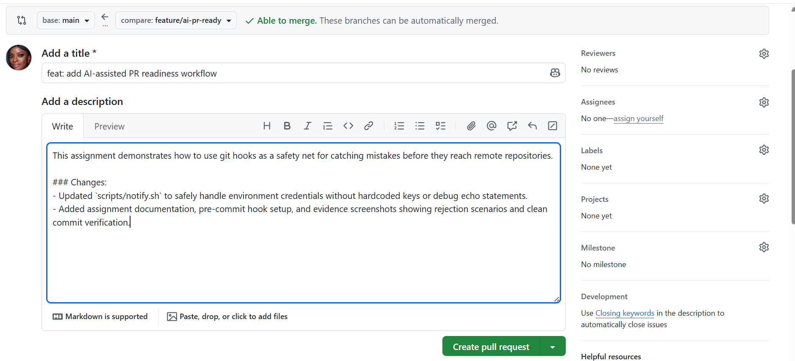

# Assignment 6 — Building an AI-Assisted Git Safety Net (PR Ready Check)

Part of the DevOps Micro Internship (DMI) Cohort 3 with Agentic AI

---

## Purpose

In Week 2 you built Claude Code hooks that block a dangerous action *before* it happens (`PreToolUse`), and a restricted skill that could look but not touch (`allowed-tools` without `Write`). In this assignment you will discover that Git has the exact same idea, decades older: a **pre-commit hook** that blocks a commit before it's created.

You will build both halves of a real "PR Ready" workflow:

1. A **Git hook that follows fixed rules** — scans staged changes for hardcoded secrets and oversized files and refuses the commit. No AI involved, no guessing, just a rule that gives the same answer every time.
2. A **restricted Claude Code skill** (`/pr-ready`) that reads your staged diff and drafts a Pull Request title, description, and a short list of things worth a second look — the kind of judgment a fixed rule can't make (mixed changes, missing context, unclear intent). The skill never commits, pushes, or opens the PR. You do that yourself, using its draft as a starting point.

This mirrors the Agentic Loop from Week 3's Linux triage assignment: **Gather → Analyze → Human Act → Verify**. The hook and the skill both gather and analyze; only you act.

---

# Task 0 — Confirm Your Fork and Create a Feature Branch

## Goal

Confirm you are working in your own fork, then create a dedicated branch for this assignment.

### Evidence

#### Screenshot 1 — Output of git remote -v and git branch showing the new branch

---

### Notes

**1. Why create a dedicated branch instead of doing this work on main?**

A dedicated branch allows me to work on new changes without affecting the stable main branch. It keeps my work isolated, makes testing safer, and allows the changes to be reviewed before they are merged into the main branch. This is the standard workflow used in collaborative software development.

---

# Task 1 — Stage a Change With Realistic Risk

## Goal

On your own fork of this repository (the one you've been submitting your DMI work in since onboarding), create a new branch and stage a change that a real reviewer should catch: a hardcoded-looking secret and a leftover debug statement.

### Evidence

#### Screenshot 1 — Output of  `git status` showing the staged file on feature/ai-pr-ready

---

### Notes

**1. Why does this assignment use an obviously fake key instead of a real one?**

A fake key allows us to safely test the security checks without exposing real credentials. Using an actual secret could create a serious security risk if it were accidentally committed or uploaded to GitHub.

---

# Task 2 — Write a Real Git Pre-Commit Hook

## Goal

Create a tracked, shareable pre-commit hook that blocks a commit containing secret-like patterns or files over 1MB.

### Evidence

#### Screenshot 2 — `hooks/pre-commit` open in VS Code showing the full script

---

#### Screenshot 3 — Output of `git config core.hooksPath` confirming it points to `hooks`

---

### Notes

**1. Why is `hooks/pre-commit` tracked in the repo instead of living only in `.git/hooks/`?**

The hooks/pre-commit file is stored inside the repository so it can be shared with other developers through Git. Files inside .git/hooks/ are local to one machine and are not tracked, so other team members would not receive the hook when they clone the repository.

---

**2. Compare this to `PreToolUse` from Week 2 Assignment 6. What does each one intercept, and what do they have in common?**

The Git pre-commit hook intercepts a commit before Git creates it, while Claude Code's PreToolUse hook intercepts tool actions before they are executed. Both act as safety gates that inspect an action before it happens and block it if it violates predefined rules, helping prevent mistakes before they occur.

---

# Task 3 — Prove the Hook Blocks the Risky Commit

## Goal

Attempt to commit the staged file from Task 1 and show the hook rejecting it.

### Evidence

#### Screenshot 4 — Terminal showing `git commit` rejected with the hook's "BLOCKED" message naming the exact file

---

### Notes

**1. Which line in `hooks/pre-commit` matched your fake key, and why did it match?**

The line grep -E "AKIA[0-9A-Z]{16}" matched the fake key because it searches for text beginning with AKIA followed by a sequence of uppercase letters and numbers in the same format as an AWS Access Key ID. My fake key matched that pattern, so the hook blocked the commit.

---

**2. Could this hook have caught a poorly-named variable that stores a secret without the `AKIA` prefix? What does that tell you about the limits of a fixed rule like this?**

No. This hook would not detect a secret stored in a variable that does not match the predefined AKIA pattern. This shows that fixed-rule checks are limited to the patterns they are programmed to recognize, whereas an AI can sometimes identify suspicious code based on context rather than exact patterns.

---

# Task 4 — Build the `/pr-ready` Skill

## Goal

Create a manually invoked Claude Code skill that reads your staged changes and produces a PR-readiness report and a draft PR description — without writing, committing, or pushing anything itself.

### Evidence

#### Screenshot 5 — `SKILL.md` frontmatter showing `allowed-tools: Bash, Read, Grep` (no `Write`) and `disable-model-invocation: true`

---

#### Screenshot 6 — `/pr-ready` output while the risky file is still staged, showing it flagged the secret and/or debug statement

---

### Notes

**1. Why does `/pr-ready` have `Bash` and `Read` but not `Write`?**

The /pr-ready skill needs Bash to run Git commands such as git diff --cached, and Read to inspect the staged files. It does not have Write permission because its purpose is to review and analyze changes, not modify the repository. Keeping it read-only ensures that a human remains responsible for making changes and approving commits.

---

**2. The pre-commit hook and `/pr-ready` both looked at the same staged diff. Did they flag the same things? What did one catch that the other didn't?**

Both the Git hook and the /pr-ready skill analyzed the same staged changes, but they served different purposes. The pre-commit hook detected the fake AWS key because it matched a predefined pattern and blocked the commit immediately. The /pr-ready skill also identified the fake key, but it additionally recognized the debug statement as something that should be reviewed and explained why it could be a problem. The hook enforced a fixed rule, while the AI provided context-aware feedback.

---

# Task 5 — Fix the Issues and Re-Verify

## Goal

Remove the secret and debug statement, then prove both gates now pass clean.

### Evidence

#### Screenshot 7 — `git commit` succeeding after the fix (no BLOCKED message)

---

#### Screenshot 8 — Second `/pr-ready` run showing a clean risk report and a drafted PR title + description

---

### Notes

**1. What exactly did you change to satisfy the pre-commit hook?**

I removed the fake AWS Access Key that matched the hook's detection pattern and deleted the leftover console.log() debug statement. After staging the cleaned file again, the pre-commit hook found no issues and allowed the commit to succeed.

---

# Task 6 — Push and Open a Pull Request Using the AI Draft

## Goal

Push your branch and open a real Pull Request, using `/pr-ready`'s drafted title and description as your starting point — read it critically and edit before you use it.

**Important:** Open this Pull Request with base repository set to **your own fork** — not the shared upstream `pravinmishraaws/devops-micro-internship-pravinmishra` repository. This assignment's hook and skill files are your own practice work, not a change meant for the shared class repo.

### Evidence

#### Screenshot 9 — Your Pull Request showing the base repository is your own fork, plus the title and description, with the `/pr-ready` draft visible for comparison (paste it in the PR conversation or your notes below)

---

#### PR Link

https://github.com/Harietonyeabor/devops-micro-internship-pravinmishra/pull/1

---

### Notes

**1. What, if anything, did you edit in the AI's drafted PR description before using it? Why?**

Add your answer here.

---

**2. If you had blindly copy-pasted the AI's draft without reading it, what could go wrong?**

Add your answer here.

---

**3. Why does this PR need to target your own fork instead of the shared upstream repository?**

Add your answer here.

---

# Task 7 — Map the Workflow to the Agentic Loop

## Goal

Explain this assignment's workflow using the same Gather → Analyze → Human Act → Verify structure from Week 3.

### Notes

**1. Which step(s) represent Gather?**

The Gather phase occurs when the Git pre-commit hook scans the staged files and when the /pr-ready skill reads the staged Git diff. During this phase, both tools collect information about the proposed changes before any decision is made.

Explanation
Nothing is being decided yet.
The tools are simply collecting evidence.

---

**2. Which step(s) represent Analyze?**

The Analyze phase happens when the pre-commit hook checks the staged files for secrets and oversized files, and when the /pr-ready skill reviews the staged changes to identify potential risks and generate a Pull Request draft.

Explanation
Notice the difference:

The hook analyzes using fixed rules.
Claude analyzes using reasoning.

Both are analyzing the same information, but in different ways.

---

**3. Which step is Human Act, and why must a human — not Claude — run `git commit`, `git push`, and open the PR?**

The Human Act phase is when I decide whether the changes are ready and then manually run git commit, git push, and create the Pull Request. A human must perform these actions because they permanently change the repository. AI can provide recommendations, but the final decision and responsibility must remain with the developer.

Explanation
This is one of the most important lessons from the assignment.

AI should assist.

Humans approve.

---

**4. Which step is Verify?**

The Verify phase occurs after fixing any issues, rerunning the pre-commit hook and the /pr-ready skill, successfully committing the changes, and confirming that the Pull Request contains the correct title, description, and repository target.

Explanation
Verification means checking that everything now works as expected.

---

**5. In one or two sentences: why do you need *both* the fixed-rule pre-commit hook and the AI skill? Isn't one enough?**

The pre-commit hook is excellent at enforcing fixed, predictable rules such as detecting secret patterns or oversized files, but it cannot understand the overall intent of the changes. The AI skill complements it by reviewing the staged changes, identifying potential concerns that require judgment, and drafting a useful Pull Request description. Together, they provide both automated safety checks and intelligent review.

Explanation

Think of it like this:
The hook asks:
"Does this match a known bad pattern?"

Claude asks:
"Does this change make sense overall?"

That's why we need both.

---

# Task 8 — LinkedIn Post

## Goal

Publish a LinkedIn post summarizing what you built and what you learned about combining fixed-rule safety checks with AI-assisted review.

### Evidence

#### LinkedIn Post URL

https://www.linkedin.com/posts/henrietta-ogochukwu-onyeabor_dmibypravinmishra-devops-git-activity-7485435307568443395-z2Nd?utm_source=share&utm_medium=member_desktop&rcm=ACoAACLZGVcB6FzOlcovzi

---

## Key Learnings

Add 3-5 bullet points on what you learned this week.

- Learned how Git pre-commit hooks act as an automated safety net by blocking commits that contain risky patterns such as hardcoded secrets and oversized files.
- Built and used an AI-assisted /pr-ready skill to review staged changes and generate a draft Pull Request title and description before submission.
- Reinforced the importance of human oversight by reviewing AI-generated suggestions before committing, pushing changes, and creating a Pull Request.

---

# Submission Instructions

- Ensure `hooks/pre-commit` and `.claude/skills/pr-ready/SKILL.md` are committed to your GitHub repository
- Add all required screenshots to your submission
- All written answers must be in your own words
- Do not use a real secret or credential anywhere in your submission — the fake key in Task 1 is intentional and must stay clearly fake
- Open your Pull Request against your own fork, not the shared upstream repository
- Push your final changes to your forked repository
- Include your PR link and LinkedIn post URL

---

## GitHub Repository URL

Paste your forked repository URL here:

`https://github.com/Harietonyeabor/devops-micro-internship-pravinmishra`

---

# Completion Checklist

- [✅] Branch `feature/ai-pr-ready` created with a staged file containing a fake secret and a debug statement
- [✅] `hooks/pre-commit` created and tracked in the repo (not only in `.git/hooks/`)
- [✅] `core.hooksPath` configured to point at `hooks/`
- [✅] Pre-commit hook shown blocking the risky commit
- [✅] `.claude/skills/pr-ready/SKILL.md` created with correct `allowed-tools` (no `Write`) and `disable-model-invocation: true`
- [✅] `/pr-ready` run against the risky diff and shown flagging issues
- [✅] Risky file fixed; `git commit` succeeds cleanly
- [✅] `/pr-ready` re-run showing a clean report and drafted PR title/description
- [✅] Pull Request opened using the AI draft as a starting point, with your own fork as the base repository (not upstream), PR link included
- [✅] Agentic Loop mapping (Task 7) completed in your own words
- [✅] LinkedIn post published and URL submitted
- [✅] All required screenshots added
- [✅] GitHub repository URL provided

---

## 📌 About DMI & CloudAdvisory

DevOps Micro Internship (DMI) is a project-based DevOps program run by Pravin Mishra (The CloudAdvisory) focused on real-world execution, systems thinking, and career readiness.

It helps learners build strong DevOps foundations with hands-on experience.

---

## 📌 Resources

- 🌐 DMI Official Website: https://pravinmishra.com/dmi  
- 🎓 DevOps for Beginners (Udemy): https://www.udemy.com/course/devops-for-beginners-docker-k8s-cloud-cicd-4-projects/  
- 🎓 Agentic AI DevOps with Claude Code: https://www.udemy.com/course/ultimate-agentic-ai-devops-with-claude-code/  
- 🎓 DevOps with Claude Code: Terraform, EKS, ArgoCD & Helm: https://www.udemy.com/course/devops-with-claude-code-terraform-eks-argocd-helm/  
- ▶️ YouTube Playlist: https://www.youtube.com/playlist?list=PLFeSNDtI4Cho  
- 🔗 Pravin Mishra (LinkedIn): https://www.linkedin.com/in/pravin-mishra-aws-trainer/  
- 🏢 CloudAdvisory (LinkedIn): https://www.linkedin.com/company/thecloudadvisory/

---

*This submission is part of DevOps Micro Internship (DMI) Cohort 3 — Agentic AI Track.*
