# Assignment 4 — Gotto Job: Backlog Refinement & Sprint 1 in Jira

Part of the DevOps Micro Internship (DMI) Cohort 3 with Agentic AI

---

## Purpose

In this 90-minute, time-boxed exercise, you will act as a Scrum team — or run in Solo Mode, playing every role yourself — to turn the Gotto Job template into a value-ordered backlog, estimate the work in story points, plan Sprint 1, open the burndown chart, and ship one small UI-only increment (text, color, spacing, a label, or a CTA — no backend changes).

---

# Task 1 — Roles & Mode Setup (Team vs Solo)

## Goal

Choose Team Mode or Solo Mode, and document how each Scrum role (Product Owner, Scrum Master, Dev Lead, DevOps Lead) was handled.

### Evidence

#### Screenshot 1 — Jira "Create project" screen, or the project sidebar after creation

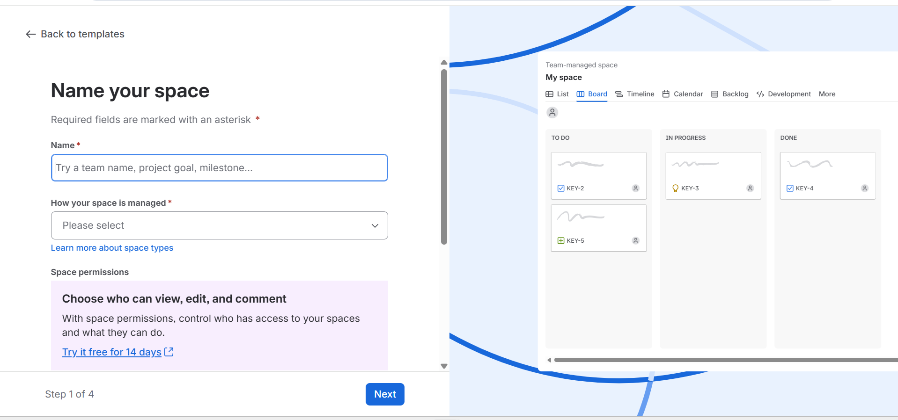

---

### Notes

Roles & Mode Setup

Mode: Solo Mode

Notes:

Write one line for each role: PO (what you prioritized), SM (how you ensured process), Dev Lead (what you built), DevOps Lead (how you shipped).

PO (Product Owner): I prioritized the backlog based on user value, focusing first on UI improvements that make the Gotto Job website clearer, more discoverable, and more trustworthy.

SM (Scrum Master): I ensured the Scrum process was followed by timeboxing the exercise, refining the backlog, planning Sprint 1, tracking progress, opening the Burndown Chart, and completing the retrospective.

Dev Lead: I implemented the selected UI improvement by updating the Gotto Job homepage hero tagline to make the primary message clearer to users.

DevOps Lead: I committed the change to Git, deployed the updated website to the EC2-hosted environment, and verified the change through the public live URL.

---

# Task 2 — Create the Jira Project (Team-managed → Scrum)

## Goal

Create a Team-managed Scrum project named `Gotto Job – Team <#>` (Team Mode) or `Gotto Job – <YourName>` (Solo Mode).

### Evidence

#### Screenshot 2 — Project created page showing the project name and key

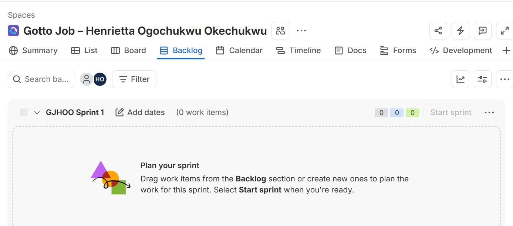

---

# Task 3 — Create the Epic

## Goal

Create the Epic `Improve Gotto Job UI discoverability & trust` to group the UI improvement initiative.

### Evidence

#### Screenshot 3 — Backlog showing the Epic panel with the Epic visible

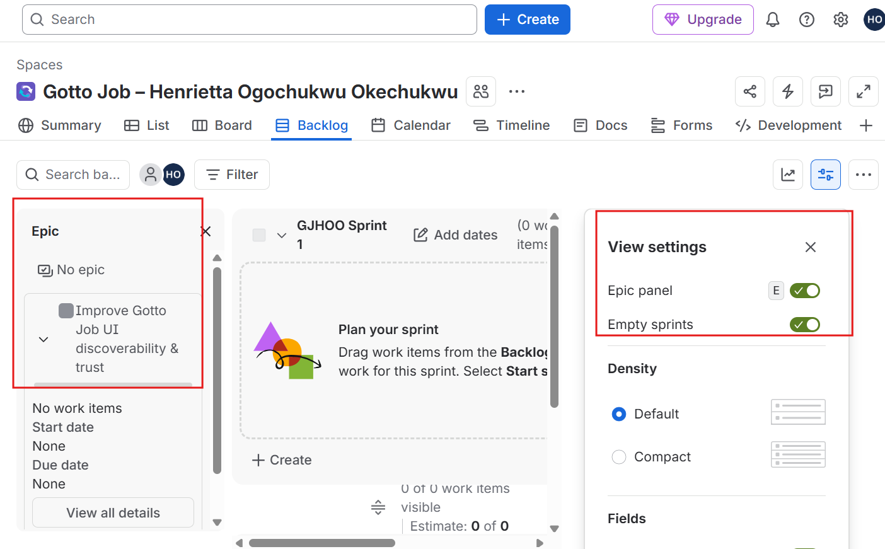

---

# Task 4 — Seed the Product Backlog (6–8 Stories + Fibonacci Points + Ranking)

## Goal

Create at least six Stories under the Epic, estimate each with 1, 2, or 3 story points, and rank them by value.

### Evidence

#### Screenshot 4 — Backlog showing the Epic and at least six Stories under it

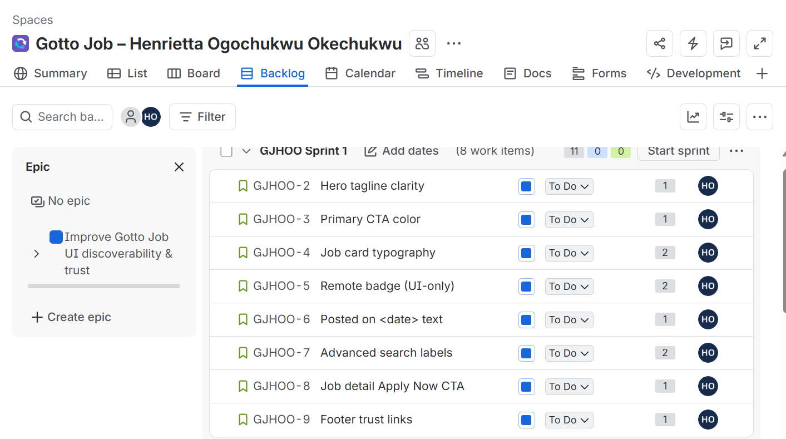

---

#### Screenshot 5 — One Story opened showing its Story Points and acceptance criteria filled in

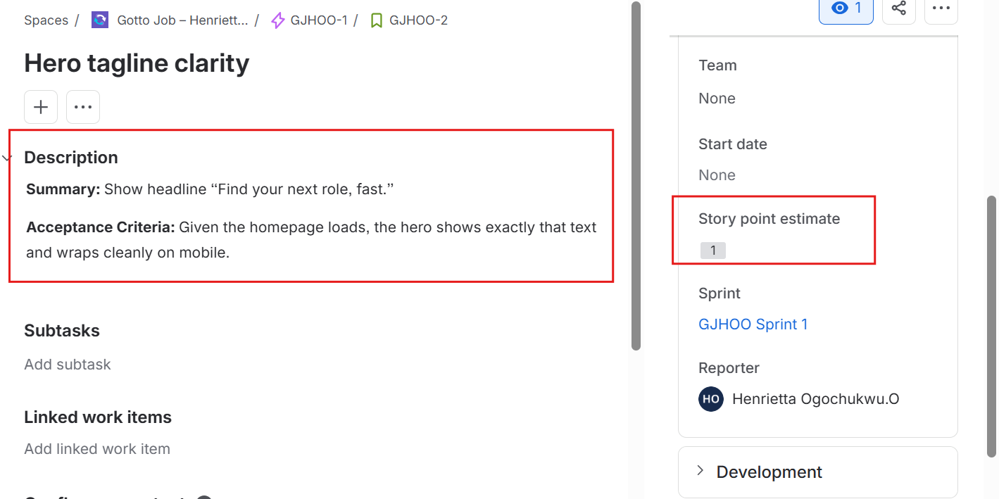

---

# Task 5 — Planning Poker (Estimate + Debate Notes)

## Goal

Confirm the Story Points (1, 2, or 3) for each Story and record brief reasoning for each estimate.

### Evidence

#### Screenshot 6 — Backlog showing Story Points visible, or two or three Stories opened showing their points

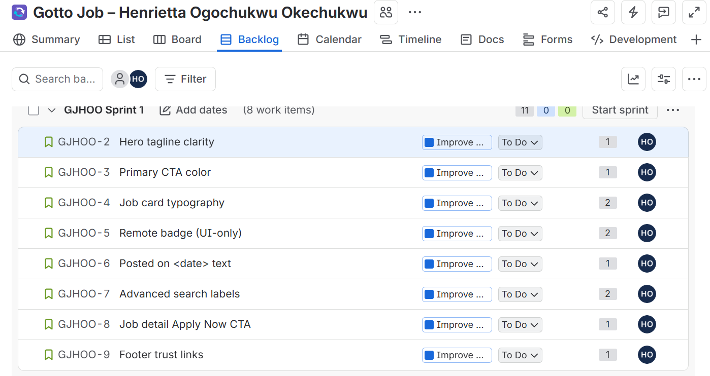

---

### Notes

For each story, explain in one or two lines why it is a 1, 2, or 3 (mention any debate, even in Solo Mode).

Task 5 — Planning Poker

S1 — Hero tagline clarity: 1 point

This is a small text-only change involving one homepage heading. I considered 2 points briefly, but the low implementation effort and low risk made 1 point more appropriate.

S2 — Primary CTA color: 1 point

This is a simple CSS/UI change. I briefly considered 2 points because the color may affect multiple buttons, but the change itself is straightforward and requires limited effort.

S3 — Job card typography: 2 points

This requires changing both font size and weight and then checking that the job-card layout remains readable across different screen sizes.

S4 — REMOTE badge: 2 points

This requires adding a new visual label and ensuring it appears appropriately on remote job cards, making it more involved than a simple text or color change.

S5 — Posted on date: 1 point

This is a small UI content addition. Static date text is acceptable, so no significant logic or backend work is required.

S6 — Advanced search labels: 2 points

Several labels and placeholders need to be clarified and aligned, so this involves more UI elements and testing than a single text change.

S7 — Job Detail Apply Now CTA: 1 point

This adds one prominent button with a simple link and requires no backend functionality, making it a small UI-only change.

S8 — Footer trust links: 1 point

This requires adding two simple links to the footer without complex functionality, so the implementation effort is small.

Total backlog estimate: 11 story points.

Planning discussion: In Solo Mode, I simulated the estimation discussion by considering whether each Story's scope, risk, and number of UI elements justified 1, 2, or 3 points before confirming the final estimate.

---

# Task 6 — Sprint Planning: Create Sprint 1 + Sprint Goal + Scope

## Goal

Create Sprint 1, move three or four Stories into it (approximately 3–6 points), set the Sprint Goal, and break each selected Story into Build, Verify, Deploy, and Screenshot Sub-tasks.

### Evidence

#### Screenshot 7 — Sprint 1 with the selected Stories inside it

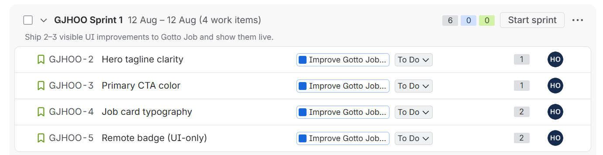

---

#### Screenshot 8 — One Story showing the Sub-tasks created

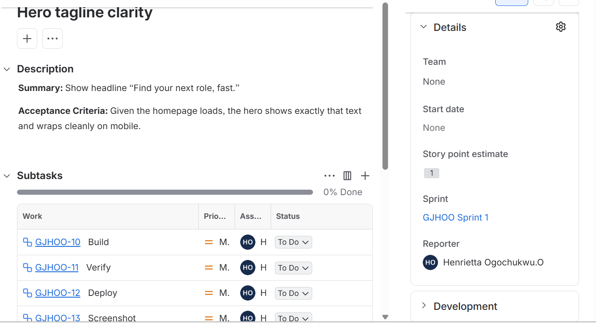

---

# Task 7 — Reports: Open Burndown Chart

## Goal

Open the Burndown Chart and confirm it exists for Sprint 1. It is acceptable if the chart is not yet populated.

### Evidence

#### Screenshot 9 — Burndown Chart page opened, even if empty

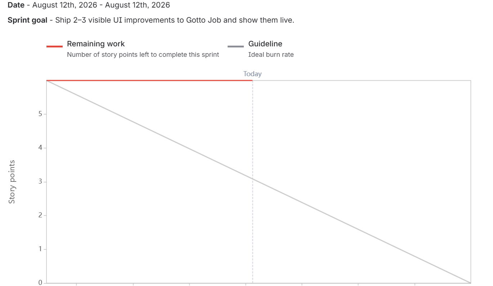

---

# Task 8 — Ship One Small Increment (Build + Deploy + Proof)

## Goal

Implement one small UI-only Story from Sprint 1, commit it, deploy it live, and move the Story and its Sub-tasks to Done in Jira.

### Evidence

#### Screenshot 10 — Jira board showing the Story moved to Done

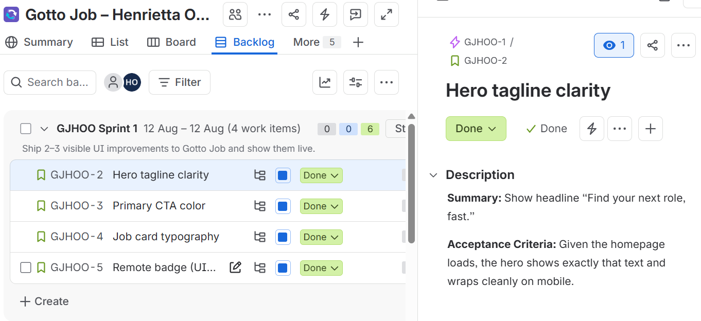

---

#### Screenshot 11 — Git commit output

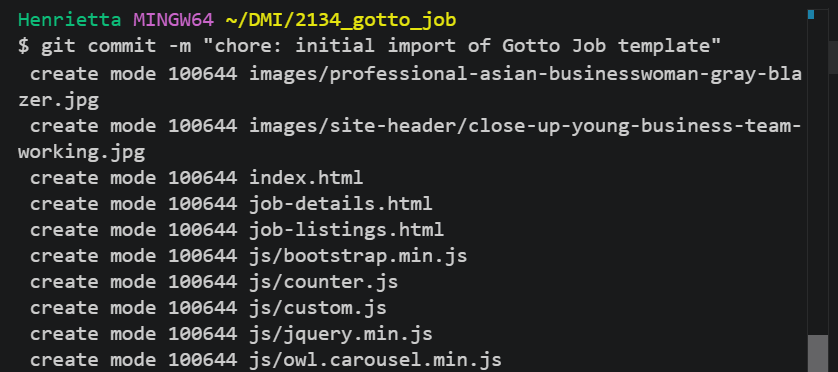

---

#### Screenshot 12 — Live URL in the browser showing the UI change, with the URL visible

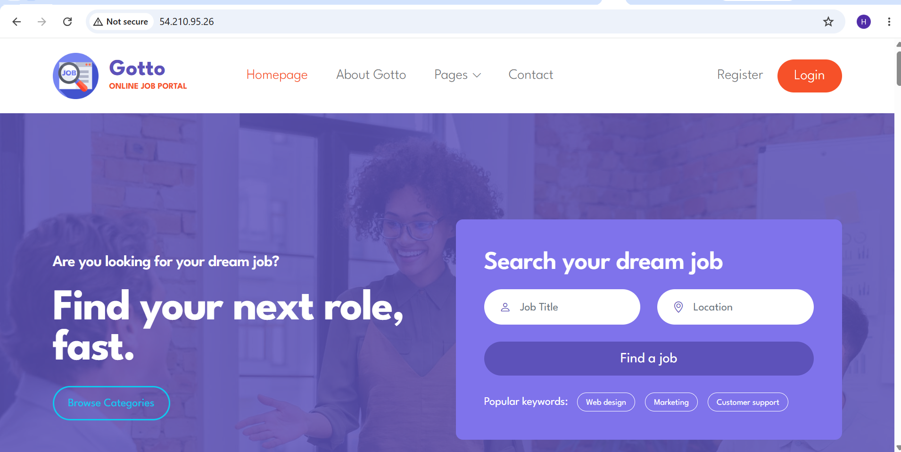

---

# Task 9 — Retro Notes (Scrum Pillar + Value)

## Goal

Add a retro comment covering what went well, what to improve, one Scrum pillar observed (Transparency, Inspection, or Adaptation), and one Scrum value (Openness, Focus, Commitment, Courage, or Respect).

### Evidence

#### Screenshot 13 — Jira retro comment visible

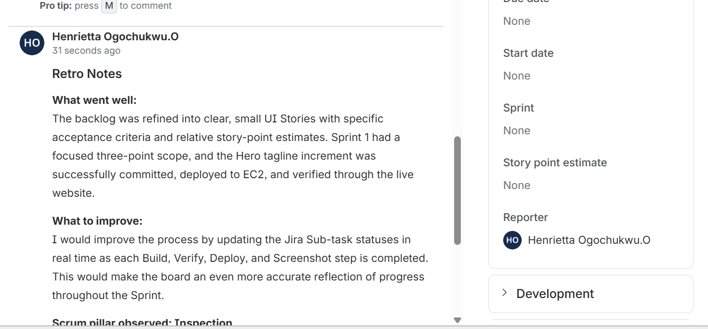

---

# Task 10 — LinkedIn Post (Mandatory)

## Goal

Publish a LinkedIn post about what you delivered, including your live URL, three to five lines on what you did and learned, and one screenshot (Burndown Chart, Sprint board, or the live UI change).

## Evidence

#### LinkedIn Post URL

Paste your LinkedIn post URL here:
I was the Product Owner, Scrum Master, Developer, and DevOps Lead… all in one sprint. 😅

And honestly, Assignment 4 of my DevOps Micro Internship taught me more than I expected.

For Gotto Job — Backlog Refinement & Sprint 1, I had to take the project from planning all the way to a real, deployed increment.

No handoff to another team.
No “someone else will handle deployment.”
I had to think through the work, prioritize it, plan the sprint, build the change, deploy it, verify it, and reflect on what could be improved.

Here’s what I worked through:
🔹 Refined and value-ordered the product backlog
🔹 Created an Epic and estimated Stories using Fibonacci story points
🔹 Planned Sprint 1 around a clear Sprint Goal
🔹 Broke Stories into Build, Verify, Deploy & Screenshot sub-tasks
🔹 Used Jira’s Burndown Chart to track sprint progress
🔹 Implemented a UI improvement on the Gotto Job homepage
🔹 Committed the change with Git
🔹 Deployed the update to an EC2-hosted environment
🔹 Verified the change on the live website
🔹 Completed a Sprint Retrospective using Scrum pillars and values

And the actual change?
I improved the homepage hero section with a simple but purposeful message:
“Find your next role, fast.”

It may look like a small UI change.
But behind that small change was a complete delivery process:
Prioritize → Plan → Build → Verify → Deploy → Reflect.

That was probably my biggest takeaway.
DevOps isn't just about knowing AWS, Git, or how to deploy an application.
And Agile isn't just about having a Jira board.

The real value comes from connecting the pieces:
Good priorities + clear planning + incremental delivery + verification + continuous improvement.

Working through this assignment also gave me a deeper appreciation for the different responsibilities involved in delivering software.

Even when one person wears all the hats, each hat requires a different way of thinking.

I'm still learning, but I'm beginning to see software delivery as a collection of tools and a system of decisions and collaboration.

One increment shipped.
One more lesson learned.
One more step forward. 🚀

🌐 Live Gotto Job Website: http://54.210.95.26/

This post is part of my journey in the DevOps Micro Internship (DMI) with Agentic AI — Cohort 3 by Pravin Mishra.

📌 My graded progress: https://lnkd.in/eyx_RBp5
📌 Start your DevOps journey: https://lnkd.in/eVW4aeZh

And yes… there’s still a lot more to learn. 🙌 😊

hashtag#DevOps hashtag#DevOpsEngineering hashtag#Jira hashtag#Scrum hashtag#Agile hashtag#Git hashtag#AWS hashtag#EC2 hashtag#SoftwareEngineering hashtag#ContinuousDelivery hashtag#LearningInPublic hashtag#DMI hashtag#DevOpsMicroInternship

`https://www.linkedin.com/posts/henrietta-ogochukwu-onyeabor_devops-devopsengineering-jira-activity-7493227127916445696-uCOQ?utm_source=share&utm_medium=member_desktop&rcm=ACoAACLZGVcB6FzOlcovzi-lUsceaYDsGRsJUSU`

---

#### Screenshot 14 — Published LinkedIn post

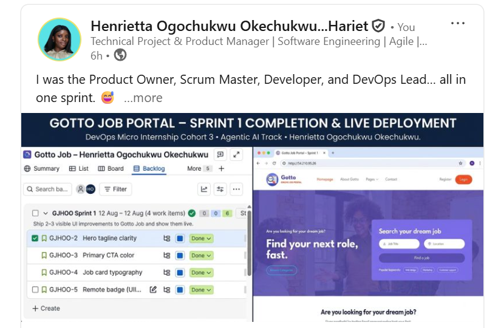

---

# Submission Instructions

- Add all 14 required screenshots
- Full name must be visible in required screenshots
- Do not expose sensitive information (keys, passwords, account IDs)

---

# Completion Checklist

- [✅] Task 1: Team Mode or Solo Mode selected and all four roles documented (Screenshot 1 & Notes)
- [✅] Task 2: Team-managed Scrum project created with the required name (Screenshot 2)
- [✅] Task 3: UI improvement Epic created (Screenshot 3)
- [✅] Task 4: 6–8 Stories added under the Epic and ranked by value (Screenshots 4 & 5)
- [✅] Task 5: Story Points set (1, 2, or 3) with reasoning recorded (Screenshot 6 & Notes)
- [✅] Task 6: Sprint 1 created with Sprint Goal, 3–4 Stories, and Sub-tasks (Screenshots 7 & 8)
- [✅] Task 7: Burndown Chart opened (Screenshot 9)
- [✅] Task 8: One UI-only increment implemented, committed, deployed, and verified (Screenshots 10–12)
- [✅] Task 9: Retro comment with one Scrum pillar and one Scrum value (Screenshot 13)
- [✅] Task 10: Mandatory LinkedIn post published with the live URL, backlog refinement, Sprint planning, one shipped increment, proof, and Screenshot 14
- [✅] Full Name visible in required screenshots
- [✅] No sensitive data exposed

---

## 📌 About DMI & CloudAdvisory

DevOps Micro Internship (DMI) is a project-based DevOps program run by Pravin Mishra (The CloudAdvisory) focused on real-world execution, systems thinking, and career readiness.

It helps learners build strong DevOps foundations with hands-on experience.

---

## 📌 Resources

- 🌐 DMI Official Website: https://dmi.pravinmishra.com?utm_source=github&utm_medium=readme  
- 🎓 University: https://university.pravinmishra.com?utm_source=github&utm_medium=readme  
- 💬 Discord Community: https://discord.pravinmishra.com?utm_source=github&utm_medium=readme  
- 📝 Blog: https://dmi.pravinmishra.com/blog?utm_source=github&utm_medium=readme  
- ▶️ YouTube Playlist: https://www.youtube.com/playlist?list=PLFeSNDtI4Cho  
- 🔗 Pravin Mishra (LinkedIn): https://www.linkedin.com/in/pravin-mishra-aws-trainer/  
- 🏢 CloudAdvisory (LinkedIn): https://www.linkedin.com/company/thecloudadvisory/

---

*This submission is part of DevOps Micro Internship (DMI) Cohort 3 — Agentic AI Track.*
