# Assignment 5 — AI-Assisted Sprint Health Report via Jira MCP

Part of the DevOps Micro Internship (DMI) Cohort 3 with Agentic AI

---

## Purpose

In this assignment, you will connect Claude Code to your Jira board through an MCP server, the same way you connected it to GitHub in Week 2, and build a read-only `/sprint-health` skill. The skill reads your current sprint through Jira's API and reports sprint velocity, stories at risk of missing the sprint, and items missing an estimate — but it must never create, edit, comment on, or transition a single ticket itself. You will prove that boundary holds by making a real change on the board yourself and confirming the skill only ever reports, never acts.

---

# Task 1 — Create a Jira API Token

## Goal

Generate an API token from your Atlassian account that the MCP server will use to authenticate with your Jira site. Do not screenshot the token value itself.

### Evidence

#### Screenshot 1 — Jira API token creation confirmation page showing the token name, with the token value not visible

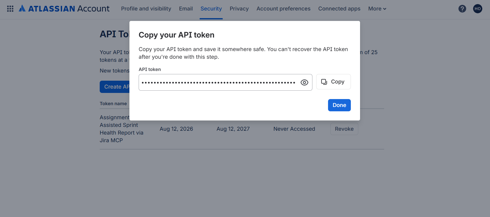

### Notes You Must Write (Very Important):

Why does the MCP server need your site URL and account email in addition to the token?

## Task 1 — Notes

The Jira MCP server needs the Jira site URL and account email in addition to the API token because the three pieces of information work together for authentication and identification. The site URL tells the MCP server which Jira instance to connect to, the account email identifies the Atlassian account being used, and the API token provides the authentication credential for that account. The token itself must remain private and must not be exposed in screenshots or committed to the repository.

---

# Task 2 — Create .mcp.json at the Project Root

## Goal

Create or update `.mcp.json` at your project root with a Jira MCP server block, following the same shape as the GitHub MCP server you configured in Week 2.

### Evidence

#### Screenshot 2 — `.mcp.json` open in VS Code showing the Jira server configuration

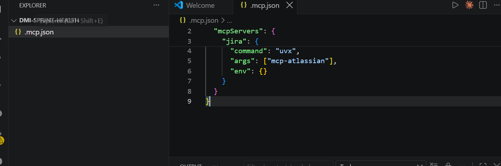

### Notes You Must Write (Very Important):

Compare this jira block to the github block from Week 2 Assignment 5. The GitHub server ran via npx (a Node.js package); this one runs via uvx (a Python package) — what stays exactly the same shape despite that difference, and why doesn't Claude Code care which language a given MCP server is written in?

## Task 2 — Notes

The Jira MCP block and the GitHub MCP block have the same basic MCP structure: each defines a server name, a command used to launch the server, arguments passed to that command, and environment configuration. The main difference is that the GitHub server uses `npx`, which runs a Node.js package, while the Jira server uses `uvx`, which runs a Python package.

Claude Code does not need to know which programming language the MCP server was written in. MCP defines a common communication protocol between Claude and external tools, so Claude interacts with the server through the MCP interface rather than directly depending on its implementation language.

---

# Task 3 — Add Your Credentials to settings.local.json

## Goal

Add your Jira site URL, account email, and API token to `.claude/settings.local.json`, and confirm that file is listed in `.gitignore` so it is never committed.

### Evidence

#### Screenshot 3 — `settings.local.json` open in VS Code showing the `env` section, with the actual token value blurred or covered

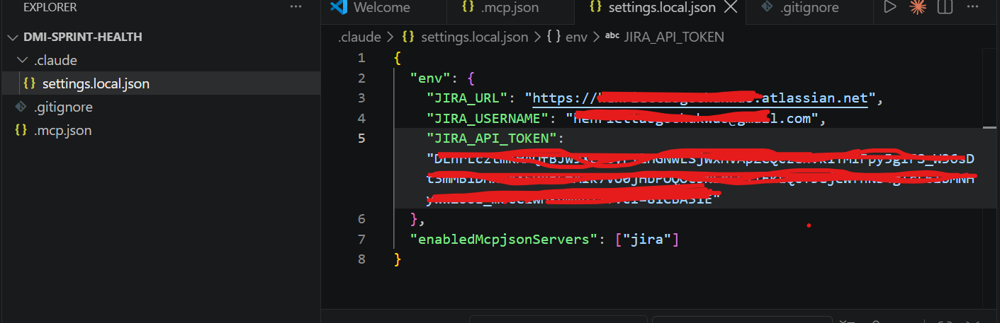

### Notes You Must Write (Very Important):

Why must JIRA_API_TOKEN live in settings.local.json and never in .mcp.json?

## Task 3 — Notes

`JIRA_API_TOKEN` must live in `settings.local.json` and not in `.mcp.json` because the API token is a secret credential. The `.mcp.json` file belongs to the project configuration and may be committed to GitHub, while `settings.local.json` is intended for local environment-specific credentials and is protected through `.gitignore`.

Keeping the token in `settings.local.json` separates configuration from secrets and prevents the credential from being accidentally exposed in the public repository.

---

# Task 4 — Verify the Connection with /mcp

## Goal

Restart Claude Code and confirm the Jira MCP server shows as connected.

### Evidence

#### Screenshot 4 — `/mcp` output showing `jira: connected`

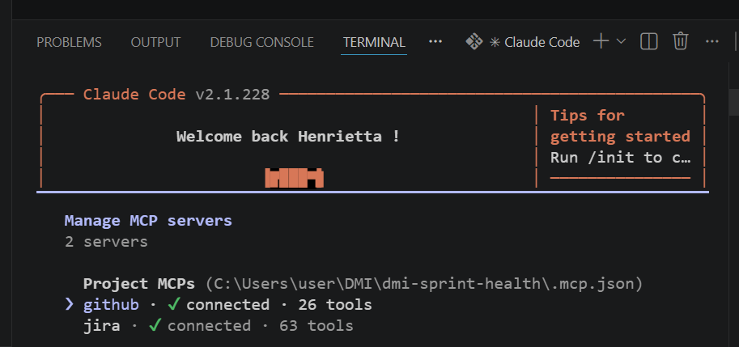

---

# Task 5 — Run a Live Query to Prove Real Board Data

## Goal

Ask Claude to list the issues in your current active sprint through the Jira MCP connection, and confirm the result matches what you see on your live board in the browser.

### Evidence

#### Screenshot 5 — Claude's response showing the live sprint issue list retrieved via Jira MCP

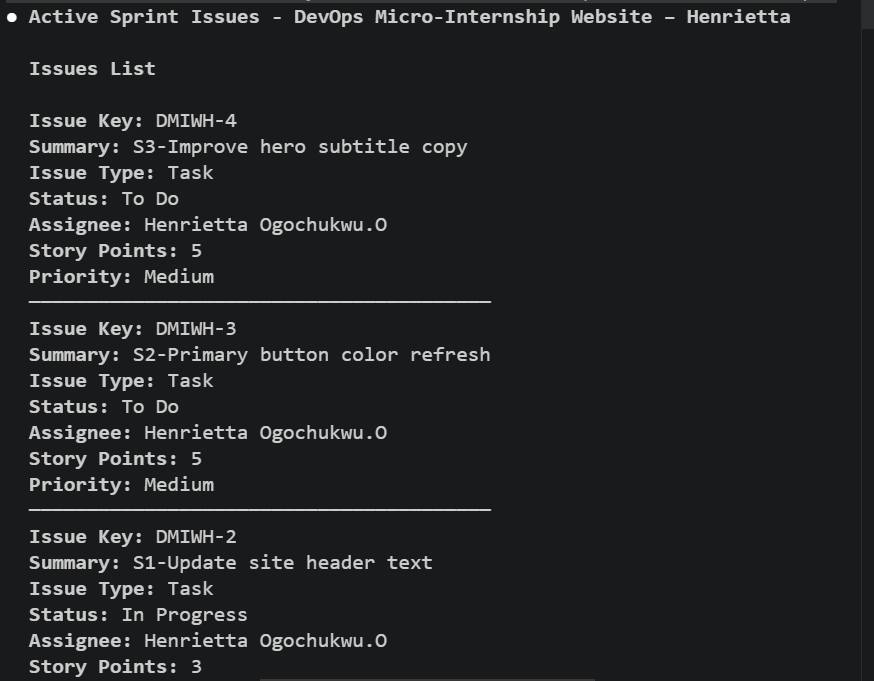
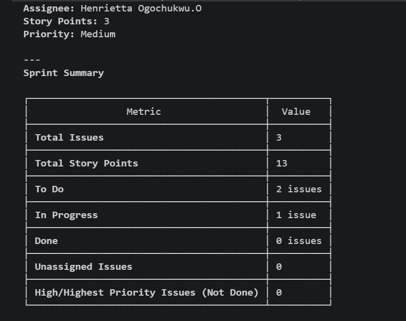
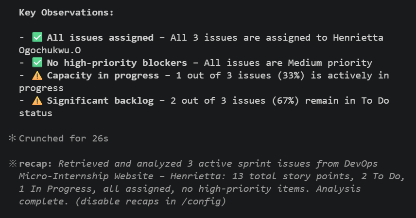

### Notes You Must Write (Very Important):

How did you confirm this was real board data and not something Claude guessed?

I confirmed that the information was real board data by comparing Claude's MCP response with the Sprint 1 board in Jira. I checked the issue keys, summaries, statuses, assignees, and story point values shown by Claude against the corresponding issues in the Jira browser interface. The matching results demonstrated that Claude was retrieving the current sprint state through the Jira MCP rather than guessing or generating information from memory.

---

# Task 6 — Build the /sprint-health Skill

## Goal

Create a `/sprint-health` skill restricted to read-only Jira tools plus `Read`, with no issue-mutating tools and no `Write`. Run it and confirm it produces a report covering sprint velocity, at-risk stories, and items missing an estimate.

### Evidence

#### Screenshot 6 — `SKILL.md` frontmatter showing `allowed-tools` limited to read-only Jira tools plus `Read`, with `disable-model-invocation: true`

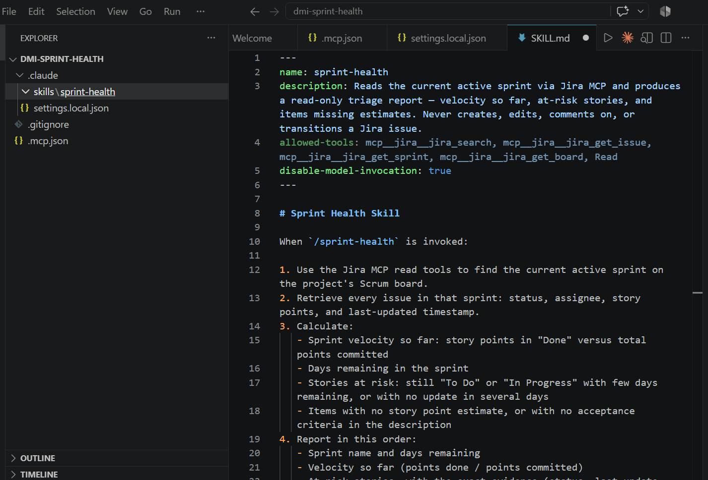

#### Screenshot 7 — `/sprint-health` output showing the full triage report against your real sprint

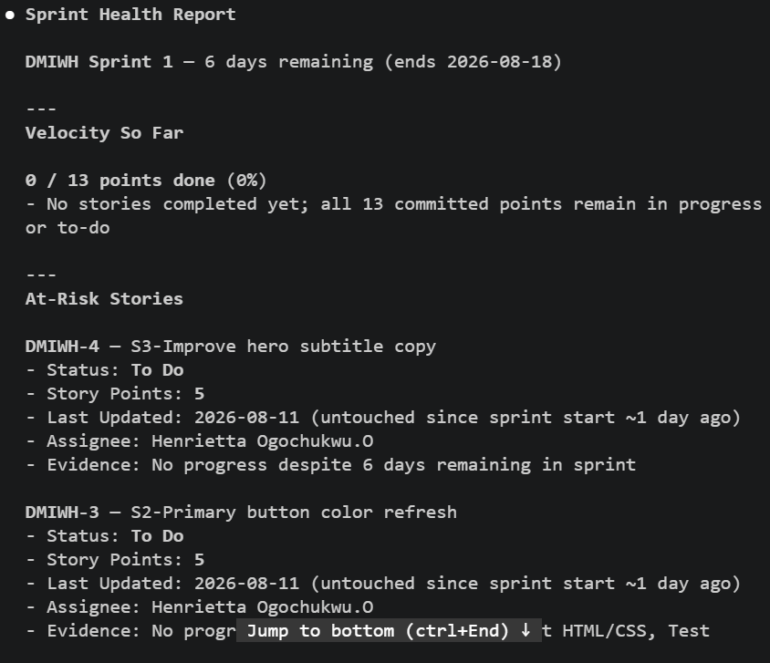
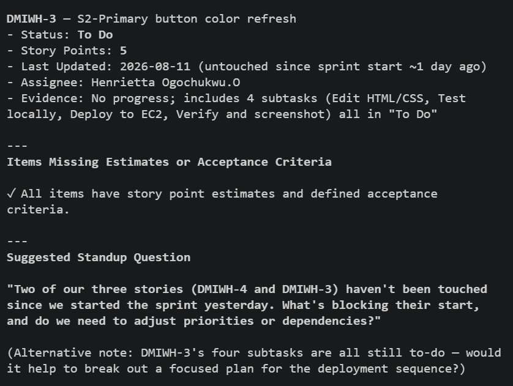

### Notes You Must Write (Very Important):

1. Which Jira MCP tools does this skill's allowed-tools list include, and which mutating tools (create issue, update issue, transition issue, add comment) does it deliberately exclude?

The skill's allowed-tools list includes mcp__jira__jira_search, mcp__jira__jira_get_issue, mcp__jira__jira_get_sprint, mcp__jira__jira_get_board, and Read.

These tools are deliberately limited to retrieving information. The skill excludes mutating capabilities such as creating an issue, updating an issue, transitioning an issue, and adding comments. It also deliberately excludes Write, so the skill cannot modify files as part of its operation.

This restriction ensures that /sprint-health can gather and analyze sprint information without taking action on the Jira board.

2. Why does a Scrum Master need this restriction more than almost any other role in this course?

A Scrum Master needs this restriction because the Scrum Master is responsible for protecting the integrity of the Scrum process and helping the team maintain transparency and accountability. If an AI assistant could silently change statuses, estimates, comments, or other ticket information, it could alter the evidence used to understand sprint progress.

Keeping the skill read-only means the AI can identify risks and provide useful information, while the human Scrum Master remains responsible for deciding and making changes to the board.

---

# Task 7 — Prove the Skill Never Mutates the Board

## Goal

Manually update one ticket on your board in the browser (for example, move a story to "Done" or add a missing estimate), then run `/sprint-health` again and confirm the new report reflects your change — proving the skill only ever reads live state and never wrote to the board itself.

### Evidence

#### Screenshot 8 — Second `/sprint-health` run showing the report now reflects your manual board change

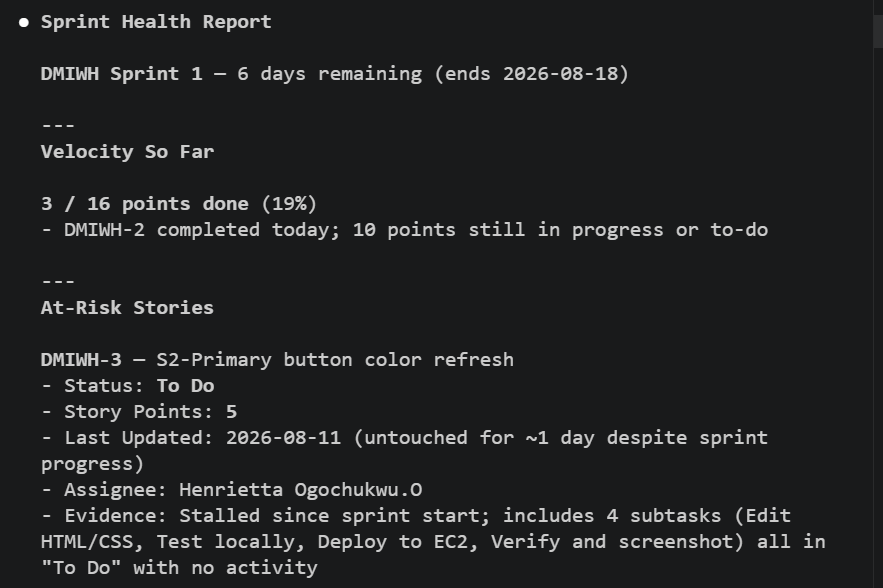
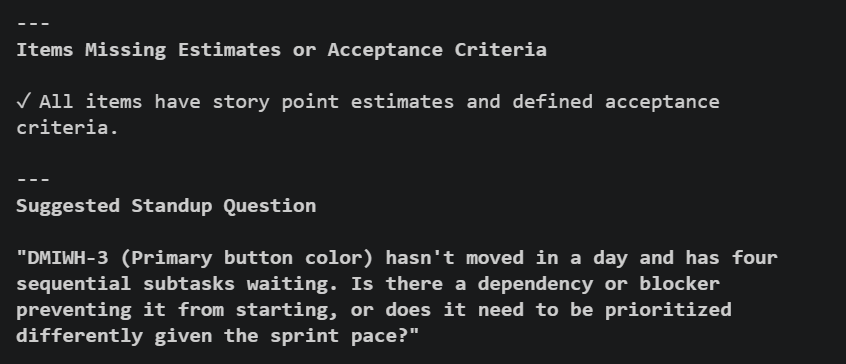

### Notes You Must Write (Very Important):

Map this assignment to Gather → Analyze → Human Act → Verify from Week 3 Assignment 6. Which step did you perform manually in the browser, and why must that step stay human?

## Task 7 — Notes

This assignment maps to the Gather → Analyze → Human Act → Verify workflow.

**Gather:** The Jira MCP gathered the current sprint information, including issues, statuses, estimates, and other sprint data.

**Analyze:** The `/sprint-health` skill analyzed that live information and identified sprint velocity, potential risks, and missing information.

**Human Act:** I manually changed the Jira ticket in the browser by updating its status. This step must remain human because the Scrum Master owns the decision to change the board, and the AI should not silently alter sprint evidence or make process decisions on behalf of the team.

**Verify:** I ran `/sprint-health` again and confirmed that the report reflected the change I had manually made in Jira. This demonstrated that the skill was reading the live board rather than making the change itself.

---

# Submission Instructions

Complete all tasks in sequence.

Your submission must include:
- All 8 required screenshots
- All the required notes

---

# Completion Checklist

- [✅] Task 1: Jira API token created, value never screenshotted (Screenshot 1)
- [✅] Task 2: `.mcp.json` has the Jira server block (Screenshot 2)
- [✅] Task 3: Credentials stored in `settings.local.json`, token blurred, file gitignored (Screenshot 3)
- [✅] Task 4: `/mcp` shows the Jira server connected (Screenshot 4)
- [✅] Task 5: Live query returned real sprint data, verified against the browser (Screenshot 5)
- [✅] Task 6: `/sprint-health` skill created with correct read-only `allowed-tools`, and produced a full report (Screenshots 6–7)
- [✅] Task 7: A manual board change was reflected in a second `/sprint-health` run (Screenshot 8)
- [✅] Skill never created, edited, transitioned, or commented on any issue
- [✅] Reflection answered (Notes)
- [✅] No API token value exposed

---

## 📌 About DMI & CloudAdvisory

DevOps Micro Internship (DMI) is a project-based DevOps program run by Pravin Mishra (The CloudAdvisory) focused on real-world execution, systems thinking, and career readiness.

It helps learners build strong DevOps foundations with hands-on experience.

---

## 📌 Resources

- 🌐 DMI Official Website: https://dmi.pravinmishra.com?utm_source=github&utm_medium=readme  
- 🎓 University: https://university.pravinmishra.com?utm_source=github&utm_medium=readme  
- 💬 Discord Community: https://discord.pravinmishra.com?utm_source=github&utm_medium=readme  
- 📝 Blog: https://dmi.pravinmishra.com/blog?utm_source=github&utm_medium=readme  
- ▶️ YouTube Playlist: https://www.youtube.com/playlist?list=PLFeSNDtI4Cho  
- 🔗 Pravin Mishra (LinkedIn): https://www.linkedin.com/in/pravin-mishra-aws-trainer/  
- 🏢 CloudAdvisory (LinkedIn): https://www.linkedin.com/company/thecloudadvisory/

---

*This submission is part of DevOps Micro Internship (DMI) Cohort 3 — Agentic AI Track.*
