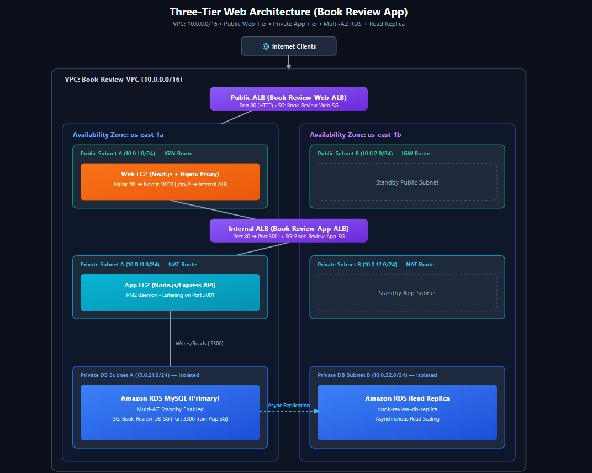
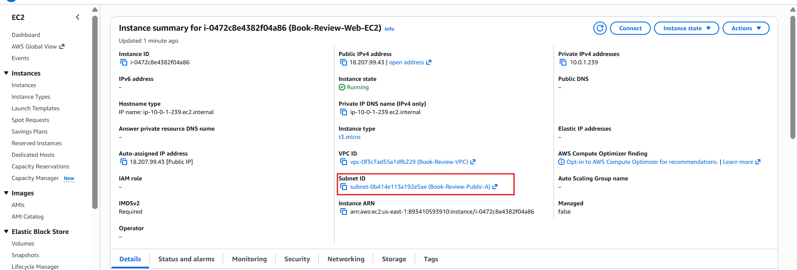
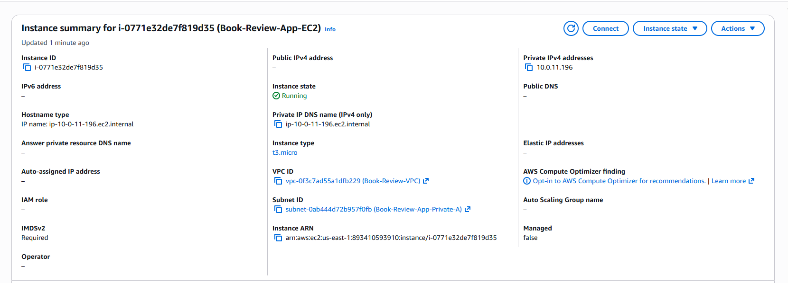
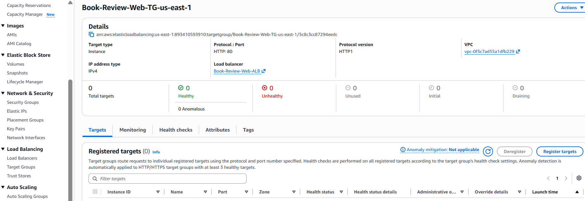
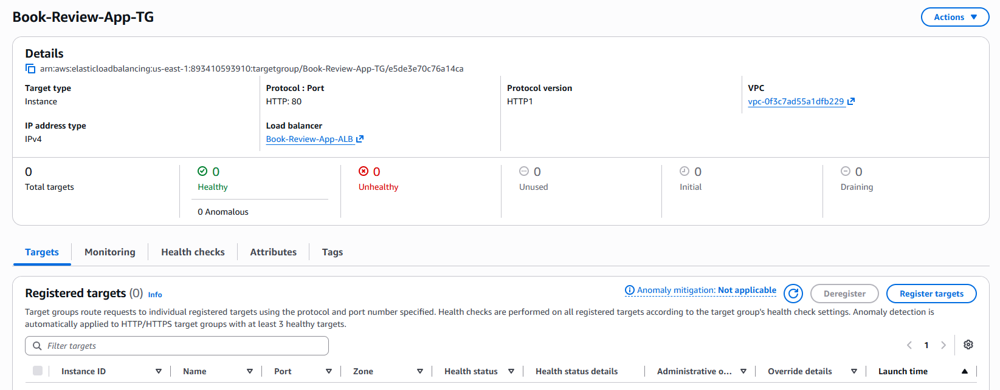
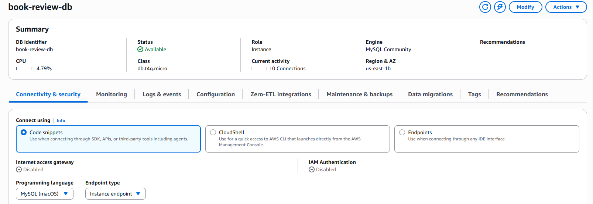
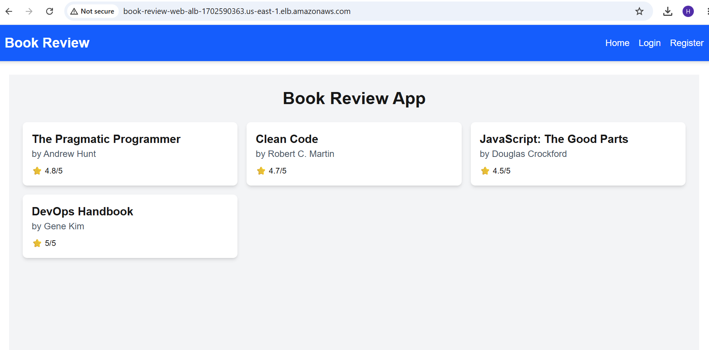

# Assignment 6 — Capstone Assignment — Deploy Book Review App (Three-Tier Architecture) on AWS

Part of the DevOps Micro Internship (DMI) Cohort 3 with Agentic AI

---

## Purpose

This is the most important assignment of the course. You will deploy the Book Review App in a fully production-style three-tier architecture on AWS: a Next.js Web Tier behind Nginx and a public ALB, a private Node.js/Express App Tier behind an internal ALB, and a private Multi-AZ MySQL RDS database with a read replica. You are expected to design, deploy, isolate, debug, and document the result independently.

---

# Task 1 — Architecture Diagram

## Goal

Create an architecture diagram showing the custom VPC (10.0.0.0/16), the six subnets across two Availability Zones (two public Web Tier, two private App Tier, two private Database Tier), the public ALB, Web Tier EC2/Nginx, internal ALB, private App Tier EC2, private Multi-AZ RDS with its read replica, and the permitted traffic flow.

### Evidence

#### Diagram image or link

---

# Task 2 — AWS Region & Services Used

## Goal

Record the AWS Region used and list every AWS service used across networking, compute, load balancing, security, and the database.

### Notes

**Region:**

AWS Region & Services Used
Region:
us-east-1 (US East - N. Virginia)

---

**Services:**

Amazon VPC: Custom VPC (10.0.0.0/16), 6 subnets across 2 Availability Zones (us-east-1a and us-east-1b), Internet Gateway (IGW), NAT Gateway, Elastic IP (EIP), and custom Route Tables.

Amazon EC2: Ubuntu Server 24.04 LTS compute instances (t3.micro) hosting Next.js frontend and Node.js backend.

Elastic Load Balancing (ALB): Public Internet-facing ALB for external user traffic, Internal ALB for private inter-tier API communication, and HTTP Target Groups with health check monitoring.

AWS Security Groups: State-aware firewalls implementing chained least-privilege ingress rules between tiers.

Amazon RDS for MySQL: Managed database engine configured with Multi-AZ automated failover and DB Subnet Groups.

Web Server & Runtime: Nginx Reverse Proxy, Node.js (v22.x), and PM2 Process Manager with systemd daemon persistence.

---

# Task 3 — Public Entry Point

## Goal

Confirm the Book Review App loads through the public ALB DNS name.

### Evidence

#### Public ALB DNS

Paste your public ALB DNS name here:

`Book-Review-Web-ALB-1702590363.us-east-1.elb.amazonaws.com`
 
---

# Task 4 — Evidence Screenshots

## Goal

Capture visual proof of every tier and load balancer.

### Evidence

#### Web EC2

---

#### App EC2

---

#### Public ALB

---

#### Internal ALB

---

#### RDS + Replica

---

#### App UI proof

---

# Task 5 — Summary

## Goal

Summarize what worked in the final deployment, the issues encountered and how each was fixed, and the tools or sources used to research and debug.

### Notes

**What worked:**

* Complete deployment of a secure, production-grade 3-Tier architecture across two Availability Zones in `us-east-1`.
* Presentation tier configured with Next.js running under PM2, reverse-proxied by Nginx on Ubuntu 24.04, and served via an Internet-facing Application Load Balancer.
* Application tier fully isolated in private subnets, running an Express.js API daemonized with PM2 on port 3001.
* Fully automated multi-tier routing enabling end-to-end CRUD operations: client requests enter the Public ALB, route through Nginx to the App Tier, and persist in a Multi-AZ Amazon RDS MySQL database.
* Target group health checks configured with path-specific endpoints (`/api/books` and `/`), reaching a steady-state healthy condition.

---

**Issues + fixes:**

1. **Target Group Health Check Failures on App Tier:**
   * *Issue:* The target group for the App Tier initially failed health checks due to inspecting the default root path (`/`) instead of the active API route, and registering on port 80 alongside port 3001.
   * *Fix:* Deregistered port 80 from `Book-Review-App-TG`, registered the App EC2 strictly on port 3001, and updated the health check path to `/api/books`, returning an immediate 200 OK.

2. **504 Gateway Timeout on API Proxy Routing:**
   * *Issue:* Requests from the Web EC2 to the backend initially timed out due to restrictive internal security group inbound rules and DNS latency over the internal proxy.
   * *Fix:* Updated the Nginx reverse proxy configuration on the Web EC2 to forward `/api/` traffic directly to the App Tier private IP (`10.0.11.196:3001`), and aligned security group rules to allow inbound HTTP traffic on port 3001 from the Web tier security group (`Book-Review-Web-SG`).

3. **Frontend 404 on `/api/api/books`:**
   * *Issue:* Setting `NEXT_PUBLIC_API_URL=/api` caused the client fetch requests to double-nest the URL path to `/api/api/books`.
   * *Fix:* Updated `.env.local` and `.env.production` to use an empty base origin (`NEXT_PUBLIC_API_URL=`), cleared `.next` build caches, recompiled the Next.js bundle via `npm run build`, and restarted the service with PM2.

---

**Tools/sources used:**

* **CLI & Runtime Management:** Git Bash, SSH, cURL for inter-tier network and endpoint testing, PM2 process manager for continuous process daemonization, systemd.
* **Web Server & Routing:** Nginx (v1.28.3) reverse proxy configuration and access logs (`/var/log/nginx/error.log`).
* **Cloud & Monitoring:** AWS Management Console (VPC, EC2, Target Groups, Application Load Balancers, RDS, Security Group rule analyzers), Chrome DevTools (Console & Network tabs).

---

# LinkedIn Post (Required)

## Goal

Publish a LinkedIn post sharing the capstone deployment, including the public ALB DNS (or a redacted screenshot), three to five lines on what you built and why it is production-style, and one proof screenshot.

## Evidence

#### LinkedIn Post URL

Paste your LinkedIn post URL here:

`https://www.linkedin.com/posts/henrietta-ogochukwu-onyeabor_devops-aws-softwareengineering-activity-7496324772247810048-qoX4?utm_source=share&utm_medium=member_desktop&rcm=ACoAACLZGVcB6FzOlcovzi-lUsceaYDsGRsJUSU`

---

#### Screenshot of LinkedIn post

---

# Submission Instructions

- Add all required screenshots and links in your submission
- Do not expose passwords, RDS credentials, connection strings, private keys, or account IDs

---

# Completion Checklist

- [✅] Task 1: Architecture diagram completed
- [✅] Task 2: AWS Region and services documented
- [✅] Task 3: Public ALB DNS confirmed working
- [✅] Task 4: All six evidence screenshots captured (Web Tier, App Tier, both ALBs, RDS + replica, app UI)
- [✅] Task 5: Deployment summary completed (what worked, issues/fixes, tools/sources)
- [✅] LinkedIn post published and URL submitted
- [✅] App Tier and Database Tier confirmed not publicly accessible
- [✅] No sensitive data exposed

---

## 📌 About DMI & CloudAdvisory

DevOps Micro Internship (DMI) is a project-based DevOps program run by Pravin Mishra (The CloudAdvisory) focused on real-world execution, systems thinking, and career readiness.

It helps learners build strong DevOps foundations with hands-on experience.

---

## 📌 Resources

- 🌐 DMI Official Website: https://dmi.pravinmishra.com?utm_source=github&utm_medium=readme  
- 🎓 University: https://university.pravinmishra.com?utm_source=github&utm_medium=readme  
- 💬 Discord Community: https://discord.pravinmishra.com?utm_source=github&utm_medium=readme  
- 📝 Blog: https://dmi.pravinmishra.com/blog?utm_source=github&utm_medium=readme  
- ▶️ YouTube Playlist: https://www.youtube.com/playlist?list=PLFeSNDtI4Cho  
- 🔗 Pravin Mishra (LinkedIn): https://www.linkedin.com/in/pravin-mishra-aws-trainer/  
- 🏢 CloudAdvisory (LinkedIn): https://www.linkedin.com/company/thecloudadvisory/

---

*This submission is part of DevOps Micro Internship (DMI) Cohort 3 — Agentic AI Track.*