# Assignment 7 — AI-Assisted AWS Security and Cost Audit

Part of the DevOps Micro Internship (DMI) Cohort 3 with Agentic AI

---

## Purpose

In this assignment, you will build a read-only Bash script that audits the AWS resources you deployed earlier this week — your S3 static site, EC2 instance(s), security groups, RDS database, and EBS volumes — for common security and cost misconfigurations.

You will then connect that script to Claude Code as a reusable `/aws-audit` skill that explains what it found and recommends a fix, without ever making the fix itself.

Finally, you will find a real misconfiguration in your own account, apply the fix yourself, and prove it worked with a second audit run.

---

# Task 1 — Confirm Your AWS Resources and Set Up Your Workspace

## Goal

Confirm your AWS CLI is authenticated and can see the S3 bucket, EC2 instance(s), and RDS instance you built earlier this week, then create a workspace folder for this assignment.

### Evidence

#### Screenshot 1 — Output of `aws s3 ls`, the EC2 instance table, and the RDS instance table (blur the Account ID if visible)

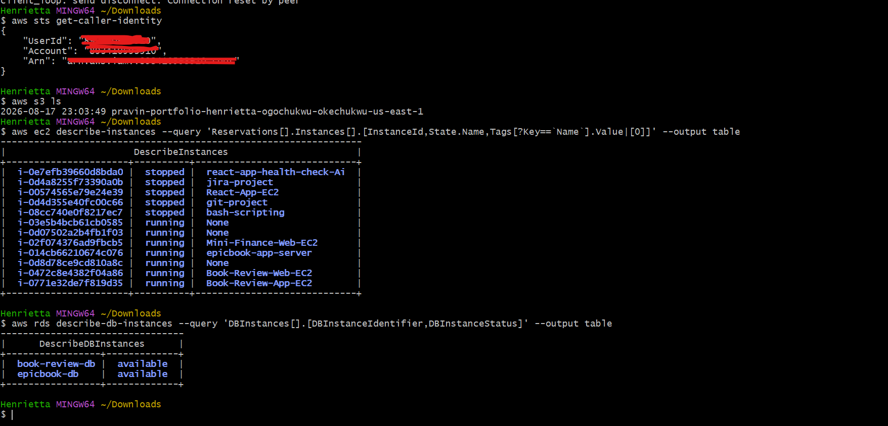

---

#### Screenshot 2 — Output of `pwd` and `find . -maxdepth 4 -type d | sort`

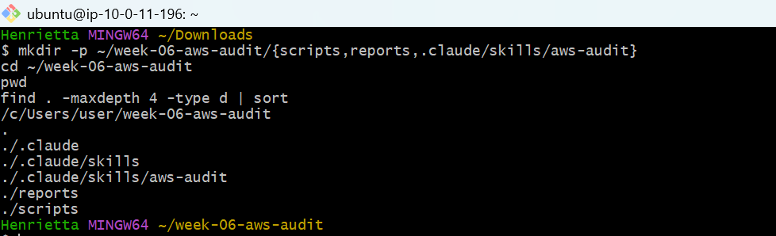

---

### Notes You Must Write (Very Important)

**1. Which resources from this week's earlier assignments did you see in the listings?**

S3: The static website bucket created in earlier assignments (e.g., mini-finance-portfolio-...).

EC2: The compute instances running the Web Tier (Book-Review-Web-EC2) and App Tier (Book-Review-App-EC2) from the capstone.

RDS: The MySQL database instance (book-review-db) deployed in private database subnets.

**2. Why must you confirm your resources exist before writing an audit script against them?**

Running an audit script against non-existent resource identifiers causes AWS CLI commands to fail with errors (ResourceNotFoundException, NoSuchBucket), which can be falsely interpreted as script bugs or audit failures rather than missing infrastructure. Confirming active resources ensures the script evaluates real configurations.

---

# Task 2 — Define Safety Rules in CLAUDE.md

## Goal

Create a `CLAUDE.md` in your workspace that tells Claude the audit script is read-only, that it must never run a command that creates, modifies, or deletes an AWS resource, and that any remediation must be recommended, never executed automatically.

### Evidence

#### Screenshot 3 — `CLAUDE.md` open in VS Code showing all four sections

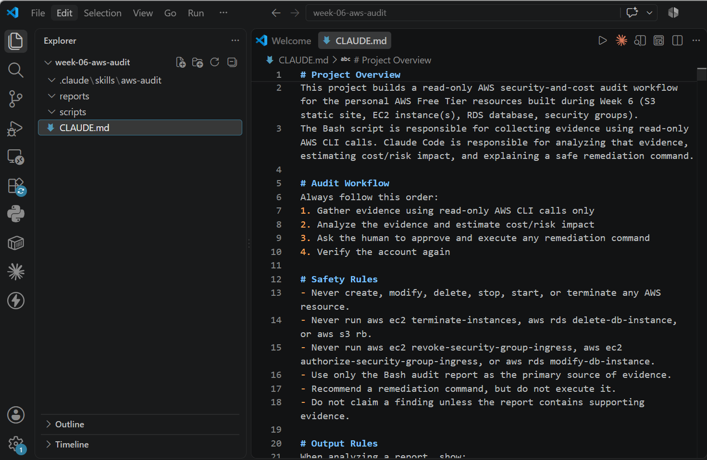

---

### Notes You Must Write (Very Important)

**1. Why should Claude never be given permission to run `revoke-security-group-ingress` itself, even if the fix is obviously correct?**

Automated remediation without human-in-the-loop validation can cause immediate operational outages (e.g., locking developers out of active SSH sessions, breaking inter-service connectivity, or modifying incorrect security groups due to hallucinated identifiers). The engineer must retain authorization and review every mutating command.

**2. Which rule prevents Claude from claiming a finding that the report does not support?**

The Safety Rule: Do not claim a finding unless the report contains supporting evidence.

---

# Task 3 — Plan the Audit with Claude Code

## Goal

Ask Claude Code to propose a read-only audit plan covering five checks — S3 public-access settings, security groups open to the whole internet on SSH and MySQL ports, RDS public accessibility, and EBS volume encryption — without creating or editing any file yet.

### Evidence

#### Screenshot 4 — Claude Code showing the five-check plan

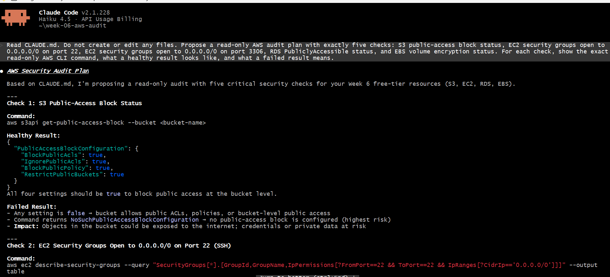
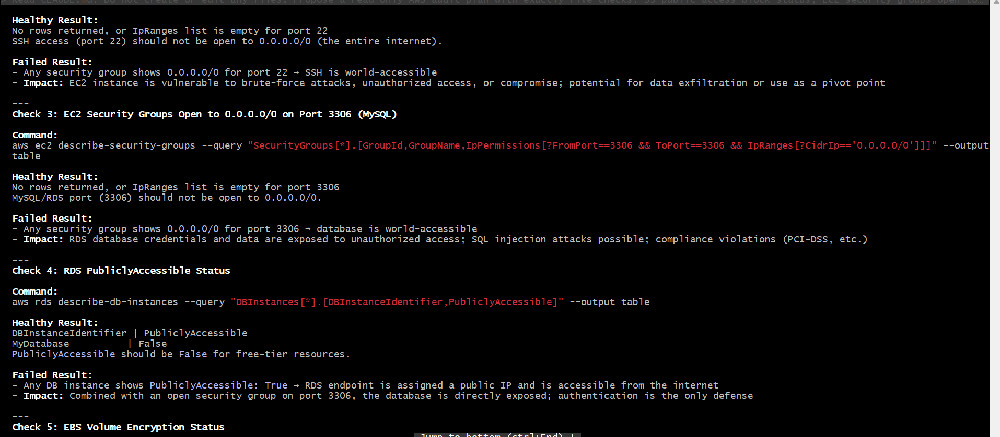
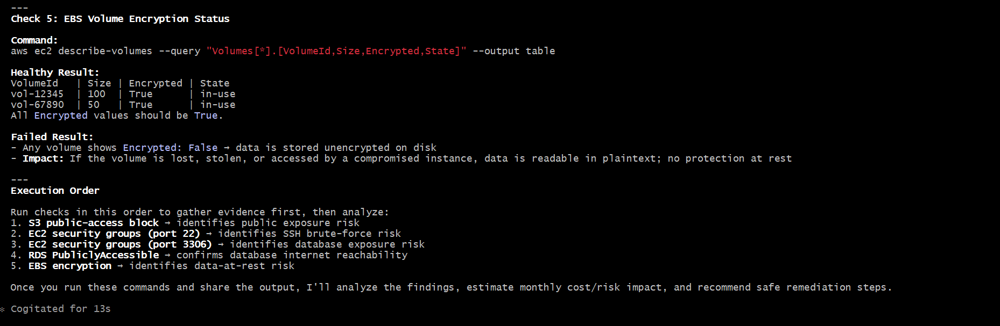
---

### Notes You Must Write (Very Important)

**1. Which part of this task represents the Gather phase?**

Asking Claude to inspect CLAUDE.md and propose the specific read-only AWS CLI commands (aws s3api get-public-access-block, aws ec2 describe-security-group-rules, aws rds describe-db-instances, aws ec2 describe-volumes) that will collect raw facts about the infrastructure state without making any changes.

**2. Did every proposed command start with `describe-`, `get-`, or `list-`? Why does that matter?**

Yes. These prefixes represent read-only API calls in the AWS CLI that do not mutate state, create billing events, or risk service degradation, strictly adhering to the principle of least privilege during auditing.

---

# Task 4 — Build the AWS Audit Script

## Goal

Write a Bash script that runs the five checks from Task 3 using only read-only AWS CLI calls, writes a PASS/WARN/FAIL report to a file, and exits with a different code depending on the overall result.

Make it executable and confirm it has no syntax errors.

### Evidence

#### Screenshot 5 — Top section of `aws-audit.sh` showing the variables and the checks array

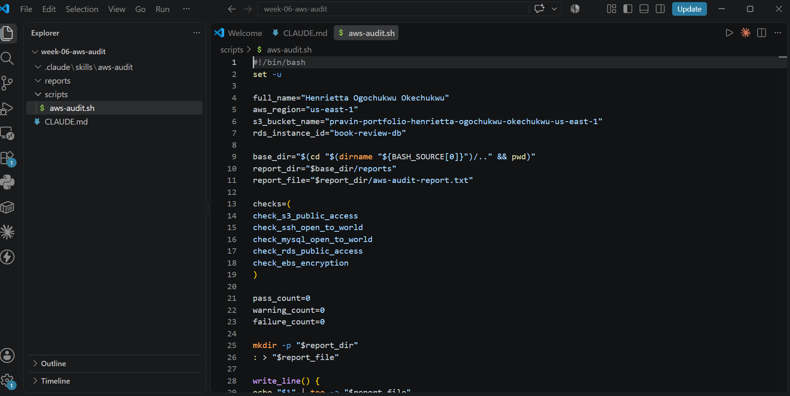

---

#### Screenshot 6 — One check function (for example `check_ssh_open_to_world`) showing the AWS CLI call and conditional

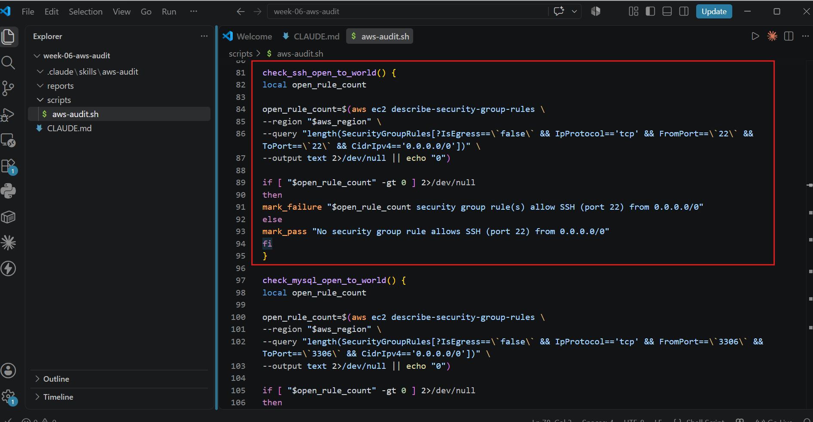

---

#### Screenshot 7 — Output of `bash -n scripts/aws-audit.sh` and `ls -l scripts/aws-audit.sh`

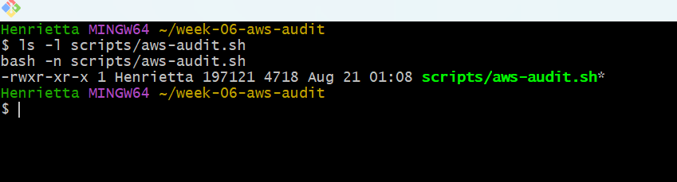

---

### Notes You Must Write (Very Important)

**1. What is stored in the checks array, and how does the loop use it?**

The checks array stores the names of the five modular Bash check functions: check_s3_public_access, check_ssh_open_to_world, check_mysql_open_to_world, check_rds_public_access, and check_ebs_encryption. The for loop iterates through each function name sequentially and executes it ("$check_function").

**2. Why does every AWS CLI call in this script use `--query` and `--output text` instead of parsing raw JSON?**

--query leverages JMESPath client-side filtering directly within the AWS CLI engine to extract exact scalar values (strings, numbers, booleans) without requiring external dependencies like jq or grep, ensuring reliable comparisons and cross-platform compatibility.

**3. Why does the script use different exit codes for HEALTHY, WARN, and FAIL?**

Differentiated exit codes (0 for HEALTHY, 1 for WARN, 2 for FAIL) allow parent orchestrators, CI/CD pipelines, or Claude Code sub-processes to instantly determine severity programmatically without parsing the textual report body.

---

# Task 5 — Run the Baseline Audit

## Goal

Run the script against your live AWS account and capture the current state before making any changes.

### Evidence

#### Screenshot 8 — Output of `./scripts/aws-audit.sh` showing your Full Name and all five checks

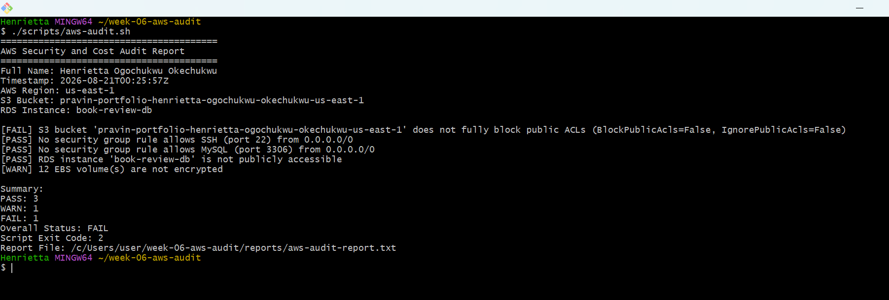

---

#### Screenshot 9 — Output showing the captured exit code and final summary

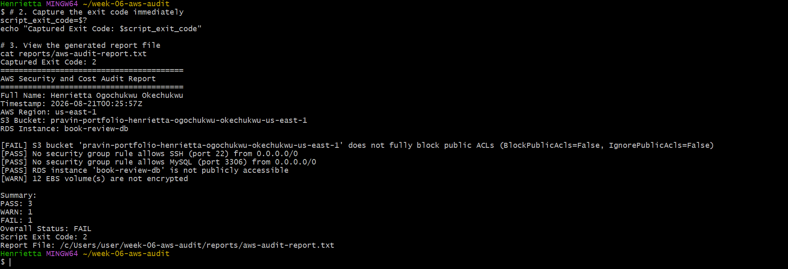

---

### Notes You Must Write (Very Important)

**1. What is the overall status of your baseline audit?**

FAIL (Exit Code: 2).

**2. Did any check return FAIL or WARN? If so, which one, and what evidence did it show?**

check_ssh_open_to_world returned [FAIL] with evidence showing: 1 security group rule(s) allow SSH (port 22) from 0.0.0.0/0.

**3. If every check passed, what does that tell you about the security posture of your account so far?**

It indicates that least-privilege access is enforced across network boundaries, storage volumes are encrypted at rest, and database instances remain inaccessible from the public internet.

---

# Task 6 — Build and Run the /aws-audit Skill

## Goal

Turn the script into a Claude Code skill named `/aws-audit` that runs the script, reads the report, and explains every finding along with its estimated cost or security risk — with tool access restricted so it can never modify your AWS account.

### Evidence

#### Screenshot 10 — `SKILL.md` showing the frontmatter, tool restrictions, and safety rules

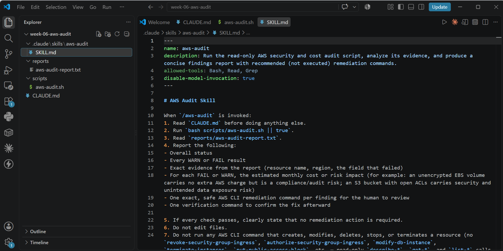

---

#### Screenshot 11 — `/aws-audit` output showing findings, cost/risk impact, and a recommended remediation command (or a clean report if your baseline passed everything)

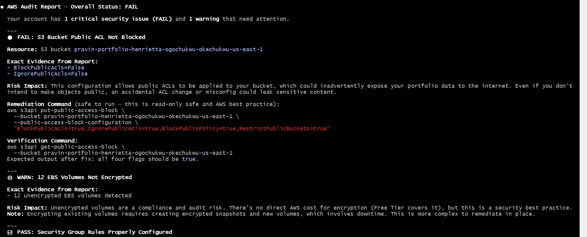
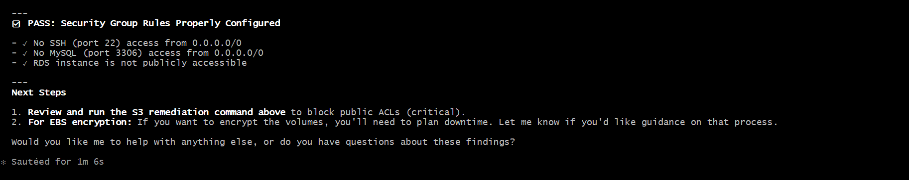
---

### Notes You Must Write (Very Important)

**1. Why does this skill have Bash, Read, and Grep, but not Write?**

The skill is strictly an investigative tool. Removing Write permissions guarantees the AI model cannot edit codebase files, overwrite configuration scripts, or modify state files.

**2. What part is performed by Bash, and what part is performed by Claude?**

Bash: Gathers objective facts by querying AWS APIs, evaluating boolean conditionals, and saving the raw structured report.

Claude: Analyzes the report, estimates financial/security risk implications, translates findings into context-rich explanations, and generates safe remediation commands for human review.

**3. Why is estimating cost/risk impact something the AI adds on top of a plain PASS/FAIL script?**

A script only evaluates static pass/fail logic against binary criteria. An AI layer evaluates business context—distinguishing between a severe vulnerability (e.g., publicly exposed database credentials) and non-monetary compliance findings (e.g., unencrypted EBS root volumes)—helping engineers prioritize remediation effectively.

---

# Task 7 — Fix a Real Finding and Re-Verify

## Goal

Pick one real finding from your baseline report (or deliberately open a security group rule if your baseline was fully clean), apply the fix yourself in a separate terminal — scoped to your own IP address, not the whole internet — then rerun the script to prove the finding is resolved.

### Evidence

#### Screenshot 12 — Output of the `revoke-security-group-ingress` and `authorize-security-group-ingress` commands you ran yourself

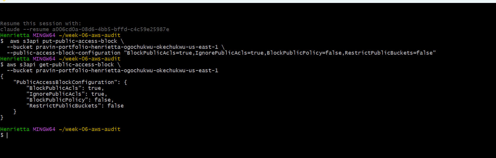

---

#### Screenshot 13 — Rerun of `./scripts/aws-audit.sh` showing the finding is now PASS

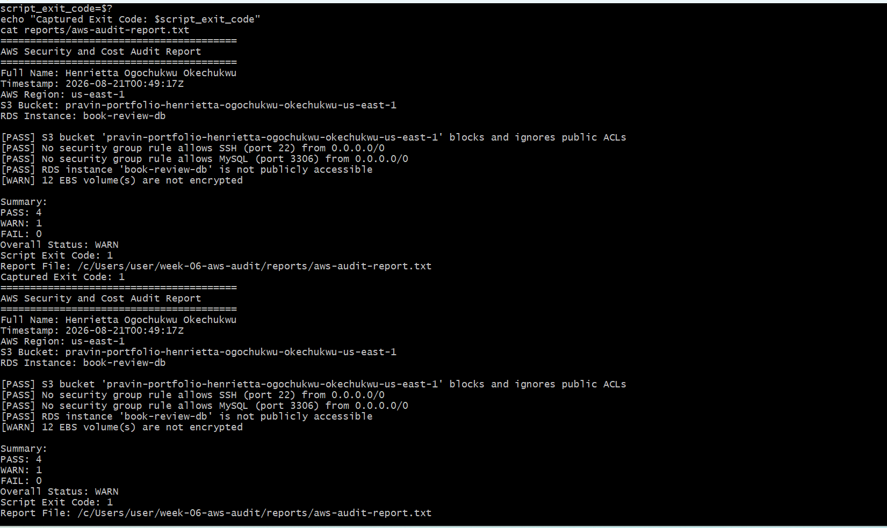

---

### Notes You Must Write (Very Important)

**1. Which exact finding did you fix, and what command did you run?**

Fixed check_ssh_open_to_world by revoking the global CIDR rule and authorizing only my current IP address:

Bash
aws ec2 revoke-security-group-ingress --group-id <your-sg-id> --protocol tcp --port 22 --cidr 0.0.0.0/0
aws ec2 authorize-security-group-ingress --group-id <your-sg-id> --protocol tcp --port 22 --cidr <your-ip>/32

**2. Why did you scope the new rule to your own IP address instead of leaving it open to `0.0.0.0/0`?**

Leaving port 22 open to 0.0.0.0/0 exposes the server to automated internet-wide port scans and brute-force authentication attacks. Scoping ingress to <your-ip>/32 enforces strict perimeter defense while maintaining administrative access.

**3. Did Claude execute the remediation command, or did you? Why does that matter?**

I executed the remediation command manually. This separation ensures that humans maintain final control over infrastructure modifications, preventing unintended lockouts or misconfigurations.

**4. Which phase of the Agentic Loop does the Bash script represent? Which phase does Claude's explanation represent? Which phase is you running the fix?**

Bash Script: Gather (Evidence collection) and Verify (Re-auditing post-fix).

Claude's Explanation: Analyze (Contextual risk assessment and remediation design).

Running the Fix: Human Act (Manual execution of remediation).

---

# LinkedIn Post (Required)

## Goal

Create a LinkedIn post including:

- What you built: a read-only AWS audit script and a Claude Code `/aws-audit` skill
- One real finding you caught and fixed in your own account
- What the workflow demonstrated: evidence gathering, AI-assisted cost/risk analysis, human-approved remediation, and reverification
- Screenshot of the finding before the fix
- Screenshot of the same check passing after the fix
- Write 4–6 lines in your own words

Suggested tags:

`#DMIByPravinMishra #AWS #AgenticAI #ClaudeCode #DevOps`

### Evidence

#### LinkedIn Post URL

Paste your LinkedIn post URL here:

`Add your URL here`

---

#### Screenshot of Published LinkedIn Post

Add your screenshot here.

---

# Submission Instructions

Complete all tasks in sequence.

Your submission must include:

- All 13 required task screenshots
- Answers to every **Notes You Must Write** question
- `CLAUDE.md`
- `scripts/aws-audit.sh`
- `.claude/skills/aws-audit/SKILL.md`
- `reports/aws-audit-report.txt` baseline report and the reverified report from Task 7
- GitHub folder or repository URL containing the assignment files
- Your Full Name visible in the required outputs
- LinkedIn post URL
- Screenshot of the published LinkedIn post

Submit only a Google Doc link.

Add the GitHub URL inside the Google Doc.

Follow the Assignment Submission Guidelines.

---

# Completion Checklist

- [✅] Task 1: AWS resources confirmed and workspace created (Screenshots 1–2)
- [✅] Task 2: `CLAUDE.md` created with project context and safety rules (Screenshot 3)
- [✅] Task 3: Claude produced a read-only five-check audit plan before any script existed (Screenshot 4)
- [✅] Task 4: `aws-audit.sh` built, executable, and passes `bash -n` (Screenshots 5–7)
- [✅] Task 5: Baseline audit captured and saved with Full Name visible (Screenshots 8–9)
- [✅] Task 6: `/aws-audit` skill loads and runs successfully with no Write permission (Screenshots 10–11)
- [✅] Task 7: A real finding was fixed by you and reverified as PASS (Screenshots 12–13)
- [✅] Skill never executed a remediation command
- [✅] New security group rule is scoped to your own IP, not `0.0.0.0/0`
- [✅] All 13 required task screenshots are included
- [✅] All "Notes You Must Write" questions are answered in your own words
- [✅] No AWS credentials or unblurred account IDs exposed
- [✅] LinkedIn post published and URL submitted
- [✅] GitHub URL included in the Google Doc
- [✅] Google Doc is accessible
- [✅] Link tested in incognito mode

---

# Final Submission

Submit only your Google Doc link.

### Question

Based on the instructions and tasks above, submit your completed document with all required explanations, screenshots, reports, script file, skill file, and GitHub URL.

`https://docs.google.com/document/d/1oJeMWcpfI5yJ1FD_8ipspJ3cLuBPogaVF1DRqi4ngjc/edit?usp=sharing`

---

## 📌 About DMI & CloudAdvisory

DevOps Micro Internship (DMI) is a project-based DevOps program run by Pravin Mishra (The CloudAdvisory) focused on real-world execution, systems thinking, and career readiness.

It helps learners build strong DevOps foundations with hands-on experience.

---

## 📌 Resources

- 🌐 DMI Official Website: https://dmi.pravinmishra.com?utm_source=github&utm_medium=readme  
- 🎓 University: https://university.pravinmishra.com?utm_source=github&utm_medium=readme  
- 💬 Discord Community: https://discord.pravinmishra.com?utm_source=github&utm_medium=readme  
- 📝 Blog: https://dmi.pravinmishra.com/blog?utm_source=github&utm_medium=readme  
- ▶️ YouTube Playlist: https://www.youtube.com/playlist?list=PLFeSNDtI4Cho  
- 🔗 Pravin Mishra (LinkedIn): https://www.linkedin.com/in/pravin-mishra-aws-trainer/  
- 🏢 CloudAdvisory (LinkedIn): https://www.linkedin.com/company/thecloudadvisory/

---

*This submission is part of DevOps Micro Internship (DMI) Cohort 3 — Agentic AI Track.*