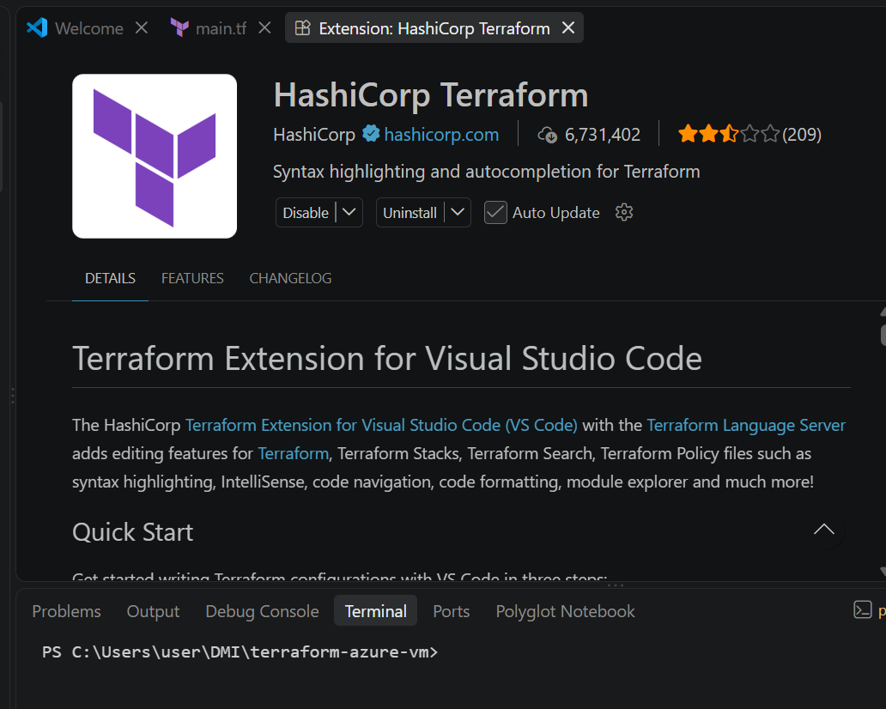

# Assignment 1 — Create an Azure Virtual Machine using Terraform
Part of the DevOps Micro Internship (DMI) Cohort 3 with Agentic AI

---

## Purpose

In this assignment, you will use Terraform to provision a complete Azure Virtual Machine environment: a resource group, virtual network, subnet, public IP, network interface, and an Ubuntu 18.04 Linux VM. You will initialize, plan, and apply the configuration, verify the running VM via Azure CLI, and destroy the resources after testing.

---

# Task 0 — Set Up and Verify the Terraform and Azure CLI Environment
## Goal

Prepare your local environment for Terraform deployment by installing Terraform, Azure CLI, and the HashiCorp Terraform extension in VS Code, signing in to your Azure account, and confirming that all required tools are working correctly.

### Evidence

#### Screenshot 1 — Terminal showing successful terraform version output

---

#### Screenshot 2 — Terminal showing successful az version output

#### Screenshot 3 — VS Code Extensions panel showing the HashiCorp Terraform extension installed and enabled

---

# Task 1 — Create a New Terraform Project and Define the Infrastructure
## Goal

Create a new Terraform project and define the complete Azure Virtual Machine environment in main.tf by using the official Terraform Registry documentation.

---

# Task 1 — Create a New Terraform Project and Define the Infrastructure

## Goal

Create a new Terraform project and define the complete Azure Virtual Machine environment in `main.tf` by using the official Terraform Registry documentation.

### Evidence

#### Screenshot 4 — VS Code showing the AzureRM provider configuration and resource group configuration in main.tf

---

#### Screenshot 5 — `main.tf` showing the public IP output and VM authentication configuration, with the password hidden or redacted

---

# Task 2 — Initialize Terraform

## Goal

Run `terraform init` and confirm the working directory initializes successfully.

### Evidence

#### Screenshot 6 — Terminal showing successful `terraform init` output

---

# Task 3 — Plan and Apply the Configuration

## Goal

Review `terraform plan`, run `terraform apply`, and record the VM's public IP from the Terraform output.

### Evidence

#### Screenshot 7 — Terraform plan summary showing the proposed resources

---

#### Screenshot 8 — Terraform apply output showing successful completion

---

#### Screenshot 9 — Terraform output showing the public IP of the VM

---

# Task 4 — Verify the Deployment

## Goal

Confirm through Azure CLI that the virtual machine was created successfully and is currently running.

### Evidence

#### Screenshot 10 — Azure CLI output showing the VM name and running status

---

# Task 5 — Destroy the Resources

## Goal

Remove all Azure resources created by Terraform after completing the deployment and verification.

### Evidence

#### Screenshot 11 — Terminal showing successful `terraform destroy` completion

---

### Notes

Write a short paragraph explaining what you learned or any issues you encountered.

During this lab, I gained practical experience using Terraform to automate and manage the end-to-end lifecycle of cloud infrastructure on Microsoft Azure, from provisioning virtual networks and compute instances to executing clean teardowns. The primary challenges encountered involved regional capacity restrictions (`SkuNotAvailable`) and subscription-level region eligibility constraints across standard locations like East US and West Europe, as well as temporary WSL DNS resolution failures following a system reboot. I resolved these issues by configuring persistent DNS resolvers in `/etc/resolv.conf`, analyzing subscription-supported regions, and migrating the deployment target to `polandcentral` with an available `Standard_B2as_v2` VM size. This reinforced the critical importance of understanding regional cloud availability, managing Infrastructure as Code (IaC) state consistency, and verifying dependency lifecycles during automated deployments.

---

# Submission Instructions

- Complete all tasks in sequence and include all required screenshots specified in Tasks 0–5.
- Include the VM public IP from the Terraform output
- Do not expose passwords, keys, account IDs, or other sensitive information in screenshots.

---

# Completion Checklist

- [✅] Installed Terraform and verified it using terraform version
- [✅] Installed Azure CLI and verified it using az version
- [✅] Signed in to Azure using az login
- [✅] Confirmed the correct Azure subscription
- [✅] Installed and enabled the HashiCorp Terraform extension in VS Code
- [✅] Created the terraform-azure-vm project directory and main.tf
- [✅] Added the Terraform and AzureRM provider configuration
- [✅] Defined the resource group, virtual network, subnet, public IP, and network interface
- [✅] Defined the Linux virtual machine with username and password-based authentication
- [✅] Added the Terraform output for the VM public IP address
- [✅] Completed terraform init successfully
- [✅] Reviewed the Terraform execution plan using terraform plan
- [✅] Completed terraform apply successfully
- [✅] Captured and recorded the VM public IP using terraform output
- [✅] Verified that the VM is running using Azure CLI
- [✅] Completed terraform destroy successfully
- [✅] Captured all required screenshots
- [✅] Learning/issues paragraph written (Notes)
- [✅] Checked that no passwords, keys, account IDs, or other sensitive information are visible in the screenshots

---

## 📌 About DMI & CloudAdvisory

DevOps Micro Internship (DMI) is a project-based DevOps program run by Pravin Mishra (The CloudAdvisory) focused on real-world execution, systems thinking, and career readiness.

It helps learners build strong DevOps foundations with hands-on experience.

---

## 📌 Resources

- 🌐 DMI Official Website: https://dmi.pravinmishra.com?utm_source=github&utm_medium=readme  
- 🎓 University: https://university.pravinmishra.com?utm_source=github&utm_medium=readme  
- 💬 Discord Community: https://discord.pravinmishra.com?utm_source=github&utm_medium=readme  
- 📝 Blog: https://dmi.pravinmishra.com/blog?utm_source=github&utm_medium=readme  
- ▶️ YouTube Playlist: https://www.youtube.com/playlist?list=PLFeSNDtI4Cho  
- 🔗 Pravin Mishra (LinkedIn): https://www.linkedin.com/in/pravin-mishra-aws-trainer/  
- 🏢 CloudAdvisory (LinkedIn): https://www.linkedin.com/company/thecloudadvisory/

---

*This submission is part of DevOps Micro Internship (DMI) Cohort 3 — Agentic AI Track.*
