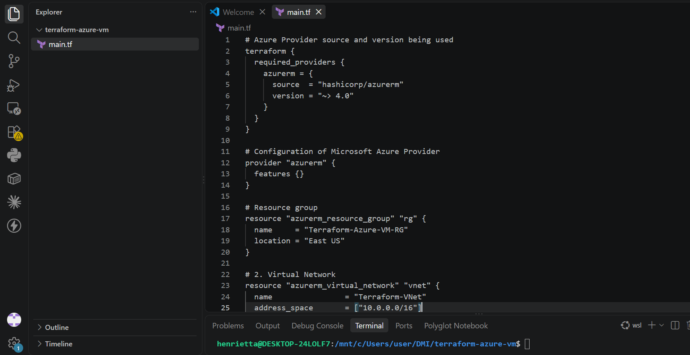
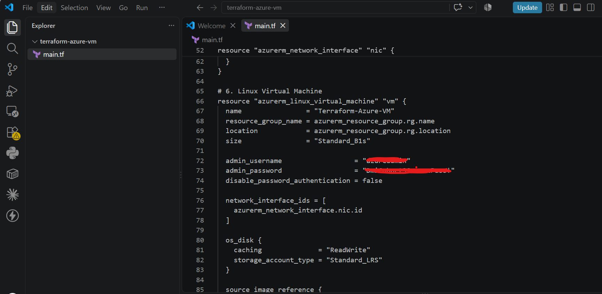
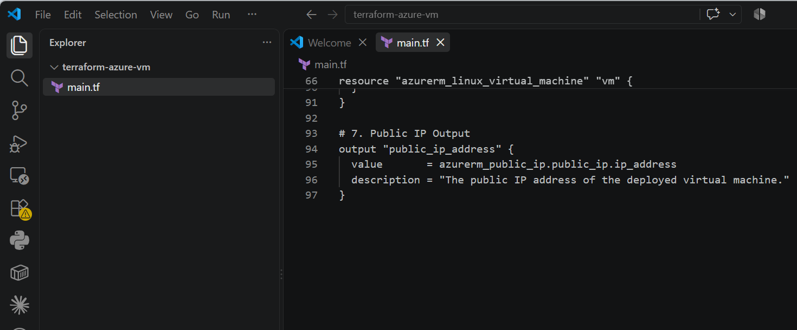
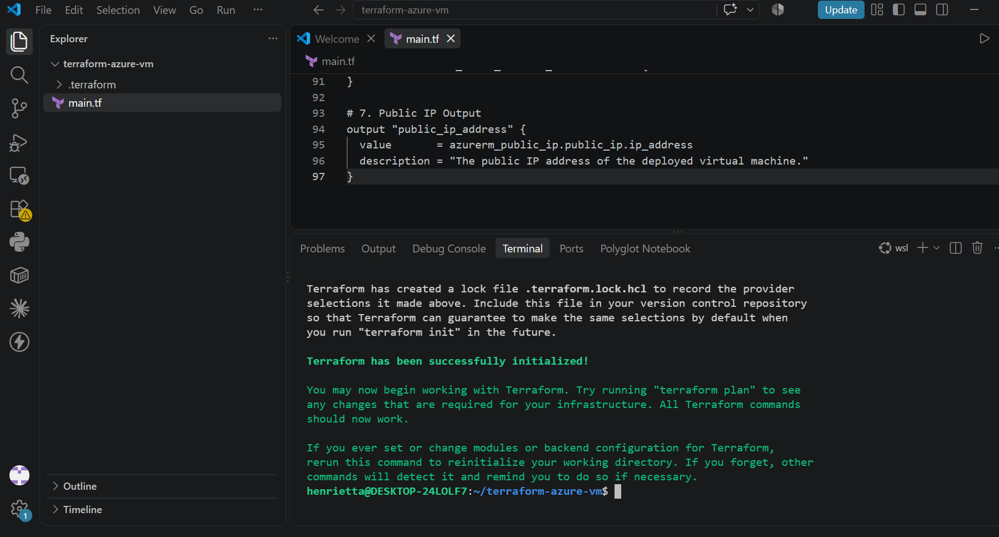
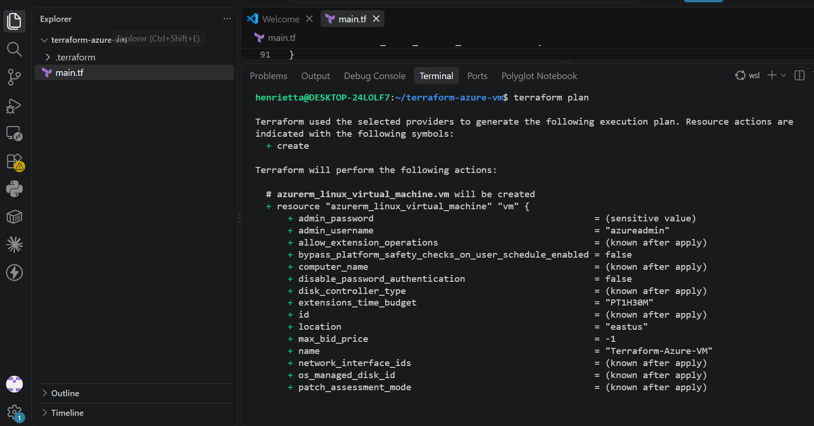
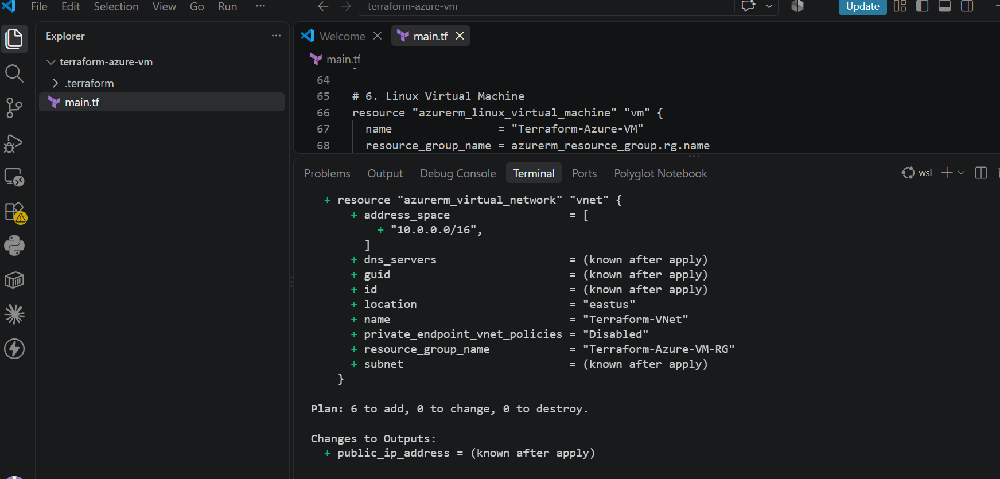
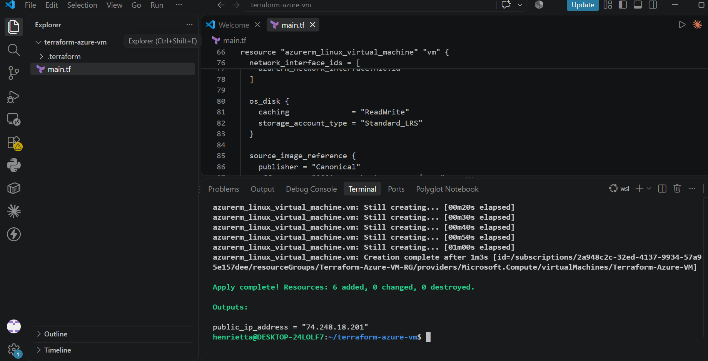
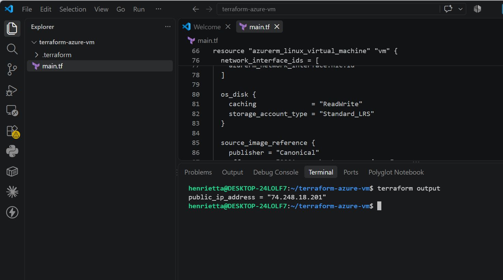
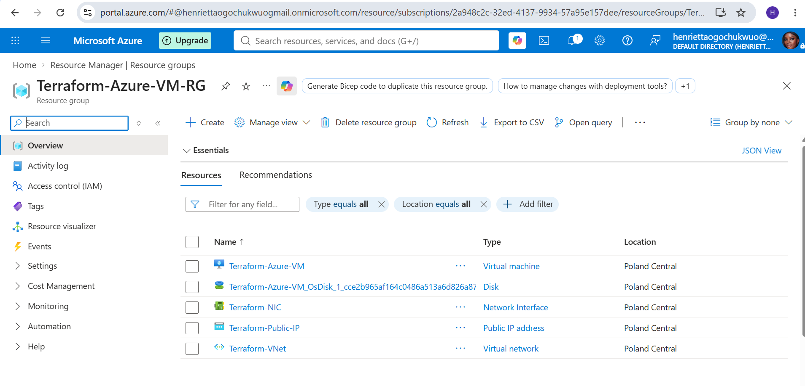

# Assignment 1 — Create an Azure Virtual Machine using Terraform

Part of the DevOps Micro Internship (DMI) Cohort 3 with Agentic AI

---

## Purpose

In this assignment, you will use Terraform to provision a complete Azure Virtual Machine environment: a resource group, virtual network, subnet, public IP, network interface, and an Ubuntu 18.04 Linux VM. You will initialize, plan, and apply the configuration, verify the running VM via Azure CLI, and destroy the resources after testing.

---

# Task 1 — Create a New Terraform Project and Define the Infrastructure

## Goal

Create a `terraform-azure-vm` project and define the resource group, virtual network, subnet, public IP, network interface, and Ubuntu 18.04 VM (with username/password authentication and a public IP output) in `main.tf`.

### Evidence

#### Screenshot 1 — VS Code showing `main.tf` and the required Azure resources

---

#### Screenshot 2 — `main.tf` showing the public IP output and VM authentication configuration, with the password hidden or redacted

---

# Task 2 — Initialize Terraform

## Goal

Run `terraform init` and confirm the working directory initializes successfully.

### Evidence

#### Screenshot 3 — Terminal showing successful `terraform init` output

---

# Task 3 — Plan and Apply the Configuration

## Goal

Review `terraform plan`, run `terraform apply`, and record the VM's public IP from the Terraform output.

### Evidence

#### Screenshot 4 — Terraform plan summary showing the proposed resources

---

#### Screenshot 5 — Terraform apply output showing successful completion

---

#### Screenshot 6 — Terraform output showing the public IP of the VM

---

# Task 4 — Verify the Deployment

## Goal

Use Azure CLI to confirm the VM was created and is running.

### Evidence

#### Screenshot 7 — Azure CLI output showing the VM name and running status

---

# Task 5 — Destroy the Resources

## Goal

Run `terraform destroy` to clean up the Azure resources after testing.

### Evidence

#### Screenshot 8 — Terminal showing successful `terraform destroy` completion

---

### Notes

Write a short paragraph explaining what you learned or any issues you encountered.

During this lab, I gained practical experience using Terraform to automate and manage the end-to-end lifecycle of cloud infrastructure on Microsoft Azure, from provisioning virtual networks and compute instances to executing clean teardowns. The primary challenges encountered involved regional capacity restrictions (`SkuNotAvailable`) and subscription-level region eligibility constraints across standard locations like East US and West Europe, as well as temporary WSL DNS resolution failures following a system reboot. I resolved these issues by configuring persistent DNS resolvers in `/etc/resolv.conf`, analyzing subscription-supported regions, and migrating the deployment target to `polandcentral` with an available `Standard_B2as_v2` VM size. This reinforced the critical importance of understanding regional cloud availability, managing Infrastructure as Code (IaC) state consistency, and verifying dependency lifecycles during automated deployments.

---

# Submission Instructions

- Add all required screenshots in your submission
- Include the VM public IP from the Terraform output
- Do not expose Azure credentials, subscription details, or passwords

---

# Completion Checklist

- [✅] Task 1: `terraform-azure-vm` project created with all required resources defined (Screenshots 1–2)
- [✅] Task 2: `terraform init` completed successfully (Screenshot 3)
- [✅] Task 3: Plan reviewed and `terraform apply` completed, public IP recorded (Screenshots 4–6)
- [✅] Task 4: VM verified as running via Azure CLI (Screenshot 7)
- [✅] Task 5: `terraform destroy` completed successfully (Screenshot 8)
- [✅] Learning/issues paragraph written (Notes)
- [✅] No sensitive information exposed

---

## 📌 About DMI & CloudAdvisory

DevOps Micro Internship (DMI) is a project-based DevOps program run by Pravin Mishra (The CloudAdvisory) focused on real-world execution, systems thinking, and career readiness.

It helps learners build strong DevOps foundations with hands-on experience.

---

## 📌 Resources

- 🌐 DMI Official Website: https://dmi.pravinmishra.com?utm_source=github&utm_medium=readme  
- 🎓 University: https://university.pravinmishra.com?utm_source=github&utm_medium=readme  
- 💬 Discord Community: https://discord.pravinmishra.com?utm_source=github&utm_medium=readme  
- 📝 Blog: https://dmi.pravinmishra.com/blog?utm_source=github&utm_medium=readme  
- ▶️ YouTube Playlist: https://www.youtube.com/playlist?list=PLFeSNDtI4Cho  
- 🔗 Pravin Mishra (LinkedIn): https://www.linkedin.com/in/pravin-mishra-aws-trainer/  
- 🏢 CloudAdvisory (LinkedIn): https://www.linkedin.com/company/thecloudadvisory/

---

*This submission is part of DevOps Micro Internship (DMI) Cohort 3 — Agentic AI Track.*
