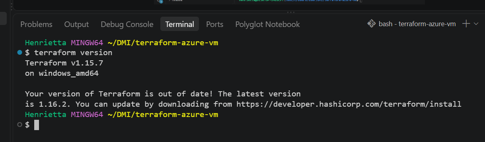
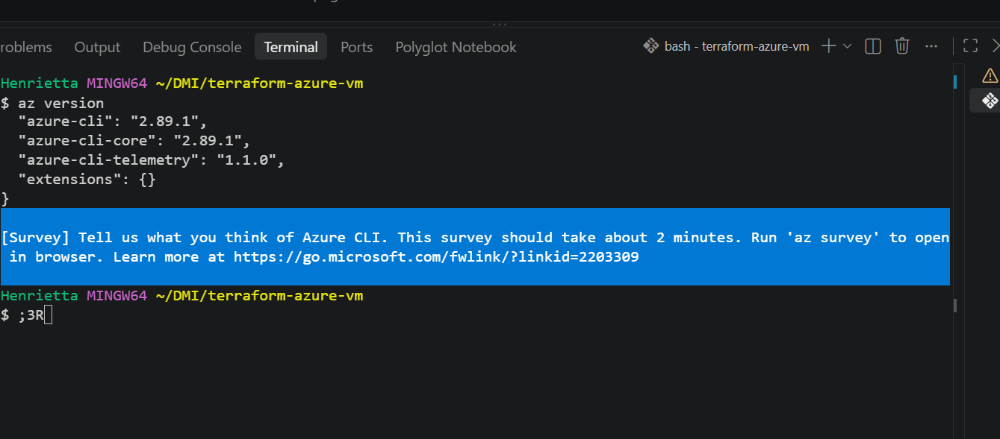
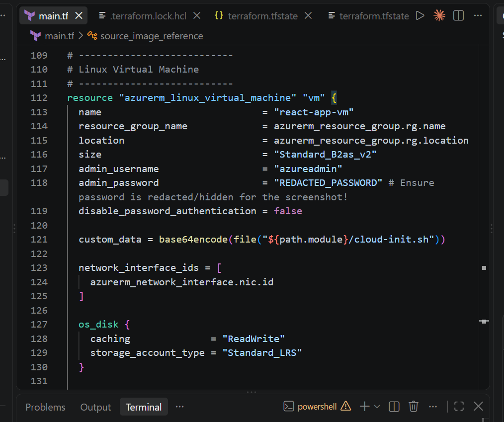
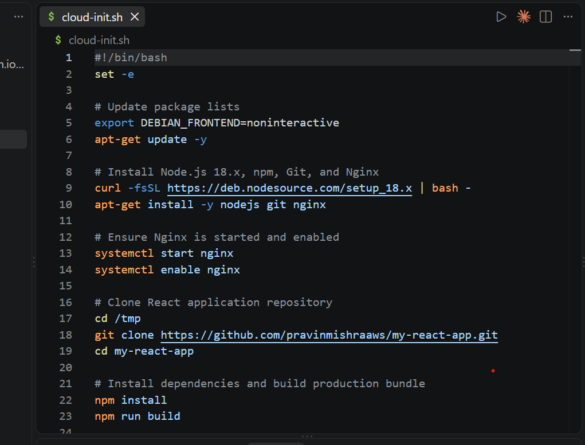
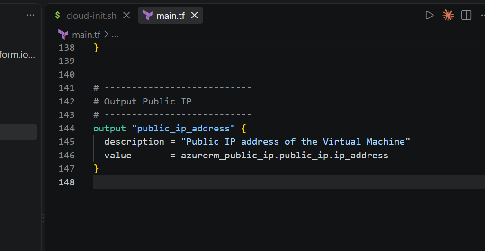
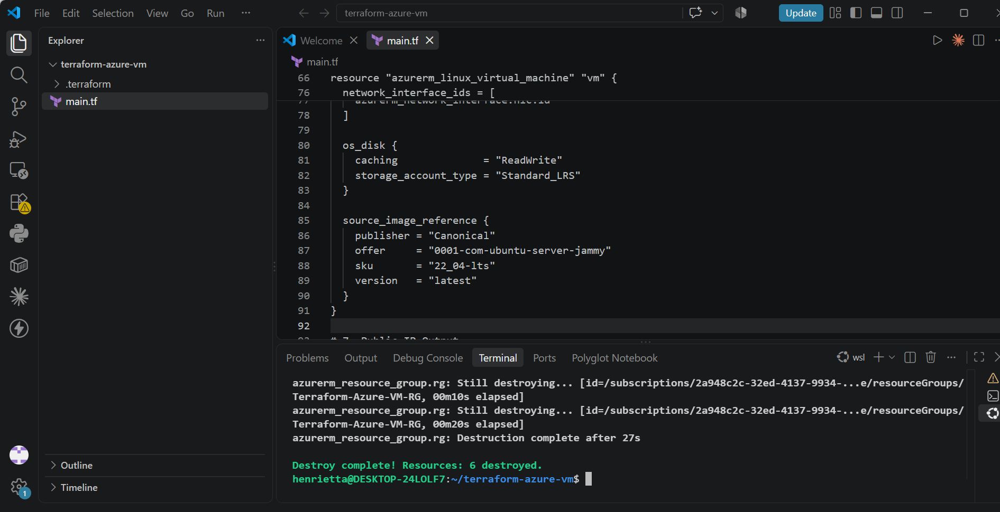

# Assignment 3 — Deploy a React Application on Azure Virtual Machine Using Terraform

Part of the DevOps Micro Internship (DMI) Cohort 3 with Agentic AI

---

## Purpose

In this assignment, you will use Terraform to provision the required Azure infrastructure and automatically deploy the `my-react-app` React application on an Azure Linux virtual machine using a `cloud-init.sh` deployment script passed to the VM through `custom_data`.

You will verify the automated deployment through SSH, confirm that Nginx is running, access the React application through the VM public IP, and destroy the Terraform-managed resources after testing.

---

# Task 0 — Set Up and Verify the Terraform and Azure CLI Environment

## Goal

Prepare your local environment for Terraform deployment by installing Terraform, Azure CLI, and the HashiCorp Terraform extension in VS Code, signing in to your Azure account, and confirming that all required tools are working correctly.

### Evidence

#### Screenshot 1 — Terraform Version

Add a screenshot of the terminal showing successful terraform version output.

---

#### Screenshot 2 — Azure CLI Version

Add a screenshot of the terminal showing successful az version output.

---

#### Screenshot 3 — HashiCorp Terraform Extension

Add a screenshot of the VS Code Extensions panel showing the HashiCorp Terraform extension installed and enabled.

---

# Task 1 — Task 1 — Create a New Terraform Project and Define the Infrastructure

## Goal

Create a new Terraform project and define the complete Azure infrastructure required to host the React application using the official Terraform Registry documentation.

The terraform-react-azure project must contain:

terraform-react-azure/
├── main.tf
└── cloud-init.sh

The Terraform configuration must include:

- Terraform and AzureRM provider configuration
- Resource group
- Virtual network and subnet
- Network Security Group
- SSH rule for TCP port 22
- HTTP rule for TCP port 80
- Public IP address
- Network interface
- Linux virtual machine
- custom_data configuration referencing cloud-init.sh
- Public IP output
- The cloud-init.sh file must contain the complete automated React application deployment workflow based on the repository instructions.

### Evidence

#### Screenshot 4 — Provider, Resource Group, and Network Security Group

Add a screenshot of VS Code showing the AzureRM provider, resource group, and Network Security Group configuration in main.tf.

---

#### Screenshot 5 — Linux Virtual Machine and custom_data

Add a screenshot of VS Code showing the Linux virtual machine configuration, including the custom_data configuration, in main.tf.

Ensure that passwords, private keys, account IDs, access tokens, and other sensitive information are hidden.

---

#### Screenshot 6 — Completed cloud-init.sh

Add a screenshot of VS Code showing the completed cloud-init.sh deployment script.

Ensure that no passwords, Azure credentials, access tokens, SSH private keys, or other sensitive information are visible.

---

#### Screenshot 7 — Public IP Output Block

Add a screenshot of VS Code showing the public IP output block in main.tf.

---

#### Screenshot 1 — File Explorer, VS Code, or terminal showing the `terraform-react-azure` project directory

---
# Task 2 — Initialize Terraform

## Goal

Initialize the Terraform working directory and download the required provider components.

### Evidence

#### Screenshot 8 — Terraform Initialization

Add a screenshot of the terminal showing successful terraform init output.

---

# Task 3 — Plan and Apply the Configuration

## Goal

Review the Terraform execution plan and provision the Azure infrastructure.

### Evidence

#### Screenshot 9 — Terraform Plan

Add a screenshot showing the Terraform plan summary and the proposed resources.

---

#### Screenshot 10 — Terraform Apply

Add a screenshot showing successful terraform apply completion.

---

#### Screenshot 11 — VM Public IP Output

Add a screenshot showing the VM public IP address returned by terraform output.

VM Public IP Address
Record the public IP address displayed by terraform output.

VM Public IP Address: 74.248.19.27

---

# Task 4 — Verify the Automated Deployment

## Goal

Connect to the Azure Linux virtual machine and confirm that the cloud-init/user data deployment script completed successfully.

### Evidence

#### Screenshot 12 — SSH Connection and Completed React Deployment

Add a screenshot of the SSH terminal showing a successful connection to the Azure VM and evidence that the React application deployment completed.

---

#### Screenshot 13 — Nginx Service Status

Add a screenshot of the terminal showing that the Nginx service is running successfully.

---

# Task 5 — Verify the React Application Deployment

## Goal

Confirm that the automatically deployed React application is publicly accessible and functioning correctly.

### Evidence

#### Screenshot 14 — React Application in the Browser

Add a screenshot of the browser showing the deployed React application successfully loaded using the Azure VM public IP.

Ensure that the Azure VM public IP is visible in the browser address bar.

---

# Task 6 — Destroy the Resources

## Goal

Remove all Azure resources created by Terraform after completing the application deployment and verification.

### Evidence

#### Screenshot 15 — Terraform Destroy

Add a screenshot of the terminal showing successful terraform destroy completion.

---

### Notes

Write a short summary of what you built and any issues you encountered and how you resolved them.

**Project Summary**

* **Infrastructure Provisioning**: Automated the deployment of a full cloud hosting environment on Microsoft Azure using Terraform, creating an Azure Resource Group, Virtual Network (VNet), Subnet, Network Security Group (NSG) configured for inbound SSH (port 22) and HTTP (port 80) traffic, a Static Public IP, a Network Interface (NIC), and an Ubuntu 22.04 LTS Virtual Machine (`Standard_B2as_v2`).
* **Application Setup & Deployment**: Connected to the VM via SSH, configured the runtime environment with modern Node.js, npm, and Nginx, cloned and personalized the React web application with my details, built the optimized production bundle (`npm run build`), and deployed the static assets to `/var/www/html`.
* **Web Server & Routing Configuration**: Configured Nginx with SPA routing fallback (`try_files $uri /index.html;`) to properly handle client-side routing, verified configuration syntax, and successfully served the live application publicly over HTTP.

---

**Issues Encountered & Resolutions**

* **Browser Redirect & DNS Hijack**: Browser queries were hijacked by a rogue extension redirecting requests to dead endpoints (`search-sync.com`, `searchtwix.com`), resulting in `DNS_PROBE_FINISHED_BAD_CONFIG`.
* *Resolution*: Removed the problematic extension (`Awesome Screen Recorder`), cleared hijacked search engines, disabled automatic extension re-syncing, flushed the local DNS cache, and configured explicit public DNS resolvers (`8.8.8.8` / `1.1.1.1`).

* **Azure VM Regional SKU Quota Constraints**: Initial deployment in `eastus` failed with `SkuNotAvailable (409 Conflict)` due to capacity restrictions on the `Standard_B1s` size.
* *Resolution*: Updated Terraform configurations to target an available region (`polandcentral`) with an active SKU (`Standard_B2as_v2`).

* **Terraform Subnet State Discrepancy**: A provider-level state mismatch occurred when the subnet provisioned before being tracked in the local state file, triggering an "already exists" error on subsequent runs.
* *Resolution*: Imported the remote subnet resource ID into the Terraform state file using `MSYS_NO_PATHCONV=1 terraform import` in Git Bash to bypass POSIX path translation, allowing the remaining resources to apply cleanly.

* **Non-Interactive Package Upgrades on Ubuntu**: The Ubuntu `needrestart` interactive dialog froze terminal automation during package upgrades.
* *Resolution*: Used non-interactive flags (`DEBIAN_FRONTEND=noninteractive NEEDRESTART_MODE=a`) to install and upgrade packages silently.

---

# Submission Instructions

- Complete Tasks 0–6 in sequence.
- Include all 15 required screenshots exactly as specified.
- Ensure that your full name is visible in the required screenshots.
- Record the VM public IP address under Task 3.
- Ensure that the submitted evidence clearly matches the required task outputs.
- Include main.tf and cloud-init.sh in your GitHub submission.
- Do not expose passwords, SSH private keys, account IDs, access tokens, Azure credentials, or other sensitive information.
- Do not store secrets inside cloud-init.sh.
- Review all screenshots and project files carefully before submitting through GitHub.

---

# Completion Checklist

- [✅]  Installed Terraform and verified it using terraform version
- [✅] Installed Azure CLI and verified it using az version
- [✅] Signed in to Azure and confirmed the correct subscription
- [✅] Installed and enabled the HashiCorp Terraform extension in VS Code
- [✅] Created the terraform-react-azure project
- [✅] Created main.tf
- [✅] Defined the Terraform and AzureRM provider configuration
- [✅] Defined the resource group
- [✅] Defined the virtual network and subnet
- [✅] Defined the Network Security Group
- [✅] Configured SSH and HTTP rules
- [✅] Defined the public IP and network interface
- [✅] Created cloud-init.sh
- [✅] Reviewed the React application repository instructions
- [✅] Created the complete deployment workflow inside cloud-init.sh
- [✅] Defined the Linux virtual machine
- [✅] Connected cloud-init.sh to the VM using custom_data
- [✅] Used file() and base64encode() correctly
- [✅] Added the Terraform public IP output
- [✅] Completed terraform init successfully
- [✅] Reviewed the Terraform execution plan
- [✅] Completed terraform apply successfully
- [✅] Recorded the VM public IP
- [✅] Connected to the VM through SSH
- [✅] Verified that the automated deployment completed successfully
- [✅] Verified that Nginx is running
- [✅] Verified the React application through the browser
- [✅] Completed terraform destroy successfully
- [✅] Captured all 15 required screenshots
- [✅] Confirmed that my full name is visible in the required screenshots
- [✅] Checked that no passwords, keys, account IDs, access tokens, or other sensitive information are exposed

---

## 📌 About DMI & CloudAdvisory

DevOps Micro Internship (DMI) is a project-based DevOps program run by Pravin Mishra (The CloudAdvisory) focused on real-world execution, systems thinking, and career readiness.

It helps learners build strong DevOps foundations with hands-on experience.

---

## 📌 Resources

- 🌐 DMI Official Website: https://dmi.pravinmishra.com?utm_source=github&utm_medium=readme  
- 🎓 University: https://university.pravinmishra.com?utm_source=github&utm_medium=readme  
- 💬 Discord Community: https://discord.pravinmishra.com?utm_source=github&utm_medium=readme  
- 📝 Blog: https://dmi.pravinmishra.com/blog?utm_source=github&utm_medium=readme  
- ▶️ YouTube Playlist: https://www.youtube.com/playlist?list=PLFeSNDtI4Cho  
- 🔗 Pravin Mishra (LinkedIn): https://www.linkedin.com/in/pravin-mishra-aws-trainer/  
- 🏢 CloudAdvisory (LinkedIn): https://www.linkedin.com/company/thecloudadvisory/

---

*This submission is part of DevOps Micro Internship (DMI) Cohort 3 — Agentic AI Track.*
