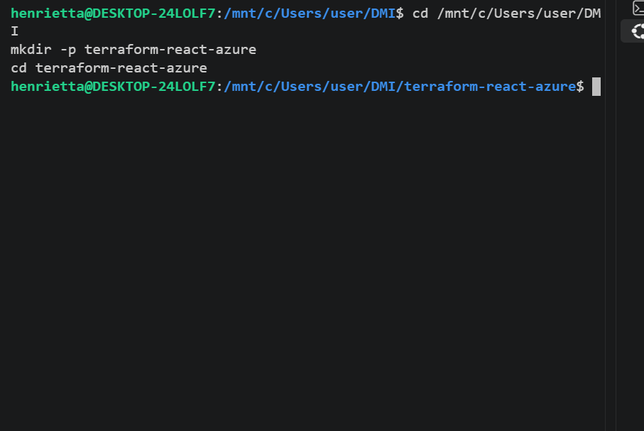
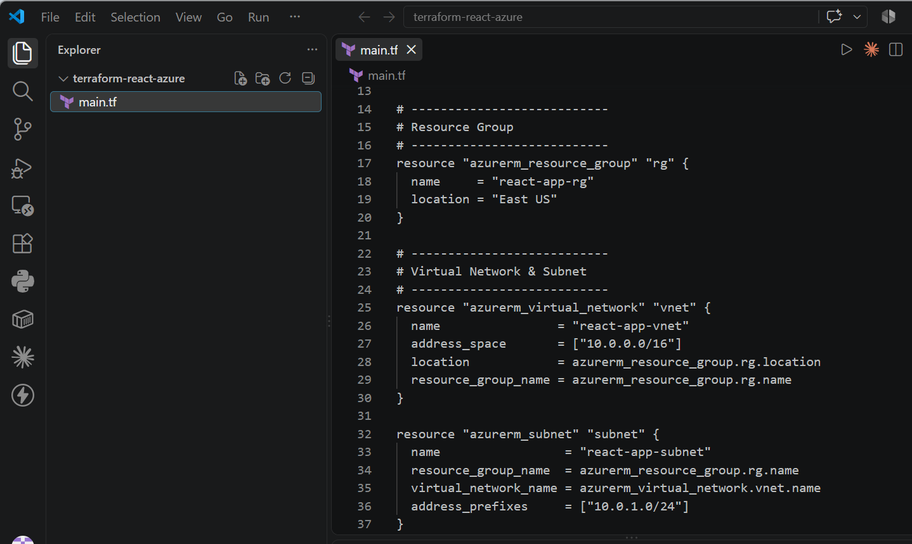
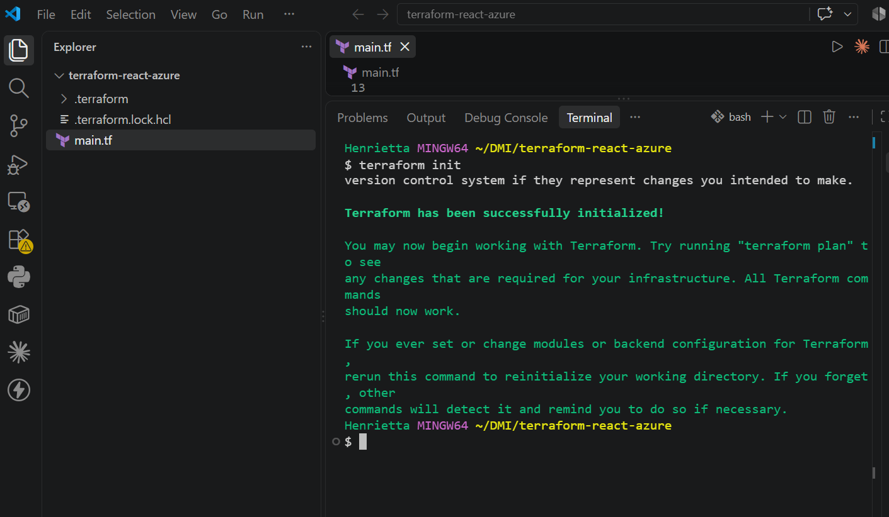
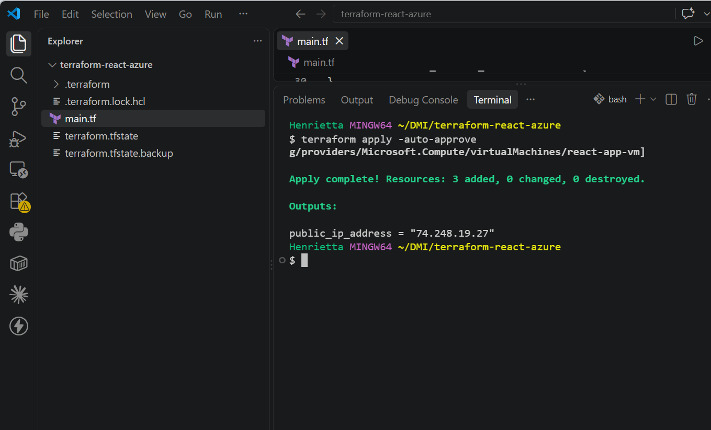
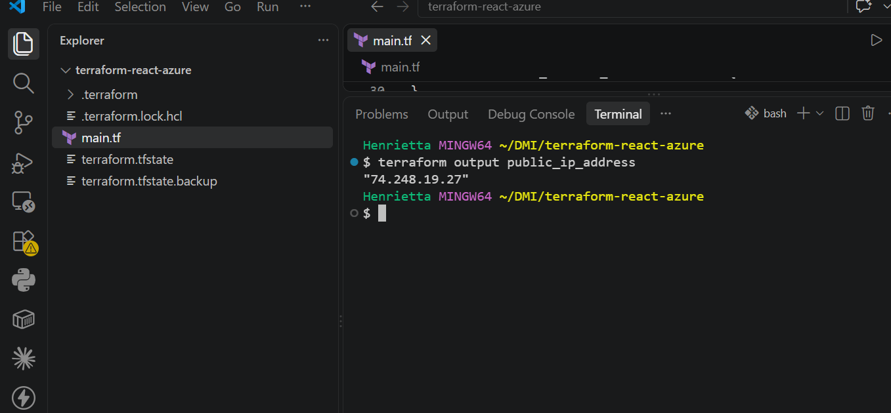
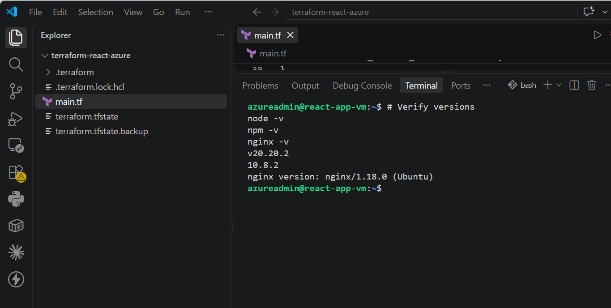
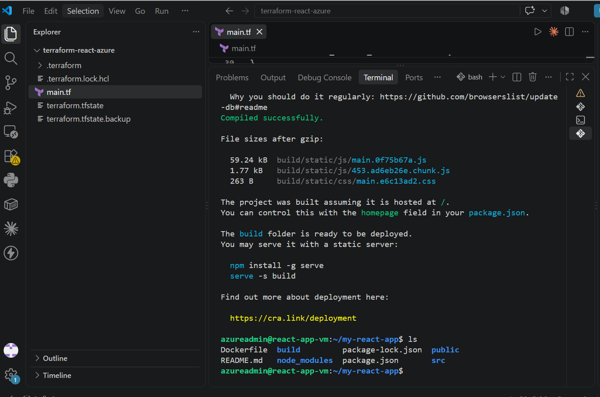
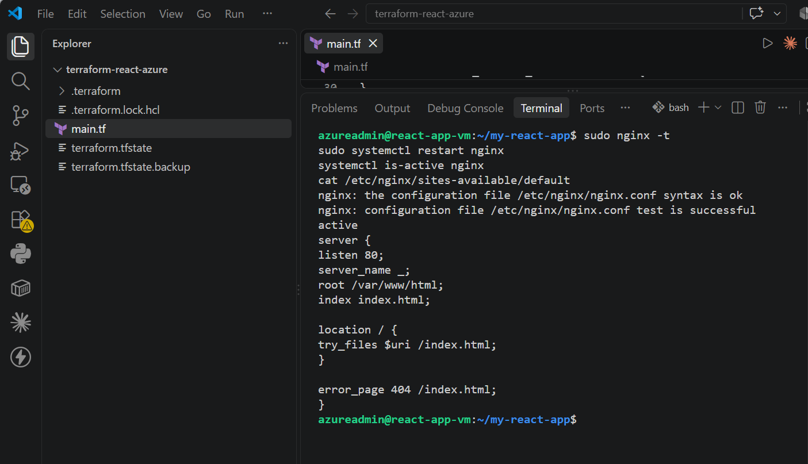
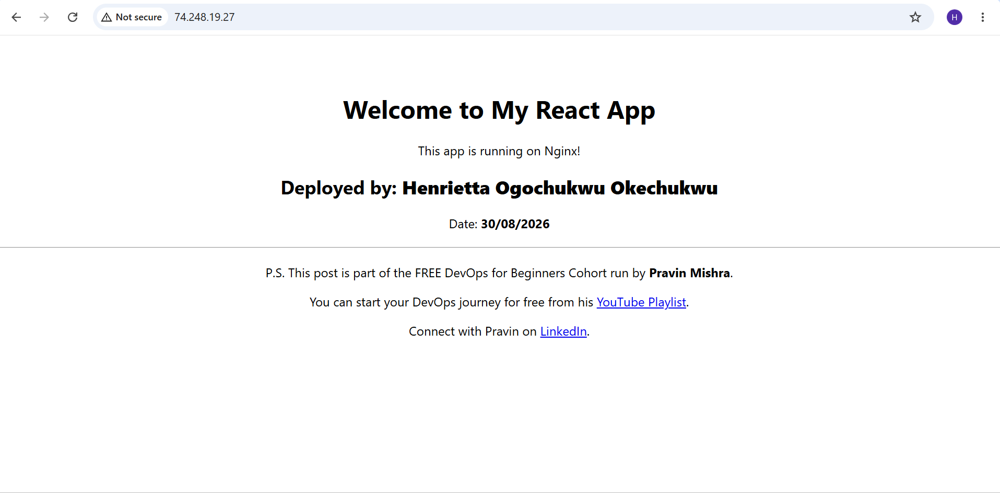

# Assignment 3 — Deploy a React Application on Azure Virtual Machine Using Terraform

Part of the DevOps Micro Internship (DMI) Cohort 3 with Agentic AI

---

## Purpose

In this assignment, you will use Terraform to provision an Azure resource group, network, and Ubuntu 20.04 VM, then deploy the `my-react-app` React application onto the VM over SSH and serve it through Nginx.

---

# Task 1 — Create a New Terraform Project

## Goal

Create a `terraform-react-azure` project directory for the Azure Terraform configuration.

### Evidence

#### Screenshot 1 — File Explorer, VS Code, or terminal showing the `terraform-react-azure` project directory

---

# Task 2 — Write main.tf to Provision the Azure Infrastructure

## Goal

Define the resource group, virtual network/subnet, Network Security Group (SSH 22, HTTP 80), public IP, network interface, and Ubuntu 20.04 Standard B1s VM in `main.tf`.

### Evidence

#### Screenshot 2 — VS Code showing `main.tf` with the required Azure resources, with any password or sensitive values hidden

---

# Task 3 — Initialize Terraform

## Goal

Run `terraform init` and confirm the working directory initializes successfully.

### Evidence

#### Screenshot 3 — Terminal showing successful `terraform init` output

---

# Task 4 — Plan and Apply the Configuration

## Goal

Review `terraform plan`, run `terraform apply`, and record the VM's public IP.

### Evidence

#### Screenshot 4 — Terraform apply output showing successful completion

---

#### Screenshot 5 — Azure portal showing the Virtual Machine running and its public IP

---

# Task 5 — Connect to the Virtual Machine

## Goal

Establish an SSH session with the Ubuntu VM through its public IP.

### Evidence

#### Screenshot 6 — Terminal showing a successful SSH connection to the Azure VM

Add your screenshot here.

---

# Task 6 — Install Node.js, npm, and Git

## Goal

Update Ubuntu and install Node.js, npm, and Git.

### Evidence

#### Screenshot 7 — Terminal showing successful installation and the `node -v` and `npm -v` output

---

# Task 7 — Clone, Build, and Serve the React App with Nginx

## Goal

Follow the `my-react-app` repository README to clone, install, and build the app, then serve the production build through Nginx.

### Evidence

#### Screenshot 8 — Terminal showing the successful React build

---

#### Screenshot 9 — Terminal showing that Nginx is active and running

---

# Task 8 — Test the Deployment

## Goal

Confirm the React application loads through the VM's public IP and navigation works.

### Evidence

#### Screenshot 10 — Browser showing the React application with the Azure VM public IP visible in the address bar

---

### Notes

Write a short summary of what you built and any issues you encountered and how you resolved them.

**Project Summary**

* **Infrastructure Provisioning**: Automated the deployment of a full cloud hosting environment on Microsoft Azure using Terraform, creating an Azure Resource Group, Virtual Network (VNet), Subnet, Network Security Group (NSG) configured for inbound SSH (port 22) and HTTP (port 80) traffic, a Static Public IP, a Network Interface (NIC), and an Ubuntu 22.04 LTS Virtual Machine (`Standard_B2as_v2`).
* **Application Setup & Deployment**: Connected to the VM via SSH, configured the runtime environment with modern Node.js, npm, and Nginx, cloned and personalized the React web application with my details, built the optimized production bundle (`npm run build`), and deployed the static assets to `/var/www/html`.
* **Web Server & Routing Configuration**: Configured Nginx with SPA routing fallback (`try_files $uri /index.html;`) to properly handle client-side routing, verified configuration syntax, and successfully served the live application publicly over HTTP.

---

**Issues Encountered & Resolutions**

* **Browser Redirect & DNS Hijack**: Browser queries were hijacked by a rogue extension redirecting requests to dead endpoints (`search-sync.com`, `searchtwix.com`), resulting in `DNS_PROBE_FINISHED_BAD_CONFIG`.
* *Resolution*: Removed the problematic extension (`Awesome Screen Recorder`), cleared hijacked search engines, disabled automatic extension re-syncing, flushed the local DNS cache, and configured explicit public DNS resolvers (`8.8.8.8` / `1.1.1.1`).

* **Azure VM Regional SKU Quota Constraints**: Initial deployment in `eastus` failed with `SkuNotAvailable (409 Conflict)` due to capacity restrictions on the `Standard_B1s` size.
* *Resolution*: Updated Terraform configurations to target an available region (`polandcentral`) with an active SKU (`Standard_B2as_v2`).

* **Terraform Subnet State Discrepancy**: A provider-level state mismatch occurred when the subnet provisioned before being tracked in the local state file, triggering an "already exists" error on subsequent runs.
* *Resolution*: Imported the remote subnet resource ID into the Terraform state file using `MSYS_NO_PATHCONV=1 terraform import` in Git Bash to bypass POSIX path translation, allowing the remaining resources to apply cleanly.

* **Non-Interactive Package Upgrades on Ubuntu**: The Ubuntu `needrestart` interactive dialog froze terminal automation during package upgrades.
* *Resolution*: Used non-interactive flags (`DEBIAN_FRONTEND=noninteractive NEEDRESTART_MODE=a`) to install and upgrade packages silently.

---

# Submission Instructions

- Add all required screenshots in your submission
- Include the Azure VM public IP
- Do not expose Azure credentials, passwords, or private keys

---

# Completion Checklist

- [ ] Task 1: `terraform-react-azure` project created (Screenshot 1)
- [ ] Task 2: `main.tf` defines all required Azure resources (Screenshot 2)
- [ ] Task 3: `terraform init` completed successfully (Screenshot 3)
- [ ] Task 4: Plan applied and VM running with public IP (Screenshots 4–5)
- [ ] Task 5: SSH connection verified (Screenshot 6)
- [ ] Task 6: Node.js, npm, and Git installed (Screenshot 7)
- [ ] Task 7: React app built and served through Nginx (Screenshots 8–9)
- [ ] Task 8: App verified through the VM public IP (Screenshot 10)
- [ ] Summary paragraph written (Notes)
- [ ] No sensitive information exposed

---

## 📌 About DMI & CloudAdvisory

DevOps Micro Internship (DMI) is a project-based DevOps program run by Pravin Mishra (The CloudAdvisory) focused on real-world execution, systems thinking, and career readiness.

It helps learners build strong DevOps foundations with hands-on experience.

---

## 📌 Resources

- 🌐 DMI Official Website: https://dmi.pravinmishra.com?utm_source=github&utm_medium=readme  
- 🎓 University: https://university.pravinmishra.com?utm_source=github&utm_medium=readme  
- 💬 Discord Community: https://discord.pravinmishra.com?utm_source=github&utm_medium=readme  
- 📝 Blog: https://dmi.pravinmishra.com/blog?utm_source=github&utm_medium=readme  
- ▶️ YouTube Playlist: https://www.youtube.com/playlist?list=PLFeSNDtI4Cho  
- 🔗 Pravin Mishra (LinkedIn): https://www.linkedin.com/in/pravin-mishra-aws-trainer/  
- 🏢 CloudAdvisory (LinkedIn): https://www.linkedin.com/company/thecloudadvisory/

---

*This submission is part of DevOps Micro Internship (DMI) Cohort 3 — Agentic AI Track.*
