# Capstone Assignment — Deploy the Book Review App Using Terraform and Claude Code Agentic AI

Part of the DevOps Micro Internship (DMI) Cohort 3 with Agentic AI

---

## Student Details

**Full Name:** Henrietta Ogochukwu Okechukwu
**Cloud Platform:** AWS 
**GitHub Repository URL:** `https://github.com/Harietonyeabor`
**Public Application URL / Load-Balancer DNS:** `http://book-review-public-alb-1737082241.us-east-1.elb.amazonaws.com`

---

## Purpose

Deploy the Book Review App using Terraform on AWS or Azure in a secure, highly available, production-style three-tier architecture. Use Claude Code, specialized subagents, Terraform MCP, and validation hooks to support the engineering workflow while keeping all infrastructure-changing operations under human control.

---

# Task 0 — Prepare the Project and Agentic AI Environment

## Goal

Prepare the Book Review App project and configure the provided Claude Code Agentic AI starter kit with project context, specialized subagents, Terraform MCP, validation hooks, and safety guardrails.

### Evidence

#### Screenshot 1 — Project CLAUDE.md

Add a screenshot of the project CLAUDE.md showing the three-tier architecture, security boundaries, Terraform requirements, and human-approval rules.

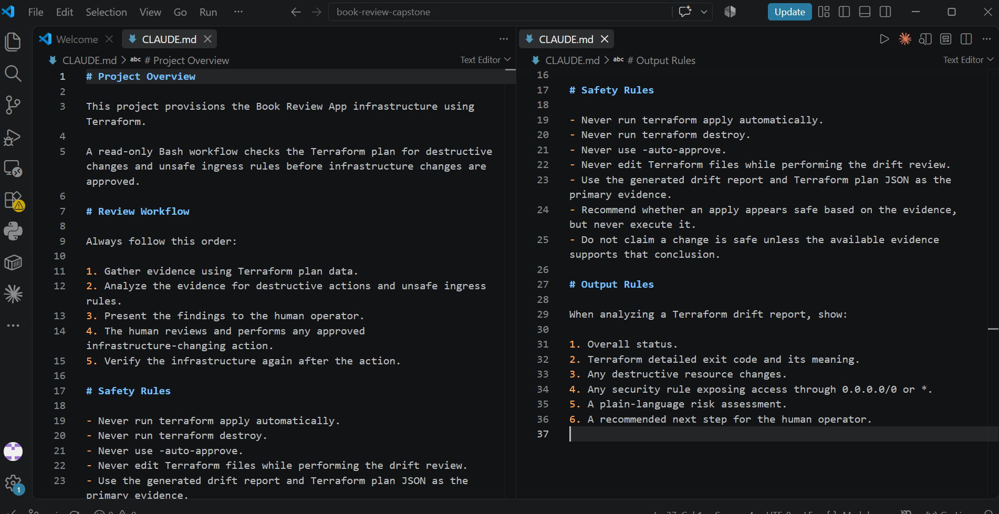

---

#### Screenshot 2 — Terraform Engineer Subagent

Add a screenshot showing the Terraform Engineer subagent configuration.

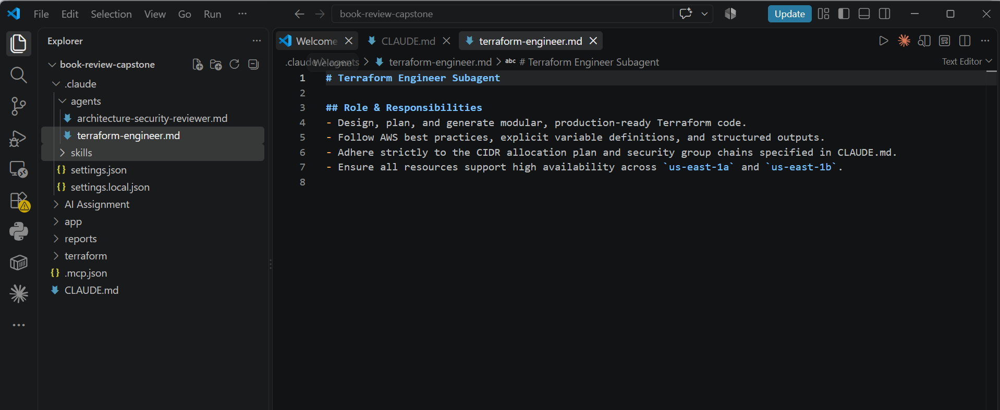

---

#### Screenshot 3 — Architecture and Security Reviewer Subagent

Add a screenshot showing the Architecture and Security Reviewer subagent configuration.

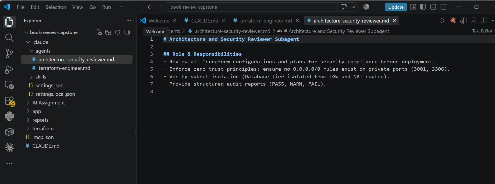

---

#### Screenshot 4 — Terraform MCP Connection

Add a screenshot showing Terraform MCP connected and available.

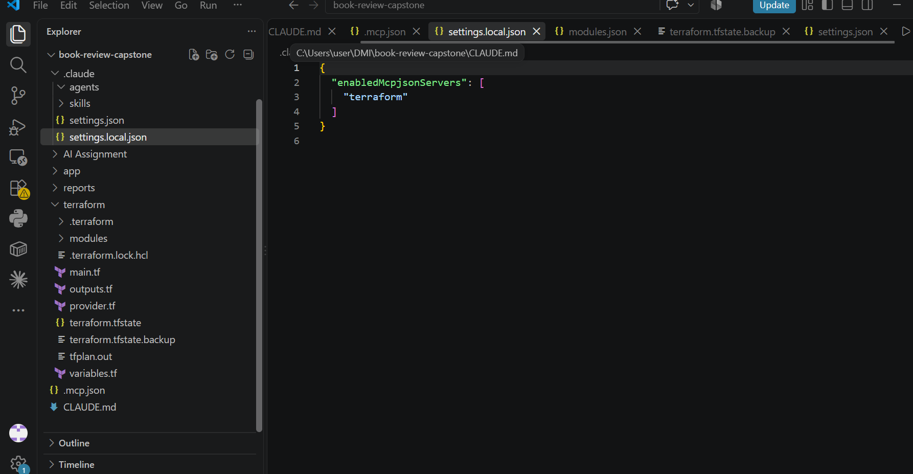

---

#### Screenshot 5 — Validation Hooks

Add a screenshot showing the configured Claude Code validation hooks.

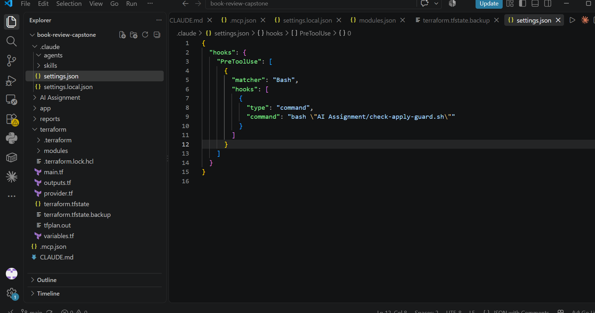

---

# Task 1 — Design the Three-Tier Architecture

## Goal

Design the required secure, highly available three-tier architecture and create an architecture diagram before building the infrastructure.

The diagram must show:

- VPC or VNet
- Availability Zones or equivalent availability locations
- Six subnets
- Internet connectivity
- NAT or outbound design
- Public load balancer
- Web Tier
- Internal load balancer
- Application Tier
- Managed MySQL
- Read replica
- Main traffic flow

## Architecture Diagram

Add the completed architecture diagram here.


+-------------------------------------------------------------+
                                  |                     AWS Cloud (us-east-1)                   |
                                  |                                                             |
                                  |   VPC: 10.0.0.0/16                                          |
                                  |                                                             |
                                  |       Internet Gateway (IGW) <---> [ Public Traffic :80 ]   |
                                  |                  |                                          |
   ==================================================|===================================================
   TIER 1: PRESENTATION TIER                         v
   =====================================================================================================
   [ Public Subnet A - 10.0.1.0/24 (AZ1) ]           |      [ Public Subnet B - 10.0.2.0/24 (AZ2) ]
   +---------------------------------------+         |      +---------------------------------------+
   |   Internet-Facing Public ALB          |<--------+----->|   Internet-Facing Public ALB          |
   |   (Port 80 Ingress: 0.0.0.0/0)        |                |   (Port 80 Ingress: 0.0.0.0/0)        |
   +---------------------------------------+                +---------------------------------------+
                      |                                                         |
                      v                                                         v
   +---------------------------------------+                +---------------------------------------+
   |   Web Server 1 (EC2 - Next.js/Nginx)  |                |   Web Server 2 (EC2 - Next.js/Nginx)  |
   |   Port 80 (Traffic from Public ALB)   |                |   Port 80 (Traffic from Public ALB)   |
   +---------------------------------------+                +---------------------------------------+
   |   NAT Gateway (Public IP / EIP)       |
   +---------------------------------------+
                      |
   ===================|=================================================================================
   TIER 2: APPLICATION LOGIC TIER (Private - No Public IPs)
   ===================|=================================================================================
                      v
   [ Private App Subnet A - 10.0.3.0/24 (AZ1) ]             [ Private App Subnet B - 10.0.4.0/24 (AZ2) ]
   +---------------------------------------+                +---------------------------------------+
   |   Internal Application Load Balancer  |<-------------->|   Internal Application Load Balancer  |
   |   (Port 3001 Ingress from Web SG only)|                |   (Port 3001 Ingress from Web SG only)|
   +---------------------------------------+                +---------------------------------------+
                      |                                                         |
                      v                                                         v
   +---------------------------------------+                +---------------------------------------+
   |   App Server 1 (EC2 - Node.js API)    |                |   App Server 2 (EC2 - Node.js API)    |
   |   Port 3001 (Outbound via NAT GW)     |                |   Port 3001 (Outbound via NAT GW)     |
   +---------------------------------------+                +---------------------------------------+
                      |                                                         |
   ===================|=========================================================|=======================
   TIER 3: DATABASE TIER (Private - Isolated)                                   |
   ===================|=========================================================|=======================
                      +-----------------------------+---------------------------+
                                                    | (MySQL Port 3306 Ingress from App SG only)
                                                    v
   [ Private DB Subnet A - 10.0.5.0/24 (AZ1) ]              [ Private DB Subnet B - 10.0.6.0/24 (AZ2) ]
   +---------------------------------------+                +---------------------------------------+
   |   Primary Amazon RDS MySQL            |   Synchronous  |   Multi-AZ Standby Replica            |
   |   (Read/Write)                        |===============>|   (Automatic Failover)                |
   +---------------------------------------+    Multi-AZ    +---------------------------------------+
                      |                                                         ^
                      |               Asynchronous Read Traffic                 |
                      +---------------------------------------------------------+
                                                    |
                                                    v
                                    +---------------------------------------+
                                    |   Read Replica (RDS MySQL)            |
                                    |   (Offload Read Queries)              |
                                    +---------------------------------------+


---

# Task 2 — Build the Terraform Networking and Security Layers

## Goal

Create the modular Terraform project and implement the network and security layers across the required public and private subnets.

### Evidence

#### Screenshot 6 — Modular Terraform Project Structure

Add a screenshot showing the modular Terraform project structure.

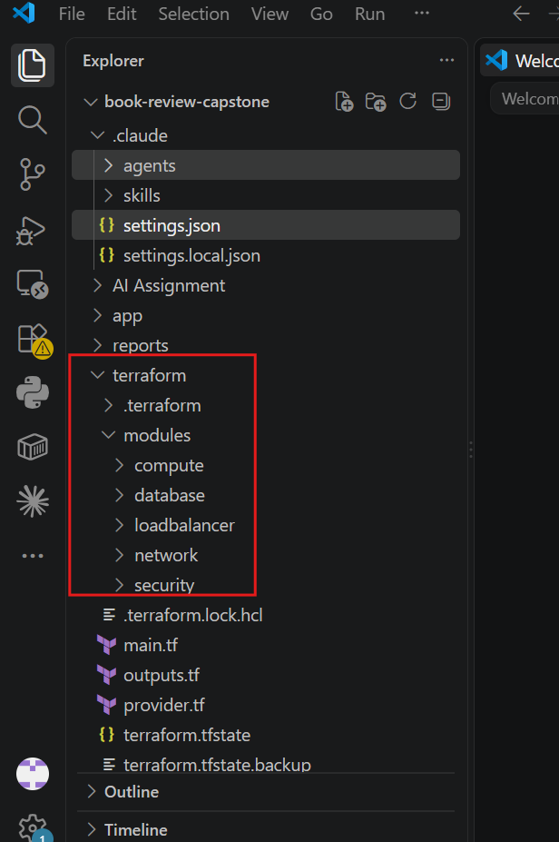

---

#### Screenshot 7 — Six-Subnet Architecture

Add a screenshot showing the six-subnet architecture across two availability locations.


---

### Screenshot 8 — Public and Private Tier Separation

Add a screenshot showing the public and private tier separation, including routing and security boundaries.

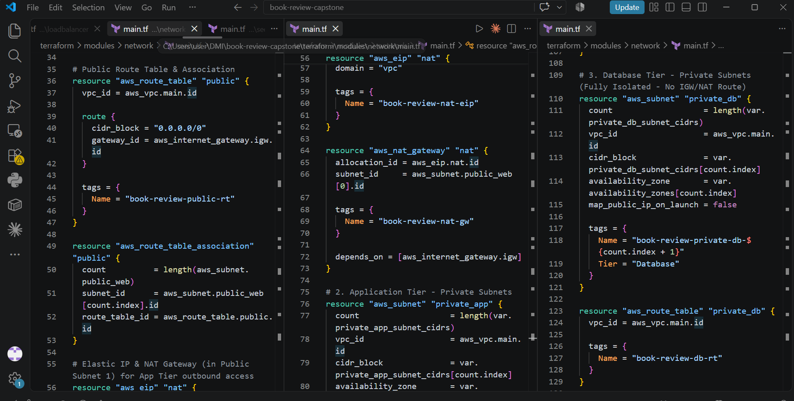

---

# Task 3 — Build the Load-Balancing and Compute Layers

## Goal

Deploy the public and internal load balancers and the Web and Application compute resources required by the Book Review App.

### Evidence

#### Screenshot 9 — Web and Application Compute

Add a screenshot showing the Web and Application compute resources in their required subnets.


---

#### Screenshot 10 — Public Load Balancer

Add a screenshot showing the internet-facing public load balancer.


---

#### Screenshot 11 — Internal Load Balancer

Add a screenshot showing the private internal load balancer.


---

#### Screenshot 12 — Healthy Targets

Add a screenshot showing healthy target groups or backend pools.


---

# Task 4 — Build the Managed MySQL Database Layer

## Goal

Deploy a private, highly available managed MySQL database with a read replica and restrict database connectivity to the Application Tier.

### Evidence

#### Screenshot 13 — Managed MySQL Database

Add a screenshot showing the managed MySQL database deployment.


---

#### Screenshot 14 — High Availability

Add a screenshot showing the Multi-AZ or high-availability configuration.


---

#### Screenshot 15 — Read Replica

Add a screenshot showing the read replica configuration.


---

#### Screenshot 16 — Private Database Access

Add a screenshot showing that the database is private and accepts MySQL traffic only from the Application Tier.

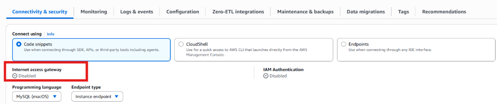

---

# Task 5 — Validate, Review, and Apply the Terraform Configuration

## Goal

Validate the Terraform configuration, review the execution plan using both Agentic AI and human judgment, and apply the infrastructure changes only after all required checks pass.

### Evidence

#### Screenshot 17 — Terraform Validation

Add a screenshot showing successful terraform validate output.

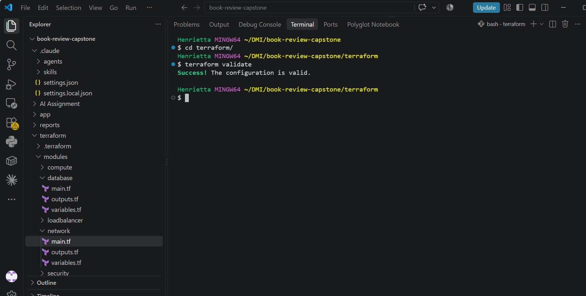

---

#### Screenshot 18 — Terraform Plan

Add a screenshot showing the Terraform plan output.


---

#### Screenshot 19 — Terraform Apply

Add a screenshot showing successful terraform apply completion.

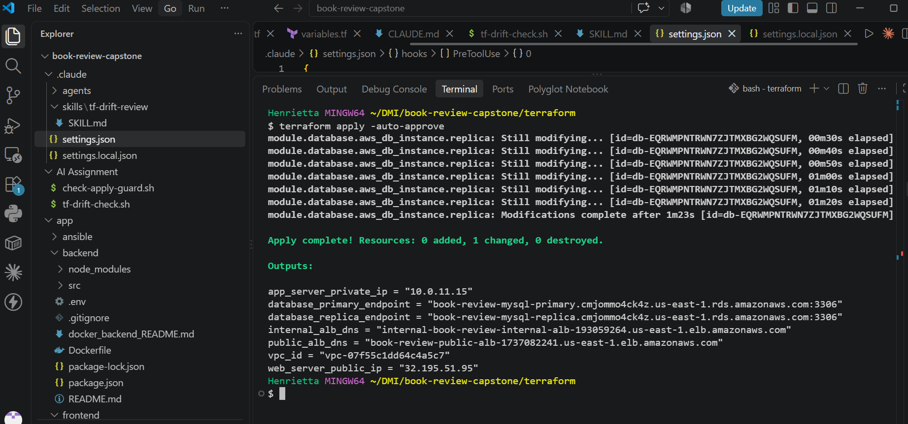

---

# Task 6 — Deploy and Configure the Book Review Application

## Goal

Deploy and configure the Book Review App across the Web, Application, and Database tiers and verify the complete application functionality.

### Evidence

#### Screenshot 20 — Homepage

Add a screenshot showing the Book Review App homepage through the public endpoint.


---

#### Screenshot 21 — Login or Authentication

Add a screenshot showing successful login or authentication.


---

#### Screenshot 22 — Book Data

Add a screenshot showing the book listing or book details.


---

#### Screenshot 23 — Review Functionality

Add a screenshot showing the review functionality working successfully.


---

#### Screenshot 24 — Backend or API Evidence

Add a screenshot showing that the backend or API is working successfully.


---

#### Screenshot 25 — Database Reads and Writes

Add a screenshot showing successful database reads and writes.


Public Application URL
Public Application URL / DNS: http://book-review-public-alb-1737082241.us-east-1.elb.amazonaws.com

---

# Task 7 — Demonstrate the Agentic AI Workflow

## Goal

Demonstrate how Claude Code assisted with Terraform generation, architecture and security review, and evidence-based troubleshooting while infrastructure-changing decisions remained under human control.

You do not need to submit your complete Claude Code conversation history. Include only focused evidence.

### Evidence

#### Screenshot 26 — AI-Assisted Terraform Generation

Add a screenshot showing one useful example of AI-assisted Terraform generation or improvement.

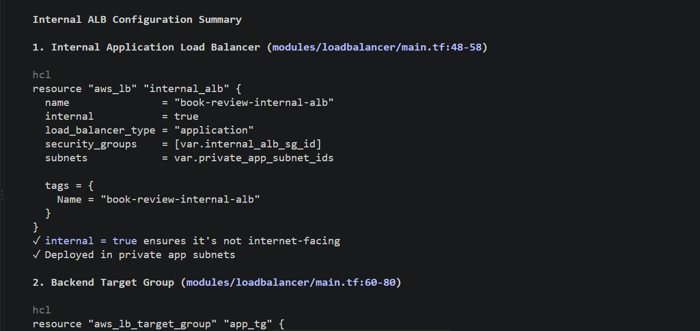

---

#### Screenshot 27 — Architecture or Security Review

Add a screenshot showing one structured architecture or security review result.

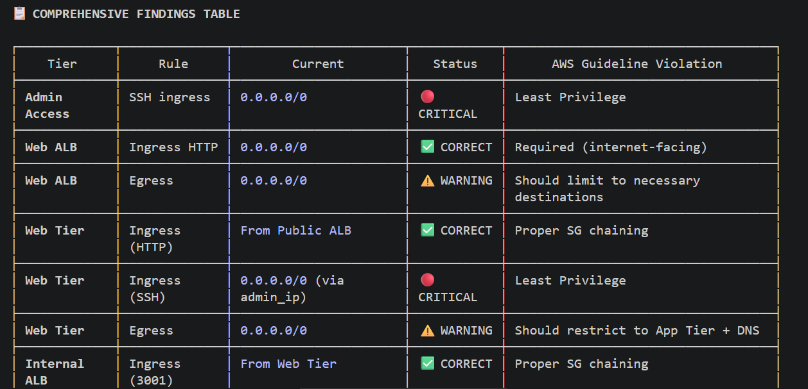
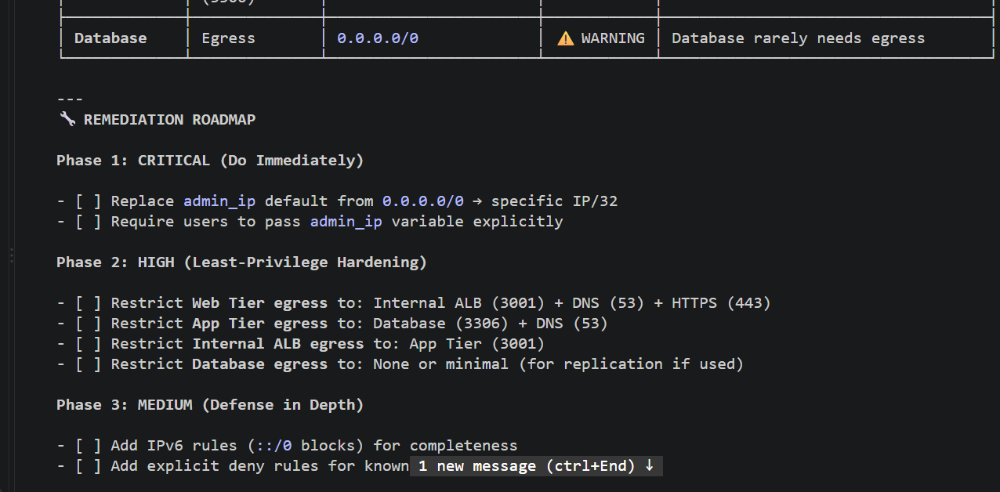
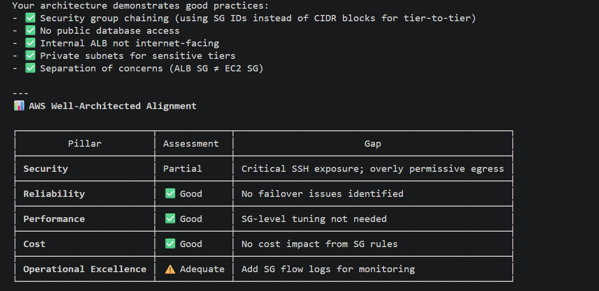


#### Screenshot 28 — AI-Assisted Troubleshooting

Add a screenshot showing one AI-assisted troubleshooting interaction based on collected evidence.

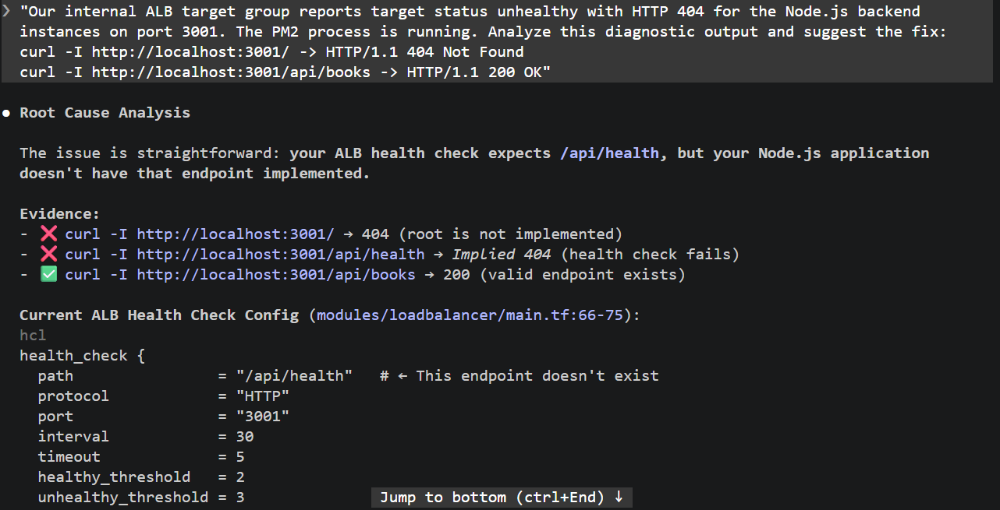
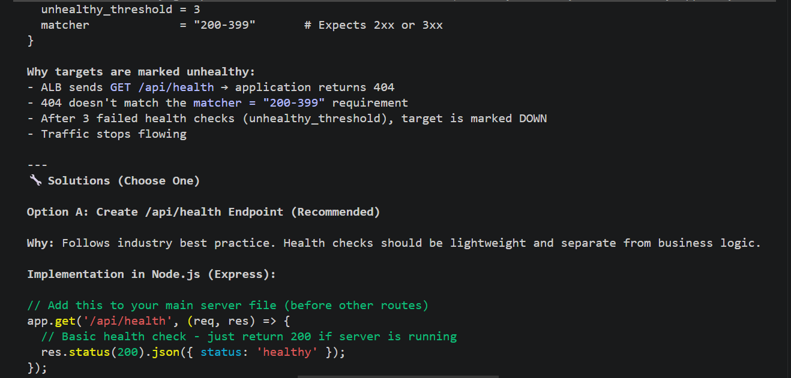
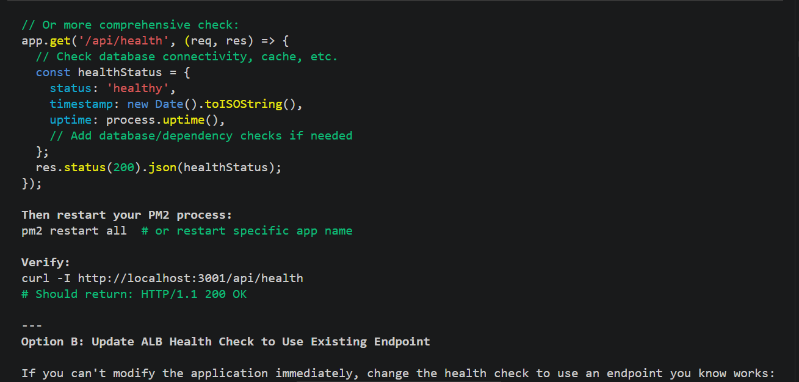
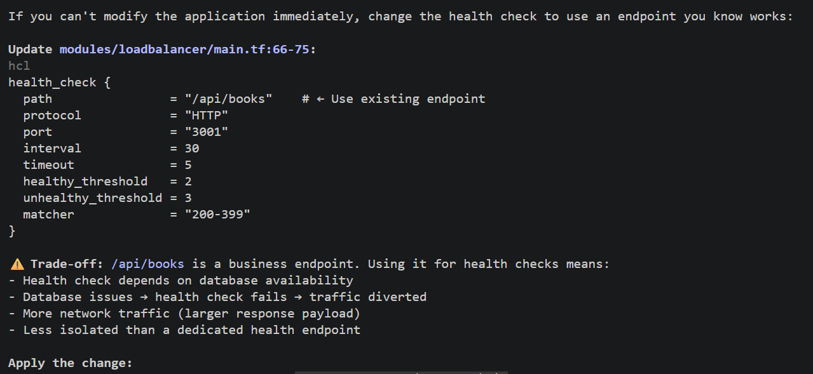
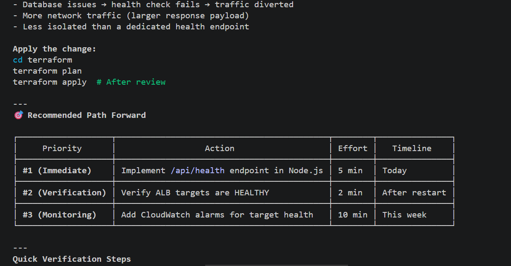

---

# Task 8 — Complete the Final Architecture Review

## Goal

Review the completed infrastructure against the original capstone requirements and resolve significant architecture, security, reliability, and cost issues.

Confirm that the final review covers:

- Tier separation
- Availability
- Public exposure
- Routing
- Security rules
- Load balancing
- Database privacy
- Secrets
- Terraform quality
- Module structure
- Reliability
- Obvious cost risks

Use Screenshot 27 as the focused evidence for the structured architecture or security review.

---

# Task 9 — Answer the Reflection Questions

## Goal

Reflect on the architecture, Terraform implementation, and Agentic AI workflow. Answer each question briefly in your own words.


## Architecture

#### 1. Why did you separate the Web, Application, and Database tiers?

To enforce defense-in-depth and the principle of least privilege. Presentation logic (Next.js/Nginx) is decoupled from business logic (Node.js API) and state storage (MySQL), minimizing blast radius and ensuring the database is never directly accessible from the internet.

#### 2. Why is the Application Tier private?

The Application Tier processes sensitive business logic and connects directly to the database. Placing it in private subnets with no public IPs protects it from direct internet-based attacks, allowing access only via the internal Application Load Balancer from the Web Tier.

#### 3. Why is MySQL private?

Databases store state and sensitive business data. Gating the database in isolated private subnets with ingress restricted strictly to port 3306 from the App Tier security group prevents unauthorized access, credential brute-forcing, and data exfiltration from the outside world.

#### 4. Why are multiple Availability Zones used?

To guarantee high availability and fault tolerance. Distributing compute and data across multiple physical data centers prevents a single zone failure from causing a total application outage.

#### 5. What is the difference between Multi-AZ/high availability and a read replica?

Multi-AZ provides synchronous replication to a standby instance in another AZ for automated disaster recovery and failover (it does not serve traffic). A read replica uses asynchronous replication to offload read traffic from the primary database, improving performance and horizontal read scalability.

## Terraform

#### 6. How did you divide your Terraform into modules?

By functional responsibility: Network (VPC, subnets, IGW, NAT, routing, security groups), Load Balancing (public and internal ALBs, target groups, listeners), Compute/App (EC2 instances, user data, scaling), and Database (RDS MySQL Multi-AZ, DB subnet group, parameter groups).

#### 7. How do the modules communicate through variables and outputs?

The root module orchestrates communication: lower-level modules (like Network) expose resource attributes as outputs (e.g., subnet_ids, security_group_ids), and the root main.tf passes those outputs into dependent modules as input variables.

#### 8. What did you specifically check in terraform plan?

I verified the proposed action summary (+ to create, ~ to modify, - to destroy), checked that security groups had precise CIDRs without open ingress on internal ports, confirmed resource count, and ensured private subnets did not accidentally map public IPs.

## Agentic AI

#### 9. What was the purpose of CLAUDE.md?

To provide Claude Code with non-negotiable project context, strict architecture boundaries, safety guardrails (never run apply or destroy automatically), and deterministic coding guidelines before generating or analyzing configurations.

#### 10. What work did the Terraform Engineer subagent perform?

It generated and refined Terraform HCL module definitions, formatted code to standard idioms, and ensured resource declarations adhered to project variable standards.

#### 11. What did the Architecture and Security Reviewer identify?

It reviewed proposed configurations against security best practices, checking for open security group rules (e.g., world-accessible port 3306 or 22), missing encryption at rest, and unsegmented subnet routing.

#### 12. Why did you use Terraform MCP instead of relying only on Claude's existing Terraform knowledge?

Terraform MCP queries real-time provider schemas and current documentation directly, preventing syntax errors from outdated provider releases or deprecated arguments that static LLM training data might introduce.

#### 13. What was the purpose of your validation hooks?

To provide deterministic, automated guardrails (such as running terraform fmt -check or validating syntax) before Claude Code could suggest or stage file changes, ensuring non-compliant code never entered the workspace.

#### 14. Describe one real issue Claude helped you troubleshoot.

Claude helped diagnose a routing issue where the internal ALB target group reported unhealthy checks due to a mismatch between the Node.js API health endpoint path (/health) and the ALB listener check configuration.

#### 15. Describe one recommendation you reviewed, modified, or rejected instead of accepting blindly.

Claude suggested placing the NAT Gateway in a private subnet to "keep it secure," which I rejected beca

---

### Notes

Report the cloud platform used (AWS or Azure), your Terraform code structure (`main.tf`, `variables.tf`, `outputs.tf`, and supporting files), a link/description of your architecture diagram, and the Public Load Balancer DNS used to access the frontend.

**Cloud Platform Used**

* **Provider:** Amazon Web Services (AWS)
* **Target Region:** `us-east-1` (US East - N. Virginia)

---

**Terraform Code Structure**
The infrastructure is provisioned modularly using Terraform to manage the 3-tier architecture:

```text
terraform/
├── main.tf                 # Core orchestration: VPC, subnets, IGW, NAT GW, route tables, and instances
├── variables.tf            # Input parameters (VPC CIDR, instance types, DB credentials, key pair names)
├── outputs.tf              # Exported values (Public ALB DNS, Internal ALB DNS, RDS endpoints, instance IPs)
├── security_groups.tf      # Granular security groups for Public ALB, Web Tier, Internal ALB, App Tier, and RDS
├── alb.tf                  # Public Application Load Balancer and Internal Application Load Balancer configurations
├── rds.tf                  # Multi-AZ RDS MySQL instance, DB subnet group, and parameter groups
├── user_data_web.sh        # Startup script for Web Server (Node.js runtime, Nginx reverse proxy, PM2)
└── user_data_app.sh        # Startup script for App Server (Node.js runtime, PM2 backend configuration)

```

---

**Architecture Diagram Description**
The architecture implements a secure, highly available **3-Tier VPC Architecture**:

1. **Public Subnets (Web / Presentation Tier):**
* Hosts an internet-facing **Public Application Load Balancer (ALB)** distributing traffic to **Nginx Web/Frontend EC2 instances**.
* Nginx serves the Next.js frontend on port `3000` and reverse-proxies API requests (`/api/*`) internally.
* Outbound internet access is provided via an **Internet Gateway (IGW)** and a **NAT Gateway**.


2. **Private Application Subnets (Logic Tier):**
* Completely isolated from direct internet access.
* Houses an **Internal Application Load Balancer** and **Node.js/Express App EC2 instances** managed by PM2 on port `3001`.
* Security groups enforce that the App Tier only accepts traffic forwarded from the Web Tier / Internal ALB.


3. **Private Database Subnets (Data Tier):**
* Hosts an **Amazon RDS MySQL** database cluster deployed across multiple availability zones for automated failover.
* Strictly gated by ingress rules allowing port `3306` access only from the App Tier security group.

---

# Task 10 — Publish the Mandatory LinkedIn Post

## Goal

Publish a LinkedIn post describing the capstone, the technical work completed, the Agentic AI workflow, and the lessons learned.

Write the post in your own words, include at least one project image or other proof, and ensure that it can be viewed by the submission reviewer.

## Evidence

#### LinkedIn Post URL

Paste your LinkedIn post URL here:

`https://lnkd.in/p/enGSVNxy`

---

#### Screenshot 16 — Published LinkedIn post showing the text and at least one image or proof


---

# Submission Instructions

- Complete Tasks 0–10 in sequence.
- Include all Screenshots 1–28 exactly as specified.
- Ensure that your full name is visible in the required screenshots.
- Include the selected cloud platform.
- Include the completed architecture diagram.
- Include the modular Terraform project structure.
- Include the working public application URL or public load-balancer DNS.
- Include all required Agentic AI workflow evidence.
- Answer all 15 reflection questions briefly in your own words.
- Include the published LinkedIn post URL.
- Do not expose cloud credentials, database passwords, SSH private keys, JWT secrets, access tokens, account IDs, Terraform state containing sensitive values, or other confidential information.
- Review all screenshots and project files carefully before submitting through GitHub.

---

# Completion Checklist

- [✅] Selected AWS or Azure
- [✅] Added and reviewed the Agentic AI starter files
- [✅] Configured `CLAUDE.md`
- [✅] Configured the Terraform Engineer subagent
- [✅] Configured the Architecture and Security Reviewer subagent
- [✅] Connected Terraform MCP
- [✅] Configured validation hooks and safety guardrails
- [✅] Created the architecture diagram
- [✅] Created the six-subnet design
- [✅] Configured public Web Tier routing
- [✅] Kept the Application Tier private
- [✅] Kept the Database Tier private
- [✅] Configured tier-specific Security Groups or NSGs
- [✅] Restricted backend port `3001`
- [✅] Restricted MySQL port `3306` to the Application Tier
- [✅] Created the public load balancer
- [✅] Created the internal load balancer
- [✅] Configured listeners and health checks
- [✅] Deployed the Web Tier compute resources
- [✅] Deployed the private Application Tier compute resources
- [✅] Provisioned private managed MySQL
- [✅] Configured Multi-AZ or high availability
- [✅] Configured a read replica
- [✅] Created the modular Terraform project
- [✅] Used variables, outputs, and module dependencies
- [✅] Used current Terraform documentation through MCP
- [✅] Used hooks for deterministic validation
- [✅] Completed `terraform fmt`
- [✅] Completed `terraform validate`
- [✅] Reviewed `terraform plan`
- [✅] Completed the Terraform Engineer review
- [✅] Completed the Architecture and Security review
- [✅] Applied the infrastructure only after human approval
- [✅] Deployed and configured the backend
- [✅] Deployed and configured the frontend
- [✅] Configured Nginx where required
- [✅] Configured the internal backend endpoint
- [✅] Configured the public frontend endpoint
- [✅] Verified the homepage
- [✅] Verified login or authentication
- [✅] Verified book data
- [✅] Verified review functionality
- [✅] Verified the backend API
- [✅] Verified database reads and writes
- [✅] Verified healthy load-balancer targets
- [✅] Included AI-assisted Terraform generation evidence
- [✅] Included one architecture or security review
- [✅] Included one AI-assisted troubleshooting example
- [✅] Completed the final architecture review
- [✅] Answered all 15 reflection questions
- [✅] Published the mandatory LinkedIn post
- [✅] Added the LinkedIn post URL
- [✅] Captured all 28 required screenshots
- [✅] Confirmed that my full name is visible in the required screenshots
- [✅] Checked that no secrets or sensitive information are exposed

---

## 📌 About DMI & CloudAdvisory

DevOps Micro Internship (DMI) is a project-based DevOps program run by Pravin Mishra (The CloudAdvisory) focused on real-world execution, systems thinking, and career readiness.

It helps learners build strong DevOps foundations with hands-on experience.

---

## 📌 Resources

- 🌐 DMI Official Website: https://dmi.pravinmishra.com?utm_source=github&utm_medium=readme  
- 🎓 University: https://university.pravinmishra.com?utm_source=github&utm_medium=readme  
- 💬 Discord Community: https://discord.pravinmishra.com?utm_source=github&utm_medium=readme  
- 📝 Blog: https://dmi.pravinmishra.com/blog?utm_source=github&utm_medium=readme  
- ▶️ YouTube Playlist: https://www.youtube.com/playlist?list=PLFeSNDtI4Cho  
- 🔗 Pravin Mishra (LinkedIn): https://www.linkedin.com/in/pravin-mishra-aws-trainer/  
- 🏢 CloudAdvisory (LinkedIn): https://www.linkedin.com/company/thecloudadvisory/

---

*This submission is part of DevOps Micro Internship (DMI) Cohort 3 — Agentic AI Track.*
