# Assignment 5 — Deploy Book Review App in Your Favorite Cloud (Agentic Terraform Project)

Part of the DevOps Micro Internship (DMI) Cohort 3 with Agentic AI

---

## Purpose

This is the most important assignment of the Terraform section. You will deploy the Book Review App in a production-style three-tier architecture using Terraform on your choice of AWS or Azure — six subnets across two Availability Zones, tier-specific security rules, public and internal load balancers, Next.js/Node.js on Ubuntu VMs, and a private managed MySQL database with a read replica. This assignment is agent-assisted: you may use Claude Code, ChatGPT, or another LLM tool to help design, generate, debug, and improve the infrastructure.

---

# Task 1 — VPC/VNet and Subnet Setup

## Goal

Create a custom VPC/VNet (10.0.0.0/16) with six subnets across two Availability Zones: two public Web Tier subnets, two private App Tier subnets, and two private Database Tier subnets, implemented with Terraform.

### Evidence

#### Screenshot 1 — VPC or VNet details showing 10.0.0.0/16

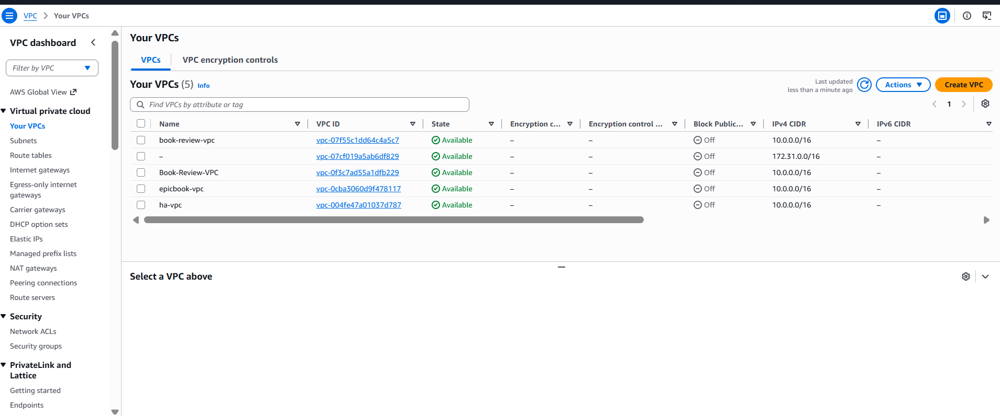
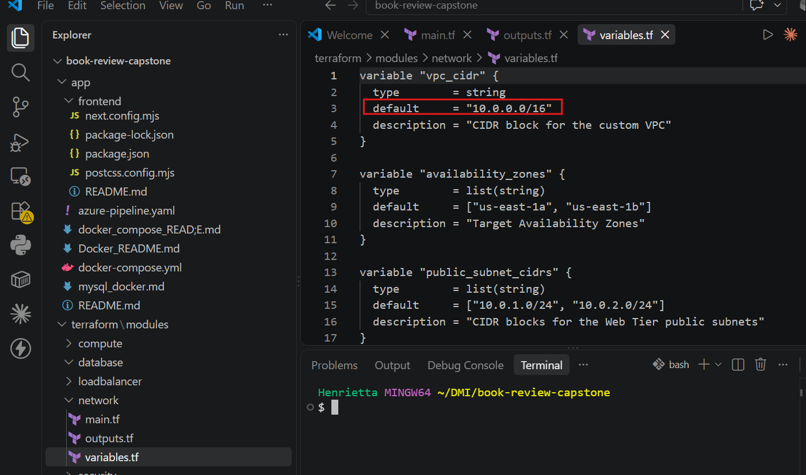

---

#### Screenshot 2 — Subnet list showing all six subnets, their tiers, CIDR ranges, and Availability Zones

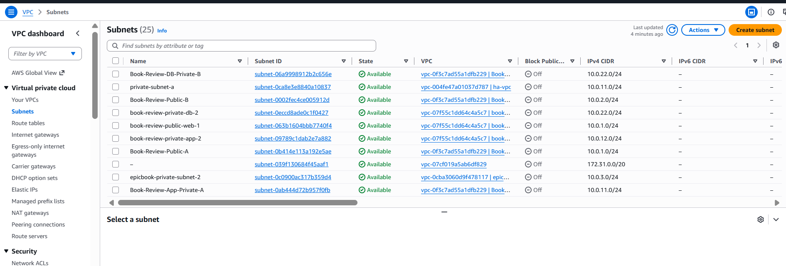
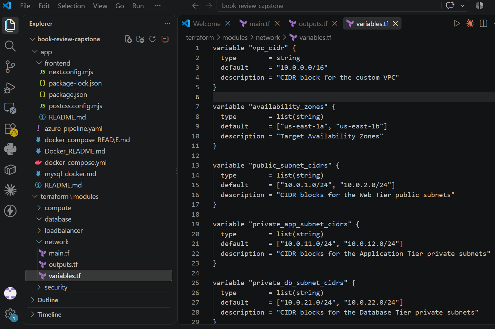

---

#### Screenshot 3 — Terraform plan or cloud networking view showing the required routing and tier isolation

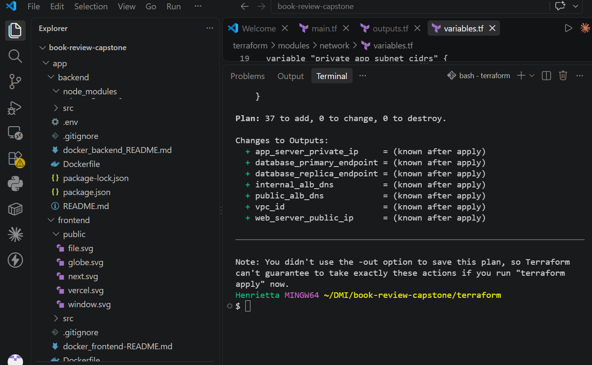

---

# Task 2 — Security Groups/NSGs and Load Balancers

## Goal

Configure tier-specific Security Groups/NSGs (Web Tier HTTP 80, App Tier 3001 only from Web Tier, Database Tier 3306 only from App Tier), and create a public load balancer for the frontend and an internal load balancer for the backend, all with Terraform.

### Evidence

#### Screenshot 4 — Web, App, and Database Security Group or NSG rules


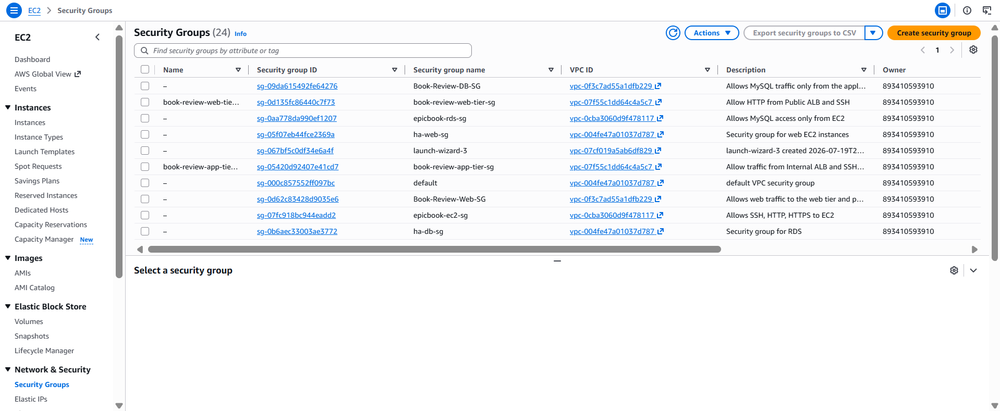

---

#### Screenshot 5 — Public frontend load balancer configuration


---

#### Screenshot 6 — Internal backend load balancer configuration

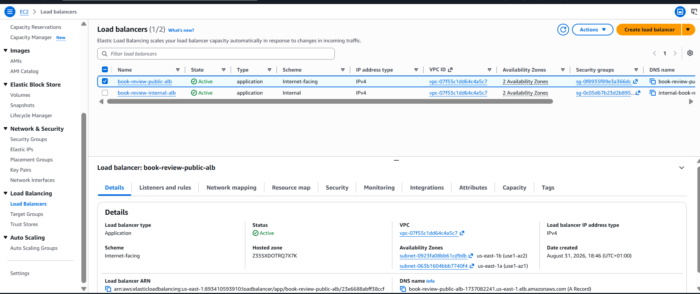

---

#### Screenshot 7 — Healthy frontend and backend targets or backend pools

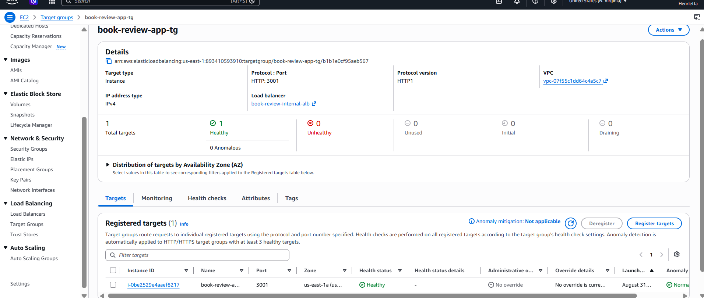
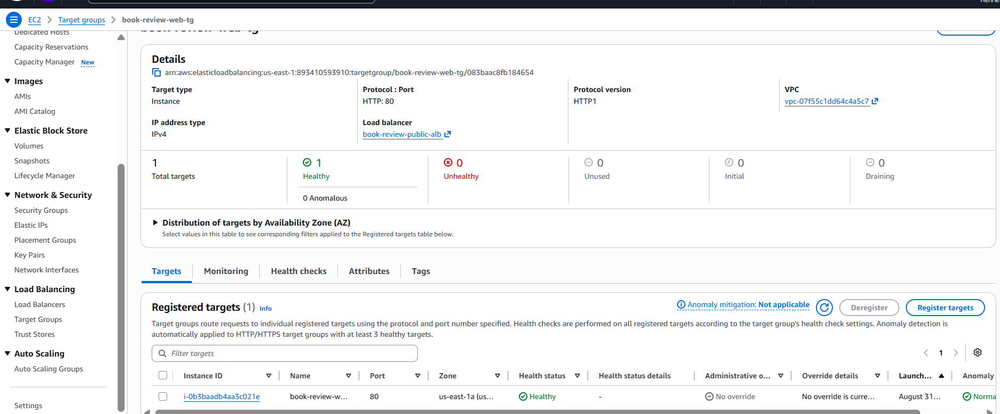

---

# Task 3 — VMs and Application Deployment

## Goal

Deploy the Next.js Web Tier behind Nginx on port 80 in the public subnets, and the Node.js App Tier on port 3001 in the private subnets (no Elastic IPs/Public IPs on private VMs), with the frontend reaching the backend through the internal load balancer.

### Evidence

#### Screenshot 8 — EC2 or Azure VM dashboard showing the frontend and backend VMs

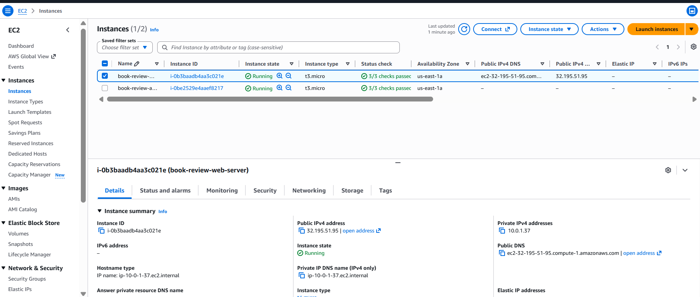
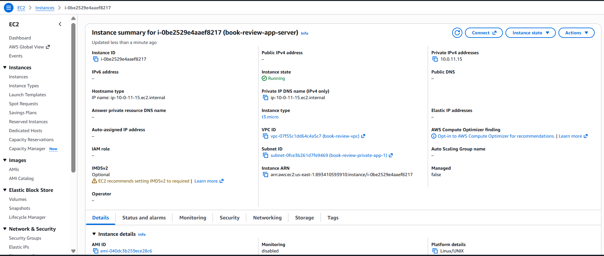

---

#### Screenshot 9 — Nginx status or frontend response on the Web Tier

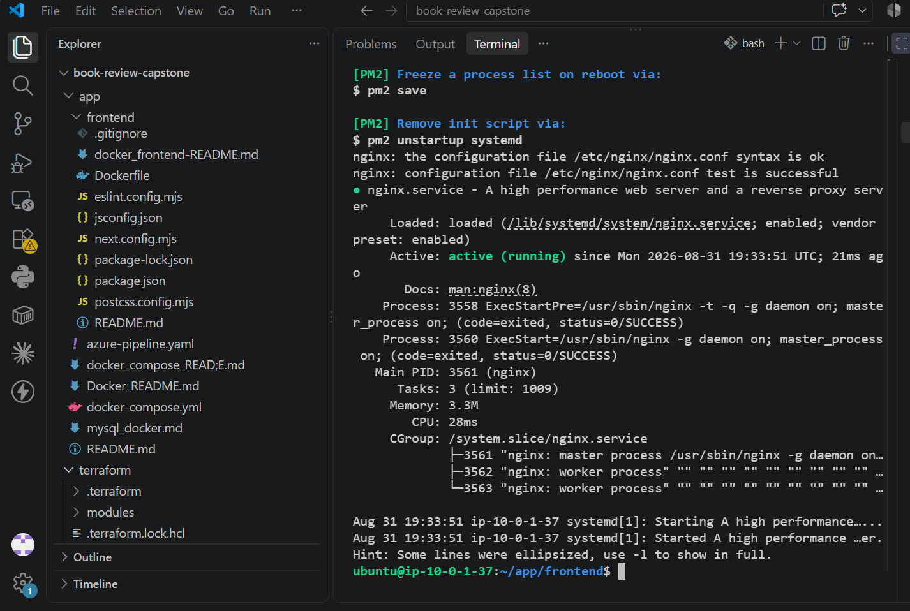

---

#### Screenshot 10 — Backend API response through the permitted internal path

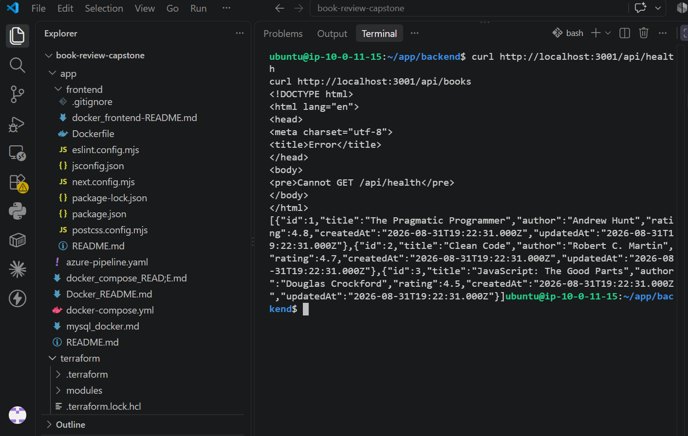

---

# Task 4 — MySQL Database Setup

## Goal

Deploy a private managed MySQL database (Amazon RDS Multi-AZ or Azure Database for MySQL Flexible Server) with a read replica, restricted to the App Tier on port 3306, and validate the Book Review App homepage, login, review flow, backend API, and database integration through the public load balancer.

### Evidence

#### Screenshot 11 — Amazon RDS or Azure Database dashboard showing the primary database and read replica

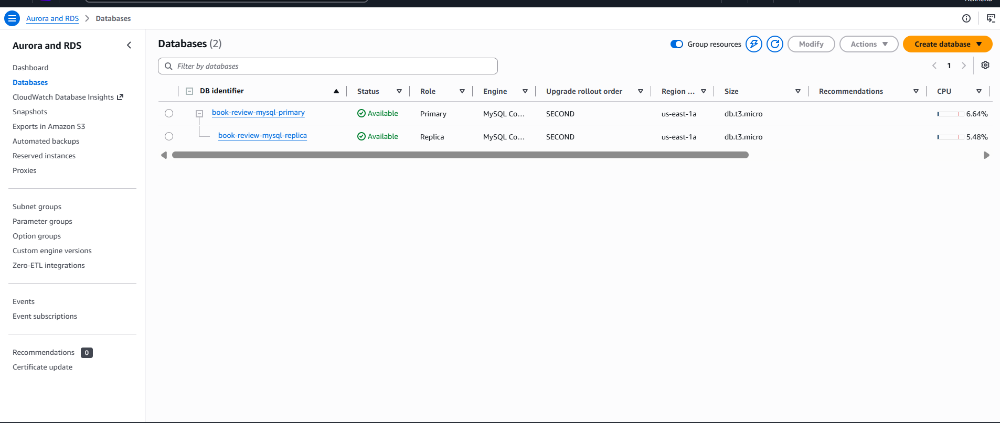

---

#### Screenshot 12 — Evidence of private database networking and permitted App Tier access

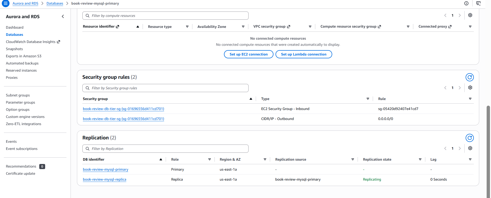

---

#### Screenshot 13 — Functional Book Review App homepage and login flow

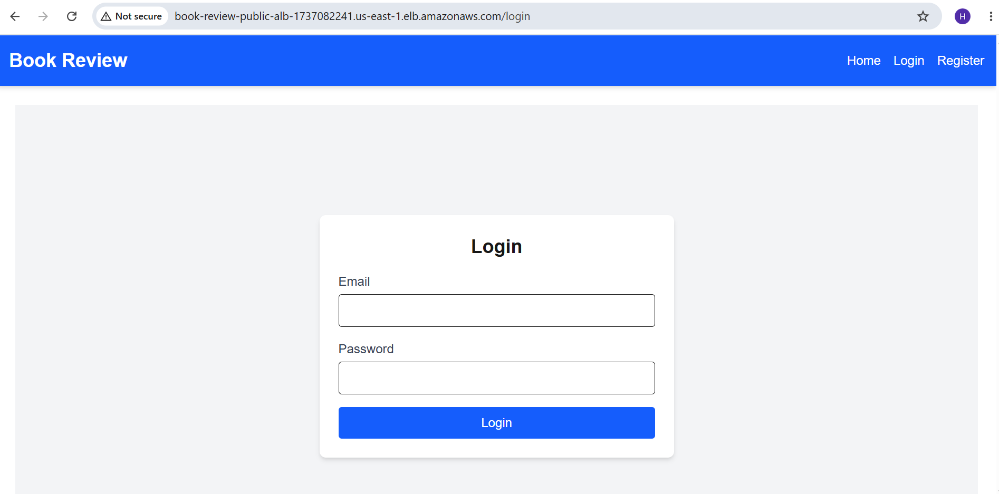

---

#### Screenshot 14 — Functional review flow with working backend API and database integration

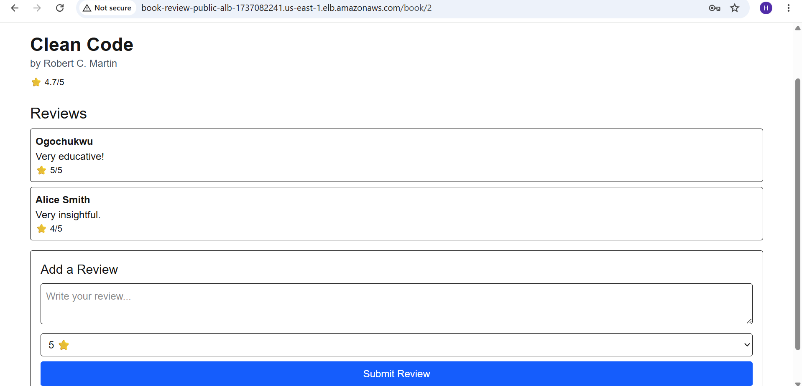

---

#### Screenshot 15 (optional) — Application logs or terminal output

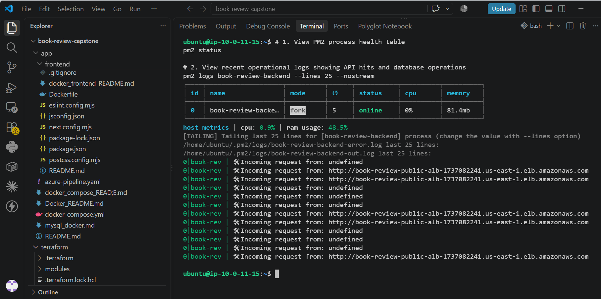

---

### Notes

Report the cloud platform used (AWS or Azure), your Terraform code structure (`main.tf`, `variables.tf`, `outputs.tf`, and supporting files), a link/description of your architecture diagram, and the Public Load Balancer DNS used to access the frontend.

**Cloud Platform Used**

* **Provider:** Amazon Web Services (AWS)
* **Target Region:** `us-east-1` (US East - N. Virginia)

---

**Terraform Code Structure**
The infrastructure is provisioned modularly using Terraform to manage the 3-tier architecture:

```text
terraform/
├── main.tf                 # Core orchestration: VPC, subnets, IGW, NAT GW, route tables, and instances
├── variables.tf            # Input parameters (VPC CIDR, instance types, DB credentials, key pair names)
├── outputs.tf              # Exported values (Public ALB DNS, Internal ALB DNS, RDS endpoints, instance IPs)
├── security_groups.tf      # Granular security groups for Public ALB, Web Tier, Internal ALB, App Tier, and RDS
├── alb.tf                  # Public Application Load Balancer and Internal Application Load Balancer configurations
├── rds.tf                  # Multi-AZ RDS MySQL instance, DB subnet group, and parameter groups
├── user_data_web.sh        # Startup script for Web Server (Node.js runtime, Nginx reverse proxy, PM2)
└── user_data_app.sh        # Startup script for App Server (Node.js runtime, PM2 backend configuration)

```

---

**Architecture Diagram Description**
The architecture implements a secure, highly available **3-Tier VPC Architecture**:

1. **Public Subnets (Web / Presentation Tier):**
* Hosts an internet-facing **Public Application Load Balancer (ALB)** distributing traffic to **Nginx Web/Frontend EC2 instances**.
* Nginx serves the Next.js frontend on port `3000` and reverse-proxies API requests (`/api/*`) internally.
* Outbound internet access is provided via an **Internet Gateway (IGW)** and a **NAT Gateway**.


2. **Private Application Subnets (Logic Tier):**
* Completely isolated from direct internet access.
* Houses an **Internal Application Load Balancer** and **Node.js/Express App EC2 instances** managed by PM2 on port `3001`.
* Security groups enforce that the App Tier only accepts traffic forwarded from the Web Tier / Internal ALB.


3. **Private Database Subnets (Data Tier):**
* Hosts an **Amazon RDS MySQL** database cluster deployed across multiple availability zones for automated failover.
* Strictly gated by ingress rules allowing port `3306` access only from the App Tier security group.


---

**Public Load Balancer DNS (Frontend Entry Point)**

* **Public ALB URL:** `[http://book-review-public-alb-1737082241.us-east-1.elb.amazonaws.com](http://book-review-public-alb-1737082241.us-east-1.elb.amazonaws.com)`

---

# LinkedIn Post (Required)

## Goal

Publish a LinkedIn post about what you achieved in this assignment, with public or "Anyone" visibility.

## Evidence

#### LinkedIn Post URL

Paste your LinkedIn post URL here:

`https://lnkd.in/p/enGSVNxy`

---

#### Screenshot 16 — Published LinkedIn post showing the text and at least one image or proof

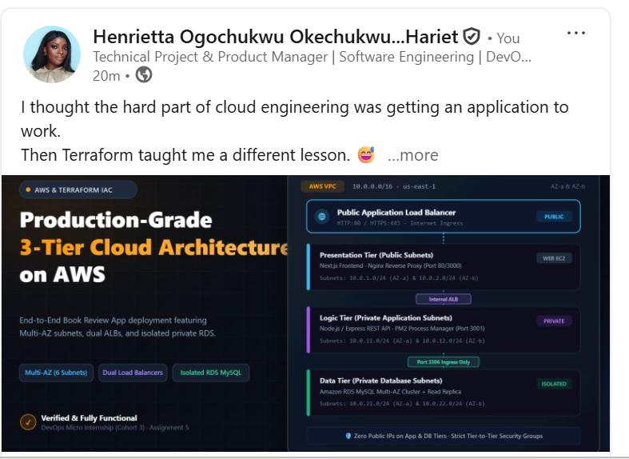

---

# Submission Instructions

- Add all required screenshots in your submission
- Include your architecture diagram and Public Load Balancer DNS
- Do not expose passwords, keys, tokens, database credentials, or Terraform state secrets

---

# Completion Checklist

- [ ] Task 1: Six-subnet VPC/VNet created across two AZs with Terraform (Screenshots 1–3)
- [ ] Task 2: Tier-specific security rules and load balancers configured (Screenshots 4–7)
- [ ] Task 3: Web and App Tier VMs deployed with correct public/private placement (Screenshots 8–10)
- [ ] Task 4: Private MySQL with read replica deployed and app validated end to end (Screenshots 11–15)
- [ ] Report completed: cloud platform, Terraform structure, diagram, LB DNS (Notes)
- [ ] LinkedIn post published and URL submitted (Screenshot 16)
- [ ] No sensitive data exposed

---

## 📌 About DMI & CloudAdvisory

DevOps Micro Internship (DMI) is a project-based DevOps program run by Pravin Mishra (The CloudAdvisory) focused on real-world execution, systems thinking, and career readiness.

It helps learners build strong DevOps foundations with hands-on experience.

---

## 📌 Resources

- 🌐 DMI Official Website: https://dmi.pravinmishra.com?utm_source=github&utm_medium=readme  
- 🎓 University: https://university.pravinmishra.com?utm_source=github&utm_medium=readme  
- 💬 Discord Community: https://discord.pravinmishra.com?utm_source=github&utm_medium=readme  
- 📝 Blog: https://dmi.pravinmishra.com/blog?utm_source=github&utm_medium=readme  
- ▶️ YouTube Playlist: https://www.youtube.com/playlist?list=PLFeSNDtI4Cho  
- 🔗 Pravin Mishra (LinkedIn): https://www.linkedin.com/in/pravin-mishra-aws-trainer/  
- 🏢 CloudAdvisory (LinkedIn): https://www.linkedin.com/company/thecloudadvisory/

---

*This submission is part of DevOps Micro Internship (DMI) Cohort 3 — Agentic AI Track.*
