# Assignment 02 — Provision Linux VMs with Terraform and Run Ansible Ad-Hoc Commands

Part of the DevOps Micro Internship (DMI) Cohort 3 with Agentic AI

---

## Purpose

In this assignment, you will use Terraform to provision three or four Ubuntu Linux Virtual Machines on either Microsoft Azure or Amazon Web Services.

You will configure SSH key-based authentication, organize the servers using a custom Ansible inventory, and run Ansible ad-hoc commands across individual hosts and inventory groups.

---

# Task 1 — Create the Multi-Host Lab Structure

## Goal

Create a separate project directory for the multi-host lab and prepare the Terraform, Ansible, and documentation files.

This project will use the Git repository and Ansible controller prepared in Assignment 01.

### Evidence

#### Screenshot 1 — Terminal showing the complete `ansible-adhoc-lab` project structure

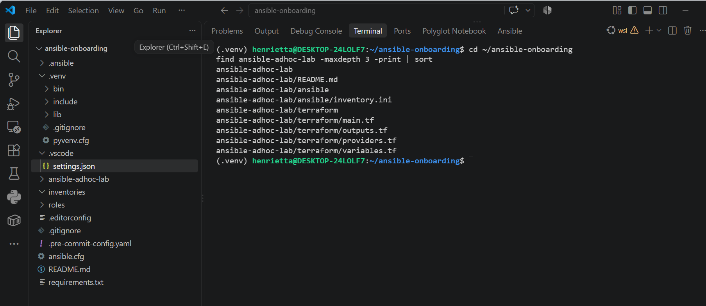

---

#### Screenshot 2 — Terminal showing `git status --short` with the new project files and updated `.gitignore`

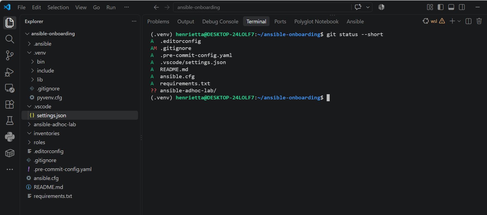

---

### Notes

Created the isolated `ansible-adhoc-lab` project directory inside the existing controller repository, cleanly separating infrastructure code (`terraform/`) from automation files (`ansible/`). Updated the root `.gitignore` with rules for `.terraform/`, `*.tfstate`, and `*.tfplan` to guarantee that local state files and sCreated an isolated ansible-adhoc-lab workspace within the existing ansible-onboarding repository, cleanly decoupling cloud infrastructure provisioning (terraform/) from configuration orchestration (ansible/). Updated the root .gitignore with rules for .terraform/, *.tfstate, and *.tfplan files to ensure that provider binaries, local state, and plan caches containing sensitive infrastructure details remain strictly excluded from version control.ensitive provider data are never tracked in Git.

---

# Task 2 — Create the Terraform Configuration

## Goal

Create the Terraform configuration required to provision three or four Ubuntu Linux VMs on your selected cloud platform.

Complete only one option:

- Option A — Microsoft Azure
- Option B — Amazon Web Services

Do not configure both providers for this assignment.

### Evidence

#### Screenshot 3 — Terraform configuration showing the three or four server roles and the `for_each` or `count` implementation

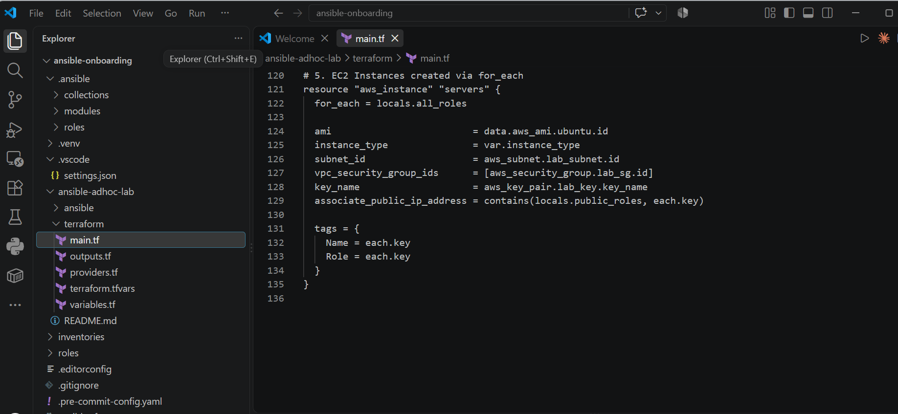

---

#### Screenshot 4 — Terraform configuration showing SSH restricted to the controller IP and HTTP allowed only for web hosts

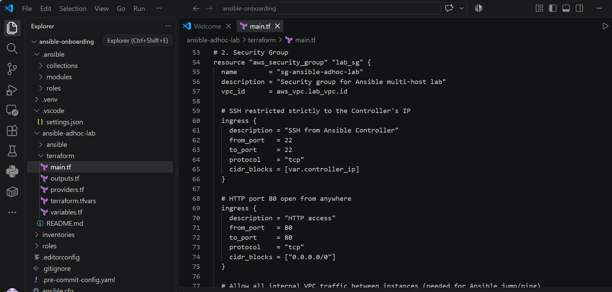

---

#### Screenshot 5 — Terraform output configuration showing how public IP addresses are associated with the server roles

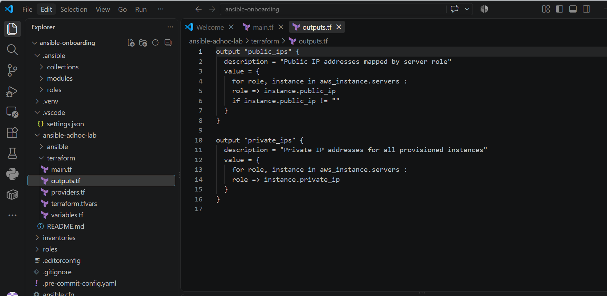

---

### Notes

Defined the infrastructure modular Terraform configuration for a three-VM fleet (web1, app1, db1) on AWS. Leveraged the for_each meta-argument across a role map to provision identical Ubuntu 22.04 LTS instances cleanly without repeating resource blocks, attaching the ED25519 public SSH key from Assignment 01. Hardened network security by restricting inbound SSH (port 22) strictly to the controller's /32 public IP CIDR, while configuring HTTP (port 80) access for the public-facing web tier.
---

# Task 3 — Provision the Infrastructure with Terraform

## Goal

Initialize and validate the Terraform configuration, review the execution plan, provision the selected three or four VMs, and retrieve their public IP addresses.

### Evidence

#### Screenshot 6 — Final `terraform apply` output showing `Apply complete`

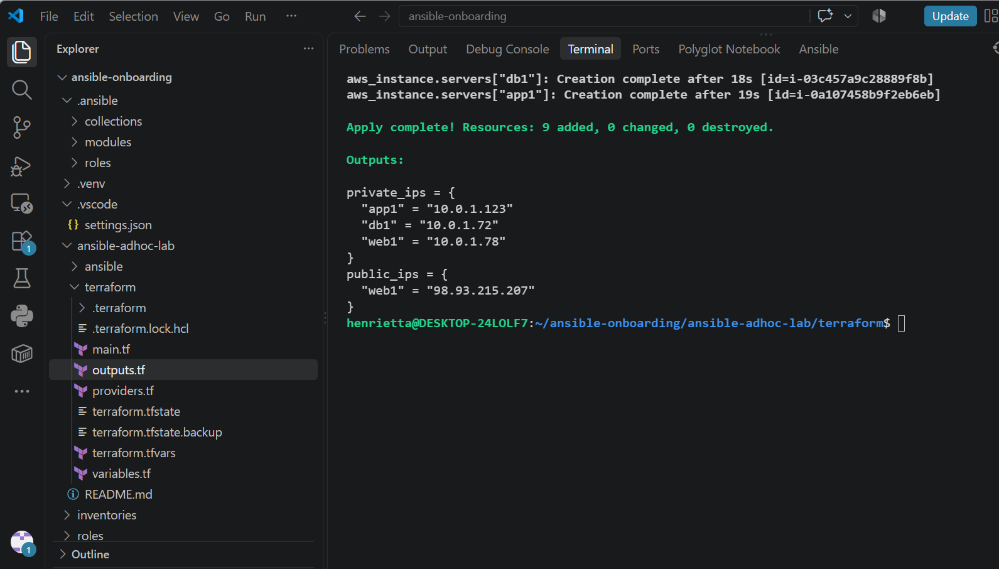

---

#### Screenshot 7 — `terraform output public_ips` showing the role-to-IP mapping for all three or four VMs

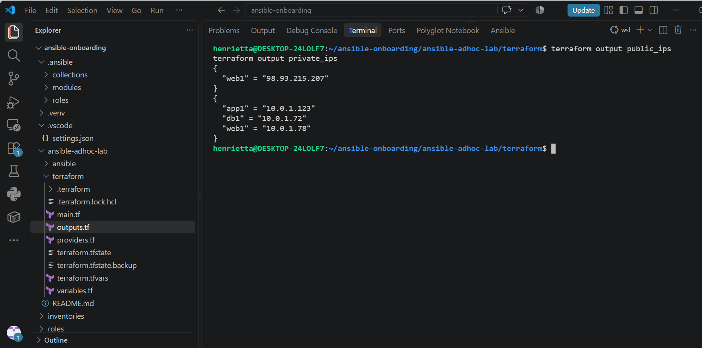

---

#### Screenshot 8 — Azure Portal or AWS Management Console showing all three or four VMs in the `Running` state, with their role-based names visible

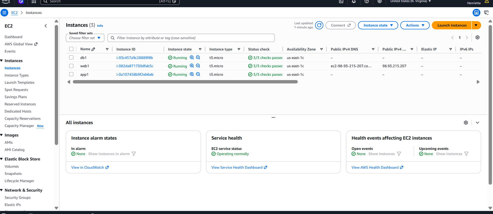

---

### Notes

Initialized the AWS provider, confirmed syntax integrity via terraform validate, and executed terraform apply to provision all 10 network and compute resources. Diagnosed and resolved a regional VpcLimitExceeded error by cleaning up stale VPCs in us-east-1, successfully spinning up the custom VPC, public subnet, internet gateway, route table, security group, and three active EC2 instances while exporting structured public and private IP map outputs for inventory consumption.
---

# Task 4 — Verify SSH Key-Based Access

## Goal

Verify that each managed VM can be accessed from the Ansible controller using SSH key-based authentication.

### Evidence

#### Screenshot 9 — Terminal showing successful SSH hostname output from all VMs

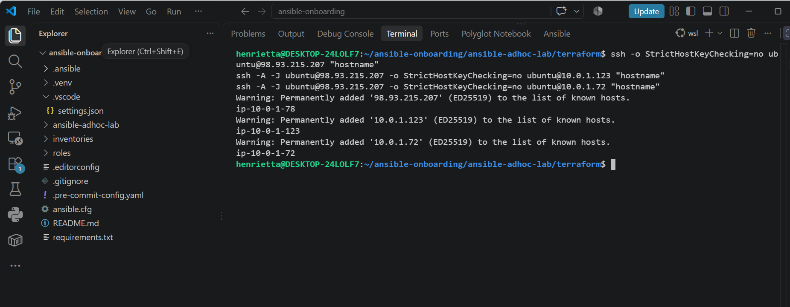

---

### Notes

Verified end-to-end passwordless SSH authentication across the entire three-node fleet using the active ED25519 key loaded into ssh-agent. Connected directly to the internet-facing web1 instance via its public IP, and successfully reached private backend nodes app1 (10.0.1.123) and db1 (10.0.1.72) through web1 using SSH ProxyJump (-J) with agent forwarding (-A), confirming that internal VPC routing and firewall rules operate correctly without exposing backend nodes publicly

---

# Task 5 — Create the Custom Ansible Inventory

## Goal

Create an Ansible inventory file that groups the managed VMs by role.

The inventory allows Ansible to run commands against all servers, or only specific groups such as `web`, `app`, or `db`.

### Evidence

#### Screenshot 10 — `inventory.ini` showing the `web`, `app`, and `db` groups

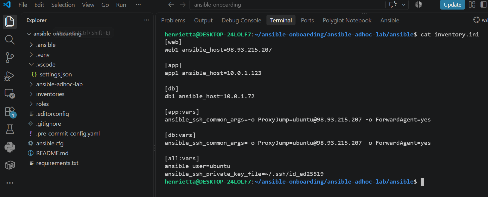

---

#### Screenshot 11 — Output of `ansible-inventory -i inventory.ini --graph`

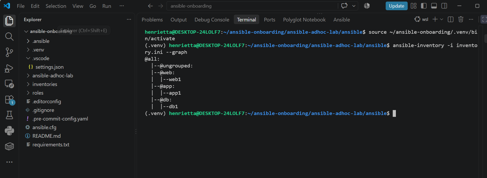

---

### Notes

Constructed a custom INI inventory file dividing the infrastructure into functional tiers (web, app, and db). Assigned the public IP to web1 for direct ingress and mapped internal VPC IPs to app1 and db1. Implemented ansible_ssh_common_args with ProxyJump and agent forwarding under group variables so Ansible seamlessly routes commands to private nodes via the public bastion host without storing SSH keys on remote instances.

---

# Task 6 — Run Ansible Ad-Hoc Commands

## Goal

Run Ansible ad-hoc commands from the controller to verify connectivity, check server information, and manage packages and services across inventory groups.

This task proves that the inventory is working and that Ansible can control multiple managed VMs without writing a playbook.

### Evidence

#### Screenshot 12 — Output of `ansible all -i inventory.ini -m ping`

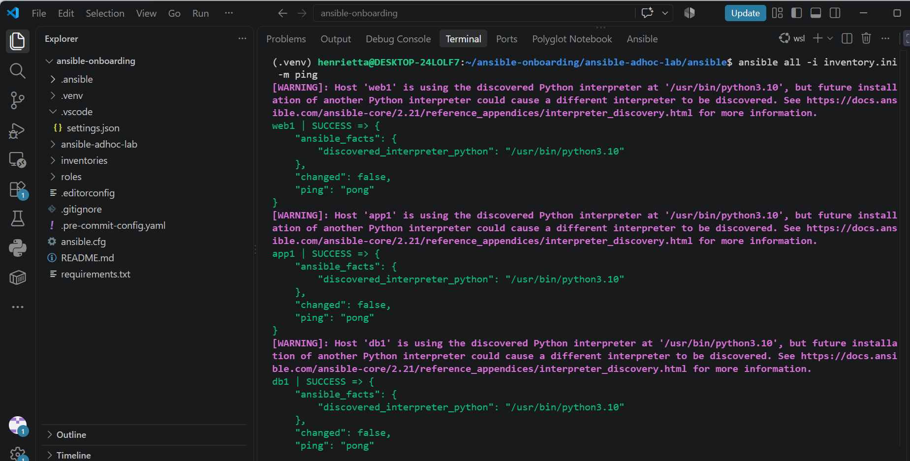

---

#### Screenshot 13 — Output of `ansible all -i inventory.ini -m command -a "uptime"`

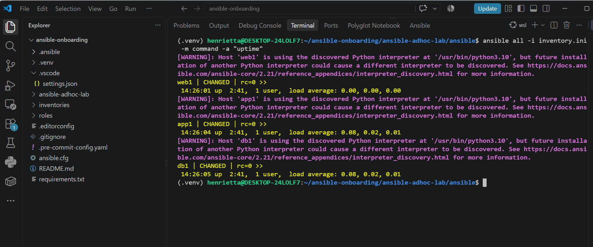

---

#### Screenshot 14 — Output of `ansible web -i inventory.ini -m apt -a "name=nginx state=present update_cache=yes" --become`

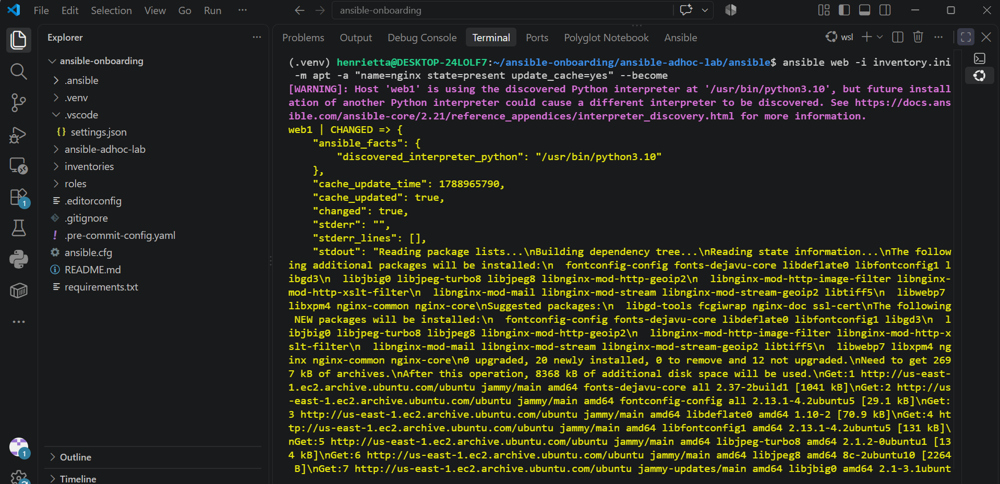

---

#### Screenshot 15 — Output of `ansible web -i inventory.ini -m service -a "name=nginx state=started enabled=yes" --become`

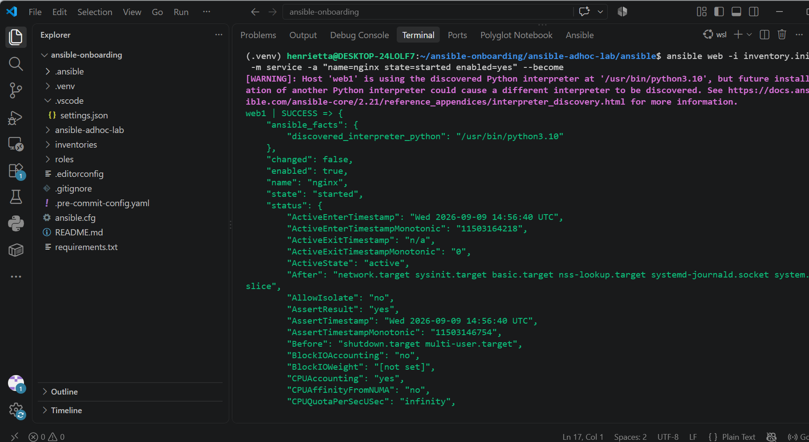

---

#### Screenshot 16 — Output of `ansible all -i inventory.ini -m apt -a "name=htop state=present update_cache=yes" --become`

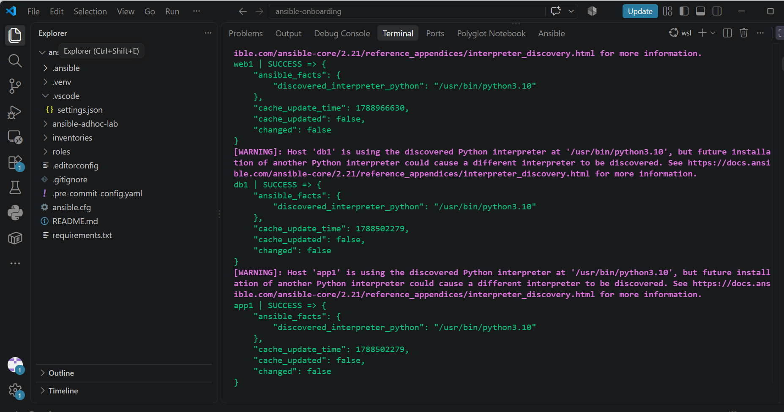

---

#### Screenshot 17 — Output of `ansible web -i inventory.ini -m command -a "systemctl is-active nginx"`

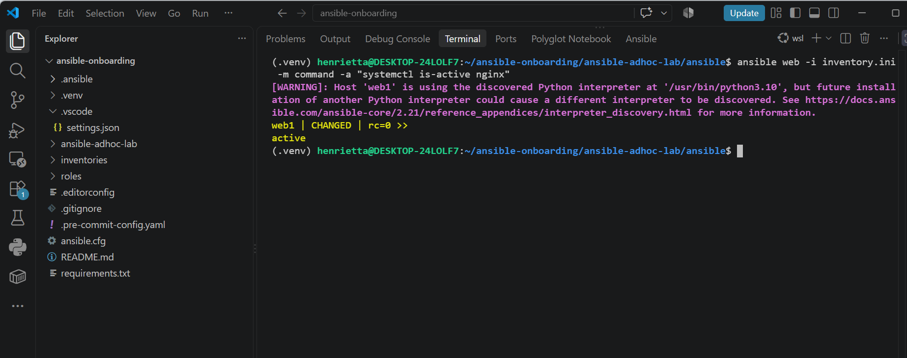

---

### Notes

Executed Ansible ad-hoc commands across target inventory tiers to validate connectivity, retrieve telemetry, and orchestrate package lifecycles without playbooks. Leveraged the ping module to verify controller-to-host execution environments, gathered fleet health via the command module, and applied privilege escalation (--become) with the apt and service modules to install, start, and verify Nginx exclusively on the web tier while deploying administrative monitoring tooling (htop) fleet-wide.

---

# LinkedIn Post Required

## Evidence

#### LinkedIn Post URL

Paste your LinkedIn post URL here:

`https://lnkd.in/p/eZvbGmYd`

---

#### Screenshot — Published LinkedIn post

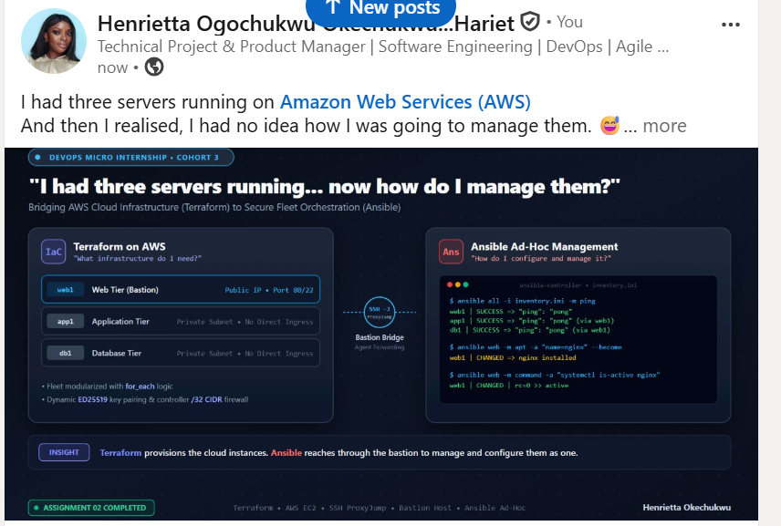

---

# Assignment Questions

Answer the following in your own words:

**1. What is the purpose of an Ansible inventory file?**

An Ansible inventory file defines and organizes the target managed infrastructure that Ansible automates. It maps human-readable host aliases to network identifiers (IP addresses or DNS hostnames), groups hosts into logical tiers based on operational roles (e.g., web, app, db), and stores connection metadata—such as SSH users, private key locations, and proxy jump instructions—so commands can be targeted accurately across the fleet.

---

**2. What is the difference between the `web`, `app`, and `db` groups in your inventory?**

The groups separate servers by their architectural role and network accessibility. The web group contains internet-facing nodes configured with public IPs and open HTTP ingress to serve end-user traffic. The app and db groups represent internal backend tiers assigned only private subnet IPs; they are shielded from direct internet access and require SSH bastion routing (ProxyJump) through the web instance for administrative operations.

---

**3. What does the Ansible `ping` module verify?**

The Ansible ping module is not an ICMP network ping. It validates end-to-end management readiness by establishing an authenticated SSH connection to the remote host, verifying the presence of a supported Python runtime environment, executing a lightweight test module, and confirming a return payload of "ping": "pong".

---

**4. Why do package installation commands require `--become`?**

Package managers such as apt interact with protected operating system directories (/var/lib/dpkg/, /etc/, /usr/bin/) and require root privileges to install software and update repository metadata. The --become flag activates privilege escalation (standard sudo), allowing the default non-root SSH user (ubuntu) to run administrative package tasks.

---

**5. When would you use an ad-hoc command instead of a playbook?**

Ad-hoc commands are best suited for rapid, one-off operational tasks, quick troubleshooting, or instant fleet-wide queries—such as verifying service status, checking disk/memory usage, running reboots, or executing quick connectivity checks. Structured Ansible playbooks are preferred when orchestrating multi-step, repeatable, version-controlled deployments and long-term configuration management.

---

**6. What is one challenge you faced while setting up SSH or inventory, and how did you fix it?**

During initial SSH verification, connections to the public instance timed out due to a dynamic change in the local workstation's public IP, which caused packets to be dropped by the security group. This was resolved by re-querying the controller's current IP address, updating terraform.tfvars, and running terraform apply -auto-approve to update the inbound port 22 firewall rule without disrupting the running virtual machines.

---

# Required Files

Confirm that the following files are included in your assignment workspace:

- [ ] `ansible-adhoc-lab/README.md`
- [ ] `ansible-adhoc-lab/terraform/providers.tf`
- [ ] `ansible-adhoc-lab/terraform/main.tf`
- [ ] `ansible-adhoc-lab/terraform/variables.tf`
- [ ] `ansible-adhoc-lab/terraform/outputs.tf`
- [ ] `ansible-adhoc-lab/ansible/inventory.ini`
- [ ] Updated `.gitignore`

---

# Submission Instructions

- Add all required screenshots from the tasks.
- Full Name must be visible in required screenshots.
- Mention whether you used Azure or AWS.
- Mention whether you used the three-VM option or four-VM option.
- Add the public IP addresses of the VMs, redacted if preferred.
- Add your `inventory.ini` proof.
- Add a short explanation of what you learned.
- Answer all assignment questions clearly in your own words.
- Add your LinkedIn post URL.
- Do not expose SSH private keys, Terraform state files, cloud credentials, passwords, access keys, secret keys, account IDs, or subscription IDs.
- Submit only one Google Doc link.

---

# Completion Checklist

- [ ] Task 1: `ansible-adhoc-lab` project structure created
- [ ] Task 1: `.gitignore` updated for Terraform files
- [ ] Task 2: Terraform configuration created
- [ ] Task 2: Server roles defined for either three or four VMs
- [ ] Task 2: `count` or `for_each` used
- [ ] Task 2: SSH restricted to the controller public IP
- [ ] Task 2: HTTP allowed only for web hosts
- [ ] Task 2: Terraform output maps roles to public IPs
- [ ] Task 3: Terraform initialized successfully
- [ ] Task 3: Terraform configuration validated
- [ ] Task 3: Terraform apply completed successfully
- [ ] Task 3: All selected VMs are running
- [ ] Task 4: SSH key-based access works for every VM
- [ ] Task 5: `inventory.ini` contains `web`, `app`, and `db` groups
- [ ] Task 5: `ansible-inventory -i inventory.ini --graph` shows the correct groups
- [ ] Task 6: `ansible all -i inventory.ini -m ping` returns `SUCCESS`
- [ ] Task 6: Ad-hoc commands run successfully
- [ ] Task 6: `--become` was used for package and service tasks
- [ ] Task 6: Nginx is active on the `web` group
- [ ] Screenshots 1–17 are included
- [ ] Assignment questions are answered
- [ ] LinkedIn post published
- [ ] LinkedIn post URL added
- [ ] No sensitive information is exposed
- [ ] Google Doc is accessible

---

## About DMI & CloudAdvisory

DevOps Micro Internship (DMI) is a project-based DevOps program run by Pravin Mishra and The CloudAdvisory, focused on real-world execution, systems thinking, and career readiness.

It helps learners build strong DevOps foundations with hands-on experience.

---

## Resources

- DMI Official Website: [https://dmi.pravinmishra.com?utm_source=github&utm_medium=readme](https://dmi.pravinmishra.com?utm_source=github&utm_medium=readme)
- University: [https://university.pravinmishra.com?utm_source=github&utm_medium=readme](https://university.pravinmishra.com?utm_source=github&utm_medium=readme)
- Discord Community: [https://discord.pravinmishra.com?utm_source=github&utm_medium=readme](https://discord.pravinmishra.com?utm_source=github&utm_medium=readme)
- Blog: [https://dmi.pravinmishra.com/blog?utm_source=github&utm_medium=readme](https://dmi.pravinmishra.com/blog?utm_source=github&utm_medium=readme)
- YouTube Playlist: [https://www.youtube.com/playlist?list=PLFeSNDtI4Cho](https://www.youtube.com/playlist?list=PLFeSNDtI4Cho)
- Pravin Mishra LinkedIn: [https://www.linkedin.com/in/pravin-mishra-aws-trainer/](https://www.linkedin.com/in/pravin-mishra-aws-trainer/)
- CloudAdvisory LinkedIn: [https://www.linkedin.com/company/thecloudadvisory/](https://www.linkedin.com/company/thecloudadvisory/)

---

*This submission is part of DevOps Micro Internship (DMI) Cohort 3 — Agentic AI Track.*