# Assignment 04 — Deploy Mini Finance on AWS Using Terraform and Ansible

Part of the DevOps Micro Internship (DMI) Cohort 3 with Agentic AI

---

## Purpose

In this assignment, you will provision Azure infrastructure using Terraform and deploy the Mini Finance website using an Ansible multi-play playbook.

Terraform will create the Azure Virtual Machine and networking resources. Ansible will install Nginx, clone the Mini Finance repository, deploy the website, and verify the deployment.

---

# Task 1 — Create the Project Structure

## Goal

Create separate directories and files for the Terraform infrastructure and Ansible configuration.

### Evidence

#### Screenshot 1 — Terminal or VS Code showing the complete `mini-finance` project structure

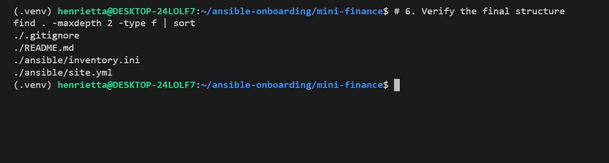

---

### Notes

Created the standardized project directory layout separating infrastructure from configuration management: mini-finance/terraform for AWS infrastructure definition and mini-finance/ansible for playbook delivery. Initialized .gitignore to safeguard against committing Terraform state files (.tfstate), plan files, and private credentials.

---

# Task 2 — Create the AWS Infrastructure Using Terraform

## Goal

Use Terraform to provision an Ubuntu Virtual Machine with the required Azure networking and security resources.

### Evidence

#### Screenshot 2 — Terraform code showing the `Allow-SSH` rule for port `22` and the `Allow-HTTP` rule for port `80`

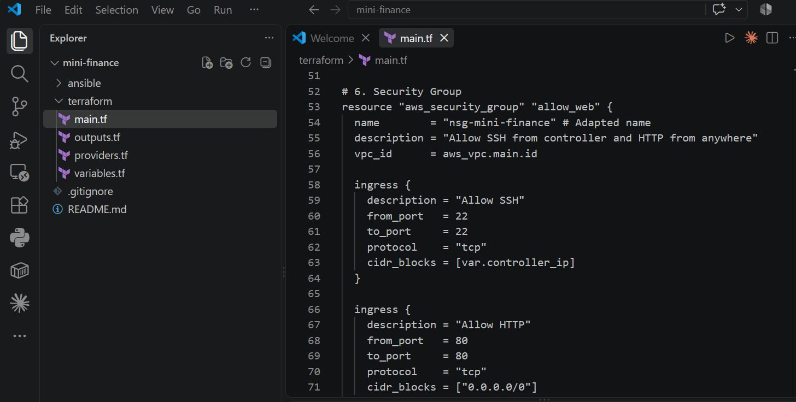

---

#### Screenshot 3 — Terraform code showing the association between `nsg-mini-finance` and `nic-mini-finance`


---

### Notes

Declared AWS resources including a custom VPC (10.0.0.0/16), public subnet (10.0.1.0/24), Internet Gateway, route table, and security group. The security group strictly restricts inbound SSH (port 22) to the controller's /32 IP (105.112.106.91/32), while leaving HTTP (port 80) open to 0.0.0.0/0 for web traffic. Associated the security group directly with the t3.micro EC2 instance.

---

# Task 3 — Initialize and Apply the Terraform Configuration

## Goal

Format and validate the Terraform configuration, review the execution plan, and provision the Azure infrastructure.

### Evidence

#### Screenshot 4 — End of the `terraform apply` output showing `Apply complete!` with no errors

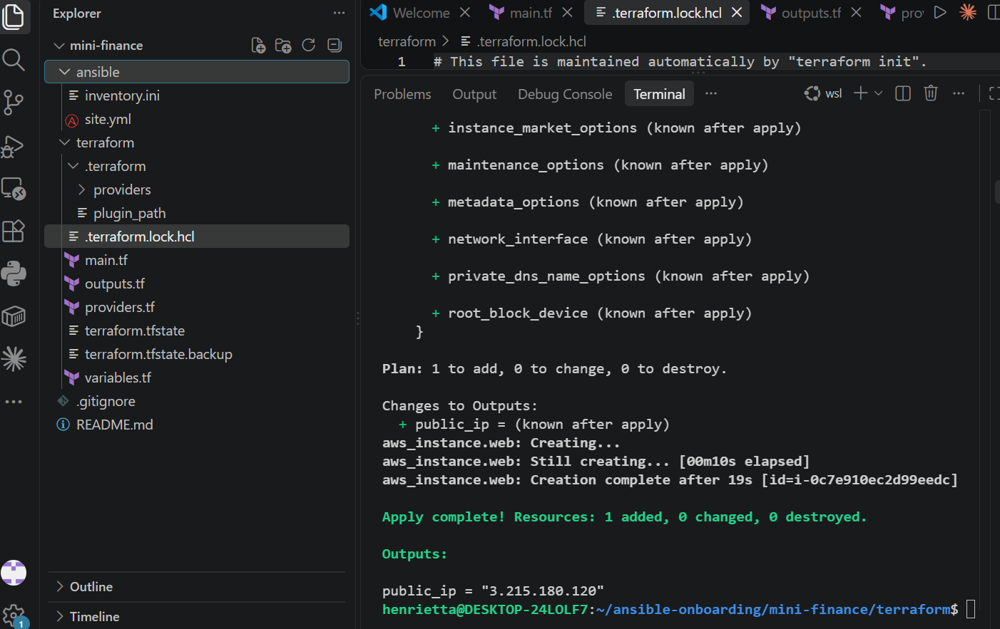

---

#### Screenshot 5 — Output of `terraform output public_ip` showing the VM’s public IP address

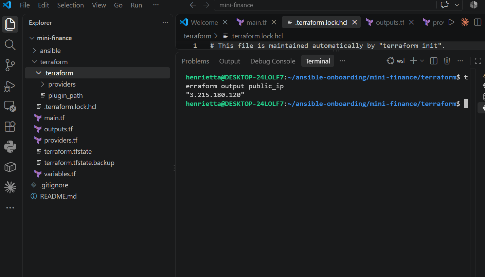

---

### Notes

Initialized the working directory by linking the local HashiCorp AWS provider cache (v5.100.0) and lock file to resolve upstream registry timeout issues in WSL. Successfully ran terraform apply to provision the 8 core infrastructure resources, outputting the instance's public IP (3.215.180.120).

---

# Task 4 — Verify Passwordless SSH Access

## Goal

Confirm that the Ansible controller can connect to the Terraform-provisioned Azure VM using SSH key authentication.

### Evidence

#### Screenshot 6 — Passwordless SSH command and the returned `mini-finance` hostname

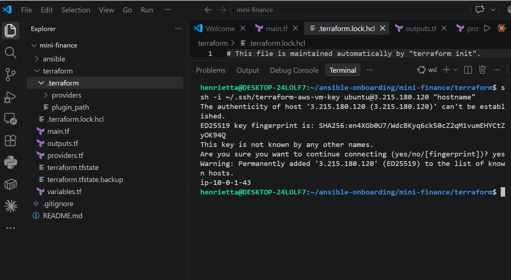

---

### Notes

Verified passwordless SSH access directly from the controller to the EC2 host using the matching private key ~/.ssh/terraform-aws-vm-key under the default ubuntu user. The remote host responded with its configured hostname without requesting password authentication.

---

# Task 5 — Create the Ansible Inventory and Verify Connectivity

## Goal

Add the Terraform-provisioned Azure VM to the Ansible inventory and confirm that Ansible can connect to it.

### Evidence

#### Screenshot 7 — Ansible ping output showing `SUCCESS` and `pong` from the Azure VM

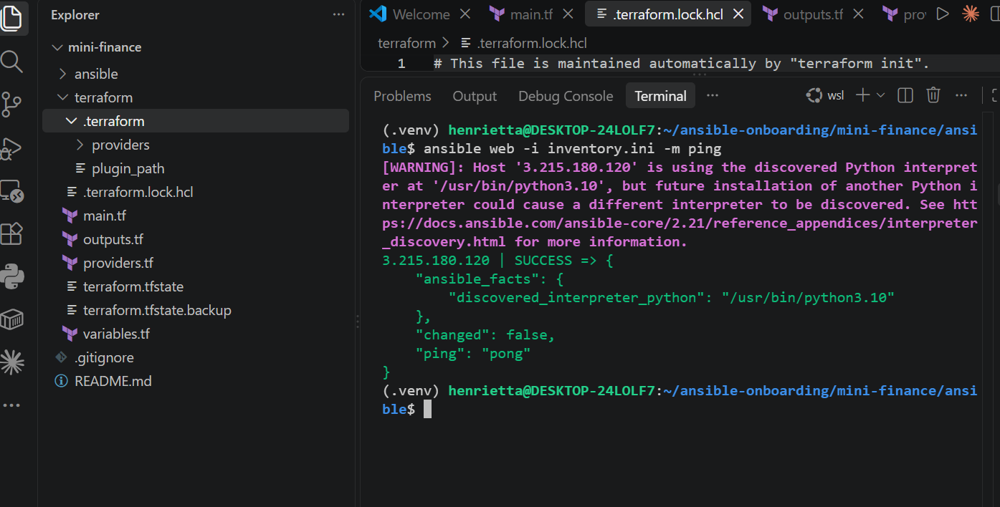

---

### Configuration File

Copy and paste the complete contents of your `ansible/inventory.ini` file below:

```ini
[web]
3.215.180.120

[web:vars]
ansible_user=ubuntu
ansible_ssh_private_key_file=~/.ssh/terraform-aws-vm-key

```

Configured inventory.ini mapping the web host group to public IP 3.215.180.120, setting ansible_user=ubuntu and specifying the private key path. Validated end-to-end controller-to-managed-node connectivity using ansible web -i inventory.ini -m ping, returning SUCCESS and "ping": "pong".

---

# Task 6 — Create the Multi-Play Ansible Playbook

## Goal

Create one Ansible playbook containing separate plays to install Nginx, deploy the Mini Finance website, and verify the deployment.

### Evidence

#### Screenshot 8 — `site.yml` showing Play 1 and the beginning of Play 2

Screenshot must show:

- Play 1 targeting the `web` group
- Installation of `nginx`, `git`, and `rsync`
- Nginx service configured as started and enabled
- Beginning of Play 2 with the Git repository URL and synchronization task

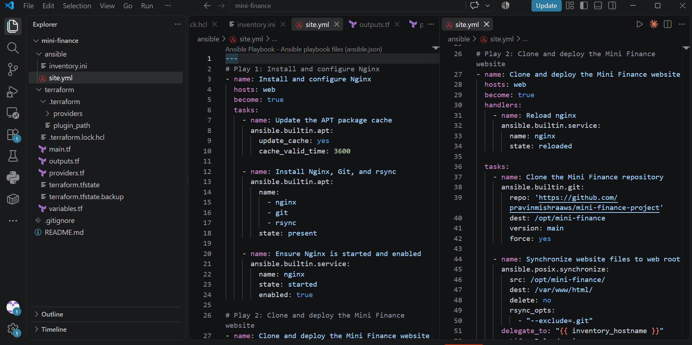

---

#### Screenshot 9 — `site.yml` showing the deployment destination, handler, and Play 3 verification

Screenshot must show:

- Website destination `/var/www/html/`
- Ownership set to `www-data:www-data`
- Nginx reload handler
- Play 3 targeting `localhost`
- The `uri` verification and `assert` condition

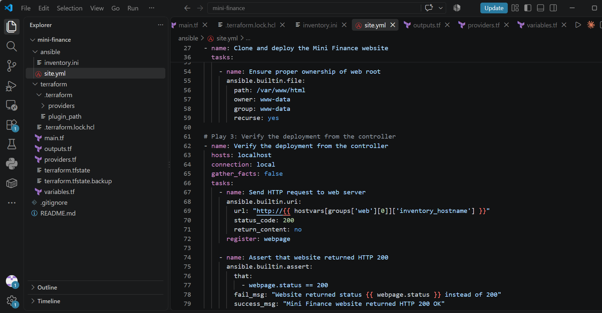

---

### Configuration File

Copy and paste the complete contents of your `ansible/site.yml` file below:

```yaml
---
# Play 1: Install and configure Nginx
- name: Install and configure Nginx
  hosts: web
  become: true
  tasks:
    - name: Update the APT package cache
      ansible.builtin.apt:
        update_cache: yes
        cache_valid_time: 3600

    - name: Install Nginx, Git, and rsync
      ansible.builtin.apt:
        name:
          - nginx
          - git
          - rsync
        state: present

    - name: Ensure Nginx is started and enabled
      ansible.builtin.service:
        name: nginx
        state: started
        enabled: true

# Play 2: Clone and deploy the Mini Finance website
- name: Clone and deploy the Mini Finance website
  hosts: web
  become: true
  handlers:
    - name: Reload nginx
      ansible.builtin.service:
        name: nginx
        state: reloaded

  tasks:
    - name: Clone the Mini Finance repository
      ansible.builtin.git:
        repo: 'https://github.com/pravinmishraaws/mini-finance-project'
        dest: /opt/mini-finance
        version: main
        force: yes

    - name: Synchronize website files to web root
      ansible.posix.synchronize:
        src: /opt/mini-finance/
        dest: /var/www/html/
        delete: no
        rsync_opts:
          - "--exclude=.git"
      delegate_to: "{{ inventory_hostname }}"
      notify: Reload nginx

    - name: Ensure proper ownership of web root
      ansible.builtin.file:
        path: /var/www/html
        owner: www-data
        group: www-data
        recurse: yes

# Play 3: Verify the deployment from the controller
- name: Verify the deployment from the controller
  hosts: localhost
  connection: local
  gather_facts: false
  tasks:
    - name: Send HTTP request to web server
      ansible.builtin.uri:
        url: "http://{{ hostvars[groups['web'][0]]['inventory_hostname'] }}"
        status_code: 200
        return_content: no
      register: webpage

    - name: Assert that website returned HTTP 200
      ansible.builtin.assert:
        that:
          - webpage.status == 200
        fail_msg: "Website returned status {{ webpage.status }} instead of 200"
        success_msg: "Mini Finance website returned HTTP 200 OK"
```
Note
Structured site.yml into three logically isolated plays: host dependency installation (nginx, git, rsync), application deployment via ansible.builtin.git and ansible.posix.synchronize tied to an event-driven Reload nginx handler, and controller-side HTTP verification using ansible.builtin.uri and ansible.builtin.assert.
---

# Task 7 — Validate and Run the Ansible Playbook

## Goal

Validate the syntax of the multi-play Ansible playbook and run it to install Nginx, deploy the Mini Finance website, and verify the deployment.

### Evidence

#### Screenshot 10 — Successful playbook syntax check showing `playbook: site.yml`

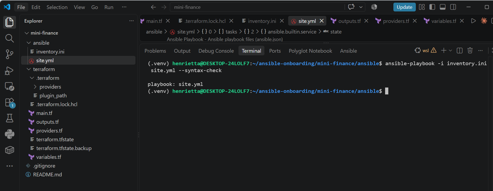

---

#### Screenshot 11 — Play 3 output showing the successful HTTP verification and assertion

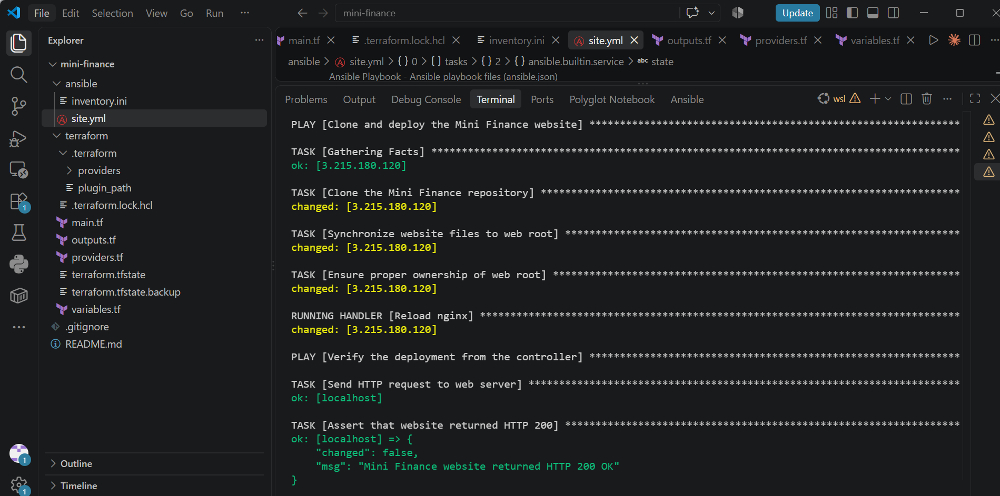

---

#### Screenshot 12 — Final `PLAY RECAP` showing `failed=0` and `unreachable=0`

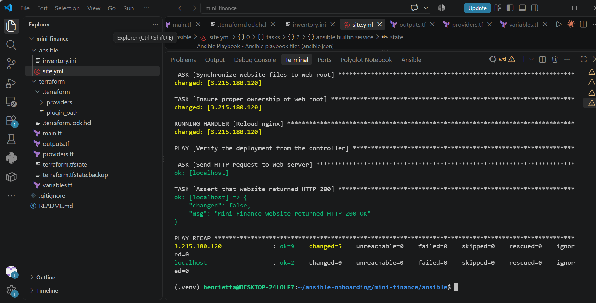

---

### Notes

Passed the playbook syntax check with ansible-playbook -i inventory.ini site.yml --syntax-check. Executed the full deployment playbook against managed host 3.215.180.120. Play 3 confirmed an HTTP 200 OK response from the web server, and the play recap finished cleanly with failed=0 and unreachable=0.

Task 8 Notes

---

# Task 8 — Test the Mini Finance Website in a Browser

## Goal

Confirm that the Mini Finance website is publicly accessible through the Azure VM’s public IP address.

### Evidence

#### Screenshot 13 — Mini Finance website successfully loading in the browser, with the Azure VM’s public IP address visible in the address bar

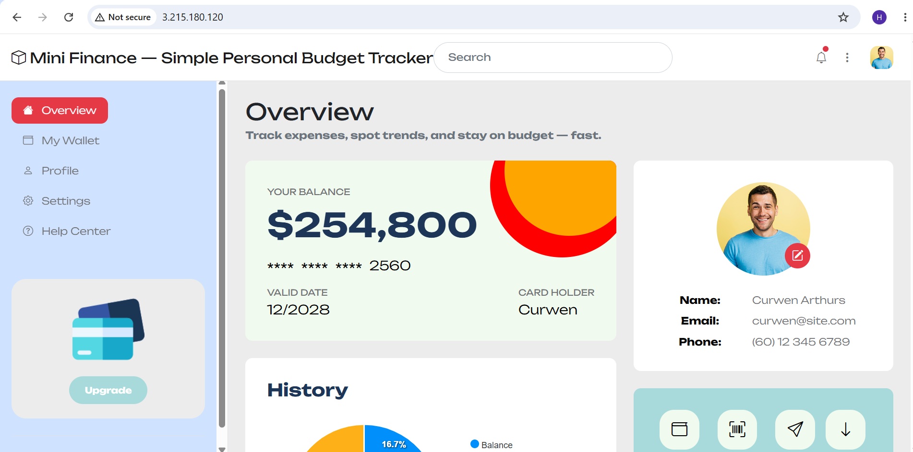

---

### Website URL

Add your deployed website URL below:

```text
http://3.215.180.120
```

Tested the public instance IP [http://3.215.180.120](http://3.215.180.120) in the browser, confirming that Nginx serves the Mini Finance landing page with full CSS and image assets loaded over port 80.
---

# Task 9 — Create the Project README

## Goal

Create a `README.md` file to document the Mini Finance infrastructure and deployment project.

### Evidence

#### Screenshot 14 — Completed `README.md` displayed in the VS Code Markdown preview or terminal

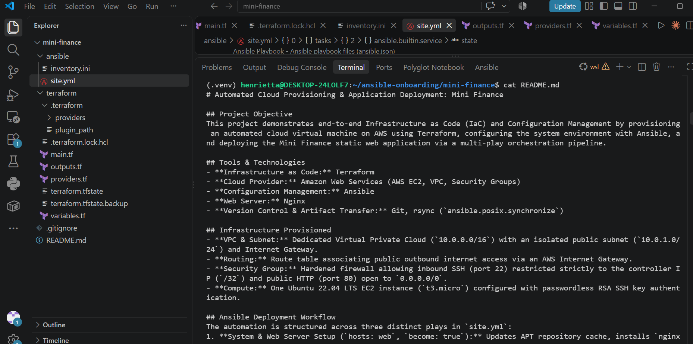
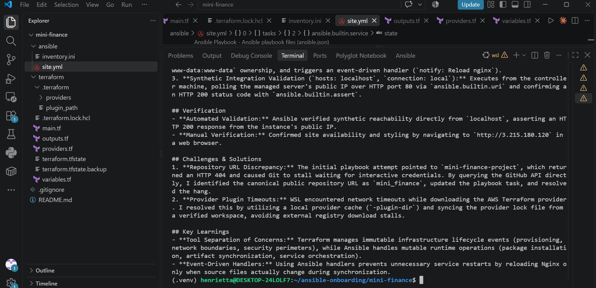

---

### README Content

Copy and paste the complete contents of your `README.md` file below:

```markdown
# Automated Cloud Provisioning & Application Deployment: Mini Finance

## Project Objective
This project demonstrates end-to-end Infrastructure as Code (IaC) and Configuration Management by provisioning an automated cloud virtual machine on AWS using Terraform, configuring the system environment with Ansible, and deploying the Mini Finance static web application via a multi-play orchestration pipeline.

## Tools & Technologies
- **Infrastructure as Code:** Terraform
- **Cloud Provider:** Amazon Web Services (AWS EC2, VPC, Security Groups)
- **Configuration Management:** Ansible
- **Web Server:** Nginx
- **Version Control & Artifact Transfer:** Git, rsync (`ansible.posix.synchronize`)

## Infrastructure Provisioned
- **VPC & Subnet:** Dedicated Virtual Private Cloud (`10.0.0.0/16`) with an isolated public subnet (`10.0.1.0/24`) and Internet Gateway.
- **Routing:** Route table associating public outbound internet access via an AWS Internet Gateway.
- **Security Group:** Hardened firewall allowing inbound SSH (port 22) restricted strictly to the controller IP (`/32`) and public HTTP (port 80) open to `0.0.0.0/0`.
- **Compute:** One Ubuntu 22.04 LTS EC2 instance (`t3.micro`) configured with passwordless RSA SSH key authentication.

## Ansible Deployment Workflow
The automation is structured across three distinct plays in `site.yml`:
1. **System & Web Server Setup (`hosts: web`, `become: true`):** Updates APT repository cache, installs `nginx`, `git`, and `rsync`, and enables the Nginx daemon on boot.
2. **Application Delivery & Handler Execution (`hosts: web`, `become: true`):** Clones the source repository from GitHub into `/opt/mini-finance`, synchronizes web assets to `/var/www/html` excluding VCS files, ensures `www-data:www-data` ownership, and triggers an event-driven handler (`notify: Reload nginx`).
3. **Synthetic Integration Validation (`hosts: localhost`, `connection: local`):** Executes from the controller machine, polling the managed server's public IP over HTTP port 80 via `ansible.builtin.uri` and confirming an HTTP 200 status code with `ansible.builtin.assert`.

## Verification
- **Automated Validation:** Ansible verified synthetic reachability directly from `localhost`, asserting an HTTP 200 response from the instance's public IP.
- **Manual Verification:** Confirmed site availability and styling by navigating to `http://3.215.180.120` in a web browser.

## Challenges & Solutions
1. **Repository URL Discrepancy:** The initial playbook attempt pointed to `mini-finance-project`, which returned an HTTP 404 and caused Git to stall waiting for interactive credentials. By querying the GitHub API directly, I identified the canonical public repository URL as `mini_finance`, updated the playbook task, and resolved the hang.
2. **Provider Plugin Timeouts:** WSL encountered network timeouts while downloading the AWS Terraform provider. I resolved this by utilizing a local provider cache (`-plugin-dir`) and syncing the provider lock file from a verified workspace, avoiding external registry download stalls.

## Key Learnings
- **Tool Separation of Concerns:** Terraform manages immutable infrastructure lifecycle events (provisioning, network boundaries, security perimeters), while Ansible handles mutable runtime operations (package installation, artifact synchronization, service orchestration).
- **Event-Driven Handlers:** Using Ansible handlers prevents unnecessary service restarts by reloading Nginx only when source files actually change during synchronization.

```

---

# LinkedIn Post Required

## Evidence

#### Screenshot 15 — Published LinkedIn post showing the text and at least one deployment screenshot

Add your screenshot here.

---

#### LinkedIn Post URL

Paste your LinkedIn post URL here:

`Add your URL here`

---

### LinkedIn Submission Notes

**One challenge you faced and how you fixed it:**

During Play 2 of the Ansible execution, the git clone task stalled indefinitely because the repository URL provided in the instructions (mini-finance-project) did not exist, prompting the background Git process to wait indefinitely for user authentication. I aborted the hanging task, diagnosed the issue by checking HTTP responses and querying the GitHub API for the user's public repositories, and discovered the correct repository name was mini_finance. After updating site.yml with the valid repository URL and cleaning up the destination directory on the server, the playbook executed cleanly.

---

**One real-world example where you can use this learning:**

This automated workflow is directly applicable to continuous deployment pipelines for staging and production web environments. In a blue/green or multi-environment rollout, Terraform can be triggered to stand up identical cloud networking and virtual machines on demand, after which Ansible takes over to configure dependencies, pull the latest release artifacts from version control, reload web servers via handlers, and run automated smoke tests before routing customer traffic to the new instances.

---

# Assignment Questions

Answer the following in your own words:

**1. What did you provision using Terraform in this assignment?**

A complete AWS cloud infrastructure stack consisting of a custom Virtual Private Cloud (VPC), a public subnet, an Internet Gateway, a route table with an outbound default route, an EC2 SSH key pair, an AWS Security Group (restricting SSH to my controller IP and opening HTTP to all), and one Ubuntu 22.04 LTS EC2 instance (t3.micro).

---

**2. What did Ansible configure and deploy in this assignment?**

Ansible updated the APT cache, installed the nginx, git, and rsync system packages, ensured Nginx was started and enabled on system boot, cloned the Mini Finance Git repository to /opt/mini_finance, synchronized the website files to /var/www/html/ with www-data ownership, triggered an Nginx reload handler, and verified site availability.

---

**3. Why is SSH access on port `22` restricted to your public IP address?**

Restricting port 22 to a specific controller CIDR (/32) minimizes attack surface exposure. Keeping SSH closed to the global internet (0.0.0.0/0) prevents automated brute-force attempts and unauthorized remote login attempts against the cloud instance.

---

**4. Why is HTTP port `80` open to the internet?**

Port 80 serves standard, unencrypted web traffic to public end users. Because the server's purpose is hosting a public-facing static demonstration site, the security group must accept inbound HTTP requests from any IP address (0.0.0.0/0).

---

**5. What is the purpose of the Ansible inventory file?**

The inventory file (inventory.ini) defines the managed targets, groups them by operational role (such as [web]), and establishes host-specific connection variables—including the SSH user (ubuntu) and the private key file path required for authentication.

---

**6. Why does the playbook use separate plays for install, deploy, and verify?**

Using separate plays enforces a clean separation of concerns and privilege boundaries. System installation requires elevated root privileges (become: true), deployment targets application directories, and synthetic verification runs locally from the controller (hosts: localhost, connection: local) without privilege escalation.

---

**7. Why is `rsync` useful when deploying website files?**

rsync (wrapped by ansible.posix.synchronize) transfers entire directory trees efficiently by inspecting file timestamps and checksums. It synchronizes only changed or added files rather than copying the entire directory on every run, supporting idempotency.

---

**8. What does the Ansible `uri` module verify in this assignment?**

It conducts an automated synthetic health check directly from the controller to the target VM over port 80, confirming that Nginx is running, accepting traffic, and returning an HTTP 200 OK status code.

---

**9. What issue did you face during this assignment, and how did you fix it?**

During Play 2, the git clone task hung indefinitely because the initial repository URL was missing or private, causing Git to wait on user credentials. I inspected the GitHub account via the API, identified the correct repository name (mini_finance instead of mini-finance-project), updated site.yml, and re-ran the playbook successfully.

---

**10. What did you learn from using Terraform and Ansible together?**

I learned how Terraform and Ansible complement each other across the deployment lifecycle. Terraform manages the creation of underlying network and compute infrastructure, while Ansible handles the operating system state, application artifacts, and post-deployment validation once the machines are reachable.

---

# Required Files

Confirm that the following files are included in your assignment folder:

- [ ] `.gitignore`
- [ ] `README.md`
- [ ] `terraform/providers.tf`
- [ ] `terraform/main.tf`
- [ ] `terraform/variables.tf`
- [ ] `terraform/outputs.tf`
- [ ] `ansible/inventory.ini`
- [ ] `ansible/site.yml`

---

# Submission Instructions

- Add all required screenshots in the correct order.
- Full Name must be visible in required screenshots.
- Add the Azure VM public IP address.
- Add the final Mini Finance website URL.
- Paste `inventory.ini`, `site.yml`, and `README.md` as editable text.
- Answer all assignment questions clearly in your own words.
- Add your LinkedIn post URL.
- Do not expose SSH private keys, passwords, Azure credentials, subscription IDs, Terraform state contents, or other sensitive information.
- Submit only one Google Doc link.
- Ensure that anyone with the link can view the document.
- Test the Google Doc link in an incognito or private browser window before submitting.

---

# Completion Checklist

- [ ] Task 1: `mini-finance` project structure created
- [ ] Task 1: `.gitignore` created
- [ ] Task 2: Terraform Azure infrastructure code created
- [ ] Task 2: `Allow-SSH` rule configured for port `22`
- [ ] Task 2: `Allow-HTTP` rule configured for port `80`
- [ ] Task 2: NSG associated with the Network Interface
- [ ] Task 3: `terraform fmt` completed
- [ ] Task 3: `terraform init` completed
- [ ] Task 3: `terraform validate` completed successfully
- [ ] Task 3: `terraform apply` completed successfully
- [ ] Task 3: `terraform output public_ip` displayed the VM public IP
- [ ] Task 4: Passwordless SSH works from the Ansible controller
- [ ] Task 5: `inventory.ini` created
- [ ] Task 5: Ansible ping returns `SUCCESS` and `pong`
- [ ] Task 6: `site.yml` contains three separate plays
- [ ] Task 6: Play 1 installs Nginx, Git, and rsync
- [ ] Task 6: Play 2 clones and deploys the Mini Finance website
- [ ] Task 6: Play 3 verifies HTTP status code `200`
- [ ] Task 7: Playbook syntax check passes
- [ ] Task 7: Ansible playbook completes successfully
- [ ] Task 7: Final recap shows `failed=0` and `unreachable=0`
- [ ] Task 8: Mini Finance website loads in the browser
- [ ] Task 8: Azure VM public IP is visible in the browser screenshot
- [ ] Task 9: `README.md` completed
- [ ] Screenshots 1–15 are included
- [ ] `inventory.ini`, `site.yml`, and `README.md` are pasted as editable text
- [ ] Assignment questions are answered
- [ ] LinkedIn post published with Anyone visibility
- [ ] LinkedIn post URL added
- [ ] No sensitive information is exposed
- [ ] Google Doc is accessible

---

## About DMI & CloudAdvisory

DevOps Micro Internship (DMI) is a project-based DevOps program run by Pravin Mishra and The CloudAdvisory, focused on real-world execution, systems thinking, and career readiness.

It helps learners build strong DevOps foundations with hands-on experience.

---

## Resources

- DMI Official Website: [https://dmi.pravinmishra.com?utm_source=github&utm_medium=readme](https://dmi.pravinmishra.com?utm_source=github&utm_medium=readme)
- University: [https://university.pravinmishra.com?utm_source=github&utm_medium=readme](https://university.pravinmishra.com?utm_source=github&utm_medium=readme)
- Discord Community: [https://discord.pravinmishra.com?utm_source=github&utm_medium=readme](https://discord.pravinmishra.com?utm_source=github&utm_medium=readme)
- Blog: [https://dmi.pravinmishra.com/blog?utm_source=github&utm_medium=readme](https://dmi.pravinmishra.com/blog?utm_source=github&utm_medium=readme)
- YouTube Playlist: [https://www.youtube.com/playlist?list=PLFeSNDtI4Cho](https://www.youtube.com/playlist?list=PLFeSNDtI4Cho)
- Pravin Mishra LinkedIn: [https://www.linkedin.com/in/pravin-mishra-aws-trainer/](https://www.linkedin.com/in/pravin-mishra-aws-trainer/)
- CloudAdvisory LinkedIn: [https://www.linkedin.com/company/thecloudadvisory/](https://www.linkedin.com/company/thecloudadvisory/)

---

*This submission is part of DevOps Micro Internship (DMI) Cohort 3 — Agentic AI Track.*