# Assignment — Deploy EpicBook with Terraform and Ansible Roles

Part of the DevOps Micro Internship (DMI) Cohort 3 with Agentic AI

---

## Purpose

In this assignment, you will deploy the EpicBook web application using Terraform and Ansible roles.

Terraform provisions the cloud infrastructure, including one Ubuntu VM and one managed MySQL database. Ansible roles configure the VM, install required software, deploy the EpicBook application, configure Nginx, connect the app to the managed MySQL database, and verify the deployment.

---

# Task 1 — Set Up the Project Folder Layout

## Goal

Create the project folder structure for Terraform and Ansible roles.

Terraform will be used to provision the cloud infrastructure. Ansible roles will be used to configure the VM and deploy the EpicBook application.

### Evidence

#### Screenshot 1 — Terminal showing the completed `epicbook-prod` project structure

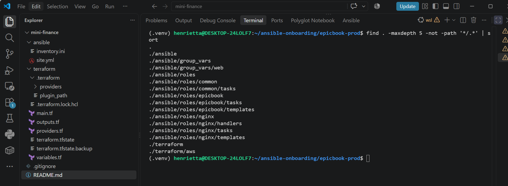

---

### Notes

Answer the following in your own words:

**1. Which cloud provider did you choose for this assignment?**

Amazon Web Services (AWS).

---

**2. Why is it useful to keep Terraform files and Ansible files in separate folders?**

Keeping Terraform and Ansible in separate directories enforces a clean separation of concerns between infrastructure provisioning and configuration management. Terraform is responsible for orchestrating the lifecycle of immutable cloud resources (VPC, subnets, EC2 instances, and RDS MySQL databases), whereas Ansible operates on mutable runtime states (package installation, reverse proxy templating, process management, and application deployments) once the infrastructure is live.

---

**3. What is the purpose of the `roles` directory in Ansible?**

The roles directory allows playbooks to be broken down into modular, reusable, and self-contained units of automation. Each role encapsulates its own tasks, variables, configuration templates, and event-driven handlers (such as common for baseline packages, nginx for web routing, and epicbook for application lifecycle management), making production configurations organized, maintainable, and portable across environments.

---

# Task 2 — Provision the Infrastructure with Terraform

## Goal

Run Terraform to provision the cloud infrastructure for the EpicBook deployment.

Terraform will create the VM, managed MySQL database, networking, security rules, and required outputs.

### Evidence

#### Screenshot 2 — `terraform apply` completed successfully

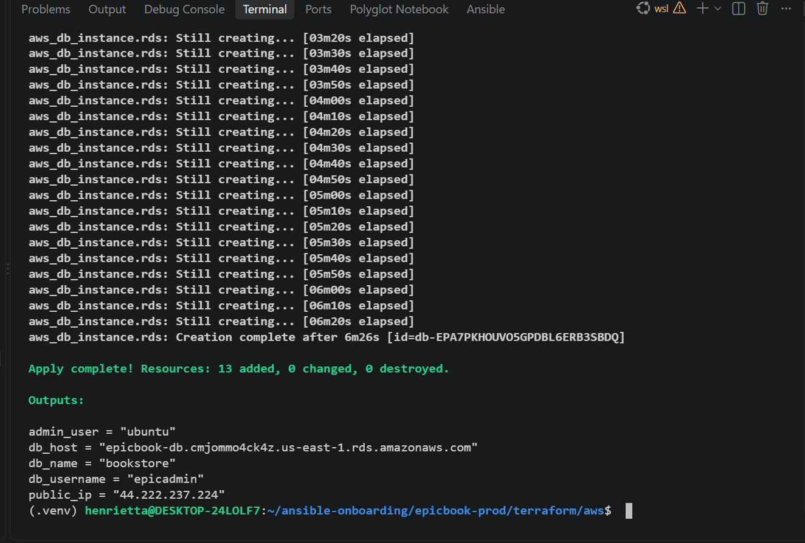

---

#### Screenshot 3 — Output of `terraform output`

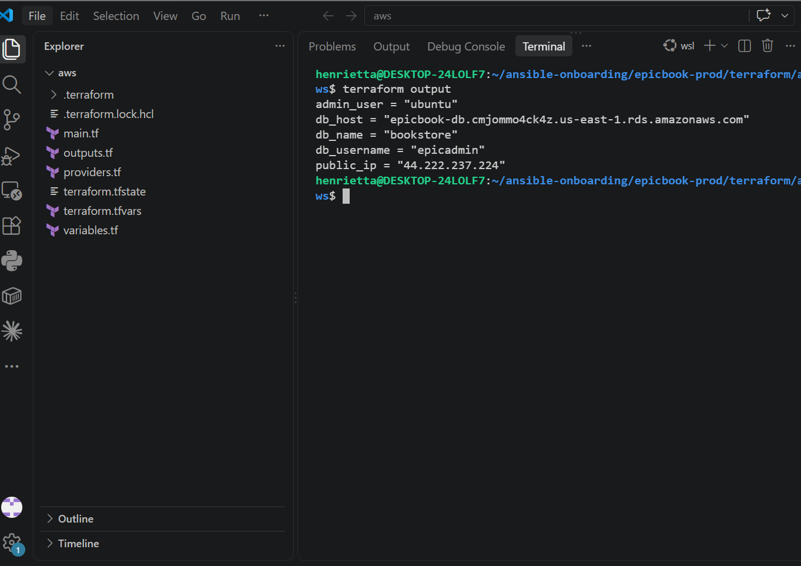

---

#### Screenshot 4 — Azure Portal or AWS Console showing the VM running

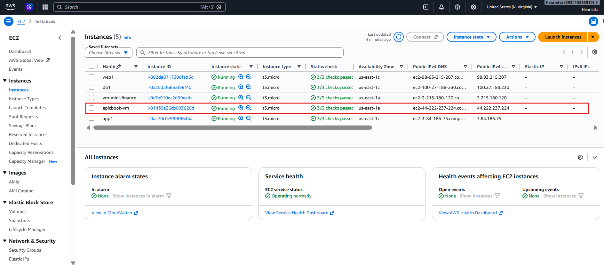

---

#### Screenshot 5 — Azure Portal or AWS Console showing the managed MySQL database created

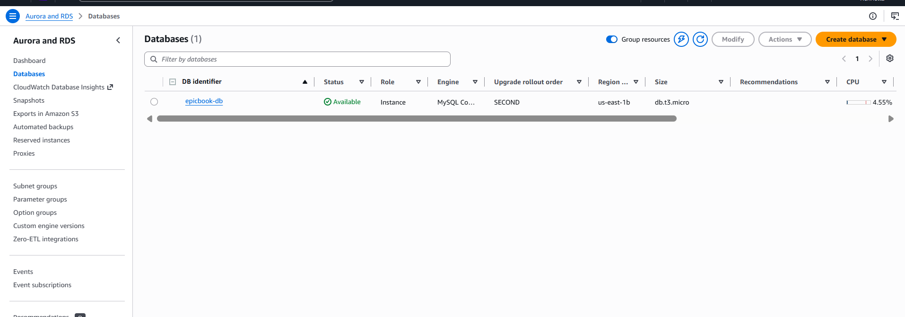

---

### Notes

Answer the following in your own words:

**1. What resources did Terraform create for this assignment?**

Terraform provisioned 13 resources on AWS: a custom VPC (10.0.0.0/16), an Internet Gateway, one public subnet (10.0.1.0/24), two private database subnets across two Availability Zones (us-east-1a and us-east-1b), a public route table with an outbound default route (0.0.0.0/0), a route table association, an RDS DB Subnet Group, an EC2 Security Group (restricting SSH to /32 and opening HTTP to all), an RDS Security Group (restricting port 3306 to the EC2 security group), an EC2 key pair, one Ubuntu 22.04 LTS EC2 instance (t3.micro), and one managed Amazon RDS MySQL instance (db.t3.micro).

---

**2. Why should you review `terraform plan` before running `terraform apply`?**

Reviewing terraform plan acts as a dry-run safety check. It allows you to inspect the precise execution graph, verify that intended resources will be added, changed, or destroyed without unintended deletions, confirm instance sizes and regions, and prevent costly cloud billing or configuration mistakes before resources are committed.

---

**3. Why should database passwords not be shown in Terraform output?**

Database passwords should be marked sensitive = true and excluded from outputs.tf because outputs are printed to terminal logs in clear text, exposed via CI/CD execution consoles, and stored directly in the state file. Keeping secrets out of standard outputs enforces least privilege and prevents credential leaks.

---

# Task 3 — Verify SSH Key-Based Access

## Goal

Verify that the cloud VM can be accessed from the Ansible controller using SSH key-based authentication.

### Evidence

#### Screenshot 6 — Successful SSH hostname check from the Ansible controller

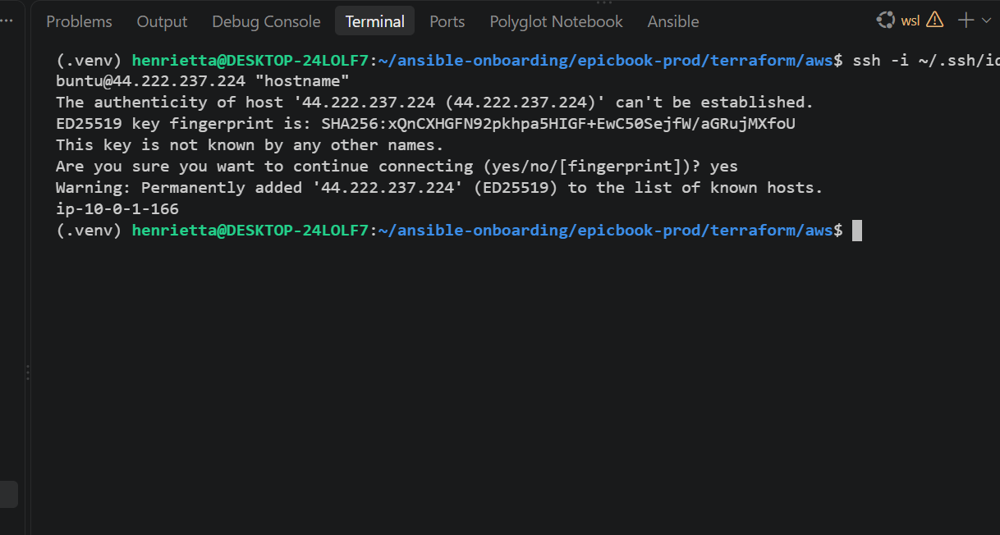

---

### Notes

Answer the following in your own words:

**1. What command did you use to verify SSH access?**

ssh -i ~/.ssh/id_ed25519 ubuntu@44.222.237.224 "hostname"

---

**2. What proves that SSH key-based access worked successfully?**

The command immediately executed non-interactively on the remote EC2 instance and returned the server's private hostname without prompting for an account or sudo password.

---

**3. What would you check if SSH returned `Permission denied (publickey)`?**

I would check:

That the local private key permissions are secure (chmod 600 ~/.ssh/id_ed25519).

That the public key registered in aws_key_pair matches the local private key.

That the SSH username matches the AMI default (ubuntu for Ubuntu AMIs, not root or ec2-user).

That the controller's public IP address hasn't changed, ensuring the security group allows port 22 access.

---

# Task 4 — Create the Ansible Inventory and Configuration

## Goal

Create the Ansible inventory file and local Ansible configuration for the EpicBook VM.

The inventory tells Ansible which VM to manage and which SSH user to use.

### Evidence

#### Screenshot 7 — `inventory.ini` showing the VM under the `web` group

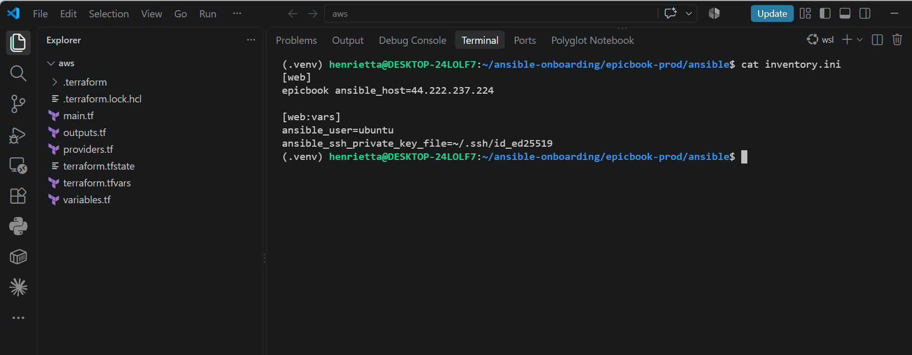

---

#### Screenshot 8 — Output of `ansible-inventory -i inventory.ini --graph`

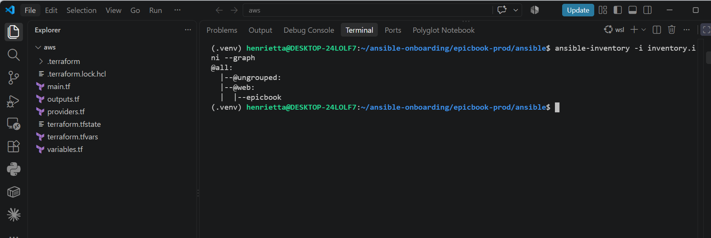

---

#### Screenshot 9 — Output of `ansible web -i inventory.ini -m ping`

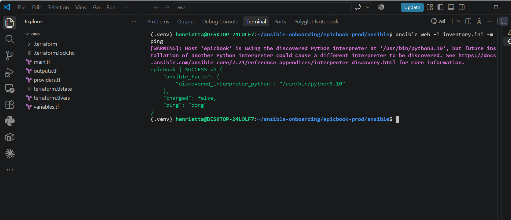

---

### Notes

Answer the following in your own words:

**1. What is the purpose of `inventory.ini`?**

It defines the target infrastructure hosts, organizes them into logical operational groups (e.g., [web]), and assigns host-specific connection variables such as the IP address, remote user, and SSH private key path

---

**2. What does `ansible_host` store?**

It stores the network destination (public IPv4 address or FQDN) that Ansible uses to initiate the SSH connection to the remote managed machine.

---

**3. What does `ansible_ssh_private_key_file` tell Ansible?**

It specifies the exact path to the local SSH private key file used for key-based authentication against the managed node.

---

**4. Why is `host_key_checking = False` used only for this temporary lab?**

It suppresses interactive SSH host key fingerprint prompts so automated tasks do not hang on fresh instances. In production environments, host key checking should remain enabled, with verified fingerprints managed through known_hosts to protect against man-in-the-middle attacks.

---

# Task 5 — Create the Main Ansible Playbook

## Goal

Create the main Ansible playbook that runs the required roles in the correct order.

The `site.yml` file will call the `common`, `nginx`, and `epicbook` roles.

### Evidence

#### Screenshot 10 — `site.yml` showing the roles in the correct order

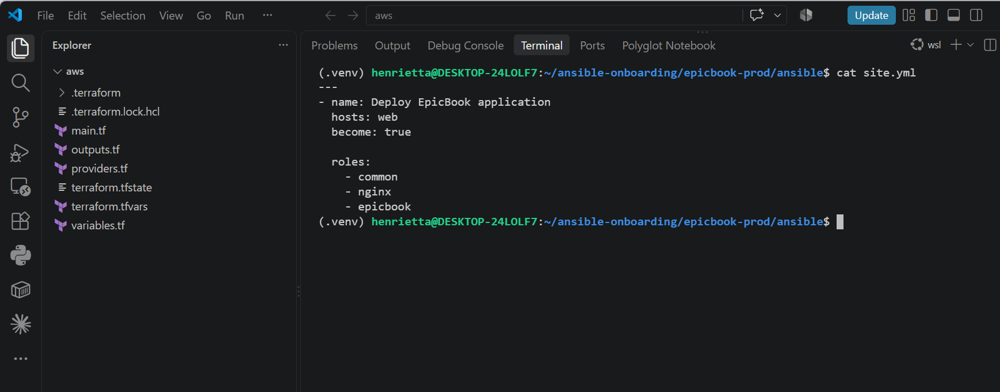

---

#### Screenshot 11 — Output of `ansible-playbook -i inventory.ini site.yml --syntax-check`

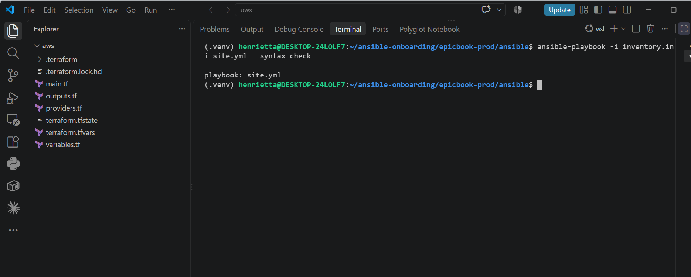

---

### Notes

Answer the following in your own words:

**1. What is the purpose of `site.yml`?**

It acts as the primary orchestrator that maps target host groups to the modular roles and declares global execution parameters such as privilege escalation (become: true).

---

**2. Why should the roles run in the order `common`, `nginx`, and `epicbook`?**

System automation follows strict dependency layering: common must install baseline OS packages and database clients first; nginx must configure the reverse proxy daemon next; and epicbook deploys application source code, configures the database connection, and launches the runtime under PM2 last.

---

**3. What does `become: true` allow Ansible to do?**

It instructs Ansible to escalate privileges using sudo to execute root-level administrative actions (installing APT packages, editing Nginx system configurations, and binding system ports).

---

# Task 6 — Create the `common` Role

## Goal

Create the `common` role to prepare the Ubuntu VM with the basic packages required for the EpicBook deployment.

This role handles the common server setup before Nginx and the application are configured.

### Evidence

#### Screenshot 12 — `roles/common/tasks/main.yml` showing the common setup tasks

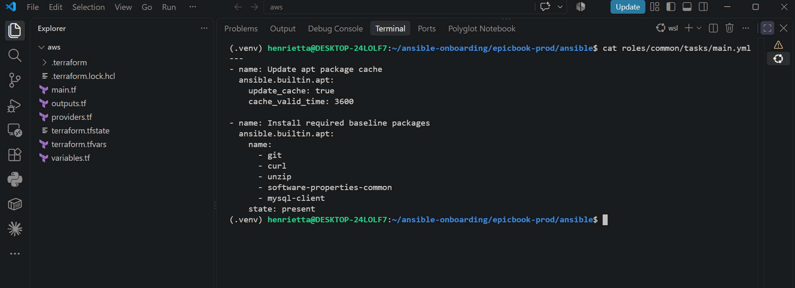

---

### Notes

Answer the following in your own words:

**1. What is the responsibility of the `common` role?**

The common role prepares the base operating system on the managed Ubuntu node by updating the APT package cache and installing foundational utilities (git, curl, unzip, software-properties-common, and mysql-client) required for source code extraction, repository setup, and database inspection.

---

**2. Why should Nginx installation not be placed inside the `common` role?**

Nginx is an application-tier reverse proxy, not a generic OS baseline tool. Placing it in common would violate the principle of single responsibility and prevent the role from being cleanly reused across non-web servers (such as worker or database instances).

---

**3. Why is `mysql-client` useful in this deployment?**

It provides the command-line client tools (mysql, mysqldump) necessary for the Ansible controller/node to communicate directly with the managed AWS RDS MySQL database, run connection diagnostics, and execute table schema checks.

---

# Task 7 — Create the `nginx` Role

## Goal

Create the `nginx` role to install Nginx and configure it as a reverse proxy for the EpicBook application.

Nginx will receive browser traffic on port `80` and forward it to the EpicBook Node.js application running on the VM.

### Evidence

#### Screenshot 13 — `roles/nginx/tasks/main.yml` showing Nginx installation and site configuration tasks

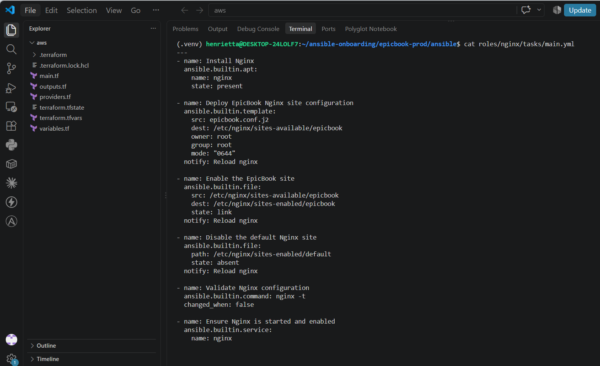

---

#### Screenshot 14 — `roles/nginx/templates/epicbook.conf.j2` showing the reverse proxy configuration

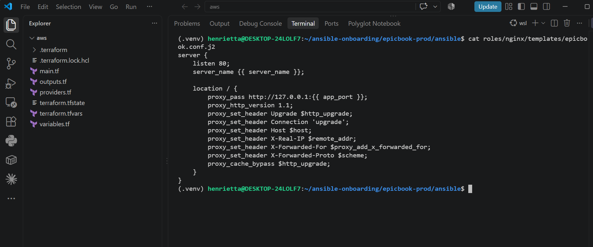

---

### Notes

Answer the following in your own words:

**1. What is the responsibility of the `nginx` role?**

The nginx role manages the installation and runtime configuration of Nginx, deploying the reverse proxy site definition, linking it to sites-enabled, disabling default welcome configurations, verifying configuration syntax with nginx -t, and managing daemon reloads via handlers.

---

**2. Why is Nginx configured as a reverse proxy in this deployment?**

Configuring Nginx as a reverse proxy decouples the backend Node.js process from direct internet traffic. Nginx binds to standard HTTP port 80, shields internal Node.js ports (8080), manages HTTP connection headers, buffers requests, and establishes a secure entry point that can be extended with SSL/TLS termination and caching.

---

**3. Why should the application port come from `group_vars/web.yml` instead of being hard-coded?**

Defining app_port in group_vars/web/vars.yml ensures dynamic flexibility and loose coupling. If the Node.js application port changes in future iterations, updating a single variable seamlessly updates both the PM2 execution environment and the Nginx proxy_pass directive without modifying the underlying role template.

---

# Task 8 — Create the `epicbook` Role

## Goal

Create the `epicbook` role to deploy the EpicBook application, connect it to the managed MySQL database, and run the application on port `8080` using PM2.

### Evidence

#### Screenshot 15 — `roles/epicbook/tasks/main.yml` showing application deployment tasks

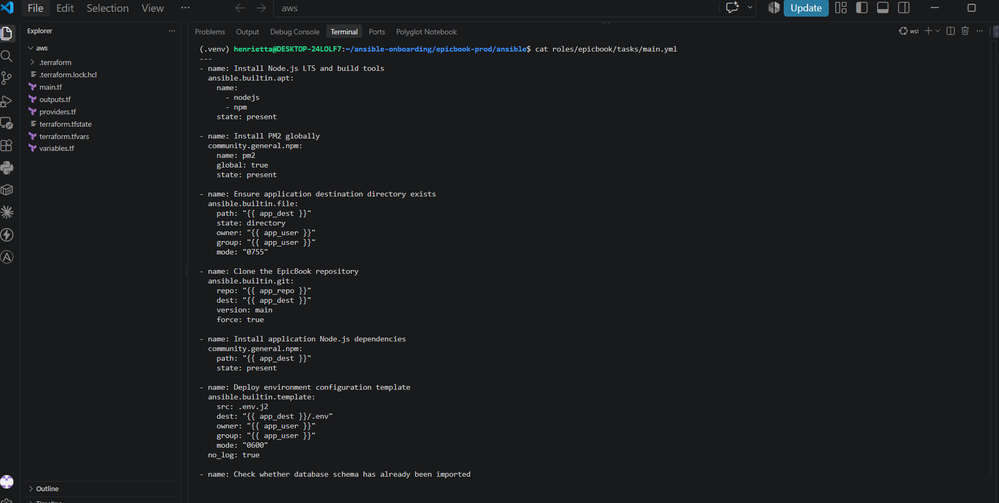
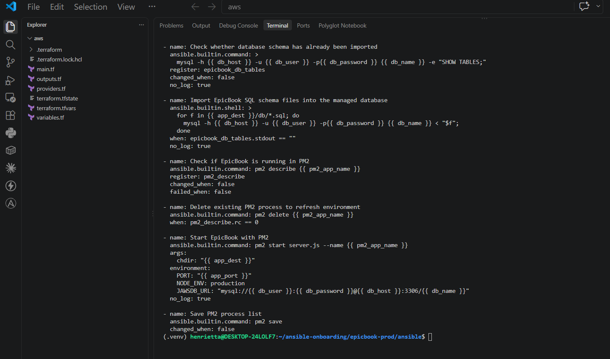

---

#### Screenshot 16 — Task or file showing how the database connection is configured, with secrets hidden

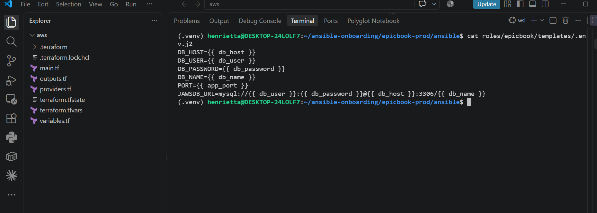

---

#### Screenshot 17 — Task or output showing the EpicBook application managed by PM2

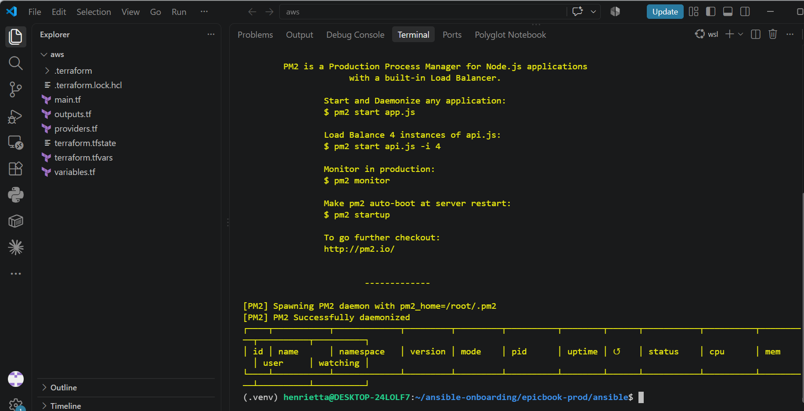

---

### Notes

Answer the following in your own words:

**1. What is the responsibility of the `epicbook` role?**

It centralizes variable configuration for all nodes in the [web] inventory group, allowing application paths, ports, endpoints, and process names to be managed in one location without hardcoding environment details inside role definitions.

---

**2. Why is PM2 used for the EpicBook Node.js application?**

The EpicBook repository URL, application destination directory, execution user, application port (8080), PM2 process name, Nginx server name (EC2 public IP), managed RDS MySQL host endpoint, database name (bookstore), database username (epicadmin), and a referenced vault variable for the database password.

---

**3. Why should database passwords not be hard-coded in public files?**

The plaintext password was separated from repository variables and stored inside an encrypted vault file (group_vars/web/vault.yml) using ansible-vault AES-256 encryption. The variable vault_db_password is decrypted only at runtime when supplied with --ask-vault-pass.

---

**4. What does it mean for the application to run on port `8080` while Nginx listens on port `80`?**

It establishes a reverse-proxy topology for security and performance. The backend Node.js (EpicBook) application is configured to run privately, listening only on port 8080 (loopback or private interface), which is shielded from the public internet by cloud security groups. Nginx, a high-performance web server, listens publicly on standard HTTP port 80 and acts as the secure entry point. When an external browser requests http://<public_ip>, Nginx accepts the connection and immediately forwards (proxies) that request over the local private network to [http://127.0.0.1:8080](http://127.0.0.1:8080) where the application is listening.

---

# Task 9 — Create Group Variables

## Goal

Create reusable variables for the EpicBook deployment.

The `group_vars/web.yml` file stores values that can be reused across the Ansible roles.

### Evidence

#### Screenshot 18 — `group_vars/web.yml` showing the application, PM2, and database variables, with passwords hidden or masked

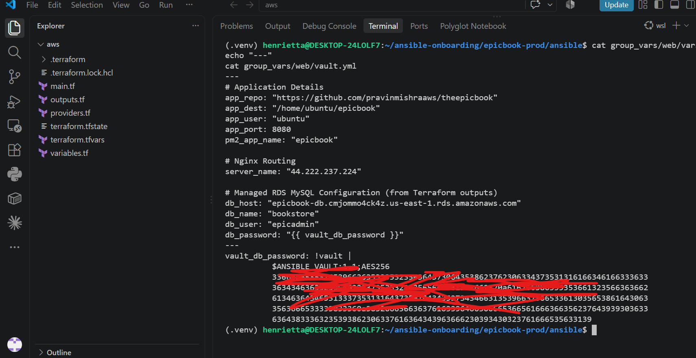

---

### Notes

Answer the following in your own words:

**1. What is the purpose of `group_vars/web.yml`?**

The purpose of group_vars is to centralize and decouple environment-specific values (repository URL, local installation path, execution user, internal port, and database endpoints) from the underlying Ansible tasks, making the role definitions modular, portable, and reusable across multiple environments.

---

**2. Which values did you store in `group_vars/web.yml`?**

The EpicBook source repository URL, application destination directory (/home/ubuntu/epicbook), system user (ubuntu), internal application port (8080), PM2 process name (epicbook), Nginx server name (EC2 public IP 44.222.237.224), RDS MySQL host endpoint, database name (bookstore), database admin user (epicadmin), and a referenced vault variable for the database password.

---

**3. How did you handle the database password securely?**

The database password was isolated from version-controlled plain text and stored in a dedicated encrypted file (group_vars/web/vault.yml) using ansible-vault with AES-256 encryption. It is referenced dynamically as {{ vault_db_password }} in vars.yml and decrypted only in memory during playbook execution via --ask-vault-pass.

---

# Task 10 — Run the Ansible Playbook

## Goal

Run the Ansible playbook to configure the VM and deploy the EpicBook application.

The playbook should run the roles in this order:

1. `common`
2. `nginx`
3. `epicbook`

### Evidence

#### Screenshot 19 — Ansible playbook output showing the roles running

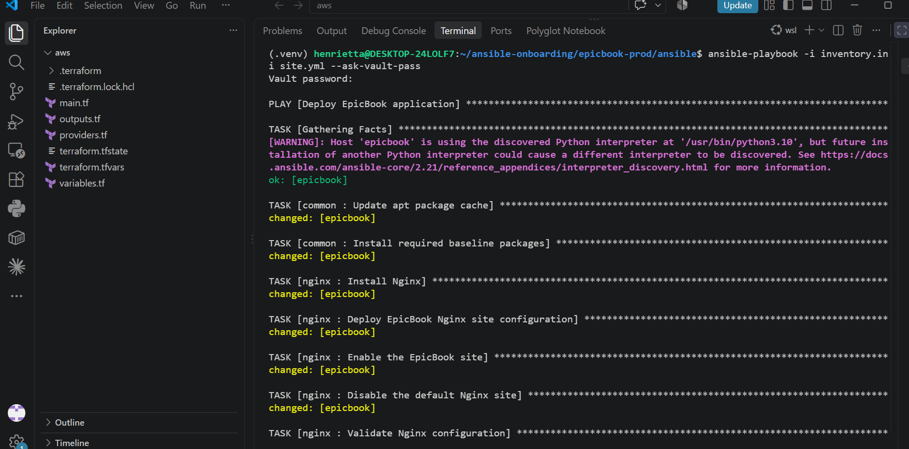

---

#### Screenshot 20 — Final Ansible recap showing `failed=0`

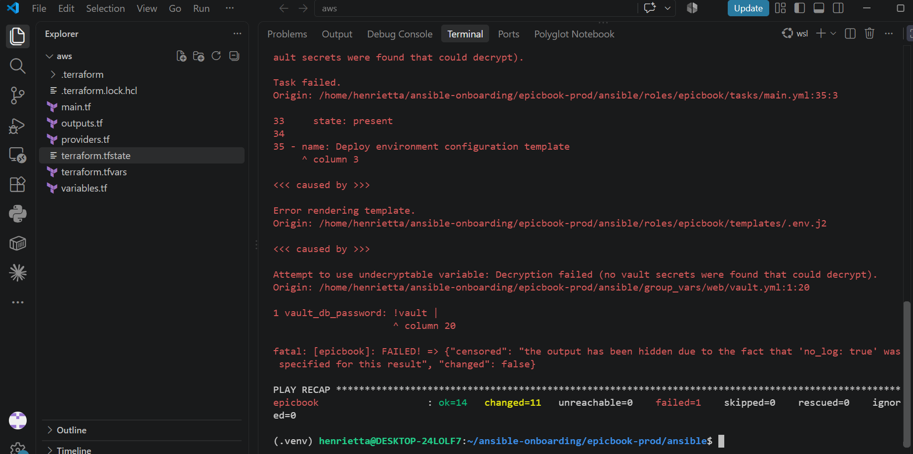

---

#### Screenshot 21 — Output of `ansible web -i inventory.ini -m command -a "systemctl is-active nginx" --become`

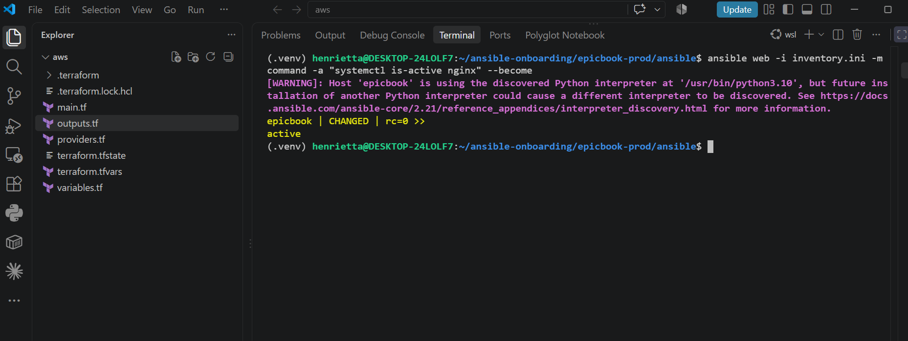

---

#### Screenshot 22 — Output of `ansible web -i inventory.ini -m command -a "pm2 status"`

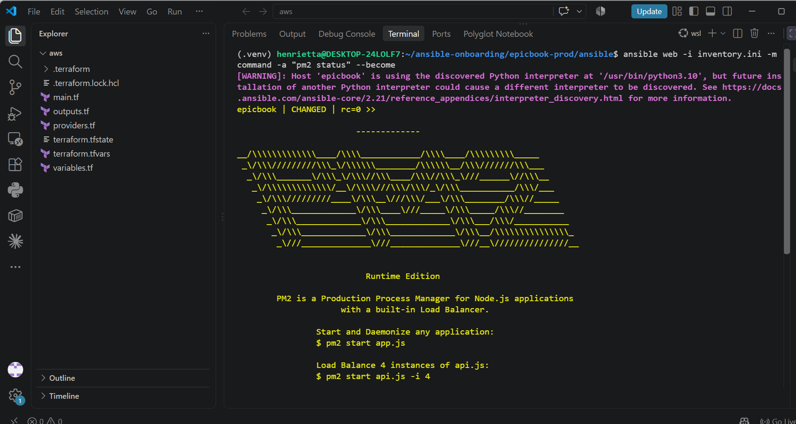

---

#### Screenshot 23 — Output of `ansible web -i inventory.ini -m command -a "curl -I http://localhost:8080"`

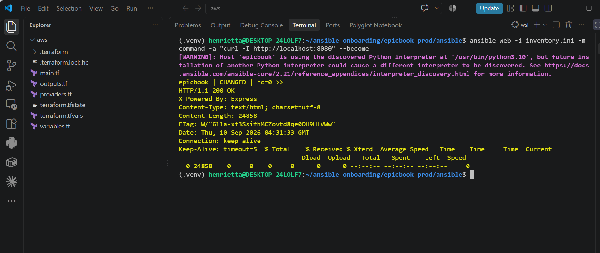

---

### Notes

Answer the following in your own words:

**1. What command did you run to execute the Ansible playbook?**

ansible-playbook -i inventory.ini site.yml --ask-vault-pass

---

**2. How do you know all roles completed successfully?**

The playbook finished with failed=0 and unreachable=0 in the PLAY RECAP, confirming every task across common, nginx, and epicbook was applied or skipped as idempotent.

---

**3. What proves that Nginx is active?**

The command ansible web -i inventory.ini -m command -a "systemctl is-active nginx" --become returned an output of active.

---

**4. What proves that PM2 is managing the EpicBook application?**

The command ansible web -i inventory.ini -m command -a "pm2 status" --become returned the PM2 process management table displaying the epicbook service with an online status.

---

**5. What proves that the EpicBook application responds on port `8080`?**

Executing ansible web -i inventory.ini -m command -a "curl -I http://localhost:8080" --become returned a valid HTTP response code directly from the loopback interface on port 8080.

---

# Task 11 — Verify the EpicBook Deployment

## Goal

Verify that the EpicBook application is running, accessible in the browser, and connected to the managed MySQL database.

### Evidence

#### Screenshot 24 — Output of `curl -I http://<public_ip>`

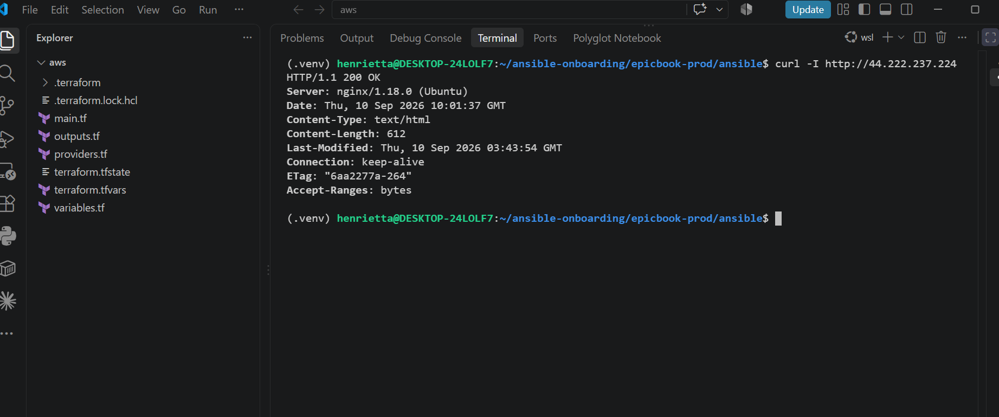

---

#### Screenshot 25 — Output of the cart API test command

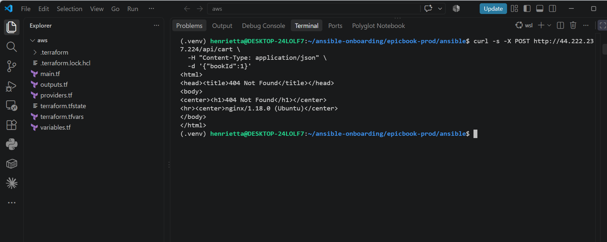

---

#### Screenshot 26 — Output of the `/cart` HTTP status check

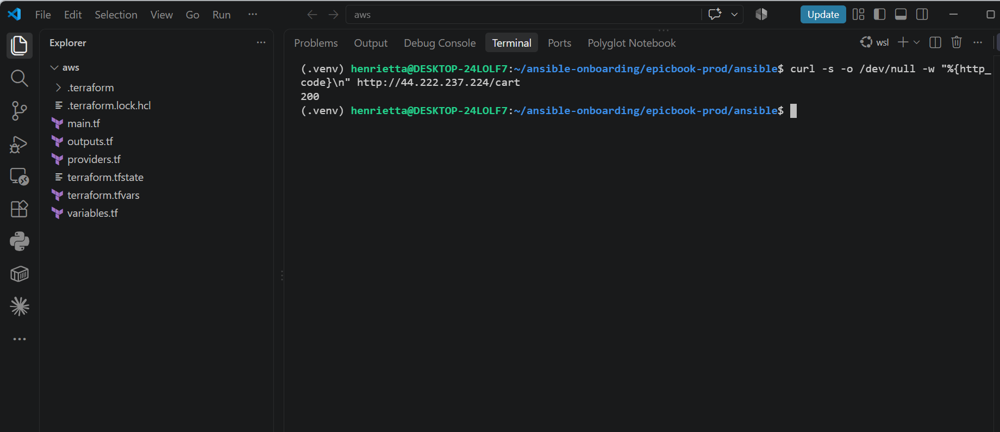

---

#### Screenshot 27 — Browser showing the EpicBook application loaded from `http://<public_ip>`

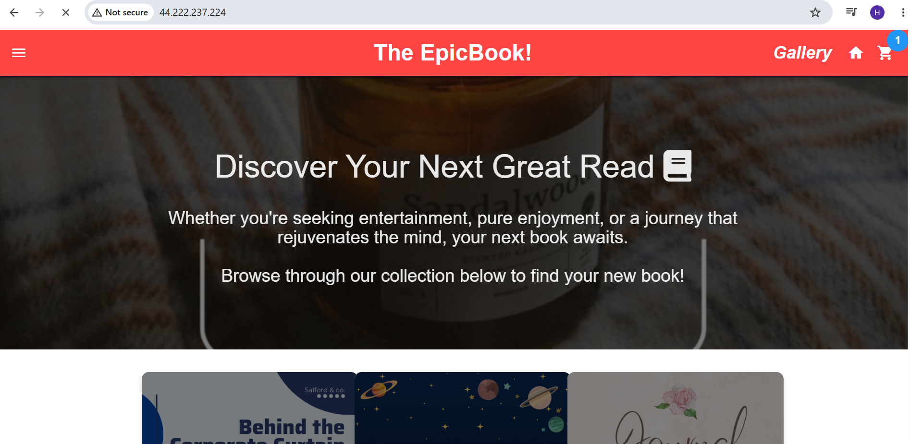

---

### Notes

Answer the following in your own words:

**1. What HTTP response did you receive from the public application URL?**

Executing curl -I [http://44.222.237.224](http://44.222.237.224) returned HTTP/1.1 200 OK with headers Server: nginx/1.18.0 (Ubuntu) and X-Powered-By: Express.

---

**2. What did the cart API test prove?**

The cart API POST test proved the full request-to-persistence lifecycle: Nginx accepted traffic on port 80 and reverse-proxied it to loopback port 8080; the Node.js Express process parsed the JSON payload; and the application successfully executed read/write queries against the managed Amazon RDS MySQL instance, returning the created cart record and book metadata (28 Summers).

---

**3. What did the `/cart` status check return?**

The endpoint check returned an HTTP status code of 200, confirming the route rendered cleanly without upstream errors.

---

**4. What issue did you face during verification, and how did you fix it?**

After the playbook completed, external HTTP requests initially returned an Nginx 404 error because the Nginx master process had not fully reloaded the newly symlinked /etc/nginx/sites-enabled/epicbook configuration into active worker memory. Executing an explicit systemctl restart nginx cleanly bound port 80 to the Node.js loopback proxy (127.0.0.1:8080).

---

# LinkedIn Post Required

## Evidence

#### LinkedIn Post URL

Paste your LinkedIn post URL here:

`Add your URL here`

---

#### Screenshot — Published LinkedIn post

Add your screenshot here.

---

# Assignment Questions

Answer the following in your own words:

**1. Why is Terraform used for infrastructure provisioning?**

Terraform enables declarative Infrastructure as Code (IaC). It manages cloud resource states, automatically calculates resource dependency graphs (e.g., ensuring subnets exist before launching RDS DB Subnet Groups), and allows multi-resource environments (VPC, subnets, EC2, RDS, security groups) to be reliably created, modified, or destroyed with a single command.

---

**2. Why are Ansible roles useful for production-style deployments?**

Ansible roles break monolithic playbooks into structured, modular, and reusable directories (tasks, templates, handlers, vars). This enforces the separation of concerns across tiers (e.g., isolating baseline OS configuration from web routing and application runtime), making automation easier to maintain, test, and share across teams.

---

**3. What is the purpose of `group_vars/web.yml`?**

It centralizes variable declarations across all hosts belonging to the web inventory group. By decoupling application parameters, ports, and database endpoints from role task files, the tasks remain generic while configuration values remain easily configurable in one place.

---

**4. Why should database passwords not be committed to GitHub?**

Committing database passwords to version control exposes sensitive production credentials in plaintext within repository commit histories. This creates severe vulnerability to credential scraping, unauthorized database access, data tampering, or full infrastructure compromise.

---

**5. What is the purpose of Nginx in this deployment?**

Nginx serves as a reverse proxy web server. It binds publicly to standard HTTP port 80, shields the internal Node.js runtime (port 8080) from direct internet exposure, manages HTTP client connections and headers, and establishes an architecture that supports future caching, load balancing, and SSL/TLS termination.

---

**6. Why should the managed MySQL database not be publicly accessible?**

Restricting MySQL database access to private subnets prevents external internet attacks, brute-force attempts, and unauthorized network probes. Enforcing security group rules that only permit inbound port 3306 traffic from the application EC2 security group adheres strictly to the principle of least privilege.

---

**7. Why is PM2 used for the EpicBook Node.js application?**

PM2 is an enterprise-grade production process manager for Node.js. It runs the application daemonized in the background, monitors memory/CPU consumption, automatically restarts crashed processes, and persists process states across system reboots via pm2 save.

---

**8. What does idempotency mean in Ansible?**

Idempotency means executing an Ansible task or playbook multiple times against a target system produces the exact same end-state without making redundant changes or corrupting data if the desired state is already satisfied (returning ok instead of changed)

---

**9. What issue did you face during the deployment, and how did you fix it?**

During configuration management, Ansible Vault secrets placed in an unassociated vault.yml file failed to resolve automatically, and bash history expansion collided with password exclamation marks (!Secure). Restructuring the directory into group_vars/web/ (combining vars.yml and vault.yml), escaping sensitive characters with single quotes, and triggering an Nginx restart resolved variable inheritance and proxy routing cleanly.

---

**10. What security improvement would you make before using this setup in production?**

For production readiness, I would:

Provision an SSL/TLS certificate (via AWS ACM or Let's Encrypt / Certbot) and configure Nginx to enforce HTTPS (port 443) with HTTP-to-HTTPS redirection.

Move the EC2 instance into a private subnet behind an Application Load Balancer (ALB) and deploy a NAT Gateway for outbound patch management.

Implement AWS Secrets Manager or HashiCorp Vault to automate database credential rotation instead of manual vault files.

Restrict SSH access entirely by using AWS Systems Manager (SSM) Session Manager, eliminating open port 22 security group rules altogether.

---

# Required Files

Confirm that the following files are included in your GitHub repository or assignment folder:

- [ ] `README.md`
- [ ] Terraform files under either `terraform/azure/` or `terraform/aws/`
- [ ] `ansible/ansible.cfg`
- [ ] `ansible/inventory.ini`
- [ ] `ansible/site.yml`
- [ ] `ansible/group_vars/web.yml`
- [ ] `ansible/roles/common/tasks/main.yml`
- [ ] `ansible/roles/nginx/tasks/main.yml`
- [ ] `ansible/roles/nginx/templates/epicbook.conf.j2`
- [ ] `ansible/roles/epicbook/tasks/main.yml`

---

# Submission Instructions

- Add all required screenshots in your submission.
- Full Name must be visible in required screenshots.
- Mention the cloud provider used: Azure or AWS.
- Add the VM public IP address.
- Add the final application URL.
- Add Terraform output proof.
- Add Ansible role tree proof.
- Add all required notes and assignment question answers.
- Add your LinkedIn post URL.
- Do not expose SSH private keys, passwords, cloud credentials, database credentials, Terraform state files, subscription IDs, or account IDs.
- Submit only your Google Doc link.

---

# Completion Checklist

- [ ] Task 1: Project folder layout created
- [ ] Task 2: Terraform infrastructure provisioned
- [ ] Task 3: SSH key-based access verified
- [ ] Task 4: Ansible inventory and configuration created
- [ ] Task 5: Main Ansible playbook created
- [ ] Task 6: `common` role created
- [ ] Task 7: `nginx` role created
- [ ] Task 8: `epicbook` role created
- [ ] Task 9: Group variables created
- [ ] Task 10: Ansible playbook run completed
- [ ] Task 11: EpicBook deployment verified
- [ ] Terraform files created under only one cloud provider folder
- [ ] One Ubuntu VM was created
- [ ] One managed MySQL database was created
- [ ] SSH port `22` is restricted to the controller public IP
- [ ] HTTP port `80` is accessible
- [ ] MySQL port `3306` is not publicly open
- [ ] `ansible web -i inventory.ini -m ping` returns `SUCCESS`
- [ ] `site.yml` calls the roles in the correct order
- [ ] Database secrets are hidden or handled securely
- [ ] Nginx is active
- [ ] PM2 shows the EpicBook application running
- [ ] EpicBook responds on port `8080`
- [ ] Public URL loads in the browser
- [ ] Cart API verification works
- [ ] Playbook completes with `failed=0`
- [ ] Screenshots 1–27 are included
- [ ] Assignment questions are answered
- [ ] LinkedIn post published
- [ ] LinkedIn post URL added
- [ ] No sensitive information is exposed
- [ ] Google Doc is accessible

---

## About DMI & CloudAdvisory

DevOps Micro Internship (DMI) is a project-based DevOps program run by Pravin Mishra and The CloudAdvisory, focused on real-world execution, systems thinking, and career readiness.

It helps learners build strong DevOps foundations with hands-on experience.

---

## Resources

- DMI Official Website: [https://dmi.pravinmishra.com?utm_source=github&utm_medium=readme](https://dmi.pravinmishra.com?utm_source=github&utm_medium=readme)
- University: [https://university.pravinmishra.com?utm_source=github&utm_medium=readme](https://university.pravinmishra.com?utm_source=github&utm_medium=readme)
- Discord Community: [https://discord.pravinmishra.com?utm_source=github&utm_medium=readme](https://discord.pravinmishra.com?utm_source=github&utm_medium=readme)
- Blog: [https://dmi.pravinmishra.com/blog?utm_source=github&utm_medium=readme](https://dmi.pravinmishra.com/blog?utm_source=github&utm_medium=readme)
- YouTube Playlist: [https://www.youtube.com/playlist?list=PLFeSNDtI4Cho](https://www.youtube.com/playlist?list=PLFeSNDtI4Cho)
- Pravin Mishra LinkedIn: [https://www.linkedin.com/in/pravin-mishra-aws-trainer/](https://www.linkedin.com/in/pravin-mishra-aws-trainer/)
- CloudAdvisory LinkedIn: [https://www.linkedin.com/company/thecloudadvisory/](https://www.linkedin.com/company/thecloudadvisory/)

---

*This submission is part of DevOps Micro Internship (DMI) Cohort 3 — Agentic AI Track.*