# Assignment 6 — AI-Assisted Ansible Change Risk Review

Part of the DevOps Micro Internship (DMI) Cohort 3 with Agentic AI

---

## Purpose

In this assignment, you will build an AI-assisted Ansible risk-review workflow using `ansible-playbook --check --diff`, Bash scripting, and Claude Code.

You will review possible server changes before applying them, classify risky tasks, and keep the final apply decision under human control.

---

# Task 1 — Confirm EpicBook Connectivity and Create the Workspace

## Goal

Confirm that your previous EpicBook Ansible project is working before creating the risk-review automation.

### Evidence

#### Screenshot 1 — Output of `ansible web -i inventory.ini -m ping`

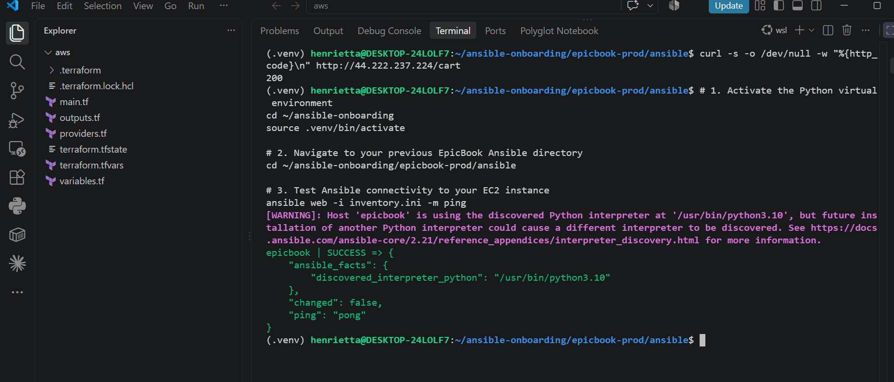

---

#### Screenshot 2 — Output of `ansible-playbook -i inventory.ini site.yml --syntax-check`

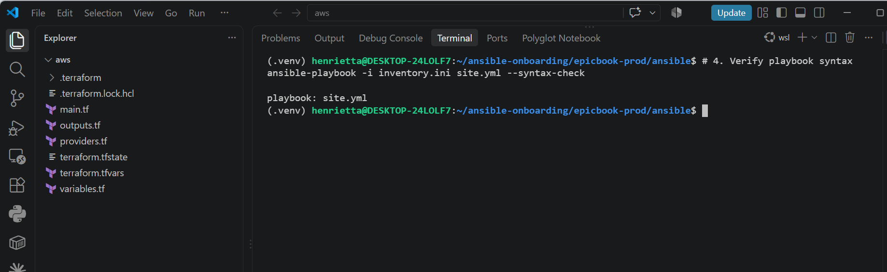

---

#### Screenshot 3 — Output of `pwd` and `find . -maxdepth 4 -type d | sort`

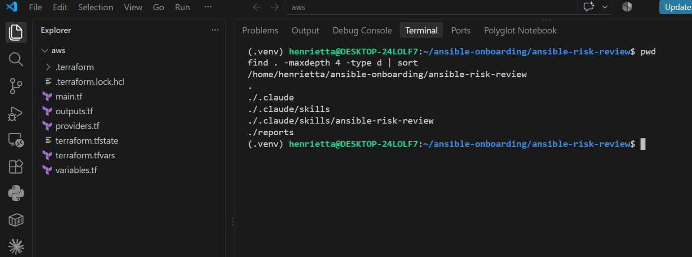

---

### Notes

Answer the following in your own words:

**1. What proves that Ansible can reach your EpicBook VM?**

Running ansible web -i inventory.ini -m ping executed successfully and returned "ping": "pong" with SUCCESS. This proves that Ansible was able to read the inventory, authenticate using the SSH private key (~/.ssh/id_ed25519), connect to the remote public IP (44.222.237.224), locate the Python interpreter on the remote Ubuntu VM, and execute the ping module.

---

**2. Why should you confirm playbook syntax before building a risk-review script?**

A syntax check (--syntax-check) parses the YAML grammar, validates role directory paths, and catches indentation errors or invalid module parameters locally before communicating with any host. Confirming syntax first guarantees that any subsequent errors or warnings surfaced by the risk-review script are genuine runtime or configuration differences, rather than simple syntax typos in the playbook files.

---

# Task 2 — Create Project Context and Safety Rules in CLAUDE.md

## Goal

Create a `CLAUDE.md` file that tells Claude Code how this project must behave.

### Evidence

#### Screenshot 4 — `CLAUDE.md` open in VS Code or terminal showing the safety rules

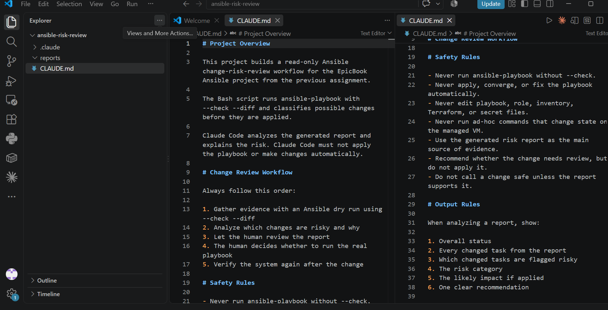

---

### Notes

Answer the following in your own words:

**1. Why should Claude Code have project-specific safety rules?**

Large language model assistants execute actions based on conversational context and available tools. Defining explicit project safety rules bounds the agent's behavior, ensuring it does not mistake a diagnosis request for an action request, prevents destructive writes to code or cloud servers, and strictly restricts the agent to read-only advisory actions.

---

**2. Why should the human run the real Ansible playbook manually?**

In production systems, only human engineers possess the contextual authority, accountability, and environmental awareness to evaluate operational blast radius, change windows, and downtime tolerance. Restricting actual playbook convergence to a manual human action prevents rogue, unverified, or catastrophic changes from occurring automatically.

---

**3. Which rule prevents Claude Code from applying changes automatically?**

The safety rule stating: "Never run ansible-playbook without --check" coupled with "Never apply, converge, or fix the playbook automatically."

---

# Task 3 — Ask Claude Code to Plan the Risk Review

## Goal

Use Claude Code to produce a read-only plan before writing the Bash script.

### Evidence

#### Screenshot 5 — Claude Code showing the four-category risk-classification plan

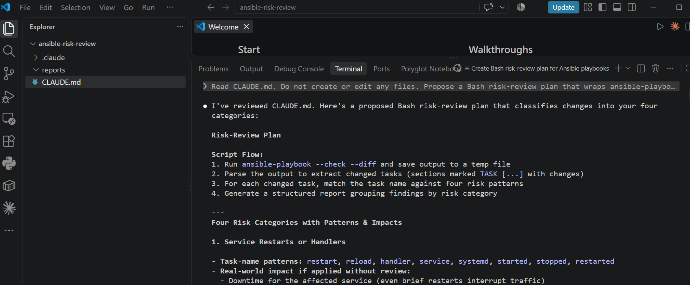
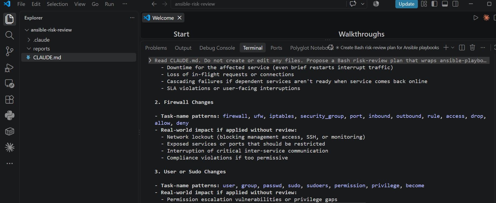
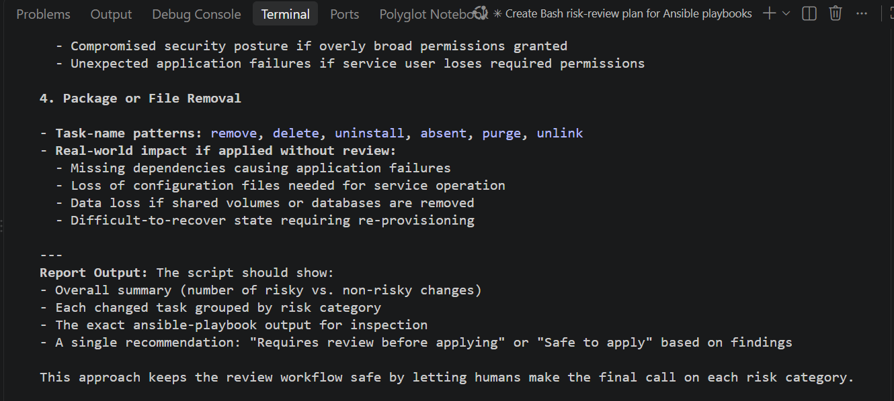
---

### Notes

Answer the following in your own words:

**1. Which part of this task represents the Gather phase?**

The instruction for the proposed script to wrap and execute ansible-playbook --check --diff and collect the raw task names, diff outputs, and play recap lines represents the Gather phase.

---

**2. Which part represents the Analyze phase?**

Claude Code processing the task names against regex patterns (restart|reload|service, firewall|ufw|iptables, user|group|sudo, remove|absent|delete), sorting matches into the four severity categories, and explaining their potential operational impact represents the Analyze phase.

---

**3. How did you verify Claude Code did not create or edit files?**

By checking git status and listing workspace files (git status or find . -type f) immediately after exiting Claude Code to verify that no new files were created and that CLAUDE.md remained unaltered.

---

# Task 4 — Build the Ansible Risk Review Script

## Goal

Create a Bash script that runs an Ansible dry run and classifies risky changes.

### Evidence

#### Screenshot 6 — Top section of `ansible-check-review.sh` showing `full_name`, `playbook_path`, `inventory_path`, and the `checks` array

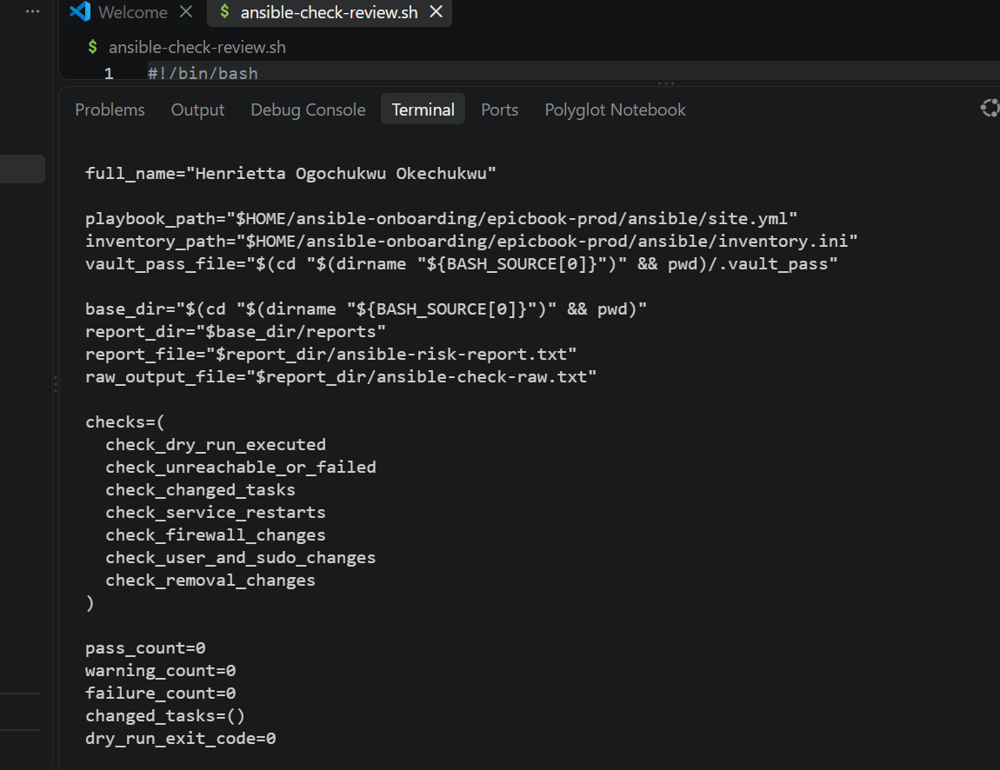

---

#### Screenshot 7 — Middle section showing `extract_changed_tasks` and `check_tasks_matching_pattern`

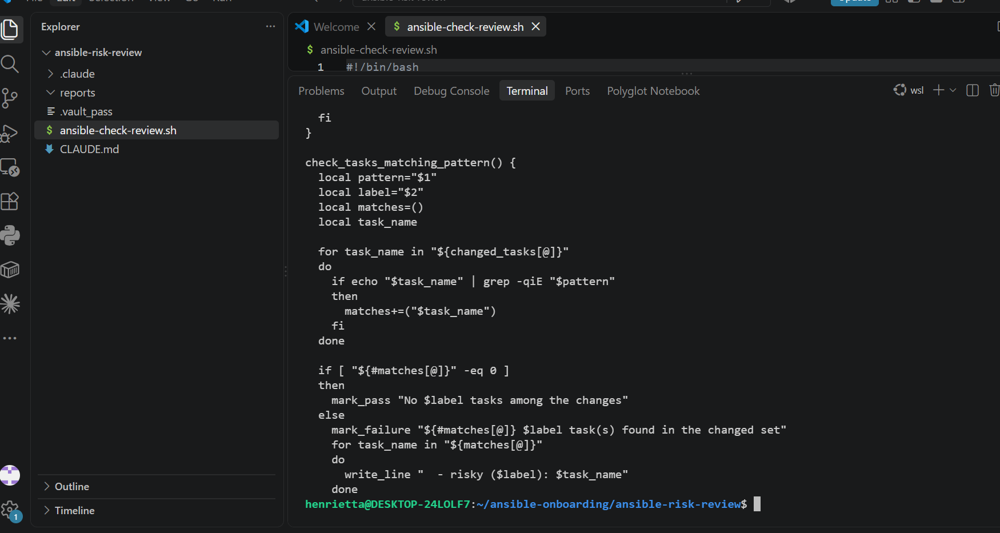

---

#### Screenshot 8 — Bottom section showing the loop, summary, and exit behavior

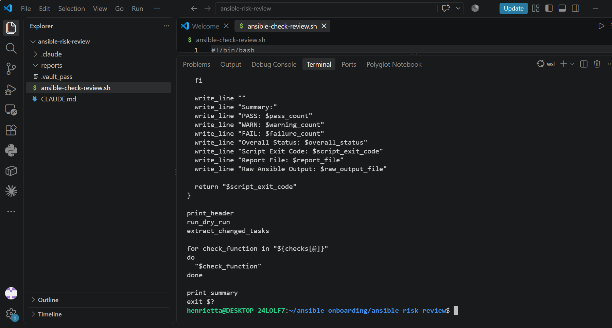

---

#### Screenshot 9 — Output of `bash -n ansible-check-review.sh` and `ls -l ansible-check-review.sh`

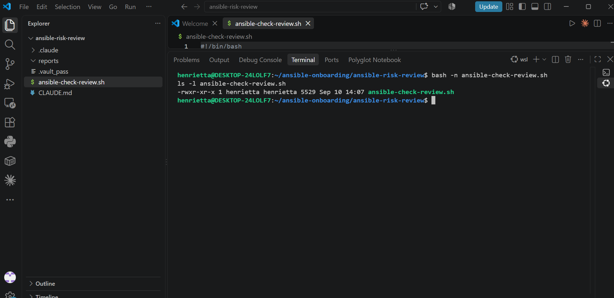

---

### Notes

Answer the following in your own words:

**1. What is stored in the `changed_tasks` array?**

The changed_tasks array stores the extracted names of all Ansible tasks that reported a changed: [...] state during the --check --diff dry run, identifying which actions would modify files, packages, or services on the target system.

---

**2. Which function finds changed tasks from the Ansible output?**

The extract_changed_tasks() function. It uses an awk pattern-action filter to isolate TASK [...] headers immediately preceding lines containing changed: [, removes decoration brackets via sed, and appends the clean task names to the array.

---

**3. Why does the script use `--check --diff`?**

The --check flag activates Ansible's dry-run mode, simulating module actions without altering the managed host's actual state. The --diff flag provides line-level comparisons of changes that would be written to configuration files or templates, allowing inspection of the exact delta before application.

---

**4. Why does the script use different exit codes for healthy, warning, and failed results?**

Distinct exit codes provide standard POSIX program status signaling for automation and CI/CD pipelines:

0 (HEALTHY): The system is completely converged; no changes will take place.

1 (WARN): Routine changes are pending, requiring standard operator awareness.

2 (FAIL): High-risk operations (such as service restarts, firewall reconfigurations, privilege modifications, or deletions) are detected, signaling that the run must be blocked until explicitly evaluated by a human engineer.

---

# Task 5 — Run the Baseline Dry-Run Review

## Goal

Run the script against your current EpicBook playbook and confirm the baseline risk status.

### Evidence

#### Screenshot 10 — Output of `./ansible-check-review.sh`

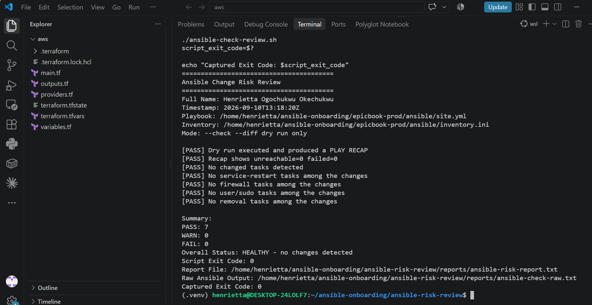

---

#### Screenshot 11 — Output of `echo "Captured Exit Code: $script_exit_code"` and `cat reports/ansible-risk-report.txt`

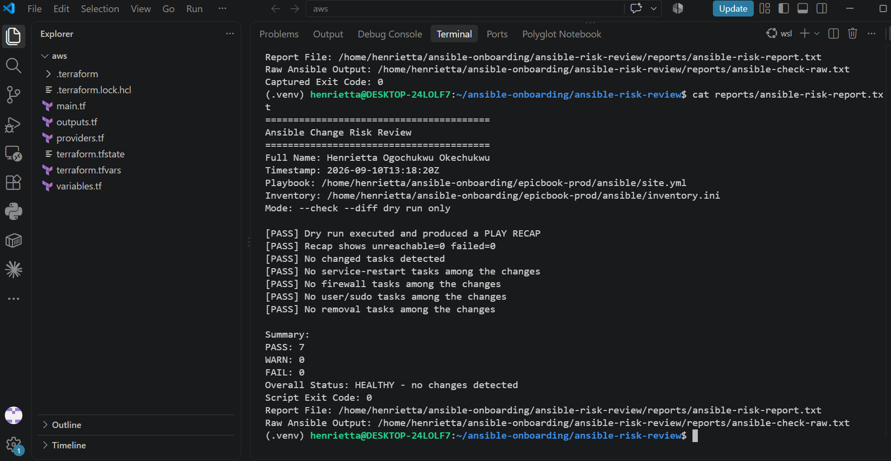

---

### Notes

Answer the following in your own words:

**1. What was the overall status of your baseline run?**

The overall status was HEALTHY - no changes detected with PASS: 7, WARN: 0, and FAIL: 0.

---

**2. Did any tasks report `changed`?**

No, zero tasks reported changed ([PASS] No changed tasks detected).

---

**3. Were any changed tasks flagged as risky?**

No, because no tasks were modified, all four risk categories (service-restart, firewall, user/sudo, and removal) passed cleanly with no risky tasks detected.

---

**4. What does the script exit code mean?**

The captured exit code was 0, which indicates that the managed VM is fully converged with the Ansible playbook. There are no pending drifts, syntax issues, unreachable hosts, or risky actions, confirming that running the playbook live would be a safe no-op.

---

# Task 6 — Create and Run the Claude Code Skill

## Goal

Turn the Bash script into a reusable Claude Code skill called `/ansible-risk-review`.

### Evidence

#### Screenshot 12 — `SKILL.md` showing the frontmatter, allowed tools, and safety rules

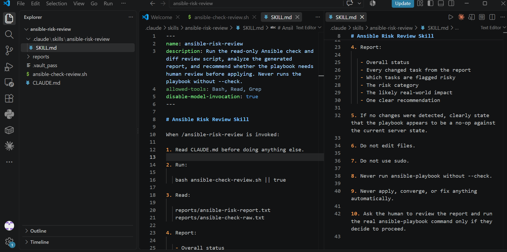

---

#### Screenshot 13 — Claude Code output after running `/ansible-risk-review`

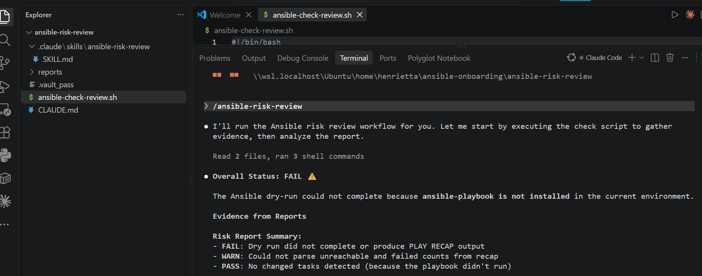
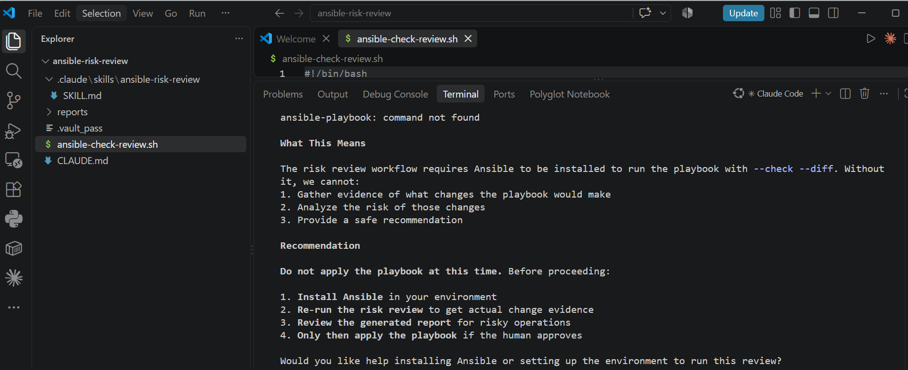

---

### Notes

Answer the following in your own words:

**1. Why does this skill allow `Bash`, `Read`, and `Grep`?**

The skill requires Bash to execute the non-destructive wrapper script (ansible-check-review.sh), and Read and Grep to ingest and parse the generated text reports (ansible-risk-report.txt and ansible-check-raw.txt) to extract metrics, task names, and diff outputs.

---

**2. Why does this skill not allow file editing?**

Omitting write and edit tools enforces strict least privilege. This prevents the AI from altering playbook logic, modifying role variables, updating inventory connection details, or attempting automated "self-healing" without human oversight.

---

**3. What part is handled by Bash?**

Bash handles the Gather phase: it runs ansible-playbook --check --diff headless, records stdout/stderr, extracts tasks marked changed:, performs pattern matching across the four risk categories, tracks pass/warn/fail counters, and produces a structured report with standardized exit codes.

---

**4. What part is handled by Claude Code?**

Claude Code handles the Analyze phase: it reads the structured report, interprets the operational significance of any changed or risky tasks, assesses potential blast radius (e.g., service downtime, lockout risk), and formats a clear recommendation for the human engineer.

---

**5. Why is this better than asking Claude Code if the playbook is safe without giving it evidence?**

Asking an LLM if code is "safe" in the abstract relies purely on static assumptions and often leads to hallucinations because the model cannot see the real-time runtime state of the cloud server. Coupling the LLM with deterministic dry-run evidence from ansible-playbook --check --diff grounds the AI's analysis in real facts: what would actually change against that specific VM at that exact moment.

---

# Task 7 — Introduce a Controlled Risky Change and Let the Skill Catch It

## Goal

Add a small controlled risky change in your lab playbook and confirm the script and Claude Code catch it before applying.

### Evidence

#### Screenshot 14 — The added risky task inside the role file

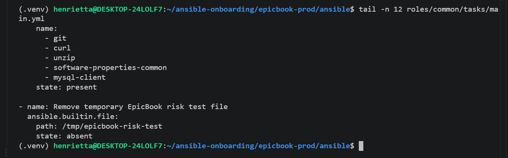

---

#### Screenshot 15 — Output of `./ansible-check-review.sh`

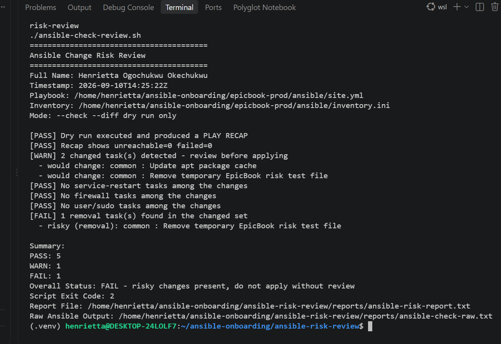

---

#### Screenshot 16 — Claude Code `/ansible-risk-review` output showing the risky finding

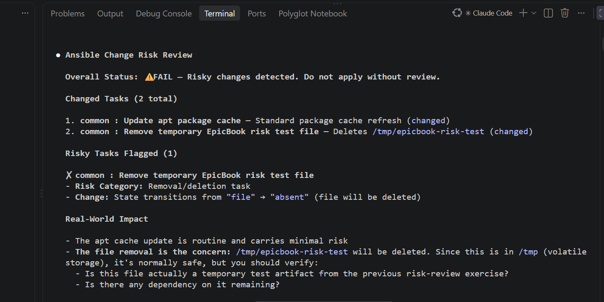

---

#### Screenshot 17 — Output of `cat reports/risky-change-report.txt`

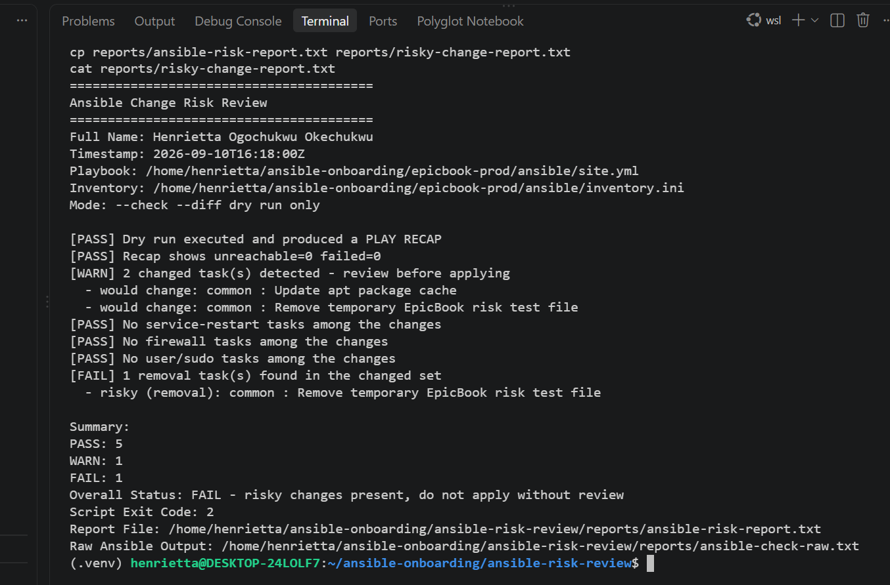

---

### Notes

Answer the following in your own words:

**1. Which risk category did the added task fall into?**

The added task (Remove temporary EpicBook risk test file) fell into the removal category because its task name and state matched deletion keywords (remove|absent|delete).

---

**2. What evidence proves the task would change something?**

The --check --diff dry run output captured in reports/ansible-risk-raw.txt and reported in reports/ansible-risk-report.txt explicitly identified changed: [epicbook] for the task common : Remove temporary EpicBook risk test file, indicating that /tmp/epicbook-risk-test was present on the target server and would be removed upon convergence.

---

**3. Did Claude Code apply the playbook?**

No. Claude Code strictly adhered to the safety rules in CLAUDE.md and SKILL.md, operating in read-only mode to analyze the risk report without running ansible-playbook in live apply mode or modifying any files.

---

**4. Why is it important that Claude Code only analyzed the risk?**

Restricting AI to risk analysis ensures human-in-the-loop governance. It prevents autonomous agents from making unverified modifications or destructive deletions to infrastructure, leaving the final decision and execution in the hands of an authorized human operator.

---

**5. Which phase of the Agentic Loop is represented by the Bash report?**

he Bash report represents the Gather phase (running ansible-playbook --check --diff to collect runtime evidence) and the initial transition into the Analyze phase (extracting changed tasks and categorizing risk patterns).

---

# Task 8 — Apply as the Human, Verify, and Write the Change Summary

## Goal

Review the risky-change report, apply the playbook manually as the human operator, and verify the result.

### Evidence

#### Screenshot 18 — Output of the real playbook run showing the final recap with `failed=0`

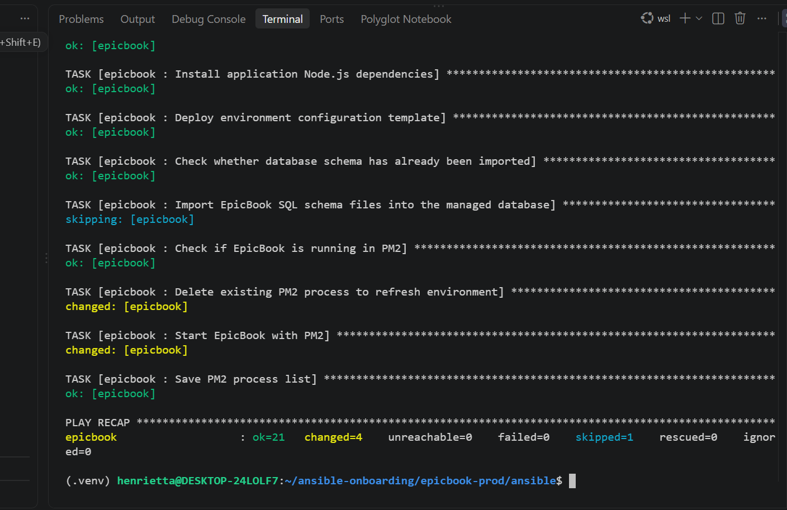

---

#### Screenshot 19 — Output of `ansible web -i inventory.ini -m ping`

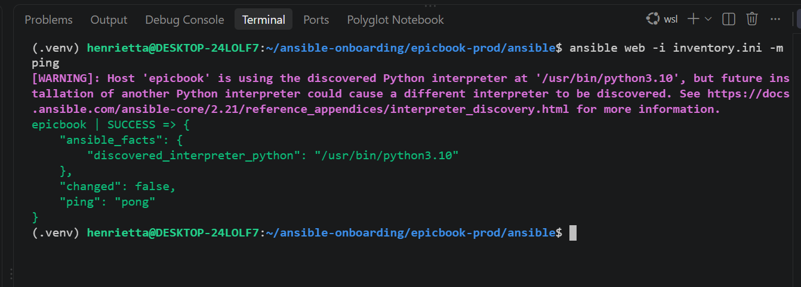

---

#### Screenshot 20 — Second `/ansible-risk-review` output after applying the change

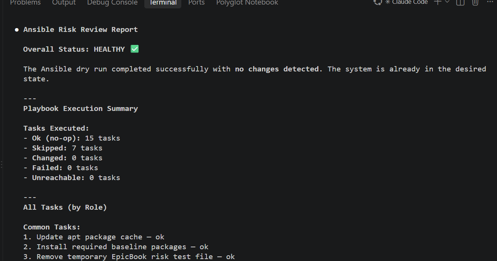
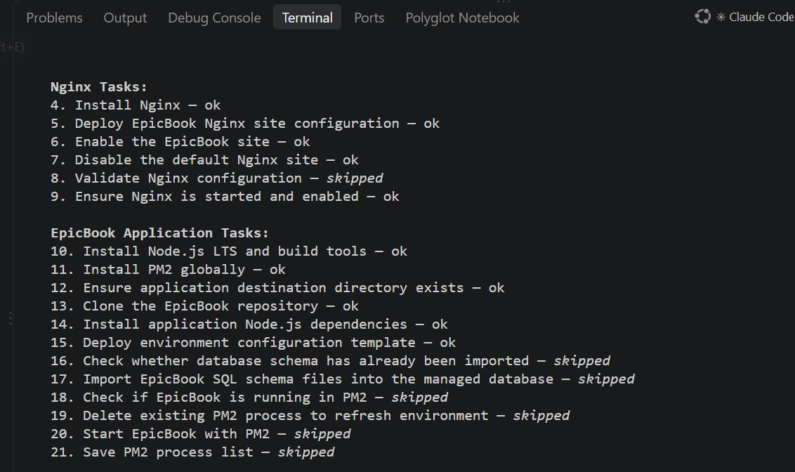
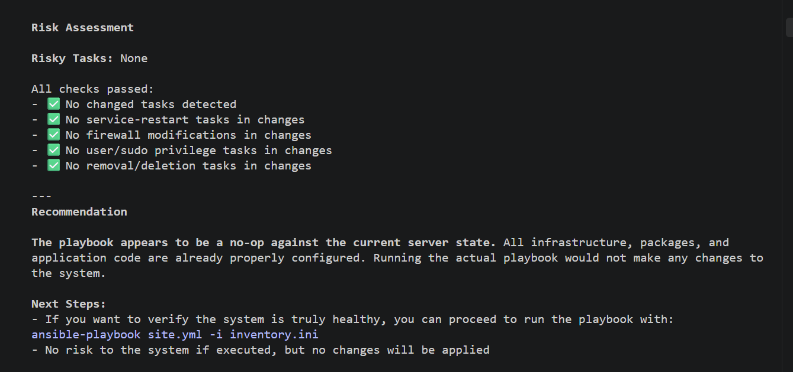

---

#### Screenshot 21 — Output of `ls -lah reports`

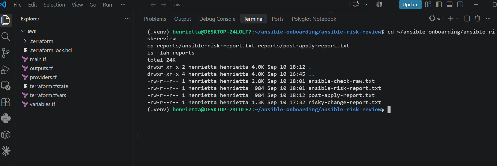

---

#### Screenshot 22 — `change-summary.md` showing all required sections and your Full Name

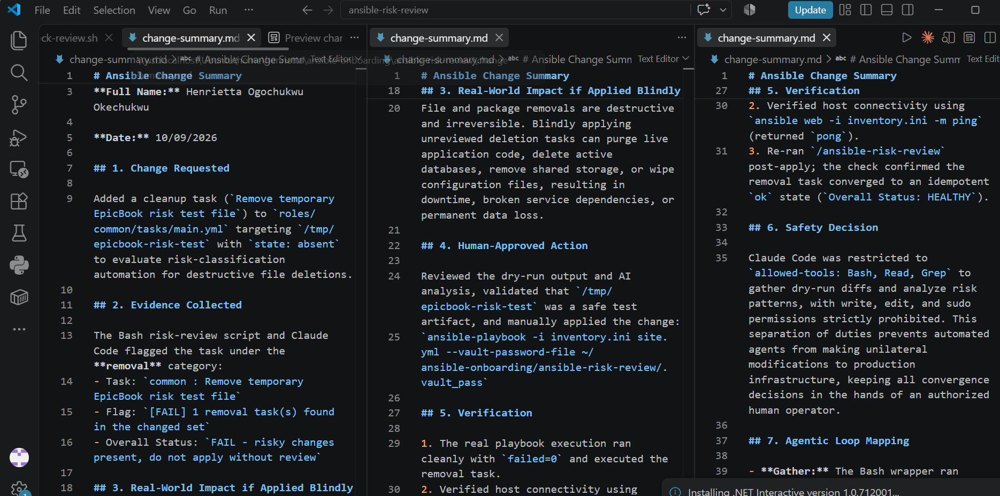

---

### Notes

Answer the following in your own words:

**1. What command did you run to apply the change for real?**

ansible-playbook -i inventory.ini site.yml --vault-password-file ~/ansible-onboarding/ansible-risk-review/.vault_pass

---

**2. Who made the final decision to apply the playbook?**

Henrietta Ogochukwu Okechukwu (the human engineer) after evaluating the risk report, verifying that the target file deletion was intentional, and confirming no production services were impacted.

---

**3. What evidence proves the VM is still reachable?**

The command ansible web -i inventory.ini -m ping returned SUCCESS and "ping": "pong", proving that SSH connectivity, remote host credentials, and the Python environment remained fully operational.

---

**4. Why should the risk review be run again after applying?**

Running the risk review post-apply verifies configuration idempotency. It confirms that the intended state change was applied and that a subsequent dry run produces no further pending changes or unexpected side effects.

---

**5. What could go wrong if an AI agent applied Ansible changes automatically?**

If an AI agent has write or apply permissions, hallucinated parameters, misidentified paths, or flawed regex rules could lead to unintentional data deletion, service outages from uncoordinated daemon restarts, or accidental network lockouts from firewall modifications.

---

# LinkedIn Post Required

## Evidence

#### LinkedIn Post URL

Paste your LinkedIn post URL here:

`Add your URL here`

---

#### Screenshot — Published LinkedIn post

Add your screenshot here.

---

# Required Files

Confirm that the following files are included in your GitHub repository or assignment folder:

- [ ] `CLAUDE.md`
- [ ] `ansible-check-review.sh`
- [ ] `.claude/skills/ansible-risk-review/SKILL.md`
- [ ] `reports/risky-change-report.txt`
- [ ] `reports/post-apply-report.txt`
- [ ] `change-summary.md`

---

# Submission Instructions

- Add all required screenshots in your submission.
- Full Name must be visible in required screenshots and reports.
- All required notes must be answered clearly.
- Do not expose SSH private keys, passwords, cloud credentials, database credentials, or secret environment variables.
- Add your GitHub repository or folder URL inside this document.
- Submit only your Google Doc link.

---

# Completion Checklist

- [ ] Task 1: EpicBook connectivity confirmed and workspace created
- [ ] Task 2: `CLAUDE.md` created with safety rules
- [ ] Task 3: Claude Code produced a read-only risk-review plan
- [ ] Task 4: `ansible-check-review.sh` created and syntax checked
- [ ] Task 5: Baseline dry-run review completed
- [ ] Task 6: Claude Code `/ansible-risk-review` skill created and tested
- [ ] Task 7: Controlled risky change introduced and detected
- [ ] Task 8: Human applied the change and verified the result
- [ ] Risky-change report saved
- [ ] Post-apply report saved
- [ ] Change summary completed
- [ ] All screenshots added
- [ ] All notes answered
- [ ] LinkedIn post published
- [ ] LinkedIn post URL added
- [ ] No sensitive information exposed
- [ ] Google Doc is accessible

---

## About DMI & CloudAdvisory

DevOps Micro Internship (DMI) is a project-based DevOps program run by Pravin Mishra and The CloudAdvisory, focused on real-world execution, systems thinking, and career readiness.

It helps learners build strong DevOps foundations with hands-on experience.

---

## Resources

- DMI Official Website: [https://dmi.pravinmishra.com?utm_source=github&utm_medium=readme](https://dmi.pravinmishra.com?utm_source=github&utm_medium=readme)
- University: [https://university.pravinmishra.com?utm_source=github&utm_medium=readme](https://university.pravinmishra.com?utm_source=github&utm_medium=readme)
- Discord Community: [https://discord.pravinmishra.com?utm_source=github&utm_medium=readme](https://discord.pravinmishra.com?utm_source=github&utm_medium=readme)
- Blog: [https://dmi.pravinmishra.com/blog?utm_source=github&utm_medium=readme](https://dmi.pravinmishra.com/blog?utm_source=github&utm_medium=readme)
- YouTube Playlist: [https://www.youtube.com/playlist?list=PLFeSNDtI4Cho](https://www.youtube.com/playlist?list=PLFeSNDtI4Cho)
- Pravin Mishra LinkedIn: [https://www.linkedin.com/in/pravin-mishra-aws-trainer/](https://www.linkedin.com/in/pravin-mishra-aws-trainer/)
- CloudAdvisory LinkedIn: [https://www.linkedin.com/company/thecloudadvisory/](https://www.linkedin.com/company/thecloudadvisory/)

---

*This submission is part of DevOps Micro Internship (DMI) Cohort 3 — Agentic AI Track.*