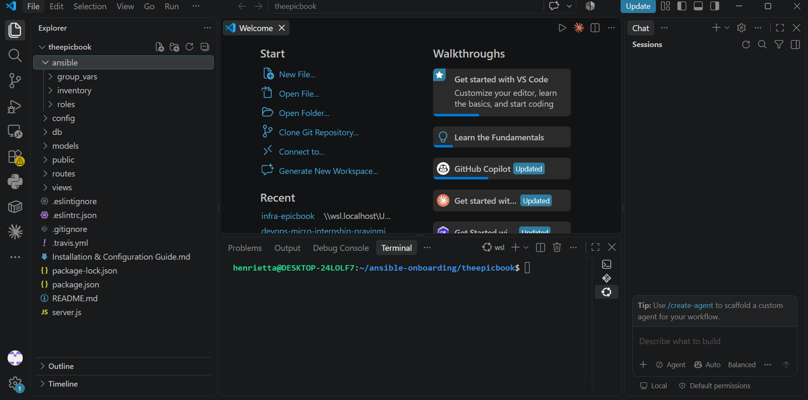
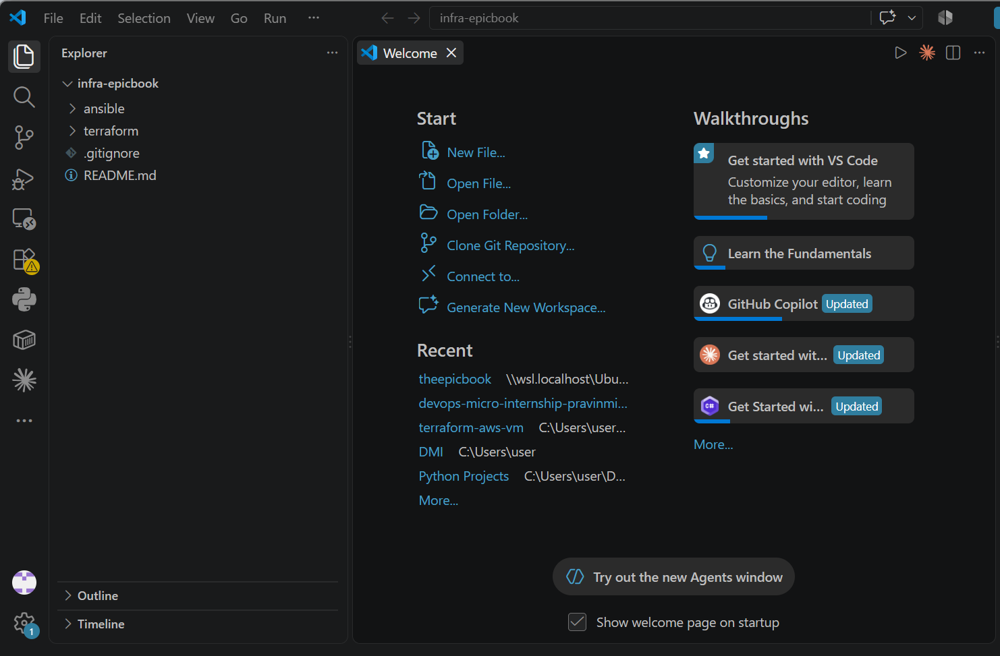
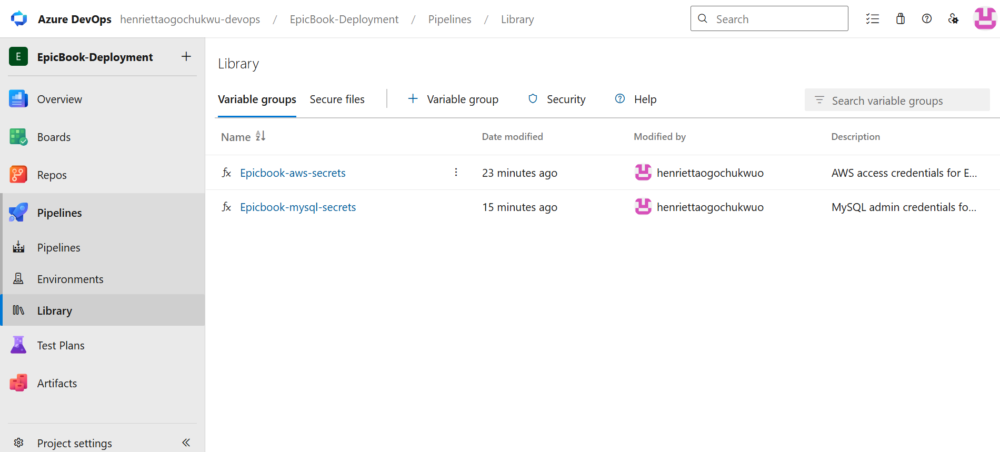
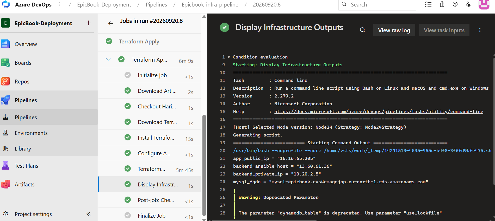
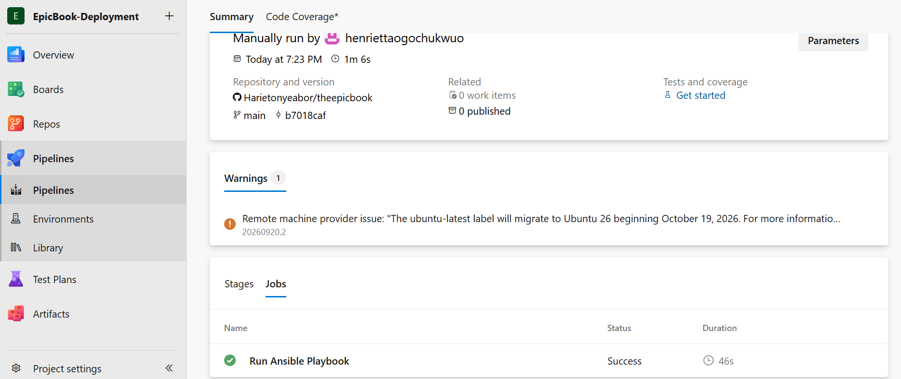
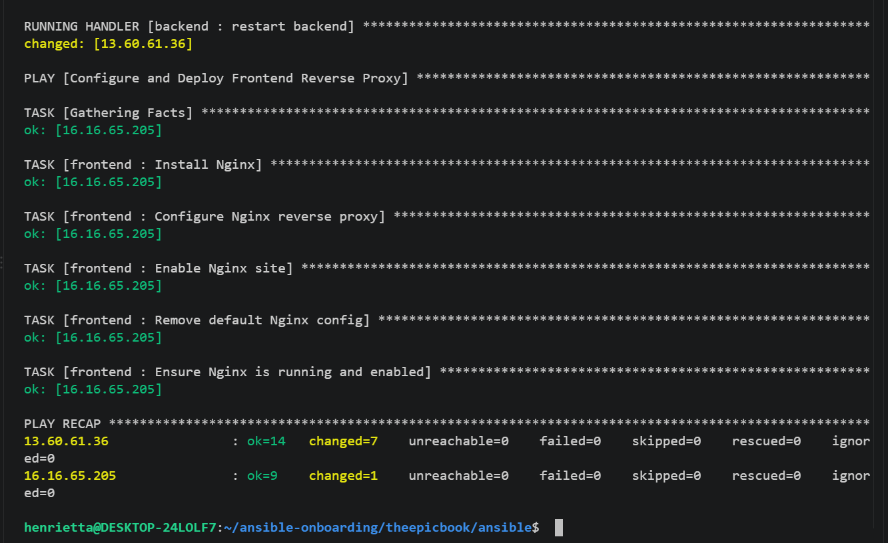
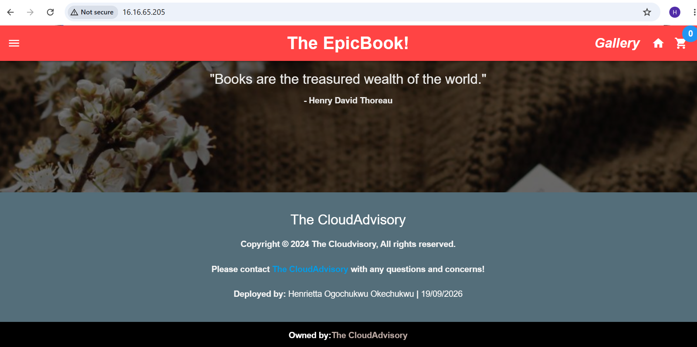
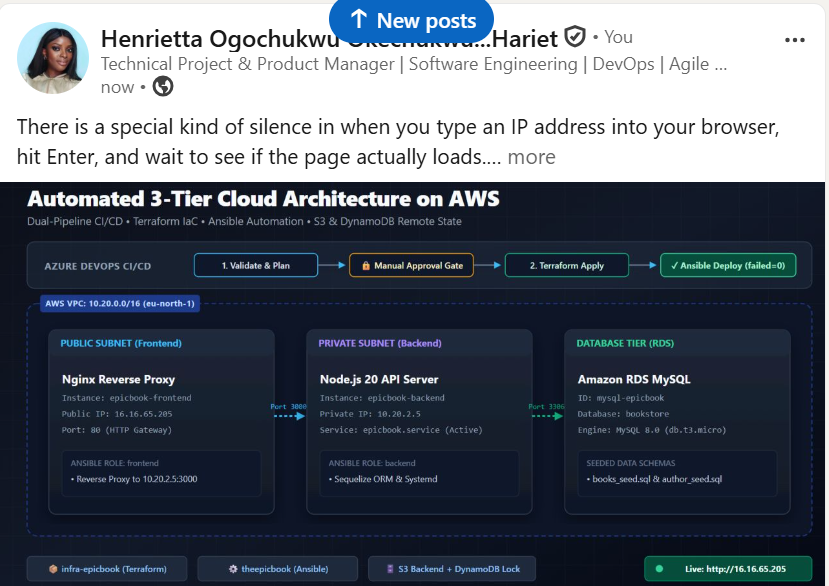

# Assignment 4 — Capstone: Automate the EpicBook Application with Dual Pipelines

Part of the DevOps Micro Internship (DMI) with Agentic AI

---

## Purpose

In this capstone assignment, you will design a complete DevOps automation workflow for EpicBook across two repositories and two Azure DevOps pipelines: an Infra Pipeline (`infra-epicbook`, Terraform) that provisions the network, frontend/backend VMs, and MySQL database, and an App Pipeline (`theepicbook`, Ansible) that consumes the Terraform outputs, configures the servers, and deploys EpicBook end to end.

---

# Task 1 — Prepare Repositories

## Goal

Prepare `infra-epicbook` (Terraform for network, frontend/backend VMs, MySQL, with `app_public_ip` and `mysql_fqdn` outputs) and `theepicbook` (application code, Ansible roles/playbooks, inventory template, MySQL variable files), keeping infrastructure and application responsibilities separated.

### Evidence

#### Screenshot 1 — Both repositories showing their required files and separation of responsibilities

---

# Task 2 — Create Azure Service Connection

## Goal

Create and validate an Azure Resource Manager SPN service connection (Tenant ID, Subscription ID, Client ID, Client Secret) for the Infra Pipeline.

### Evidence

#### Screenshot 2 — Azure Resource Manager service connection showing successful configuration with secrets hidden

"Per the project walkthrough architecture decision, AWS is utilized as the infrastructure cloud provider while retaining Azure DevOps for CI/CD. Authentication is managed via the Azure DevOps Variable Group Epicbook-aws-secrets (with credentials masked and locked), authorized directly for Epicbook-infra-pipeline."

AWS is utilized for the infrastructure provider. Authentication is securely managed using the Azure DevOps Variable Group Epicbook-aws-secrets (with credentials masked), authorized directly for the Infrastructure Pipeline."

---

# Task 3 — Create Infra Pipeline

## Goal

Create a YAML pipeline for `infra-epicbook` that authenticates via the SPN connection and runs `terraform init`/`plan`/`apply`, producing `app_public_ip` and `mysql_fqdn`.

### Evidence

#### Screenshot 3 — Infra Pipeline run showing `terraform apply` completion and the `app_public_ip` and `mysql_fqdn` outputs

---

#### Screenshot 4 — Azure Portal confirming the provisioned resources

Add your screenshot here.

---

# Task 4 — Create App Pipeline

## Goal

Upload the SSH private key to Azure DevOps Secure Files, create a YAML pipeline for `theepicbook` that installs Ansible, downloads the key, manually incorporates the Infra Pipeline's `app_public_ip`/`mysql_fqdn` outputs into the inventory/variables, and runs the playbook to configure the frontend/backend and deploy EpicBook behind Nginx.

### Evidence

#### Screenshot 5 — App Pipeline run summary showing successful completion

---

#### Screenshot 6 — Ansible playbook output showing successful configuration with `failed=0`

---

# Task 5 — Verify End-to-End Workflow

## Goal

Confirm both pipelines succeeded, the EpicBook application loads through the frontend public IP via Nginx, and a backend feature confirms successful MySQL connectivity.

### Evidence

#### Screenshot 7 — Browser displaying the running EpicBook application with the frontend public IP visible

---

### Notes

Record the frontend public application URL and a short issue-and-resolution note, if applicable.

Frontend Public Application URL:

[http://16.16.65.205](http://16.16.65.205)

Issue and Resolution Note:

During the backend role deployment, the application failed to start (ERR_CONNECTION_REFUSED / 502 Bad Gateway) due to two distinct configuration hurdles:

Sequelize Dialect & Environment Mapping: In production mode, Sequelize expected the database connection string via JAWSDB_URL. This was resolved by templating an explicit config.json with host, port, dialect, and credentials, while simultaneously providing a formatted JAWSDB_URL string in .env.

Database Authentication Mismatch: The backend service encountered an ER_ACCESS_DENIED_ERROR (1045) because the master user credentials required synchronization between the Azure DevOps variable group and the AWS RDS MySQL instance. The RDS instance master password was synchronized to EpicbookSecure2026#, the initial schema (BuyTheBook_Schema.sql) and seed data (author_seed.sql, books_seed.sql) were loaded into the bookstore database, and the Ansible backend role was re-executed, bringing epicbook.service to active (running).

---

# LinkedIn Post (Required)

## Goal

Publish a LinkedIn post about the completed capstone project, mentioning the two-repository/dual-pipeline model, Terraform + Ansible responsibilities, and one end-to-end verification result, with public/"Anyone" visibility and at least one link or image.

## Evidence

#### LinkedIn Post URL

Paste your LinkedIn post URL here:

`https://lnkd.in/p/dqytxeVr`

---

#### Screenshot — Published LinkedIn post showing the text and at least one link or image

---

# Submission Instructions

- Add all required screenshots in your submission
- Do not commit or expose the Client Secret, SSH private key, database password, or other credentials

---

# Completion Checklist

- [ ] Task 1: `infra-epicbook` and `theepicbook` repositories prepared with clean separation (Screenshot 1)
- [ ] Task 2: Azure Resource Manager SPN service connection created and validated (Screenshot 2)
- [ ] Task 3: Infra Pipeline provisioned resources and produced outputs (Screenshots 3–4)
- [ ] Task 4: App Pipeline configured servers and deployed EpicBook (Screenshots 5–6)
- [ ] Task 5: End-to-end workflow verified, including MySQL connectivity (Screenshot 7)
- [ ] Frontend URL and issue notes written (Notes)
- [ ] LinkedIn post published and URL submitted
- [ ] No secrets exposed

---

## 📌 About DMI & CloudAdvisory

DevOps Micro Internship (DMI) is a project-based DevOps program run by Pravin Mishra (The CloudAdvisory) focused on real-world execution, systems thinking, and career readiness.

It helps learners build strong DevOps foundations with hands-on experience.

---

## 📌 Resources

- 🌐 DMI Official Website: https://dmi.pravinmishra.com?utm_source=github&utm_medium=readme  
- 🎓 University: https://university.pravinmishra.com?utm_source=github&utm_medium=readme  
- 💬 Discord Community: https://discord.pravinmishra.com?utm_source=github&utm_medium=readme  
- 📝 Blog: https://dmi.pravinmishra.com/blog?utm_source=github&utm_medium=readme  
- ▶️ YouTube Playlist: https://www.youtube.com/playlist?list=PLFeSNDtI4Cho  
- 🔗 Pravin Mishra (LinkedIn): https://www.linkedin.com/in/pravin-mishra-aws-trainer/  
- 🏢 CloudAdvisory (LinkedIn): https://www.linkedin.com/company/thecloudadvisory/

---

*This submission is part of DevOps Micro Internship (DMI) — Agentic AI Track.*
